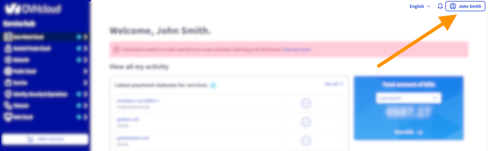
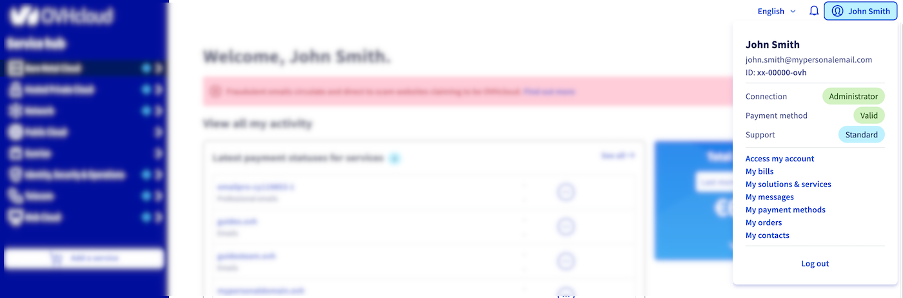
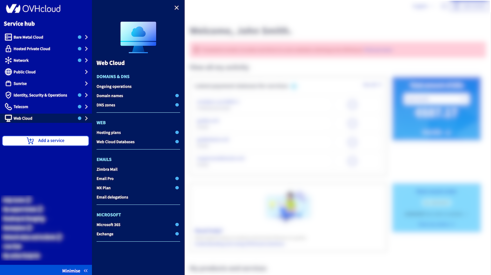
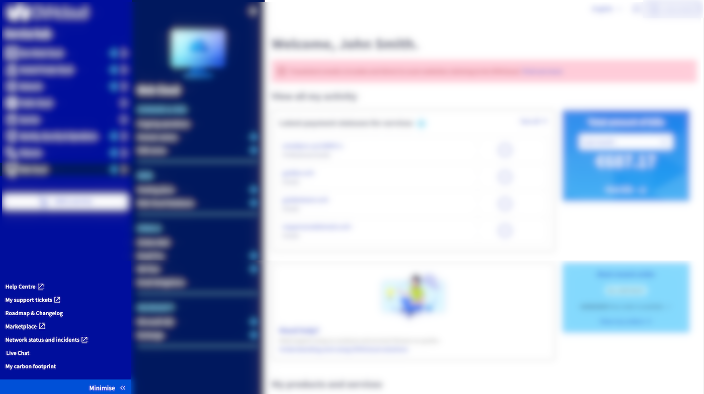

## Objetivo

Desde abril de 2025, as equipas da OVHcloud introduziram uma nova navegação na sua Área de Cliente para gerir a sua conta e os seus serviços com mais facilidade.

**Este guia propõe-lhe uma visita guiada rápida da nova navegação na Área de Cliente OVHcloud.**

## Requisitos

- Estar ligado à [Área de Cliente OVHcloud](/links/manager).

## Instruções

### Como aceder à minha conta?

Aceda à gestão da sua conta a qualquer momento clicando no seu nome no canto superior direito da Área de Cliente.

{.thumbnail width="1000"}

### Como gerir a minha conta e as minhas informações?

Clique no seu nome para atualizar o seu perfil, métodos de pagamento e nível de suporte. 
Utilize o mesmo menu para aceder rapidamente às suas faturas, encomendas e gestão dos serviços. 
Encontrará igualmente hiperligações para os e-mails de serviço enviados pela OVHcloud (`As minhas comunicações`{.action}) e para os diferentes contactos associados aos seus serviços.

{.thumbnail width="1000"}

/// details | Links úteis

- [Proteger a minha conta OVHcloud e gerir as minhas informações pessoais](/pages/account_and_service_management/account_information/all_about_username)
- [As boas práticas para a gestão dos seus serviços e da sua conta OVHcloud](/pages/account_and_service_management/managing_billing_payments_and_services/billing_best_practices)
- [Como renovar os meus serviços OVHcloud](/pages/account_and_service_management/managing_billing_payments_and_services/how_to_use_automatic_renewal)
- [Gerir os meus métodos de pagamento](/pages/account_and_service_management/managing_billing_payments_and_services/manage-payment-methods)
- [Gerir as minhas encomendas OVHcloud](/pages/account_and_service_management/managing_billing_payments_and_services/managing_ovh_orders)
- [Gerir as minhas faturas OVHcloud](/pages/account_and_service_management/managing_billing_payments_and_services/invoice_management)
- [Gerir os contactos dos serviços](/pages/account_and_service_management/account_information/managing_contact)

///

### Como aceder aos meus serviços?

O menu de acesso aos serviços da OVHcloud encontra-se agora à esquerda da Área de Cliente. O conjunto dos serviços OVHcloud está acessível, o que lhe permite completar facilmente a sua oferta com serviços suplementares e adaptados.

Os seus serviços estão associados a uma etiqueta azul1.

{.thumbnail width="1000"}

### Atalhos adicionais

No canto inferior esquerdo da Área de Cliente, os atalhos permitem-lhe descobrir os nossos vendedores parceiros no nosso Marketplace, ficar informado do estado dos seus serviços em tempo real e estimar a sua pegada de carbono.

**Necessita de ajuda?** Aceda ao Centro de Ajuda, aos pedidos de assistência e ao Live Chat para obter respostas às suas questões.

{.thumbnail width="1000"}

/// details | Links úteis

- [O Centro de Ajuda OVHcloud](https://help.ovhcloud.com/csm?id=csm_get_help)
- [OVHcloud Status](https://www.status-ovhcloud.com/)
- [How to get the carbon footprint of your OVHcloud services](/pages/account_and_service_management/managing_billing_payments_and_services/carbon_footprint) (EN)

///

## Quer saber mais?

Fale com nossa [comunidade de utilizadores](/links/community).

1: indisponível nos serviços Public Cloud.