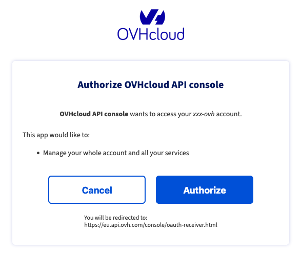
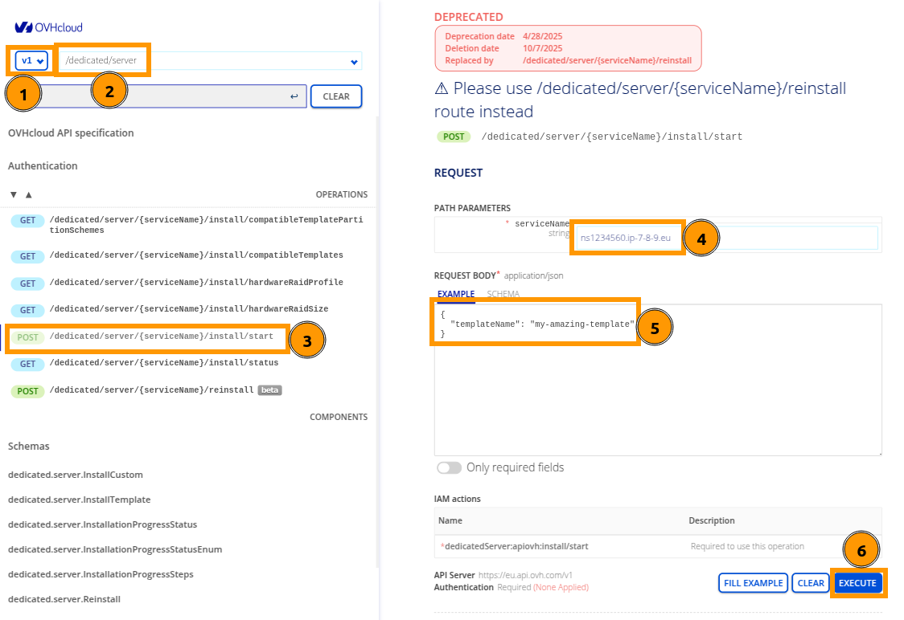
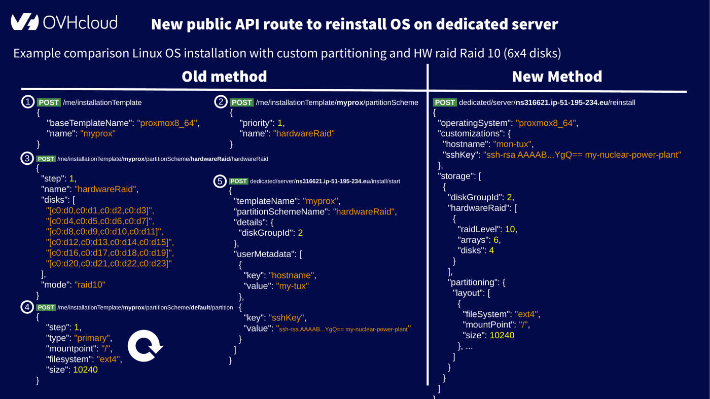

**This is an important documentation, please read it carefully as you might be impacted in the future if you request an OS installation on a new dedicated server or an OS reinstallation on a dedicated server you already have.**

Although this page outlines the decommissioning of personal templates for dedicated server OS installation and its impacts, customers can rest assured that **there will be no loss of features**.  
In fact, after this decommissioning, customers will still be able to install operating systems with **the same level of customization as before**. Moreover, customers who use the API directly will benefit from **1 simplified API call**.

## Objective

This page provides key information about the decommissioning plan for personal templates used in dedicated server OS installations. Additionally, it offers helpful tips for customers using the OVHcloud, SoYouStart, or Kimsufi Control Panels. Furthermore, it highlights the benefits of the new API call compared to the deprecated API call.

## Context<a name="context"></a>

OVHcloud is constantly evolving and must adapt its offers to the increasingly resilient and regulated cloud market. In order to meet those new challenges, **personal templates for dedicated servers OS installation** will be fully decommissioned on the **7th of October 2025**.

This feature allowed requesting an OS installation on a dedicated server by using a personal template containing the following elements:

- Operating system to be installed
- Partitioning layout
- Hardware RAID configuration
- Hostname
- SSH public key
- Post-installation script

In order to simplify the OS installation on dedicated servers as well as the migration communication, a new API call was created: `POST /dedicated/server/{serviceName}/reinstall`{.action}. This API call is the successor of the old route: `POST /dedicated/server/{serviceName}/install/start`{.action}. The old route had the ability to target an OS installation from an OVHcloud template **or a personal template**.

The old route and the notion of personal templates will be decommissioned. The new route only supports starting an OS installation from an OVHcloud template. Also, please note that the term "OVHcloud template" will gradually disappear in favour of the more precise "operating system".

Personal templates decommissioning will be done in 2 steps:

### Step 1: 17th of June 2025<a name="step-1"></a>

- Customers will no longer be able to **edit** or **add** new personal templates.
- Customers having personal templates and active subscriptions to dedicated servers will receive custom technical information by email to help them migrate their personal templates to the [new "/reinstall" API call](https://eu.api.ovh.com/console/?section=%2Fdedicated%2Fserver&branch=v1#post-/dedicated/server/-serviceName-/reinstall).

### Step 2: 7th of October 2025<a name="step-2"></a>

- Customers will no longer be able to access their personal templates.
- All data related to personal templates will be deleted.

Please note that customers will still have the email from the 17th of June 2025 with technical documentation based on their personal templates data to help them migrate to the new API call.

## Instructions <a name="instructions"></a>

The following section contains specific information for all customers with an account at OVHcloud, SoYouStart or Kimsufi and whether you are currently using the OVHcloud Control Panel or the API to install OSs on your dedicated server.

### Using the OVHcloud, SoYouStart or Kimsufi Control Panels<a name="ux"></a>

The `Install one of your templates`{.action} wizard to install an operating system on a dedicated server has already been removed since mid-April 2025. If you were using that wizard you have 3 long-term possibilities:

- Keep using the Web interface (not recommended if you plan on automating your OS installations): Apply all customizations in the OS install wizard manually (former `Install from an OVHcloud template`{.action} wizard) every time you need to perform an installation.
- Write a script that uses the API (best for automation, but requires programming skills): See the section [Using OVHcloud, SoYouStart or Kimsufi API](#api) below.
- Use the API console (good tradeoff): Use the old API call until the 17th of June 2025 and then use the new API call with the provided payloads.

Although you could start exploring the examples and schemes of the [new "/reinstall" API call in the API console](https://eu.api.ovh.com/console/?section=%2Fdedicated%2Fserver&branch=v1#post-/dedicated/server/-serviceName-/reinstall) and look at its [public documentation](/pages/bare_metal_cloud/dedicated_servers/api-os-installation), here is the temporary workaround you can follow until you receive the payloads for the new API route via email on the 17th of June 2025.

#### OVHcloud workaround <a name="ux-ovh"></a>

As mentioned in the [OVHcloud API documentation](/pages/manage_and_operate/api/first-steps#sign-in-to-ovhcloud-apis), on the [OVHcloud console API](https://eu.api.ovh.com/console/) page:

- Click `Authentication`{.action} in the upper left corner.
- Select `Login with OVHcloud SSO`{.action}.
- Enter your OVHcloud credentials.
- Click `Authorize`{.action} to allow performing API calls through the console.

{.thumbnail}

Then run the API call to trigger an OS installation from your personal template:

- Select `v1`{.action}.
- Choose the `/dedicated/server`{.action} section.
- Find the `POST /dedicated/server/{serviceName}/install/start`{.action} API call (you can use the filter).
- In the `serviceName` field, enter the name of the dedicated server you want to install.
- In the `REQUEST BODY` field (aka API payload), put the following JSON value (in this example we assume that "my-amazing-template" is the name of the personal template you want to install):

```json
{
  "templateName": "my-amazing-template"
}
```

If you need to list your personal templates and their details, please go to the `/me`{.action} section and look at all the `GET` API calls under `/me/installationTemplate`{.action}.

> [!alert]
> **Executing the call [POST /dedicated/server/{serviceName}/install/start](https://eu.api.ovh.com/console/?section=%2Fdedicated%2Fserver&branch=v1#post-/dedicated/server/-serviceName-/install/start) to a dedicated server will erase all the data on that server. PLEASE BE CAREFUL WHILE USING THIS API CALL.**
>

Then click the `Execute`{.action} button to start the OS installation.

{.thumbnail}

You can go back to the [OVHcloud Control Panel](/links/manager) on the dedicated server dashboard page to track the installation progress.

#### SoYouStart or Kimsufi workarounds <a name="ux-sys-ks"></a>

Open the [SoYouStart API console](https://eu.api.soyoustart.com/console/) or the [Kimsufi API console](https://eu.api.kimsufi.com/console/).

Click `Login`{.action} on the top right corner and enter your credentials. Then click the `Log in`{.action} button: you are now authenticated with the API console.

- Open the `/dedicated/server`{.action} section.
- Find the `POST /dedicated/server/{serviceName}/install/start`{.action} API call.
- In the `serviceName` field, enter the name of the dedicated server you want to install.
- In the `templateName` field, enter the name of the personal template you want to install.

If you need to list your personal templates and their details, please go to the `/me`{.action} section and look at all the `GET` API calls under `/me/installationTemplate`{.action}.

> [!alert]
> **Executing the call [POST /dedicated/server/{serviceName}/install/start](https://eu.api.soyoustart.com/console/#/dedicated/server/%7BserviceName%7D/install/start~POST) (or [this call](https://eu.api.kimsufi.com/console/#/dedicated/server/%7BserviceName%7D/install/start~POST) for Kimsufi) to a dedicated server will erase all the data on that server. PLEASE BE CAREFUL WHILE USING THIS API CALL.**
>

Then click the `Execute`{.action} button to start the OS installation.

You can go back to the [SoYouStart](https://eu.soyoustart.com/manager) or [Kimsufi Control Panel](https://www.kimsufi.com/fr/manager) on the dedicated server dashboard page to track the installation progress.

### Using OVHcloud, SoYouStart or Kimsufi APIs <a name="api"></a>

If you are using the OVHcloud, SoYouStart or Kimsufi APIs to trigger OS installations from a personal template, you can continue using the `POST /dedicated/server/{serviceName}/install/start`{.action} API call until **the 7th of October 2025**.  
But please note that starting from **the 17th of June 2025**, you will no longer be able to add or edit personal templates.

Although you will receive an email with all the details to migrate your API payloads to the [new "/reinstall" API call](https://eu.api.ovh.com/console/?section=%2Fdedicated%2Fserver&branch=v1#post-/dedicated/server/-serviceName-/reinstall), feel free to start exploring the examples and schemes of the [new /reinstall API call in the API console](https://eu.api.ovh.com/console/?section=%2Fdedicated%2Fserver&branch=v1#post-/dedicated/server/-serviceName-/reinstall) (API scheme is the same for OVHcloud, [SoYouStart](https://eu.api.soyoustart.com/console/#/dedicated/server/%7BserviceName%7D/install/start~POST) and [Kimsufi](https://eu.api.kimsufi.com/console/#/dedicated/server/%7BserviceName%7D/install/start~POST)) and look at its [public documentation](/pages/bare_metal_cloud/dedicated_servers/api-os-installation).

The end of the personal templates feature will simplify OS installation on dedicated servers. Indeed, the new API call [POST /dedicated/server/{serviceName}/reinstall](https://eu.api.ovh.com/console/?section=%2Fdedicated%2Fserver&branch=v1#post-/dedicated/server/-serviceName-/reinstall) brings all the possible customizations that the old API call [POST /dedicated/server/{serviceName}/install/start](https://eu.api.ovh.com/console/?section=%2Fdedicated%2Fserver&branch=v1#post-/dedicated/server/-serviceName-/install/start) was not able to offer without the need to first define a personal template under [/me/installationTemplate](https://eu.api.ovh.com/console/?section=%2Fme&branch=v1#get-/me/installationTemplate).

The following comparison gives you an idea of the reduced number of API calls to achieve a complex customization configuration involving hardware RAID and custom partitioning: from `4+n`{.action} calls (where `n`{.action} is the number of partitions you have defined in your partitioning layout) to 1 single API call.

{.thumbnail}

As you can see, everything becomes streamlined, eliminating the need for heavy setup.

## Go further

[Getting started with a dedicated server](/pages/bare_metal_cloud/dedicated_servers/getting-started-with-dedicated-server)

[Getting started with a Kimsufi, So You Start or Rise dedicated server](/pages/bare_metal_cloud/dedicated_servers/getting-started-with-dedicated-server-eco)

[First steps with the OVHcloud APIs](/pages/manage_and_operate/api/first-steps)

[OVHcloud API & OS installation](/pages/bare_metal_cloud/dedicated_servers/api-os-installation)

[OVHcloud API and Storage](/pages/bare_metal_cloud/dedicated_servers/partitioning_ovh)

Join our [community of users](/links/community).
