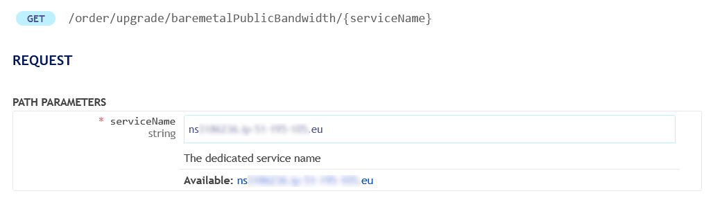
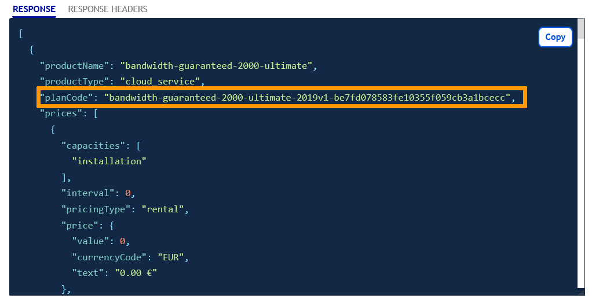
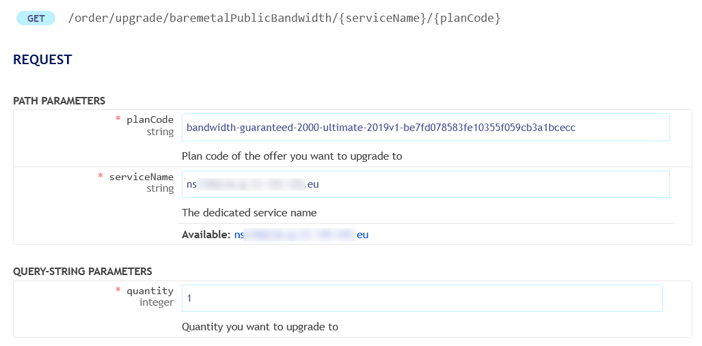
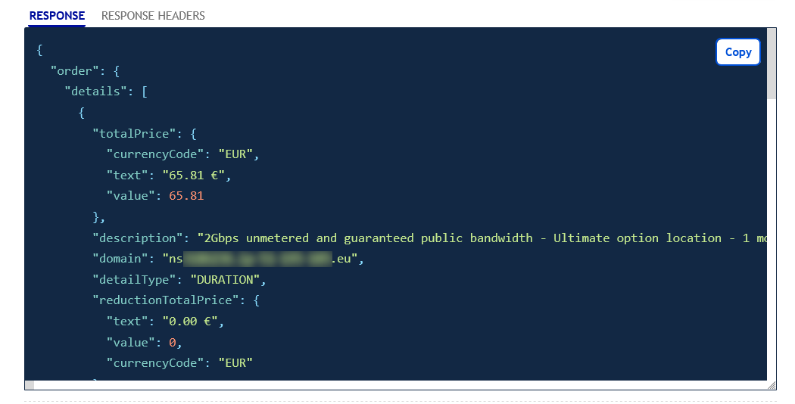
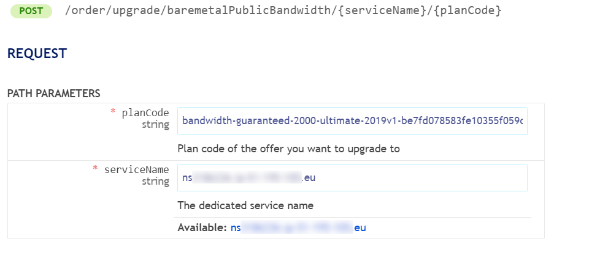

## Objective

Each of our dedicated servers includes a minimum public bandwidth of 500Mbps. In this guide, we explain how you can easily increase or decrease the bandwidth of a dedicated server.

## Requirements

- A [dedicated server](/links/bare-metal/bare-metal) in your OVHcloud account
- Access to the [OVHcloud API](/pages/manage_and_operate/api/first-steps)

## Instructions

### Find available services

Use the following API call to list all the available services for upgrade (or downgrade) and verify that the service you wish to upgrade/downgrade is listed:

> [!api]
>
> @api {v1} /order GET /order/upgrade/baremetalPublicBandwidth
>

{.thumbnail}

### Find the plan code

List available offers and find the **planCode** of your choice with the API call below:

> [!api]
>
> @api {v1} /order GET /order/upgrade/baremetalPublicBandwidth/{serviceName}
>

Enter the variables:

- serviceName: the name of your dedicated server, for example `ns1234567.ip-203.0.113.eu`

{.thumbnail}

The `RESPONSE` field should display information similar to the following:

{.thumbnail}

### Review your order

Use the following API call for a preview of your order, including pricing:

> [!api]
>
> @api {v1} /order GET /order/upgrade/baremetalPublicBandwidth/{serviceName}/{planCode}
>

Enter the variables:

- planCode: the reference retrieved in the previous step
- serviceName: the name of your dedicated server
- quantity: 1

{.thumbnail}

The `RESPONSE` field should display information similar to the following:

{.thumbnail}

### Submit your order

To officially submit the order, use the following API call:

> [!api]
>
> @api {v1} /order POST /order/upgrade/baremetalPublicBandwidth/{serviceName}/{planCode}
>

{.thumbnail}

The order will be processed once you have clicked `Execute`{.action}. Please note that if your bandwidth is upgraded after the first of the month, you will be charged a prorated amount.

## Go further

Join our [community of users](/links/community).
