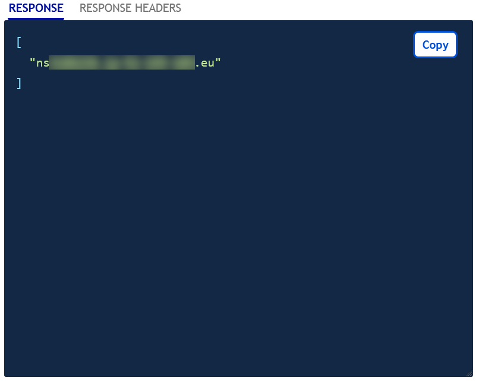
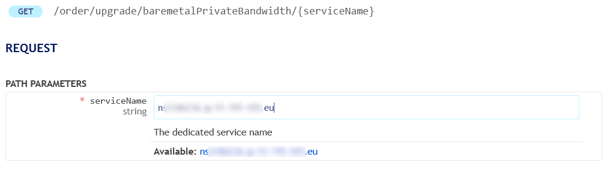
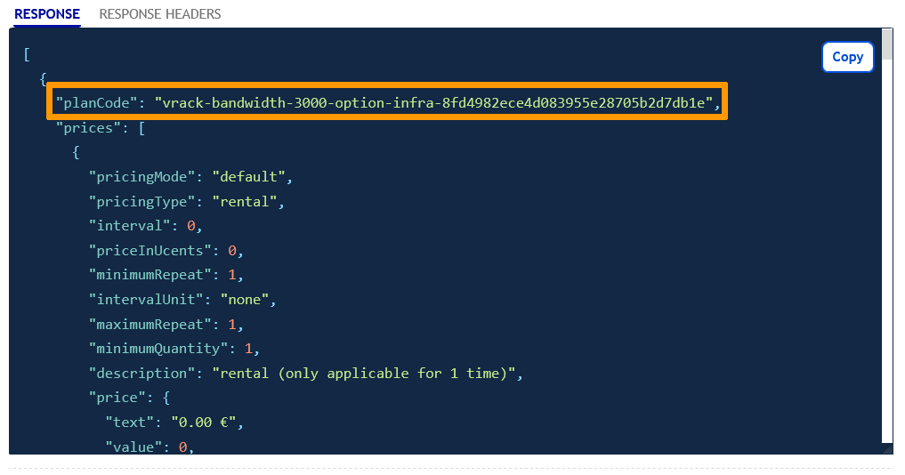
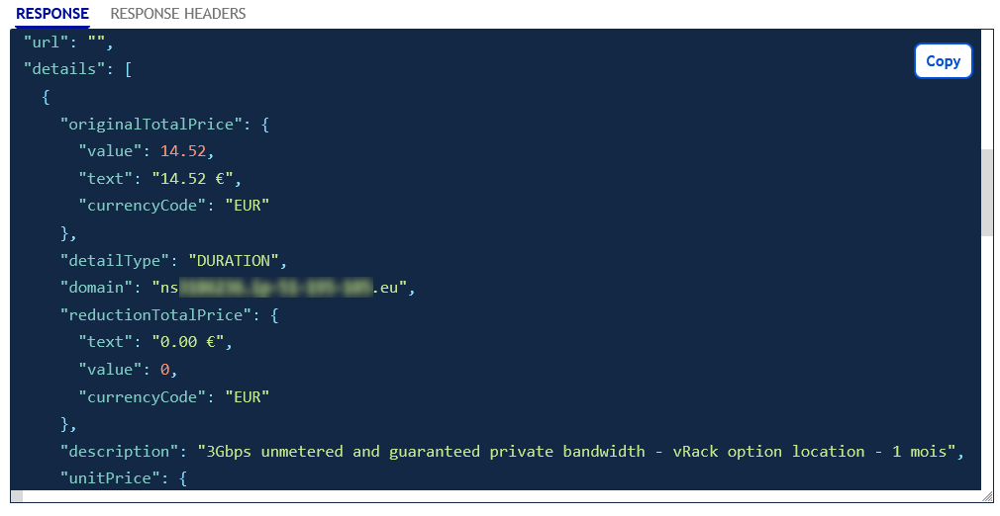

## Objective

With the private network, compatible dedicated servers benefit from a guaranteed minimum bandwidth of 1 Gbps. In the event of increased activity, this bandwidth can be increased on compatible servers.

**In this guide, we explain how you can easily increase or decrease the private bandwidth of a dedicated server.**

## Requirements

- A [vRack](/links/network/vrack) service activated in your account
- A [Dedicated Server](/links/bare-metal/bare-metal) compatible with the vRack
- Access to the [OVHcloud API](/pages/manage_and_operate/api/first-steps)

> [!warning]
> Please note that this option is not available on dedicated servers located in the APAC (Asia-Pacific) region, which come with an unmetered 25Gbit/s private bandwidth.
> 

## Instructions

### Find available services

Use the following API call to list all the available services for upgrade (or downgrade) and verify that the service you wish to upgrade/downgrade is listed:

> [!api]
>
> @api {v1} /order GET /order/upgrade/baremetalPrivateBandwidth
>

{.thumbnail}

### Find the plan code

List available offers and find the **planCode** of your choice with the API call below:

> [!api]
>
> @api {v1} /order GET /order/upgrade/baremetalPrivateBandwidth/{serviceName}
>

Enter the variables:

- serviceName: the name of your dedicated server, for example `ns1234567.ip-203.0.113.eu`

{.thumbnail}

The `RESPONSE` field should display information similar to the following:

{.thumbnail}

### Review your order

Use the following API call for a preview of your order, including pricing:

> [!api]
>
> @api {v1} /order GET /order/upgrade/baremetalPrivateBandwidth/{serviceName}/{planCode}
>

Enter the variables:

- planCode: the reference retrieved in the previous step
- serviceName: the name of your dedicated server
- quantity: 1

{.thumbnail}

The `RESPONSE` field should display information similar to the following:

{.thumbnail}

### Submit your order

To officially submit the order, use the following API call:

> [!api]
>
> @api {v1} /order POST /order/upgrade/baremetalPrivateBandwidth/{serviceName}/{planCode}
>

{.thumbnail}

The order will be processed once you have clicked `Execute`{.action}. The amount displayed corresponds to your option’s first billing month, calculated on a pro rata basis for the current month.

## Go further

Join our [community of users](/links/community).
