<style>
details>summary {
	color:rgb(33, 153, 232) !important;
	cursor: pointer;
}
details>summary::before {
	content:'\25B6';
	padding-right:1ch;
}
details[open]>summary::before {
	content:'\25BC';
}
</style>

## Ziel

Der Rescue-Modus ist ein von OVHcloud zur Verfügung gestelltes Tool für Ihren dedizierten Server, das dazu dient, den Server mithilfe eines temporären Betriebssystems zu booten. Damit haben Sie Zugriff auf den Server und können Probleme diagnostizieren und beheben.  

Die allgemeine Funktionsweise des Rescue-Modus wird in unserer Anleitung beschrieben:

[Rescue-Modus aktivieren und verwenden](/pages/bare_metal_cloud/dedicated_servers/rescue_mode)

Das **Windows Customer Rescue System** ist nur für Dedicated Server mit installiertem **Windows Server** Betriebssystem verfügbar. Es gelten folgende Bedingungen:

- Das Rescue-System für Windows (`rescue-customer-windows`) läuft in einer virtuellen Maschine (VM), die vom Customer Rescue System gestartet wurde (`rescue-customer`, basierend auf Debian GNU/Linux).
- Die Disks des Servers sind mit der VM per *Passthrough* verbunden, sodass Sie darauf zugreifen können.
- Auf andere Serverkomponenten (CPU, RAM, Netzwerkkarte, RAID-Karte) kann nicht zugegriffen werden.
- Das Netzwerk ist mit *Passthrough* angebunden, ohne direkten Zugriff auf den Netzwerkadapter. Die VM trägt die IP-Adresse und die MAC-Adresse des  *Bare Metal* Servers.

> [!warning]
>
> Falls Sie nicht schon über aktuelle Backups verfügen, sollte der erste Schritt im Troubleshooting, auch im Rescue-Modus, immer darin bestehen, ein Backup Ihrer Daten zu erstellen.
>
> Wenn Sie Dienste auf Ihrem Dedicated Server im laufenden Betrieb haben, wird der Rescue-Modus diese Dienste unterbrechen, da er in das Hilfsbetriebssystem neu gestartet wird.
> 

**Diese Anleitung erklärt, wie Sie einen Server in das Rescue-System für Windows starten.**

## Voraussetzungen

- Sie haben einen [Dedicated Server](/links/bare-metal/bare-metal) mit Windows Server installiert.
- Der Server verfügt über mindestens 16 GB RAM.
- Sie haben Zugriff auf Ihr [OVHcloud Kundencenter](/links/manager).

## In der praktischen Anwendung

### Aktivierung des Rescue-Modus für Windows

Loggen Sie sich in Ihr [OVHcloud Kundencenter](/links/manager) ein und öffnen Sie den Bereich `Bare Metal Cloud`{.action} und dann `Dedicated Server`{.action}.

Klicken Sie auf den Namen Ihres Servers, um den Tab `Allgemeine Informationen`{.action} zu öffnen.

<a name="netboot"></a>

Klicken Sie im Feld **Allgemeine Informationen** auf den Button `...`{.action} neben `Boot`. Klicken Sie im Kontextmenü auf `Bearbeiten`{.action}.

{.thumbnail}

Wählen Sie auf der Seite **Netboot-Modus ändern** `Im Rescue-Modus booten`{.action} aus.

Wählen Sie `Customer rescue system`{.action} aus dem Dropdown-Menü.

Wählen Sie im Dropdown-Menü `Windows customer rescue system`{.action} aus.

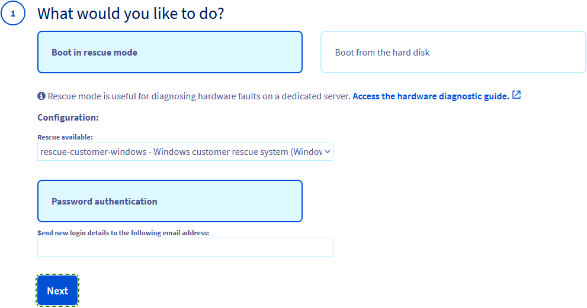{.thumbnail width="800"}

Die Benachrichtigung zur Aktivierung des Rescue-Modus und die zugehörigen Login-Daten werden an die Kontakt-E-Mail-Adresse Ihres OVHcloud Kunden-Accounts gesendet. Um eine abweichende E-Mail-Adresse zu verwenden, geben Sie diese in das Feld `Zugangsdaten an folgende E-Mail-Adresse versenden` ein.

Klicken Sie auf `Weiter`{.action}.

Klicken Sie im Schritt **Zusammenfassung** auf `Bestätigen`{.action}.

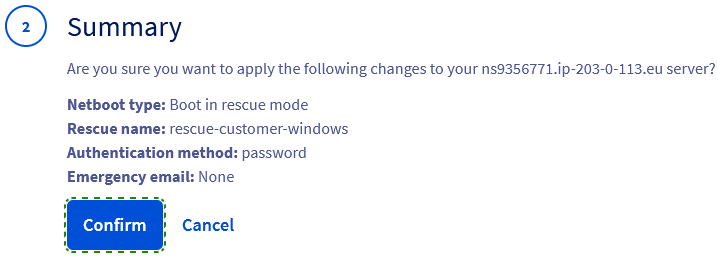{.thumbnail}

Sie sollten nun eine Meldung bezüglich des geänderten `Netboot` im Tab `Allgemeine Informationen`{.action} erhalten.

{.thumbnail}

Im letzten Schritt muss der Server neu gestartet werden. Klicken Sie auf den Button `...`{.action} neben "Status" im Feld **Status der Dienste** und dann auf `Neu starten`{.action}. Klicken Sie im Popup-Fenster auf `Bestätigen`{.action}.

{.thumbnail}

Der *hard reboot* benötigt einige Minuten zur Durchführung. Sie können den aktuellen Status im Tab `Tasks`{.action} überprüfen.

> [!primary]
>
> Achten Sie darauf, nach Abschluss Ihrer Aktionen im Rescue-Modus den `Netboot` auf `Von Festplatte booten`{.action} zurückzusetzen, bevor Sie den Server neu starten.

### Zugriff auf Ihren Server im Rescue-Modus

Sobald Sie die E-Mail zur Aktivierung des Rescue-Modus erhalten haben, können Sie sich über das Windows Rescue-System einloggen und auf Ihren Server zugreifen.  
Diese E-Mail ist auch in Ihrem [OVHcloud Kundencenter](/links/manager) verfügbar, sobald sie verschickt wurde. Klicken Sie oben rechts auf den zu Ihrer Kundenkennung gehörigen Namen und wählen Sie `E-Mails von OVHcloud`{.action} aus.

Zum Aufbau einer Remote-Verbindung mit dem Windows Rescue-System benötigen Sie die folgenden Anmeldedaten:

- IP-Adresse des Servers
- Benutzername für den temporären Administrator-Account (`Administrator`)
- Passwort für den temporären Administrator-Account

Sie haben die folgenden Verbindungsmethoden zur Auswahl, um über das Windows Rescue-System auf Ihren Server zuzugreifen:

- Remote Desktop Protocol (RDP)
- KVM over IP (wenn Ihr Server dies erlaubt)
- OpenSSH (offizielle Komponente von Windows Server)

#### RDP

/// details | Diesen Abschnitt erweitern

Verwenden Sie zum Anmelden den Client `Remote Desktop Connection` von  Windows oder eine kompatible Anwendung.

{.thumbnail}

///

#### KVM

/// details | Diesen Abschnitt erweitern

Im KVM-Login-Interface können Sie eine Tastatursprache auswählen.

{.thumbnail width="800"}

{.thumbnail width="800"}

Sie können die Eingabehilfen ändern und die virtuelle Tastatur aktivieren:

{.thumbnail width="800"}

{.thumbnail width="800"}

Weitere Informationen finden Sie in unserer [Anleitung zur Verwendung der IPMI-Konsole mit einem Dedicated Server](/pages/bare_metal_cloud/dedicated_servers/using_ipmi_on_dedicated_servers).

///

#### SSH

/// details | Diesen Abschnitt erweitern

Öffnen Sie die Befehlszeilenanwendung auf dem lokalen Gerät, und geben Sie den folgenden Befehl ein:

```bash
ssh Administrator@SERVER_IP
```

Beispiel:

```bash
ssh Administrator@203.0.113.100
```

Geben Sie das temporäre Passwort für den Rescue-Modus ein, wenn Sie dazu aufgefordert werden. Beispiel:

```console
Administrator@ns9356771.ip-203-0-113.eu's password:
administrator@WINRESCUEOVH C:\Users\Administrator>
```

Weitere Informationen zu SSH-Verbindungen finden Sie in unserer [SSH-Einführung](/pages/bare_metal_cloud/dedicated_servers/ssh_introduction).  
Sie können auch ein beliebiges Tool für SSH-Verbindungen verwenden, z.B. [PuTTY](/pages/web_cloud/web_hosting/ssh_using_putty_on_windows).

///

### Datentäger importieren, um auf Ihre Dateien zuzugreifen

Wenn Sie im Windows Rescue-System eingeloggt sind, müssen die Disks des Windows-Servers zunächst importiert (gemounted) werden, bevor Sie auf das Dateisystem zugreifen können.

/// details | Diesen Abschnitt erweitern

> [!warning]
> Die nachfolgenden beispielhaften Anweisungen und Screenshots veranschaulichen den Mount-Vorgang basierend auf einem Server mit zwei gespiegelten Disks (RAID1). Die in der Datenträgerverwaltung angezeigten Details hängen von der Datenträgerkonfiguration des Servers ab.  
> Weitere Informationen finden Sie in der [offiziellen Dokumentation von Microsoft](https://learn.microsoft.com/en-us/windows-server/storage/disk-management/overview-of-disk-management).
>
> Wenn Sie professionelle Unterstützung bei der Verwaltung Ihres Servers benötigen, beachten Sie die Informationen im Abschnitt [Weiterführende Informationen](#gofurther) dieser Anleitung.

| 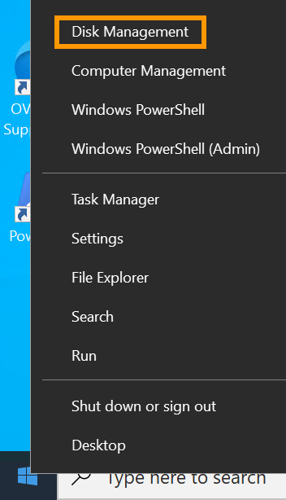{.thumbnail} |
|---|
| Klicken Sie mit der rechten Maustaste auf das `Startmenü`{.action} und öffnen Sie `Disk Management`{.action}. |

| 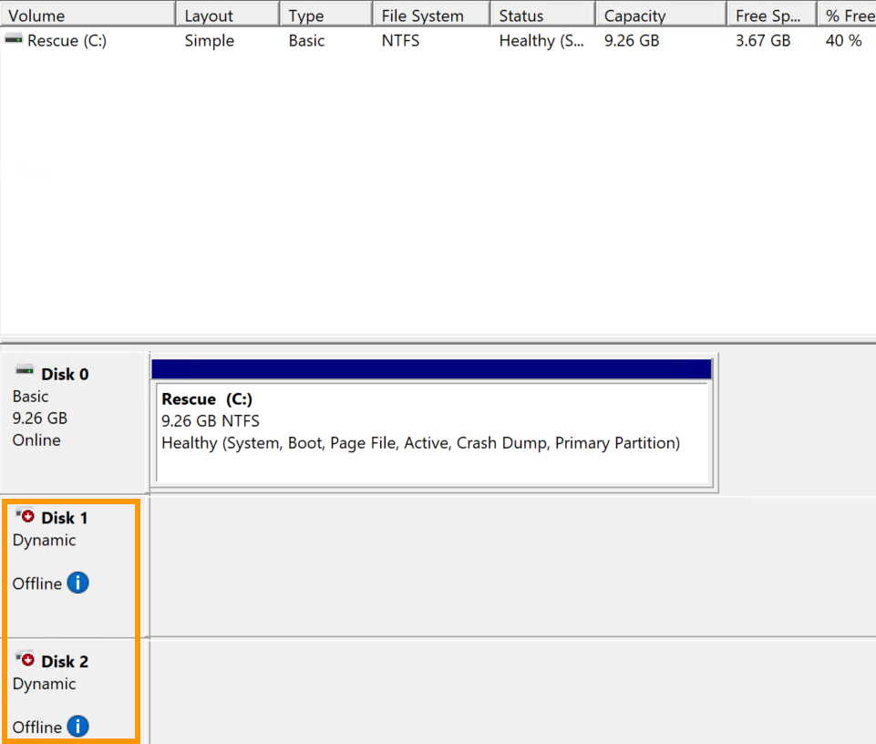{.thumbnail width="700"} |
|---|
| `Disk 0` enthält das Rescue-System (Volume `C:`). Die Disks Ihres Windows Servers werden als `Offline` angezeigt. |

| 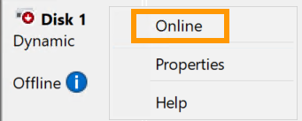{.thumbnail} |
|---|
| Klicken Sie mit der rechten Maustaste jeweils auf die Disks, und wählen Sie im Kontextmenü `Online`{.action} aus. |

| 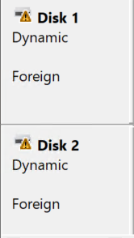{.thumbnail} |
|---|
| Die Disks des Servers werden jetzt [vom Rescue-System als `Foreign` erkannt](https://learn.microsoft.com/en-us/troubleshoot/windows-server/backup-and-storage/troubleshoot-disk-management#a-dynamic-disks-status-is-foreign); ein Status, der in diesem Fall anzeigt, dass die angeschlossenen Datenträger zu einem anderen Betriebssystem gehören. |

| 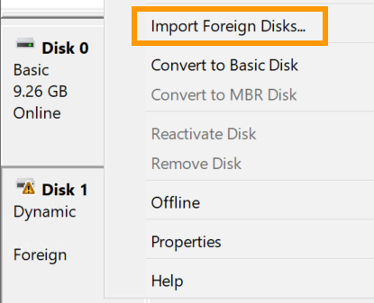{.thumbnail} |
|---|
| Klicken Sie mit der rechten Maustaste auf eine Disk und wählen Sie `Import Foreign Disks...`{.action} aus dem Kontextmenü. |

| 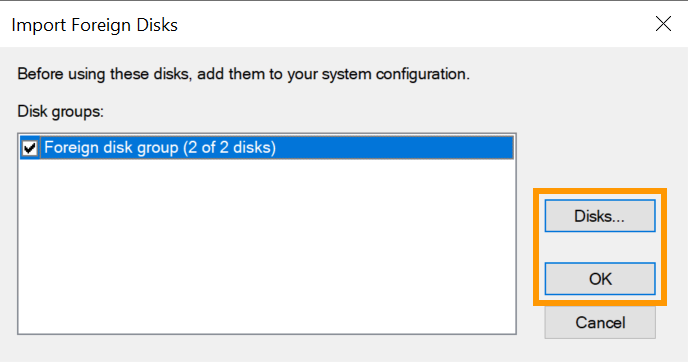{.thumbnail} |
|---|
| Wählen Sie gegebenenfalls die zu importierenden Datenträger aus. Klicken Sie auf `OK`{.action}. |

| 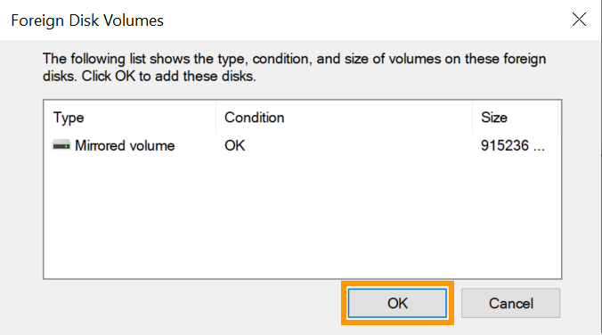{.thumbnail} |
|---|
| Klicken Sie auf `OK`{.action}. |

| 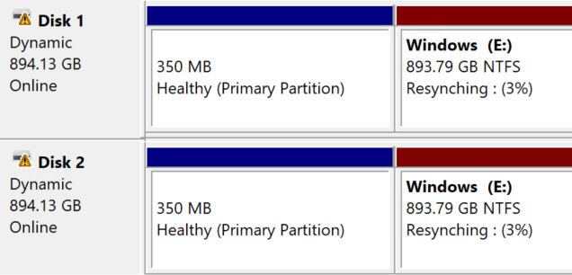{.thumbnail} |
|---|
| In diesem Beispiel werden die beiden Disks des Servers gespiegelt, daher wird nun der Status `Resynching` angezeigt. Dies ist der normale Vorgang; die Neusynchronisierung wird fortgesetzt, nachdem der Server mit seinem installierten Betriebssystem neu gestartet wurde. |

| 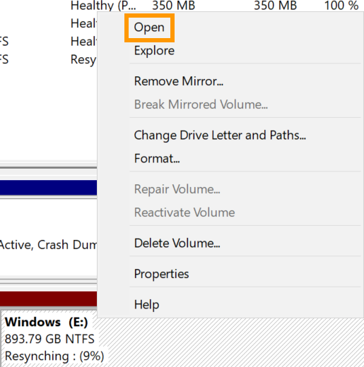{.thumbnail} |
|---|
| Um auf Ihre Dateien zuzugreifen, klicken Sie mit der rechten Maustaste auf die Windows-Partition Ihrer `Disk 1` und wählen `Open`{.action} aus dem Kontextmenü. |

///

### Empfohlene Dienstprogramme

> [!primary]
>
> Im Rescue-System ist keine zusätzliche Software vorinstalliert. Nachfolgend finden Sie eine Liste empfohlener Tools, die von der offiziellen Website ihrer respektiven Herausgeber beziehbar sind.

| Software | Beschreibung |
| --- | --- |
| CrystalDiskInfo | Datenträgerdiagnosetool |
| 7-zip | Archivverwaltungstool |
| FileZilla | FTP Client |

### Rescue-Modus verlasssen

Öffnen Sie in Ihrem [OVHcloud Kundencenter](/links/manager) die `Netboot`-Einstellungen und [ändern Sie den Modus](#netboot) wieder zu `Auf Festplatte booten`{.action}.

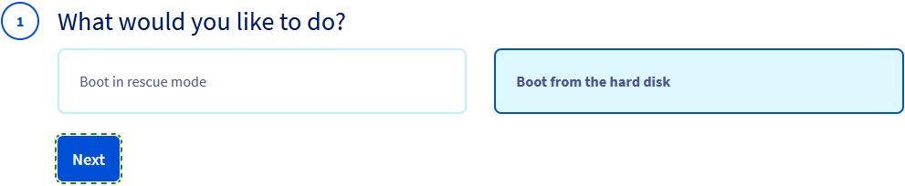{.thumbnail width="800"}

Verwenden Sie anschließend die Funktion `Neu starten`{.action} in Ihrem OVHcloud Kundencenter.

<a name="gofurther"></a>

## Weiterführende Informationen

[Rescue-Modus aktivieren und verwenden](/pages/bare_metal_cloud/dedicated_servers/rescue_mode)

[Administrator-Zugang zu einem Windows Dedicated Server wiederherstellen](/pages/bare_metal_cloud/dedicated_servers/rcw-changing-admin-password-on-windows)

Kontaktieren Sie für spezialisierte Dienstleistungen (SEO, Web-Entwicklung etc.) die [OVHcloud Partner](/links/partner).

Wenn Sie Hilfe bei der Nutzung und Konfiguration Ihrer OVHcloud Lösungen benötigen, beachten Sie unsere [Support-Angebote](/links/support).

Treten Sie unserer [User Community](/links/community) bei.