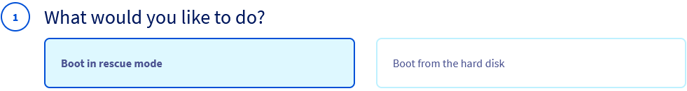
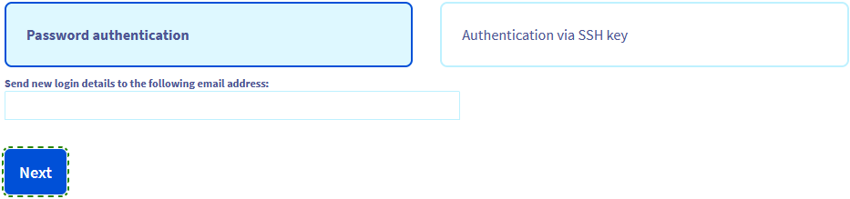
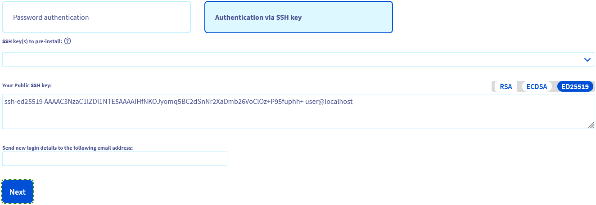
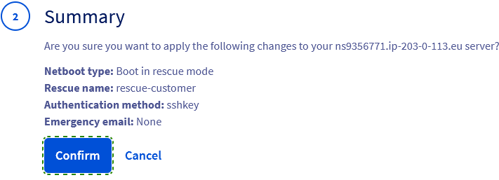
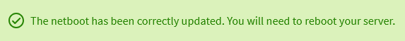
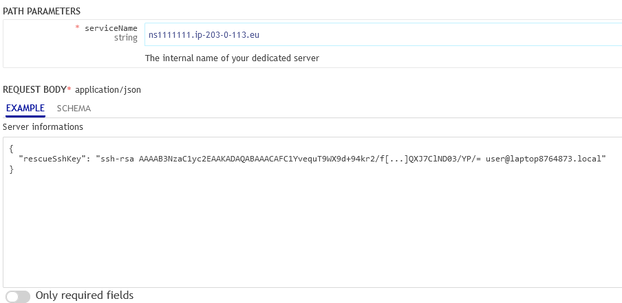
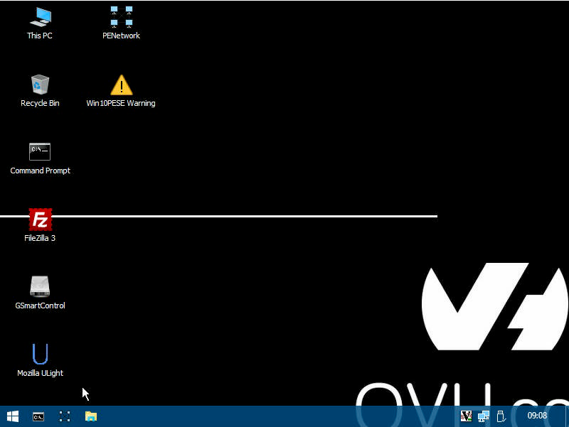

## Objectif

Le mode Rescue est un outil fourni par OVHcloud qui vous permet de démarrer sur un système d'exploitation temporaire dans le but de diagnostiquer et de résoudre les problèmes sur votre serveur.

Le mode rescue est généralement adapté aux tâches suivantes :

- [Réinitialisation du mot de passe de l'utilisateur](/pages/bare_metal_cloud/dedicated_servers/replacing-user-password)
- [Diagnostic des problèmes réseau](/pages/bare_metal_cloud/dedicated_servers/hardware-diagnose)
- Réparation d'un système d'exploitation défectueux
- Correction d'une configuration incorrecte d'un pare-feu logiciel
- [Test des performances des disques](/pages/bare_metal_cloud/dedicated_servers/hardware-diagnose)
- [Test du processeur et de la mémoire RAM](/pages/bare_metal_cloud/dedicated_servers/hardware-diagnose)

> [!warning]
>
> Prenez soin d'effectuer une sauvegarde de vos données si vous ne disposez pas encore de sauvegardes récentes.
>
> Si vous avez des services en production sur votre serveur, le mode rescue les interrompt tant que la machine n’a pas été redémarrée en mode normal.
> 

**Ce guide vous explique comment redémarrer un serveur en mode rescue et monter des partitions.**

## Prérequis

- Posséder un [serveur dédié](/links/bare-metal/bare-metal).
- Accès à l’[espace client OVHcloud](/links/manager).

## En pratique

Pour utiliser le mode rescue, vous devez modifier le paramètre `Netboot` du serveur. Le serveur doit ensuite être redémarré.

Connectez-vous à votre [espace client OVHcloud](/links/manager), ouvrez la section `Bare Metal Cloud`{.action} puis `Serveurs dédiés`{.action}.

Cliquez sur le nom de votre serveur pour ouvrir l'onglet `Informations générales`{.action}.

### Activation du mode rescue

Dans la case **Informations générales**, cliquez sur le bouton `...`{.action} à côté de `Démarrer`. Cliquez sur `Modifier`{.action} dans le menu contextuel.

{.thumbnail}

<a name="netboot"></a>

#### 1 : Options du mode rescue

Sur la page **Modifier le netboot**, sélectionnez `Démarrer en mode rescue`{.action}.

{.thumbnail}

Les options disponibles pour le mode rescue dépendent du type de serveur et du **système d'exploitation** installé.

- Système de secours client (toujours disponible)
- Système Rescue pour Windows (disponible pour les serveurs Windows)
- [iPXE](https://ipxe.org) / ipxe-shell (outil open source externe, toujours disponible)
- [Système de secours Windows hérité](#windows_legacy) (système WinPE déconseillé, uniquement pertinent si votre serveur ne répond pas aux exigences du système de secours actuel pour Windows)

> [!primary]
>
> Les instructions ci-dessous ne concernent que le **système de secours client** qui est l’option la plus couramment utilisée.
>
> Reportez-vous à notre [guide dédié pour une explication détaillée sur l’utilisation du **système rescue pour Windows**](/pages/bare_metal_cloud/dedicated_servers/rescue-customer-windows).

Sélectionnez `Customer rescue system`{.action} dans le menu déroulant.

#### 2 : Options d'authentification

Le choix suivant détermine la méthode d'authentification pour la connexion SSH au système en mode rescue. Il s’agit principalement d’une question de commodité puisque chaque session en mode rescue est censée être transitoire et sera supprimée une fois que vous aurez redémarré le serveur à partir de son disque.

- **Authentification par mot de passe** : Les identifiants vous seront communiqués par e-mail.
- **Authentification par clé** : Vous pouvez utiliser une clé publique d'authentification de votre choix (formats compatibles: `RSA`, `ECDSA`, `ED25519`).

Cliquez sur l'onglet correspondant à votre moyen de connexion :


> [!tabs]
> Authentification par mot de passe
>>
>> Cliquez sur `Authentification par mot de passe`{.action}.
>>
>>{.thumbnail width="400"}
>>
>> L'e-mail de notification du mode rescue, ainsi que ses identifiants, seront envoyés à l'adresse e-mail de contact de votre compte OVHcloud. Pour utiliser une autre adresse e-mail, renseignez-la dans le champ `Envoyer de nouvelles identifiants à l'adresse e-mail suivante`.
>>
>> Cliquez sur `Suivant`{.action}.
>>
> Authentification par clé
>>
>> Cliquez sur `Authentification par clé SSH`{.action}.
>>
>>{.thumbnail width="400"}
>>
>> Vous avez deux possibilités :
>>
>> - Sélectionnez une touche dans le menu déroulant. Vous devez déjà avoir au moins une [clé publique stockée dans votre espace client OVHcloud](/pages/bare_metal_cloud/dedicated_servers/import-keys-control-panel).
>> - Copiez manuellement la chaîne de clé publique et collez-la dans le champ `Votre clé SSH publique`.
>>
>> Pour en savoir plus sur ce sujet, consultez nos guides :
>>
>> - [Comment créer et utiliser des clés pour l'authentification SSH](/pages/bare_metal_cloud/dedicated_servers/creating-ssh-keys-dedicated)
>> - [Comment créer et utiliser des clés pour l'authentification SSH avec PuTTY](/pages/web_cloud/web_hosting/ssh_using_putty_on_windows)
>>
>> > [!success]
>> > Vous pouvez ajouter une clé publique par défaut pour le système de secours client à un serveur via l'API OVHcloud. Pour plus d'informations, consultez la [section guide ci-dessous](#rescuessh).
>>
>> Cliquez sur `Suivant`{.action}.
>>

#### 3 : Dernières étapes pour activer le mode rescue

Dans l'étape **Résumé**, cliquez sur `Valider`{.action}.

{.thumbnail}

Vous devriez maintenant avoir une notification concernant le paramètre `Netboot` dans l'onglet « Informations générales »{.action}.

{.thumbnail}

La dernière étape consiste à redémarrer le serveur. Cliquez sur le bouton `...`{.action} à côté de « État » dans la zone **État du service**, puis cliquez sur `Redémarrer`{.action}. Cliquez sur `Valider`{.action} dans la fenêtre contextuelle.

{.thumbnail}

Ce « redémarrage dur » prendra quelques minutes à se terminer. Vous pouvez vérifier l'état actuel dans l'onglet `Tâches`{.action}.

> [!primary]
>
> Après avoir terminé vos actions en mode rescue, n'oubliez pas de redéfinir le paramètre `Netboot` sur `Booter sur le disque dur`{.action} avant de redémarrer le serveur.

### Accéder à votre serveur en mode rescue via SSH

Une fois l'e-mail reçu vous informant de l'activation du mode rescue, vous pouvez vous connecter au système du mode rescue et accéder à votre serveur.  
Cet e-mail est également disponible dans votre [espace client OVHcloud](/links/manager) dès son envoi. Cliquez sur le nom associé à votre identifiant client dans la barre de menu en haut à droite, puis sélectionnez `E-mails de service`{.action}.

> [!primary]
>
> Votre client SSH bloquera normalement la connexion au début en raison d'une incompatibilité de l'empreinte ECDSA. Ceci est normal car le mode rescue utilise son propre serveur SSH temporaire. Pour résoudre cela, vous devez éditer le fichier `known_hosts` de votre dossier local `.ssh`.  
> Deux possibilités s'offrent à vous :
>
> - **Supprimer l'empreinte du fichier.** Votre client SSH ajoutera alors une nouvelle entrée d'empreinte pour le serveur lorsque vous n'utiliserez plus le mode rescue. Pour une explication détaillée, reportez-vous à la section « Login et fingerprint » dans notre [guide d'introduction SSH](/pages/bare_metal_cloud/dedicated_servers/ssh_introduction).
>
> - **Désactiver temporairement l'empreinte.** Ouvrez le fichier `known_hosts` avec un éditeur de texte et identifiez la chaîne d'empreinte de votre serveur par son adresse IP. Ajoutez le caractère `#` au début de la ligne. Par conséquent, cette ligne est désormais un « commentaire » et sera ignorée par les applications qui lisent le fichier. N'oubliez pas d'annuler ce changement avant de repasser le `Netboot` en mode « normal ».
>

Cliquez sur l'onglet correspondant à la méthode de connexion sélectionnée :

> [!tabs]
> Authentification par mot de passe
>>
>> Ouvrez l'application de ligne de commande sur votre périphérique local et entrez la commande suivante :
>>
>> ```bash
>> ssh root@SERVER_IP
>> ```
>>
>> Exemple :
>>
>> ```bash
>> ssh root@203.0.113.100
>> ```
>>
>> Entrez le mot de passe du mode rescue temporaire lorsque vous y êtes invité.
>>
>> ```console
>> root@ns9356771.ip-203-0-113.eu's password:
>> root@rescue-customer-eu (ns9356771.ip-203-0-113.eu) ~ #
>> ```
>>
>> Retrouvez plus d'informations sur les connexions SSH dans notre [guide d'introduction SSH](/pages/bare_metal_cloud/dedicated_servers/ssh_introduction).    
>> Vous pouvez également utiliser n'importe quel outil de connexion SSH, tel que [PuTTY](/pages/web_cloud/web_hosting/ssh_using_putty_on_windows).
>>
> Authentification par clé
>>
>> Ouvrez l'application de ligne de commande sur votre périphérique local et entrez la commande suivante :
>>
>> ```bash
>> ssh -i USER_FOLDER/.ssh/KEY_FILE_NAME root@SERVER_IP
>> ```
>>
>> Exemple :
>>
>> ```bash
>> ssh -i ~/.ssh/MyAuthKey root@203.0.113.100
>> ```
>>
>> Si vous y êtes invité, entrez votre mot de passe pour déchiffrer le fichier de clé privée.
>>
>> Pour en savoir plus sur ce sujet, consultez nos guides :
>>
>> - [Comment créer et utiliser des clés pour l'authentification SSH](/pages/bare_metal_cloud/dedicated_servers/creating-ssh-keys-dedicated)
>> - [Comment créer et utiliser des clés pour l'authentification SSH avec PuTTY](/pages/web_cloud/web_hosting/ssh_using_putty_on_windows)
>>

### Le montage des partitions pour accéder à vos fichiers

Sauf si vous avez l'intention de configurer les disques du serveur d'une manière qui nécessite qu'ils soient détachés (*unmounted*), vous devez d'abord **monter la partition système** afin d'accéder à vos données depuis le mode rescue.

Tout d'abord, listez toutes les partitions afin de récupérer le nom de la partition que vous devez monter :

```bash
lsblk
```

Exemples de sorties :

```console
NAME      MAJ:MIN RM  SIZE RO TYPE  MOUNTPOINT
sda         8:0    0  1.8T  0 disk
├─sda1      8:1    0  511M  0 part
├─sda2      8:2    0  1.8T  0 part
│ └─md127   9:127  0  1.8T  0 raid1
├─sda3      8:3    0  512M  0 part
└─sda4      8:4    0    2M  0 part
sdb         8:16   0  1.8T  0 disk
├─sdb1      8:17   0  511M  0 part
├─sdb2      8:18   0  1.8T  0 part
│ └─md127   9:127  0  1.8T  0 raid1
└─sdb3      8:19   0  512M  0 part
```

```console
NAME        MAJ:MIN RM   SIZE RO TYPE  MOUNTPOINT
nvme1n1     259:0    0 894.3G  0 disk
├─nvme1n1p1 259:2    0   511M  0 part
├─nvme1n1p2 259:3    0     1G  0 part
│ └─md2       9:2    0  1022M  0 raid1
├─nvme1n1p3 259:4    0 892.3G  0 part
│ └─md3       9:3    0 892.1G  0 raid1
└─nvme1n1p4 259:5    0   512M  0 part
nvme0n1     259:1    0 894.3G  0 disk
├─nvme0n1p1 259:6    0   511M  0 part
├─nvme0n1p2 259:7    0     1G  0 part
│ └─md2       9:2    0  1022M  0 raid1
├─nvme0n1p3 259:8    0 892.3G  0 part
│ └─md3       9:3    0 892.1G  0 raid1
├─nvme0n1p4 259:9    0   512M  0 part
└─nvme0n1p5 259:10   0     2M  0 part
```

Montez ensuite la partition appropriée en conséquence :

```bash
mount /dev/PARTITION_NAME /MOUNT_POINT/
```

La partition à monter doit être facilement identifiable par **SIZE** indiqué dans le tableau (`sda2` dans le premier exemple, `nvme1n1p3` dans le second). Cependant, dans une [configuration RAID logiciel](/pages/bare_metal_cloud/dedicated_servers/raid_soft) (un `raid1` par défaut dans les exemples), vous devrez utiliser l'identifiant du volume RAID (`mdX`).  
En utilisant le nom de dossier `mnt` comme point de montage, pour le premier example la commande `mount` serait donc la suivante:

```bash
mount /dev/md127 /mnt/
```

Commande à renseigner pour le second exemple :

```bash
mount /dev/md3 /mnt/
```

> [!warning]
> Les exemples ci-dessus illustrent simplement les étapes nécessaires basées sur une configuration de serveur typique. Les informations du tableau de sortie dépendent du matériel de votre serveur et de son schéma de partition. En cas de doute, consultez la documentation de votre système d'exploitation.
>
> Si vous avez besoin d’une assistance professionnelle pour l’administration de votre serveur, consultez la section [Aller plus loin](#gofurther) de ce guide.

Pour obtenir des informations plus techniques sur les disques et les partitions du serveur, entrez :

```bash
fdisk -l
```

Certaines tâches peuvent nécessiter le détachement de disques ou de partitions. Pour cela, utilisez la commande unmount :

```bash
umount /mnt
```

#### VMware - Monter un datastore

/// details | Déplier cette section

Vous pouvez monter un datastore VMware de la même manière que décrite dans l'étape précédente.

Listez vos partitions afin de récupérer le nom de la partition du datastore :

```bash
lsblk
```

```bash
fdisk -l
```

Montez la partition avec la commande suivante, en remplaçant `sdbX` par la valeur identifiée à l'étape précédente :

```bash
vmfs-fuse /dev/sdbX /mnt
```

Si vous avez des datastores `VMFS 6`, accédez au dossier `sbin` et créez le dossier de montage :

```bash
cd /usr/local/sbin/
mkdir /mnt/datastore
```

Listez vos partitions afin de récupérer le nom de la partition du datastore :

```bash
lsblk
```

```bash
fdisk -l
```

Montez la partition avec la commande suivante, en remplaçant `sdbX` par la valeur identifiée à l'étape précédente :

```bash
vmfs6-fuse /dev/sdbX /mnt/datastore/
```

///

Une fois l'opération de montage terminée, vous pouvez accéder à vos fichiers et effectuer des tâches de dépannage à l'intérieur du dossier que vous avez défini comme point de montage. Exemple :

```bash
cd /mnt
```

Certaines opérations sur le système de fichiers (telles que la configuration des comptes d'utilisateurs) nécessiteront une étape supplémentaire. Créez un environnement temporaire `chroot` au point de montage avec cette commande :

```bash
chroot /mnt/
```

Vous devriez maintenant pouvoir appliquer toutes les modifications nécessaires à votre système, par exemple pour [regain server access](#gofurther).

### Sortie du mode rescue

Le cas échéant, revenez au shell de connexion du mode rescue en entrant :

```bash
exit
```

Dans votre [espace client OVHcloud](/links/manager), [changez le mode de démarrage](#netboot) de nouveau en `Booter sur le disque dur`{.action} et validez.

{.thumbnail}

Vous pouvez maintenant redémarrer le serveur à partir du shell du mode rescue :

```bash
reboot
```

Vous pouvez également utiliser la fonction `Restart`{.action} dans votre espace client.

<a name="rescuessh"></a>

### Comment ajouter une clé d'authentification par défaut pour le mode rescue

/// details | Déplier cette section

Pour accélérer le processus, vous pouvez ajouter une clé publique par défaut pour l'accès SSH en mode rescue à votre serveur. Ceci est possible uniquement via l’[API OVHcloud](/pages/manage_and_operate/api/first-steps).

Pour ce faire, dans la console Web API, ouvrez le point de terminaison API suivant :

> [!api]
>
> @api {v1} /dedicated/server PUT /dedicated/server/{serviceName}
>

Entrez le nom interne de votre serveur (`ns111111.ip-203-0-113.eu`) dans le champ approprié.

Modifiez ensuite le champ de texte ci-dessous comme suit :

```bash
{
  "rescueSshKey": "string"
}
```

Remplacez `string` par votre chaîne de clé publique complète.

Le résultat doit ressembler à l'exemple suivant :

{.thumbnail}

Une fois les valeurs correctement entrées, cliquez sur le bouton `TRY`{.action}.

Le champ `Votre clé SSH publique :` sera maintenant rempli automatiquement avec cette chaîne de clé lors du [changement du mode `Netboot`](#netboot).

///

<a name="windows_legacy"></a>

### Legacy Windows rescue system (mode rescue WinPE)

/// details | Déplier cette section

Une fois votre serveur redémarré, vous recevrez un e-mail avec vos identifiants d'accès en mode rescue. Cet e-mail est également disponible dans votre [espace client OVHcloud](/links/manager) dès son envoi : cliquez sur le nom associé à votre identifiant client dans la barre de menu en haut à droite, puis sélectionnez `E-mails de service`{.action}.

Pour utiliser l’interface graphique du mode rescue de Windows PE, vous devez télécharger et installer une console VNC ou utiliser le [module IPMI](/pages/bare_metal_cloud/dedicated_servers/using_ipmi_on_dedicated_servers) (non disponible sur tous les modèles de serveurs).

{.thumbnail}

Les outils suivants sont déjà installés dans ce mode :

|Outil|Description|
|---|---|
|Mozilla ULight|Un navigateur web.|
|Memory Diagnostics Tool|Un outil Windows permettant de tester la mémoire RAM.|
|Explorer_Q-Dir|Un explorateur de fichiers.|
|GSmartControl|Un outil de vérification des disques durs et des disques durs SSD.|
|PhotoRec|Un outil de récupération de fichiers potentiellement perdus sur un disque.|
|SilverSHielD|Un serveur SSH2 et SFTP.|
|System Recovery|Un outil Windows de restauration et de dépannage du système.|
|TestDisk|Une puissante application de récupération de données. Elle vous permet de récupérer et de modifier des partitions corrompues, de trouver des partitions perdues, de réparer un secteur de démarrage et même de reconstruire un MBR défectueux.|
|FileZilla|Un client FTP open source. Il prend en charge les protocoles SSH et SSL, et dispose d'une interface glisser-déposer claire et intuitive. Il peut être utilisé pour transférer vos données vers un serveur FTP, comme la sauvegarde FTP fournie avec la plupart des modèles de serveurs OVHcloud.|
|7-ZIP|Un utilitaire de compression et d'archivage de fichiers qui lit les formats suivants : ARJ, CAB, CHM, CPIO, CramFS, DEB, DMG, FAT, HFS, ISO, LZH, LZMA, MBR, MSI, NSIS, NTFS, RAR, RPM, SquashFS, UDF, VHD, WIM, XAR et Z. Il vous permet également de créer vos propres archives dans les formats suivants : BZIP2, GZIP, TAR, WIM, XZ, Z et ZIP.|

///

<a name="gofurther"></a>

## Aller plus loin

[Comment utiliser le mode rescue pour Windows](/pages/bare_metal_cloud/dedicated_servers/rescue-customer-windows)

[Comment récupérer l'accès au serveur si votre mot de passe utilisateur est perdu](/pages/bare_metal_cloud/dedicated_servers/replacing-user-password)

[Comment remplacer vos clés d'authentification pour l'accès SSH si une clé est perdue](/pages/bare_metal_cloud/dedicated_servers/replacing-lost-ssh-key)

[Configuration et reconstruction du RAID logiciel](/pages/bare_metal_cloud/dedicated_servers/raid_soft)

[Comment diagnostiquer les problèmes matériels des serveurs](/pages/bare_metal_cloud/dedicated_servers/hardware-diagnose)

[Comment utiliser la console IPMI avec un serveur dédié](/pages/bare_metal_cloud/dedicated_servers/using_ipmi_on_dedicated_servers)

Pour des prestations spécialisées (référencement, développement, etc), contactez les [partenaires OVHcloud](/links/partner).

Si vous souhaitez bénéficier d'une assistance à l'usage et à la configuration de vos solutions OVHcloud, nous vous proposons de consulter nos différentes [offres de support](/links/support).

Échangez avec notre [communauté d'utilisateurs](/links/community).
