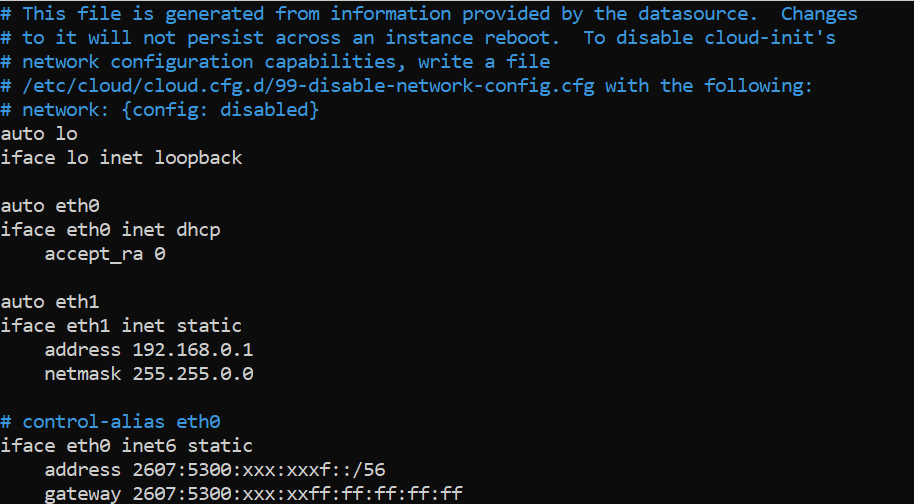
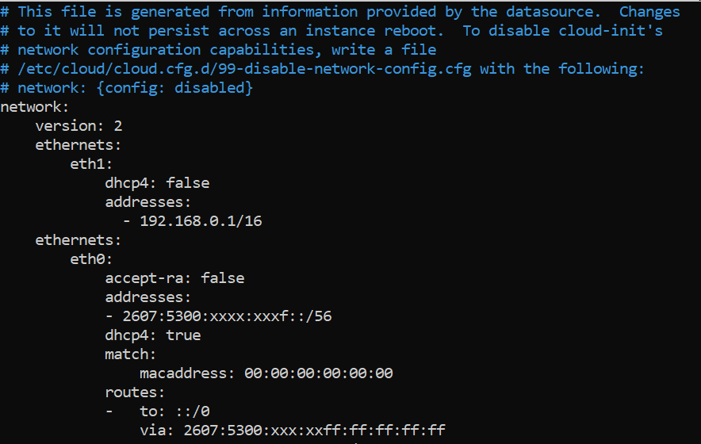
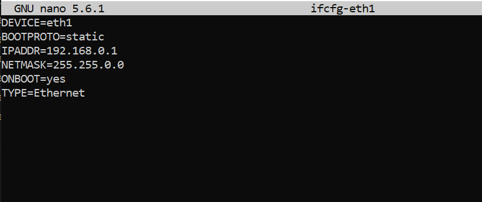

## Objectif

Le vRack (baie virtuelle) OVHcloud permet de rassembler virtuellement plusieurs serveurs (quel que soit leur nombre et leur emplacement physique dans nos datacenters) et de les connecter à un switch virtuel au sein d’un même réseau privé. Vos serveurs peuvent ainsi communiquer de manière privée et sécurisée entre eux, au sein d'un VLAN dédié.

**Découvrez comment configurer le vRack sur plusieurs serveurs dédiés.**

<iframe class="video" width="560" height="315" src="https://www.youtube.com/embed/ZA7IsbDdAmc?rel=0" frameborder="0" allow="autoplay; encrypted-media" allowfullscreen></iframe>

## Prérequis

- Un service [vRack](/links/network/vrack) activé dans votre compte
- Plusieurs [serveurs dédiés](/links/bare-metal/bare-metal) (compatibles vRack)
- Disposer d’un accès administrateur (sudo) au serveur via SSH ou RDP
- Être connecté à votre [espace client OVHcloud](/links/manager)
- Préparer la plage d'adresses IP privées que vous avez choisie

> [!warning]
> Cette fonctionnalité peut être indisponible ou limitée sur les [serveurs dédiés **Eco**](/links/bare-metal/eco-about).
>
> Consultez notre [comparatif](/links/bare-metal/eco-compare) pour plus d’informations.

## En pratique

### Étape 1 : commander le vRack

Connectez-vous à votre [espace client OVHcloud](/links/manager) et cliquez sur le bouton `Ajouter un service`{.action} (icône de panier d'achat) dans le menu situé à gauche de l'écran. Utilisez le filtre en haut de la page ou faites défiler vers le bas pour trouver le service `vRack`{.action}.

{.thumbnail}

Cliquez sur la case `vRack`{.action} pour être redirigé vers la page de validation de la commande. La mise en place du vRack dans votre compte peut prendre quelques minutes.

### Étape 2 : ajouter vos serveurs au vRack

Une fois le vRack activé dans votre compte, rendez-vous dans la section `Bare Metal Cloud`{.action} de votre [espace client OVHcloud](/links/manager), cliquez sur `Network`{.action} et ouvrez le menu `vRack`{.action}.

Sélectionnez votre vRack dans la liste pour afficher la liste des services éligibles. Cliquez sur chacun des serveurs que vous souhaitez ajouter au vRack, puis cliquez sur le bouton `Ajouter`{.action}.

{.thumbnail}

### Étape 3 : configuration de vos interfaces réseau

Les étapes suivantes contiennent les configurations des distributions/systèmes d'exploitation récents les plus couramment utilisés. La première étape consiste toujours à vous [connecter à votre serveur](/pages/bare_metal_cloud/dedicated_servers/getting-started-with-dedicated-server) en SSH ou en session RDP (pour Windows). Les exemples ci-dessous supposent que vous êtes connecté en tant qu'utilisateur avec des autorisations élevées (Administrateur/sudo).

> [!primary]
>
Concernant les différentes distributions, sachez que la procédure à suivre pour configurer votre interface réseau, ainsi que les noms de fichiers, ont pu être sujets à modification. Si vous rencontrez des difficultés, Nous vous recommandons de consulter les manuels et les bases de connaissances des versions respectives du système d'exploitation.
>
Par exemple, les détails de configuration ci-dessous auront l'adresse IP `192.168.0.0/16` (**Masque de sous-réseau**: `255.255.0.0`).
>
Vous pouvez utiliser n'importe quelle plage d'IP privée de votre choix et n'importe quelle adresse dans cette plage.
>

#### Identification de l’interface vRack <a name="vrack-interface"></a>

Les noms des interfaces réseau de vos serveurs ne sont pas toujours les mêmes.

Le meilleur moyen de vérifier la bonne interface pour le vRack est de vérifier l'onglet `Interfaces réseau`{.action} de votre serveur dans votre [espace client OVHcloud](/links/manager). Dans le tableau du bas, notez l'adresse MAC qui est aussi le **Nom** de l'interface **Privée**.

{.thumbnail}

Une fois connecté à votre serveur via SSH, vous pouvez lister vos interfaces réseau avec la commande suivante :

```bash
ip a
```

Sur la ligne qui commence par ```link ether```, vous pouvez vérifier que cette interface correspond à l'interface **Privée** renseignée dans votre [espace client OVHcloud](/links/manager). Utilisez ce nom d'interface pour remplacer `NETWORK_INTERFACE` dans les configurations ci-dessous (exemple : `eth1`).

```console
link ether f0:00:00:ef:0e:f0
```

#### Configurations GNU/Linux

> [!tabs]
> **Debian (hors Debian 12)**
>>
>> Dans un éditeur de texte, ouvrez le fichier de configuration réseau situé dans `/etc/network/interfaces.d` pour le modifier. Ici, le fichier s'appelle `50-cloud-init`.
>>
>> ```bash
>> sudo nano /etc/network/interfaces.d/50-cloud-init
>> ```
>>
>> Ajoutez les lignes suivantes à la configuration existante, remplacez `NETWORK_INTERFACE`, `IP_ADDRESS` et `NETMASK` par vos propres valeurs :
>>
>> ```console
>> auto NETWORK_INTERFACE
>> iface NETWORK_INTERFACE inet static
>>    address IP_ADDRESS
>>    netmask NETMASK
>> ```
>>
>> **Exemple :**
>>
>> {.thumbnail}
>>
>> Enregistrez vos modifications dans le fichier de configuration et quittez l'éditeur.
>>
>> Redémarrez le service réseau pour appliquer la configuration :
>>
>> ```bash
>> sudo systemctl restart networking
>> ```
>>
>> Répétez cette procédure pour vos autres serveurs et attribuez à chacun d'entre eux une adresse IP inutilisée à partir de votre plage privée. Dès lors, vos serveurs pourront communiquer entre eux sur le réseau privé.
>>
> **Ubuntu et  Debian 12**
>>
>> A l'aide de l'éditeur de texte de votre choix, ouvrez le fichier de configuration réseau se trouvant dans `/etc/netplan/` afin de l'éditer. Ici, le fichier s'appelle `50-cloud-init.yaml`.
>>
>> ```bash
>> sudo nano /etc/netplan/50-cloud-init.yaml
>> ```
>>
>> Ajoutez les lignes suivantes à la configuration existante après la ligne `version: 2`. Remplacez `NETWORK_INTERFACE` et `IP_ADDRESS/PREFIX` par vos propres valeurs.
>>
>> ```yaml
>>    ethernets:
>>        NETWORK_INTERFACE:
>>           dhcp4: false
>>            addresses:
>>              - IP_ADDRESS/PREFIX
>> ```
>>
>> **Exemple :**
>>
>> {.thumbnail}
>>
>> > [!warning]
>> >
>> > Il est important de respecter l'alignement de chaque élément dans les fichiers `yaml` comme représenté dans l'exemple ci-dessus. N'utilisez pas la touche de tabulation pour créer votre espacement. Seule la touche espace doit être utilisée.
>> >
>>
>> Enregistrez vos modifications dans le fichier de configuration et quittez l'éditeur.
>>
>> Appliquez la configuration :
>>
>> ```bash
>> sudo netplan apply
>> ```
>>
>> Répétez cette procédure pour vos autres serveurs et attribuez à chacun d'entre eux une adresse IP inutilisée à partir de votre plage privée. Dès lors, vos serveurs pourront communiquer entre eux sur le réseau privé.
>>
> **CentOS, AlmaLinux et RockyLinux**
>>
>> Une fois que vous avez identifié votre interface de réseau privé, utilisez l'éditeur de texte de votre choix pour créer le fichier de configuration réseau suivant. Remplacez `NETWORK_INTERFACE` par votre propre valeur.
>>
>> ```bash
>> sudo touch /etc/sysconfig/network-scripts/ifcfg-NETWORK_INTERFACE
>> ```
>>
>> Ajoutez ces lignes, en remplaçant `NETWORK_INTERFACE`, `IP_ADDRESS` et `NETMASK` par vos propres valeurs :
>>
>> ```console
>> DEVICE=NETWORK_INTERFACE
>> BOOTPROTO=static
>> IPADDR=IP_ADDRESS
>> NETMASK=NETMASK
>> ONBOOT=yes
>> TYPE=Ethernet
>> ```
>>
>> **Exemple :**
>>
>> {.thumbnail}
>>
>> Enregistrez vos modifications dans le fichier de configuration et quittez l'éditeur.
>>
>> Redémarrez le service réseau pour appliquer les modifications :
>>
>> ```bash
>> sudo systemctl restart networking
>> ```
>>
>> Sous **CentOS 8, AlmaLinux et RockyLinux**, utilisez cette commande :
>>
>> ```bash
>> sudo systemctl restart NetworkManager.service
>> ```
>>
>> Répétez cette procédure pour vos autres serveurs et attribuez à chacun d'entre eux une adresse IP inutilisée à partir de votre plage privée. Dès lors, vos serveurs pourront communiquer entre eux sur le réseau privé.
>>
> **Fedora**
>>
>> Une fois que vous avez identifié le nom de votre interface privée (comme expliqué [ici](#vrack-interface)), lancez la commande suivante pour vérifiez qu'elle est bien connectée. Dans notre exemple, notre interface est appelée `eno2` :
>>
>> ```bash 
>> $ nmcli device status
>>
>> DEVICE           TYPE      STATE                   CONNECTION
>> eno1             ethernet  connected               cloud-init eno1
>> lo               loopback  connected (externally)  lo
>> eno2             ethernet  disconnected            --
>> ```
>>
>> Si le `STATE` du `DEVICE` apparaît comme `disconnected`, il est nécessaire de le connecter avant de configurer l'IP.
>>
>> Lors de l'ajout d'une connexion **ethernet**, nous devons créer un profil de configuration que nous assignons ensuite à un périphérique.
>>
>> Exécutez la commande suivante, en remplaçant `INTERFACE_NAME` et `CONNECTION_NAME` par vos propres valeurs.
>>
>> Dans notre exemple, nous avons nommé notre profil de configuration `private-interface`.
>>
>> ```bash
>> nmcli connection add type ethernet con-name CONNECTION_NAME ifname INTERFACE_NAME
>> ```
>>
>> **Exemple :**
>>
>> ```bash
>> nmcli connection add type ethernet con-name private-interface ifname eno2
>> ```
>>
>> - Vérifiez que l'interface a été correctement connectée :
>>
>> ```bash
>> $ nmcli device status
>>
>> DEVICE           TYPE      STATE                   CONNECTION
>> eno1             ethernet  connected               cloud-init eno1
>> eno2             ethernet  connected               private-interface
>> lo               loopback  connected (externally)  lo              
>> ```
>>
>> Une fois cela fait, un nouveau fichier de configuration nommé *xxxxxxxxxx.nmconnection* sera créé dans le dossier `/etc/NetworkManager/system-connections`.
>>
>> ```bash
>> [user@server ~]$ cd /etc/NetworkManager/system-connections
>> [user@server system-connections]$ ls
>> cloud-init-eno1.nmconnection  private-interface.nmconnection
>> ```
>>
>> Vous pouvez alors éditer ce fichier en utilisant le gestionnaire `nmcli`, en remplaçant `IP_ADDRESS`, `PREFIX` et `CONNECTION_NAME` par vos propres valeurs.
>>
>> - Ajoutez votre IP :
>>
>> ```bash
>> nmcli connection modify CONNECTION_NAME IPv4.address IP_ADDRESS/PREFIX
>> ```
>>
>> **Exemple :**
>>
>> ```bash
>> nmcli connection modify private-interface IPv4.address 192.168.0.1/16
>> ```
>>
>> - Changez la configuration de **auto** à **manual** :
>>
>> ```bash
>> sudo nmcli connection modify CONNECTION_NAME IPv4.method manual
>> ```
>>
>> **Exemple :**
>>
>> ```bash
>> sudo nmcli connection modify private-interface IPv4.method manual
>> ```
>>
>> - Rendez la configuration persistante :
>>
>> ```bash
>> sudo nmcli con mod CONNECTION_NAME connection.autoconnect true
>> ```
>>
>> **Exemple :**
>>
>> ```bash
>> sudo nmcli con mod private-interface connection.autoconnect true
>> ```
>>
>> - Redémarrez votre réseau avec la commande suivante :
>>
>> ```bash
>> sudo systemctl restart NetworkManager
>> ```
>>

#### Configuration Windows

À titre d'exemple, les configurations suivantes utiliseront la plage d'adresses IP de `192.168.0.0/16` (**Masque de sous-réseau**: `255.255.0.0`).

Connectez-vous à votre serveur Windows via le bureau à distance et allez dans le **Panneau de configuration**.

{.thumbnail}

Cliquez sur `Network and Internet`{.action}.

{.thumbnail}

Ouvrez `Network and Sharing Center`{.action}.

{.thumbnail}

Cliquez sur `Change Adapter Settings`{.action}.

{.thumbnail}

Faites un clic-droit sur l'interface réseau secondaire, puis cliquez sur `Propriétés`{.action}.

Notez que, dans notre exemple, `Ethernet 2` est l'interface utilisée pour le vRack. Cependant, il est possible que la carte réseau vRack utilise une interface différente. Utilisez une interface qui ne possède pas l'adresse IP principale du serveur ou qui utilise une adresse IP auto-attribuée.

{.thumbnail}

Double-cliquez sur `Internet Protocol Version 4 (TCP/IPv4)`{.action}.

{.thumbnail}

Cliquez sur **Utiliser l'adresse IP suivante**. Entrez n'importe quelle adresse **IP** de votre plage privée et le **masque** de sous-réseau approprié (`255.255.0.0` dans cet exemple) dans le champ correspondant.

{.thumbnail}

Cliquez sur `OK`{.action} pour sauvegarder les modifications puis redémarrez votre serveur pour les appliquer.

Répétez cette procédure pour vos autres serveurs et attribuez à chacun d'entre eux une adresse IP inutilisée à partir de votre plage privée. Dès lors, vos serveurs pourront communiquer entre eux sur le réseau privé.

## Aller plus loin

[Créer plusieurs VLAN dans le vRack](/pages/bare_metal_cloud/dedicated_servers/creating-multiple-vlans-in-a-vrack).

Échangez avec notre [communauté d'utilisateurs](/links/community).
