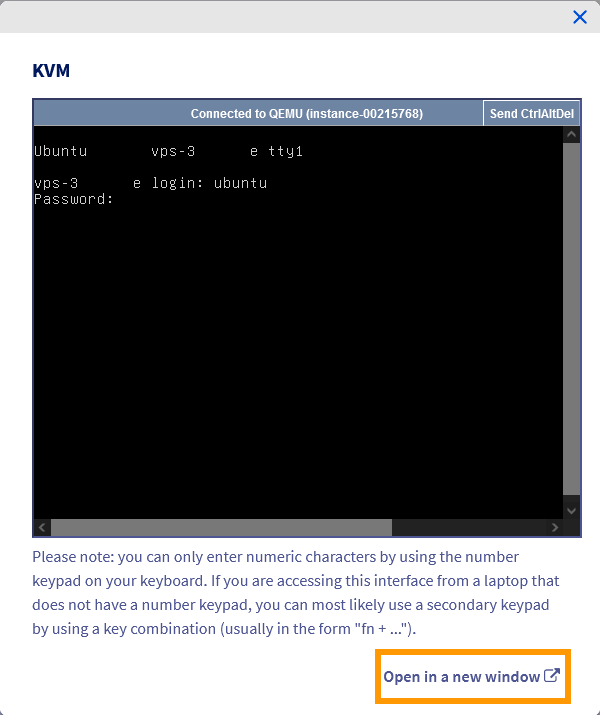

<style>
details>summary {
    color:rgb(33, 153, 232) !important;
    cursor: pointer;
}
details>summary::before {
    content:'\25B6';
    padding-right:1ch;
}
details[open]>summary::before {
    content:'\25BC';
}
</style>

## Objectif

La console KVM pour VPS, disponible dans votre espace client OVHcloud, vous permet d'ouvrir une connexion à votre VPS dans votre navigateur web, indépendamment d'un logiciel de connexion supplémentaire. Dans ce contexte, KVM signifie « *keyboard, video, and mouse* », en référence à la méthode d’entrée/sortie émulée de la connexion à distance.

> [!primary]
>
> À noter que la console KVM n’est pas une solution de contournement si vous avez perdu l’accès au système d’exploitation de votre VPS. Vous devrez alors [utiliser le mode rescue du VPS pour récupérer l'accès au serveur](/pages/bare_metal_cloud/dedicated_servers/replacing-user-password).

**Ce guide vous explique comment utiliser la console KVM pour accéder à votre VPS.**

## Prérequis

- Un [VPS](/links/bare-metal/vps) dans votre compte OVHcloud
- Accès à l’[espace client OVHcloud](/links/manager)

## En pratique

### Comment ouvrir la console KVM via l'espace client OVHcloud

Connectez-vous à l'[espace client OVHcloud](/links/manager), rendez-vous dans la section `Bare Metal Cloud`{.action} et sélectionnez votre serveur sous `Serveurs privés virtuels`{.action}.

Dans l'onglet `Informations générales`{.action}, cliquez sur le bouton `...`{.action} à côté du nom de votre VPS dans la section **Votre VPS**.

{.thumbnail}

### Comment ouvrir la console KVM via l’API OVHcloud

/// details | Dépliez cette section

Si vous n'êtes pas familier avec l'utilisation de l'API OVHcloud, consultez notre guide « [Premiers pas avec les API OVHcloud](/pages/manage_and_operate/api/first-steps) ».

Pour récupérer l'URL d'accès KVM, ouvrez ce point de terminaison :

> [!api]
>
> @api {v1} /vps POST /vps/{serviceName}/getConsoleUrl
>

Renseignez le nom interne de votre VPS (`vps-x11x11xyy.vps.ovh.net`) dans le champ `serviceName`.

Cliquez sur le bouton `EXECUTE`{.action}.

L'URL d'accès sera affichée dans la section `RESPONSE`.

///

### Utilisation de la console KVM

Si vous accédez au KVM depuis votre espace client, une fenêtre contextuelle s’affiche. Pour l'utiliser en plein écran, cliquez sur le lien `Ouvrir dans une nouvelle fenêtre`{.action} dans le coin inférieur droit. Cela ouvrira généralement un nouvel onglet de navigateur.

{.thumbnail}

L'écran KVM affiché dépend du système d'exploitation et de l'état individuel du VPS. Si vous y êtes invité, connectez-vous avec les informations d'identification d'un compte d'utilisateur actif.

Vous pouvez également utiliser un logiciel client tiers pour vous connecter.

#### Comment changer la disposition du clavier

> [!primary]
>
> Le clavier de la console KVM peut avoir une disposition différente de la vôtre. Avant d’entrer un mot de passe, tapez quelques caractères pour vérifier la disposition, par exemple à l’aide de [cette page](https://en.wikipedia.org/wiki/Keyboard_layout#Conventional_Latin-script_keyboard_layouts).
>

Vous pouvez activer la configuration clavier souhaitée pour faciliter l'utilisation de la console. Entrez la commande suivante :

```bash
sudo dpkg-reconfigure keyboard-configuration
```

Un menu graphique s'ouvre dans lequel vous pouvez sélectionner un modèle de clavier.

{.thumbnail}

Utilisez les touches fléchées pour accéder à l'option la plus proche de votre matériel, puis appuyez sur `Enter`{.action}.

Dans le menu suivant, choisissez votre pays.

{.thumbnail}

Dans le troisième menu, vous pouvez spécifier la disposition réelle du clavier.

{.thumbnail}

En fonction de vos sélections, d'autres options peuvent apparaître après le troisième menu.

De retour en ligne de commande, renseignez la commande suivante pour appliquer les modifications :

```bash
sudo systemctl restart keyboard-setup
```

> [!primary]
>
> Cette modification ne persistera pas si le serveur est redémarré.
>

## Aller plus loin

Pour des prestations spécialisées (référencement, développement, etc), contactez les [partenaires OVHcloud](/links/partner).

Si vous souhaitez bénéficier d'une assistance à l'usage et à la configuration de vos solutions OVHcloud, consultez nos différentes [offres de support](/links/support).

Échangez avec notre [communauté d'utilisateurs](/links/community).
