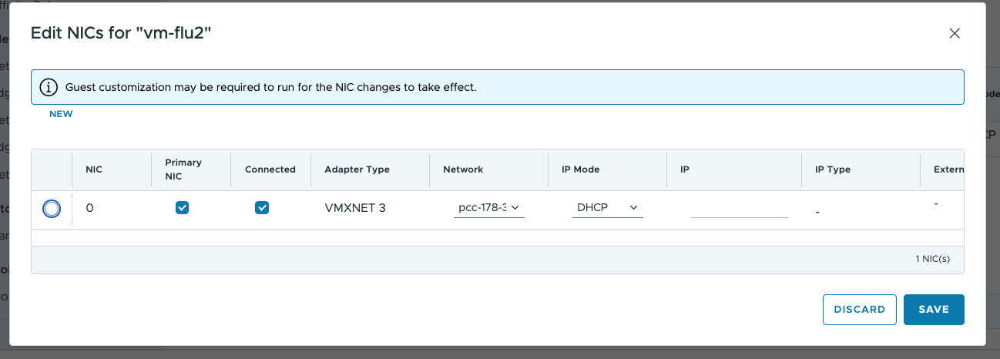

## Objective

This guide explains the necessary steps to configure your environment after migrating from Managed vSphere to VMware Cloud Director (VCD). 

These modifications are essential to ensure the proper functioning of your virtual machines and networks.

## Requirements

- Access to **VMware Cloud Director**.
- Administrative rights to modify virtual machine and network settings.

## Instructions

### Step 1: Update virtual machine network settings  

After migration, you need to update the network configurations of your virtual machines (VMs) by selecting one of the following options:

- Option 1: **Set the network configuration to DHCP**  
   - Go to the network settings of each VM. 

   - Change the IP assignment mode to **DHCP**.  

{.thumbnail}

   - Make sure the **"Guest customization settings"** are set to **Disabled** before modifying the NIC settings.  

{.thumbnail}

- Option 2: **Update Gateway CIDR for each network**  
   - Update the Gateway CIDR to match the actual subnet used in each network.  
   - This step is required to maintain connectivity and avoid configuration conflicts.  

{.thumbnail}

### Step 2: Handling the IP addressing bug in VCD  

During migration, VLANs are pre-created with **placeholder Gateway CIDRs**, as the actual VM subnets are unknown beforehand. 

This can lead to IP assignment issues if not addressed post-migration.

#### **Identified issue**  
- If a static IP is manually assigned to a VM and does not match the pre-configured Gateway CIDR, the assignment will fail. 

- You will not be able to create or update a VM with manual IP assignment outside the predefined Gateway CIDR.  

#### **Solutions**  

1. **Use DHCP mode** *(Recommended)*  
   - Setting all IP modes to DHCP works seamlessly, even if the OS is configured with a static IP.  
   - This approach is valid for both **isolated networks** and **VM Networks**.  

   {.thumbnail}

2. **Manually update the subnet in static mode**  
   - Identify and configure the correct subnet manually for each network.  
   - There is no automatic method to retrieve these details.  

3. **Create a new segment**  
   - Customers can create a new network segment with the correct subnet.  
   - This solution works only if the customer has **a single** public IP range.  

## Go further  

If you need assistance, please reach out to:  

- **Your Account Manager or assigned Technical Account Manager**  
- **Our OVHcloud Professional Services team**: [https://www.ovhcloud.com/en/professional-services/](https://www.ovhcloud.com/en/professional-services/)  

We strongly recommend reviewing this documentation carefully and adapting your environment to ensure a smooth transition to Managed VCD.  

Join our [community of users](/links/community).
