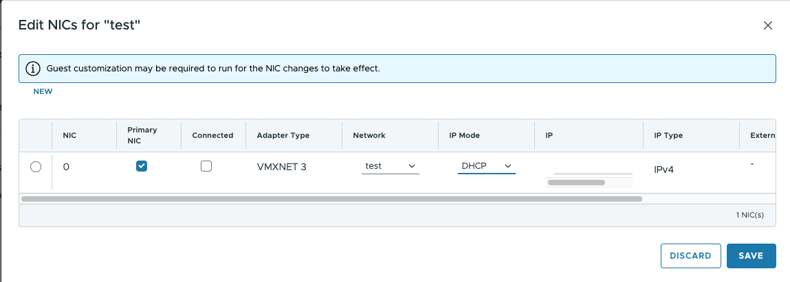
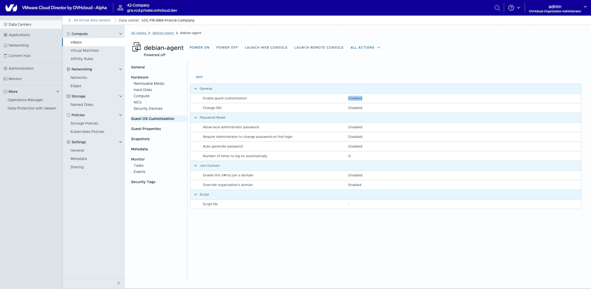

## Objective

This guide explains the necessary steps to configure your environment after migrating from your managed `VMware vSphere` on OVHcloud services to a managed `VMware Cloud Director` on OVHcloud solution

These modifications are essential to ensure the proper functioning of your virtual machines and networks.

## Requirements

- Access to `VMware Cloud Director`on OVHcloud solution.
- You must have access to the [OVHcloud Control Panel](/links/manager) and be technical administrator of the managed [VMware vSphere on OVHcloud](/links/hosted-private-cloud/vmware) infrastructure.

## Instructions

### Step 1: Update virtual machine network settings

After migration, you need to update the network configurations of your `virtual machines (VMs)`.

To set the network configuration to `DHCP`:

1. Go to the network settings of each `VM`.

2. Change the IP assignment mode to `DHCP`{.action}.

    {.thumbnail}

3. Make sure the `"Guest customization settings"`{.action} are set to `Disabled` before modifying the NIC settings.

    {.thumbnail}

### Step 2: Handling the IP addressing bug in `VCD`

 Networks are pre-created with placeholder Gateway CIDRs, as the actual VM subnets are unknown beforehand.

This can lead to IP assignment issues if not addressed post-migration.

#### **Identified issue**
- If a static IP is manually assigned to a `VM` and does not match the pre-configured `Gateway CIDR`, the assignment will fail.
- You will not be able to create or update a `VM` with manual IP assignment outside the predefined `Gateway CIDR`.

#### **Solutions**

1. **Use `DHCP` mode** *(Recommended)*
    - Setting all IP modes to `DHCP` works seamlessly, even if the OS is configured with a static IP.
    - This approach is valid for both **`isolated networks`** and **`VM Networks`**.

    {.thumbnail}

2. **Manually update the subnet in `static mode`**
    - Identify and configure the correct subnet manually for each network.
    - There is no automatic method to retrieve these details.

3. **Create a new `segment`**
    - Customers can create a new `network` with the correct subnet.
    - This solution works only if the customer has **a single** public IP range.

## Go further

If you need training or technical assistance to implement our solutions, please contact your Technical Account Manager or click on [this link](/links/professional-services) to get a quote and ask our Professional Services experts for a custom analysis of your project.

Ask questions, give your feedback and interact directly with the team building our Hosted Private Cloud services on the dedicated [Discord](https://discord.gg/ovhcloud) channel.

Join our [community of users](/links/community).
