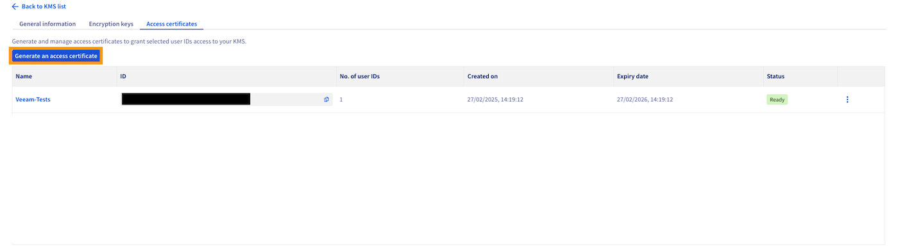
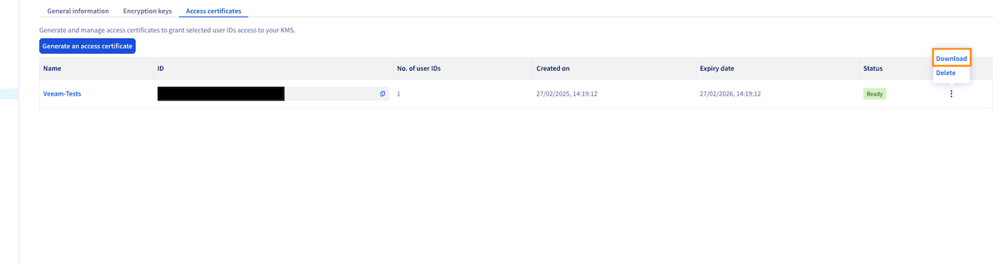

## Objectif
Ce guide explique comment configurer des tâches de sauvegarde chiffrées en utilisant la solution de sauvegarde Veeam et le service KMS d’OVHcloud (OKMS).

## Prérequis
- Être connecté à [l'espace client OVHcloud](/links/manager).
- Disposer d'une offre [VMware on OVHcloud](/links/hosted-private-cloud/vmware).
- Avoir lu les guides : 
    - [Intégration d'un KMS pour VMware on OVHcloud](/pages/hosted_private_cloud/hosted_private_cloud_powered_by_vmware/vmware_overall_vm-encrypt).
    - [Premiers pas avec OKMS](/pages/manage_and_operate/kms/quick-start).

## En pratique

### Étape 1 : Création du certificat via l’API

Vous pouvez créer un certificat d’accès directement via l’API OKMS, sans passer par l’interface graphique.

1. Générez la clé privée via l’API (sans CSR) :

> [!api]
>
> @api {v1} /okms POST / /okms/resource/{okmsId}/credential

2. Récupérez le certificat via une requête GET :

> [!api]
>
> @api {v1} /okms GET /okms/resource/{okmsId}/credential

> [!note]
> Cette méthode est équivalente à l’option `Je n’ai pas de clé privée`{.action} dans l’interface utilisateur du Manager.
> Vous pouvez aussi passer un CSR si vous disposez déjà de votre propre clé privée.

3. Téléchargez la clé privée.

4. Téléchargez le certificat.

> [!info]
> La clé privée téléchargée est utilisée pour générer le fichier `.pfx` à l’étape suivante.
> Elle ne doit pas être importée directement dans Veeam, mais elle est indispensable pour convertir le certificat dans un format compatible.
> Veillez à la conserver dans un endroit sécurisé.

### Étape 2 : Création du certificat via le Manager

Vous pouvez aussi générer un certificat depuis [l'espace client OVHcloud](/links/manager) :

1. Cliquez sur `Hosted Private Cloud`{.action} puis `Identity, Security & Operations`{.action} et enfin `Key Management Service`{.action}. Sélectionnez votre KMS.

{.thumbnail}

2. Sélectionnez votre KMS.

{.thumbnail}

3. Cliquez sur l’onglet `Certificats d’accès`.

{.thumbnail}

4. Cliquez sur `Générer un certificat d’accès`{.action}.

5. Remplissez les champs requis et sélectionnez l’option `Je n’ai pas de clé privée`{.action}.

{.thumbnail}

> [!note]
> L’option `Je n’ai pas de clé privée`{.action} correspond à une génération de certificat sans CSR (comme via l’API).
> Vous pouvez aussi sélectionner `J’ai déjà une clé privée` si vous souhaitez générer un certificat à partir de votre propre CSR.

### Ajouter des identifiants utilisateur (user IDs)

Avant de pouvoir utiliser le certificat, vous devez associer au moins un identifiant utilisateur.

1. Dans l'interface de gestion du KMS, cliquez sur `Ajouter des identifiants`{.action}.
2. Sélectionnez les utilisateurs autorisés à accéder à ce KMS.
3. Validez pour que le certificat soit lié à ces identifiants.

> [!info]
> Cette étape est indispensable pour que le certificat soit reconnu et utilisable dans Veeam.

6. Téléchargez la clé privée et le certificat.

{.thumbnail}

### Étape 3 : Conversion du certificat PEM en format PFX

Pour importer le certificat dans Veeam, vous devez le convertir au format `.pfx` en utilisant la commande suivante :

```bash
openssl pkcs12 -export -out cert.pfx -inkey privatekey.pem -in certificate.pem
```

### Étape 4 : Importation du certificat dans le Windows Certificate Store de Veeam

- Ouvrez le Windows Certificate Store sur votre serveur Veeam.
- Importez le fichier `.pfx` généré à l’étape précédente.
- Cochez l’option permettant de rendre le certificat exportable.

{.thumbnail}

### Étape 5 : Enregistrement du KMS dans Veeam

- Ouvrez Veeam Backup & Replication et allez dans `Credentials & Passwords`{.action}, puis cliquez sur `Key Management Servers`{.action}.

{.thumbnail}

- Cliquez sur `Add`{.action} pour ajouter un nouveau serveur KMS.

{.thumbnail}

- Saisissez les informations suivantes :
    - Adresse du serveur : `eu-west-rbx.okms.ovh.net`
    - Port : `5696`
    - Certificat serveur : `*.okms.ovh.net`
    - Certificat client : le fichier `.pfx` que vous venez d'importer

{.thumbnail}

### Étape 6 : Récupération du certificat serveur

Pour récupérer le certificat depuis le serveur OKMS, utilisez la commande suivante :

```bash
openssl s_client -connect eu-west-rbx.okms.ovh.net:443 2>/dev/null </dev/null |  sed -ne '/-BEGIN CERTIFICATE-/,/-END CERTIFICATE-/p'
```
### Étape 7 : Configuration du chiffrement des tâches de sauvegarde

- Enregistrez le serveur KMS dans votre console Veeam Backup & Replication.
- Sélectionnez la tâche de sauvegarde souhaitée, puis configurez le chiffrement avec le KMS enregistré.

{.thumbnail}

- Une fois la sauvegarde exécutée, une icône de cadenas s'affiche à côté de son nom.

{.thumbnail}

- En cas d’erreur `Unsupported attribute: OPERATION_POLICY_NAME`, consultez la documentation ou contactez le support.

{.thumbnail}

## Aller plus loin

Si vous avez besoin d'une formation ou d'une assistance technique pour la mise en oeuvre de nos solutions, contactez votre commercial ou cliquez sur [ce lien](/links/professional-services) pour obtenir un devis et demander une analyse personnalisée de votre projet à nos experts de l’équipe Professional Services.

Posez vos questions, donnez votre avis et échangez directement avec l’équipe en charge des services Hosted Private Cloud sur notre canal [Discord](https://discord.gg/ovhcloud).

Échangez avec notre [communauté d'utilisateurs](/links/community).