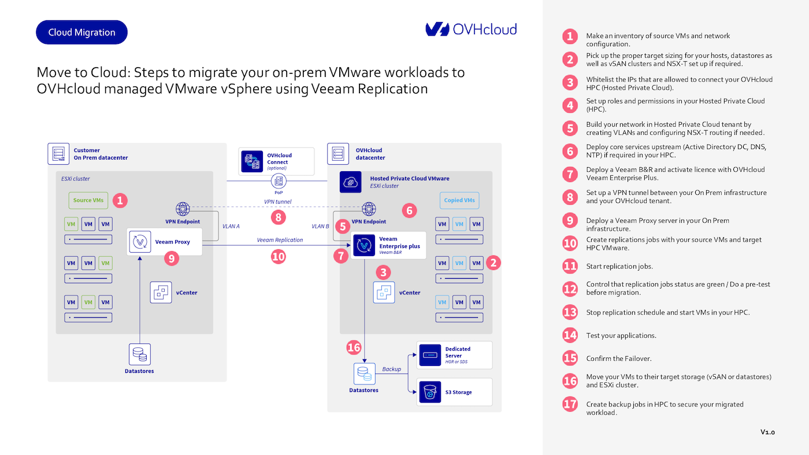

## Objectif

Ce guide explique comment migrer vos workloads VMware on-premises vers un **OVHcloud Hosted Private Cloud (HPC)** à l’aide de Veeam Replication.

> [!primary]
> **Ce guide s’applique aux environnements Hosted Private Cloud qui ne font PAS partie de SecNumCloud (SNC), PCI-DSS ou HDS.**
> Si vous utilisez un environnement Hosted Private Cloud qualifié SNC, PCI-DSS ou HDS, certaines fonctionnalités décrites ici, comme OVHcloud IAM, peuvent être indisponibles.
> Pour les environnements SecNumCloud, veuillez consulter le guide dédié : [Move2Cloud - Migrating VMware Workloads to SecNumCloud Hosted Private Cloud with Veeam Replication](/pages/hosted_private_cloud/hosted_private_cloud_powered_by_vmware/vmware_migration_veeam_secnumcloud)

## Prérequis

Avant de commencer, vous aurez besoin de :

- Une liste complète des VM avec FQDN, adresses IP et dépendances.
- Des ressources cibles correctement dimensionnées (ex : hôtes, datastores, clusters vSAN).
- Une solution **Veeam Backup & Replication** valide via le [site de Veeam](https://www.veeam.com/downloads.html?ad=top-sub-menu).
- Un accès à vCenter, ainsi que des services DNS, NTP et d’authentification préconfigurés dans votre HPC.

{.thumbnail}

## En pratique

### Étape 1 : Concevoir votre plan de migration

À la fin de cette étape, vous saurez exactement quelles charges de travail migrer, leurs dépendances, ainsi que la configuration réseau et de stockage cible.

#### Étape 1.1 : Créer un inventaire des VM

Commencez par lister toutes les VM que vous prévoyez de migrer.

Pour chaque VM, indiquez les éléments suivants :

- **FQDN** (nom de domaine complet) et **adresse IP**
- **Version du système d’exploitation** (à jour et supportée)
- **Dépendances** (ex : applications qui reposent sur des serveurs spécifiques)

#### Étape 1.2 : Regrouper les VM en lots de migration

Organisez vos VM en groupes logiques selon leurs dépendances applicatives.

Par exemple :

- Un **serveur web**, un **serveur applicatif** et une **base de données** qui fonctionnent ensemble doivent être migrés dans le même lot.

Cela garantit le bon fonctionnement des applications durant la transition.

#### Étape 1.3 : Documenter les détails réseau

Notez la configuration réseau actuelle de votre environnement on-premises :

- **Sous-réseaux** et **VLAN IDs**
- Nombre de VLAN nécessaires pour le HPC cible

Avec [OVHcloud vRack](/links/network/vrack), vous pouvez créer jusqu’à 4 000 VLAN, ce qui permet de répliquer votre plan d’adressage sans re-IP.

### Étape 2 : Planifier les ressources cibles

À la fin de cette étape, vous connaîtrez les ressources nécessaires dans votre HPC.

#### Étape 2.1 : Calculer les besoins en ressources

Évaluez vos besoins en CPU et RAM en calculant le total des cœurs et de la mémoire nécessaires.

Utilisez votre ratio de consolidation actuel (pCPU/vCPU) comme référence pour déterminer le nombre et le type d’hôtes ESXi requis.

#### Étape 2.2 : Définir les besoins en stockage

Identifiez les workloads nécessitant des **datastores NFS** ou du **stockage vSAN**, selon leurs IOPS. Pour les applications à fortes performances, vSAN est recommandé.

#### Étape 2.3 : Planifier le réseau

Si vous utilisez NSX-T, définissez votre stratégie de segmentation réseau (VLAN ou overlay) et évaluez le trafic nord/sud.

Décidez si vous conservez votre pare-feu actuel ou si vous déployez des firewalls virtuels (FortiVM, Stormshield, Palo Alto VM-Series).

Pour les services exposés à Internet, prévoyez des IP publiques ou utilisez la fonction [Bring Your Own IP (BYOIP)](/links/network/byoip).

### Étape 3 : Autoriser l’accès IP au vCenter

Pour permettre l’accès à distance au vCenter dans votre HPC :

1. Connectez-vous à [l'espace client OVHcloud](/links/manager)
2. Accédez à `Hosted Private Cloud`{.action} > Secure SSL Gateway
3. Ajoutez les adresses IP autorisées

Consultez aussi notre [guide de IP whitelisting](/pages/hosted_private_cloud/hosted_private_cloud_powered_by_vmware/autoriser_des_ip_a_se_connecter_au_vcenter).

### Étape 4 : Configurer les rôles et permissions

#### Étape 4.1 : Utiliser OVHcloud IAM

Configurez les rôles et permissions dans votre `Hosted Private Cloud`{.action} via **OVHcloud IAM**.

> [!warning]
> **OVHcloud IAM n’est pas disponible dans les environnements qualifiés SecNumCloud (SNC), PCI-DSS ou HDS.**
> Vous devrez alors configurer les rôles directement dans vSphere ou via une solution IAM externe (AD, Okta…).

Voir [le guide IAM](/pages/hosted_private_cloud/hosted_private_cloud_powered_by_vmware/vmware_iam_getting_started).

#### Étape 4.2 : Intégration avec IAM existant

Si vous utilisez déjà AD ou Okta, vous pouvez les déployer dans le HPC.

#### Étape 4.3 : Activer le SSO

Configurez le Single Sign-On (SSO) avec ADFS pour simplifier l’accès.

Voir [ce guide](/pages/account_and_service_management/account_information/ovhcloud-account-connect-saml-adfs).

### Étape 5 : Construire votre réseau cible

#### Étape 5.1 : Définir la matrice de flux

Identifiez quels VLAN sont routés et quelles VM doivent échanger du trafic. Précisez les ports et protocoles autorisés.

#### Étape 5.2 : Configurer NSX-T

Configurez les gateways Tier-1/Tier-0 avec NSX-T. Les tenants VMware disposent de **dVS** et VLAN préconfigurés, modifiables selon vos besoins.

Voir le [guide de démarrage NSX](/pages/hosted_private_cloud/hosted_private_cloud_powered_by_vmware/nsx-01-first-steps).

### Étape 6 : Déployer les services essentiels

Votre HPC nécessite des services fondamentaux :

- **NTP :** `ntp.ovh.net` pour la synchro horaire
- **DNS :** Déployer un AD ou un autre serveur DNS local
- **Authentification :** Mettre en place un service local pour limiter le trafic croisé

### Étape 7 : Installer le serveur Veeam Backup & Replication

Installez le serveur **Veeam Backup & Replication** dans le HPC.

Activez la licence avec [ce guide](/pages/storage_and_backup/backup_and_disaster_recovery_solutions/veeam/veeam_veeam_backup_replication).

### Étape 8 : Configurer une connectivité sécurisée

#### Étape 8.1 : Configurer un tunnel VPN

Créez un tunnel IPsec avec NSX, Stormshield ou OpnSense :

- [VPN avec NSX](/pages/hosted_private_cloud/hosted_private_cloud_powered_by_vmware/nsx-12-configure-ipsec)
- [VPN Stormshield](https://documentation.stormshield.eu/SNS/v4/en/Content/User_Configuration_Manual_SNS_v4/IPSec_VPN/IPSEC_VPN.htm)
- [VPN OpnSense](https://docs.opnsense.org/manual/how-tos/ipsec-s2s.html)

#### Étape 8.2 : Utiliser OVHcloud Connect (facultatif)

Pour bénéficier de plus de bande passante et d’une latence maîtrisée, vous pouvez souscrire à [OVHcloud Connect](/links/network/ovhcloud-connect). Cette solution fournit un lien de type MPLS entre votre infrastructure On Prem et votre tenant OVHcloud.

Avec [OVHcloud Connect](/links/network/ovhcloud-connect) vous choisissez le débit adapté à vos besoins, de 200 Mbps à plusieurs Gbps.

### Étape 9 : Déployer le proxy Veeam

Déployez un proxy Veeam sur site :

1. Ajoutez-le via la console Veeam > **Backup Infrastructure**
2. Configurez les modes de transport et ressources

Voir [ce guide d'installation d'un proxy](https://helpcenter.veeam.com/docs/backup/vsphere/add_vmware_proxy.html?ver=120)

### Étape 10 : Créer les jobs de réplication

Depuis Veeam Backup & Replication :

1. Ouvrez `Replication Jobs`{.action}
2. Ajoutez les `VM sources`{.action} et configurez la cible HPC
3. Réglez les options (compression, app-aware …)

Voir le [guide de création](https://helpcenter.veeam.com/docs/backup/vsphere/replica_job.html?ver=120)

### Étape 11 : Lancer et tester la réplication

Testez avec `Failover Now`{.action}, puis revenez à l’état initial avec `Undo Failover`{.action}.

Voir [Failover](https://helpcenter.veeam.com/docs/backup/vsphere/failover.html?ver=120) et [Undo Failover](https://helpcenter.veeam.com/docs/backup/vsphere/undo_failover.html?ver=120)

### Étape 12 : Finaliser la migration

Lancez un `Planned Failover`{.action} le jour J pour synchroniser les données finales et activer les replicas.

Voir [Planned Failover](https://helpcenter.veeam.com/docs/backup/vsphere/planned_failover.html?ver=120)

### Étape 13 : Vérifier les applications

Redémarrez les VM et testez les services critiques (AD, DNS, BDD…).

### Étape 14 : Valider le basculement définitif

Utilisez `Permanent Failover`{.action} pour officialiser le changement de prod.

Voir [Permanent Failover](https://helpcenter.veeam.com/docs/backup/vsphere/permanent_failover.html?ver=120)

### Étape 15 : Optimiser et sécuriser

Utilisez [Storage vMotion](/pages/hosted_private_cloud/hosted_private_cloud_powered_by_vmware/vmware_storage_vmotion) pour déplacer les VM, puis configurez les backups dans [OVHcloud Object Storage](/links/public-cloud/object-storage).

### Étape 16 : Déplacer les VM vers le stockage cible

Une fois vos VM migrées vers l’environnement HPC d’OVHcloud, il peut être nécessaire d’optimiser leur emplacement en fonction des besoins en performance.

Cela implique de déplacer les VM et leurs fichiers disques virtuels (VMDK) vers le stockage approprié.

1. **Évaluer les besoins en performance :**
    - Identifiez les VM nécessitant un stockage haute performance (par exemple, vSAN pour les charges de travail intensives).
    - Utilisez des datastores NFS pour les applications moins exigeantes.
2. **Utiliser Storage vMotion :**
    - Ouvrez le `vSphere Client`{.action} et naviguez jusqu’à la VM que vous souhaitez déplacer.
    - Faites un clic droit sur la VM et sélectionnez `Migrate`{.action}.
    - Choisissez l’option `Change storage only`{.action} et sélectionnez le datastore cible (vSAN ou NFS).
    - Vérifiez et confirmez les paramètres de migration, puis lancez le processus de migration.

Cette étape garantit que vos VM sont stockées sur l’infrastructure la plus adaptée à leurs besoins en performance.

Pour plus d’informations, consultez le [guide Storage vMotion](/pages/hosted_private_cloud/hosted_private_cloud_powered_by_vmware/vmware_storage_vmotion).

### Étape 17 : Créer des jobs de sauvegarde pour sécuriser vos workloads

Maintenant que vos VM fonctionnent dans l’environnement Hosted Private Cloud d’OVHcloud, il est essentiel de mettre en place une stratégie de sauvegarde pour protéger vos données.

**Veeam Backup & Replication** offre des options flexibles pour sécuriser vos workloads.

1. **Définir l’emplacement de stockage pour la sauvegarde :**
    - Utilisez l’**[Object Storage compatible S3*](/links/public-cloud/object-storage)** d’OVHcloud comme référentiel de sauvegarde, pour une solution évolutive et optimisée en termes de coûts.
2. **Créer un job de sauvegarde dans Veeam :**
    - Ouvrez la **console Veeam** et accédez à l’onglet `Home`{.action}.
    - Cliquez sur `Backup Job`{.action} > `Virtual Machine`{.action} et suivez l’assistant :
    - Sélectionnez les VM à sauvegarder.
    - Choisissez le référentiel de sauvegarde (par exemple, OVHcloud Object Storage).
    - Configurez les règles de rétention, la compression et le chiffrement selon vos besoins.
3. **Lancer et tester le job de sauvegarde :**
    - Démarrez le job de sauvegarde et surveillez son exécution.
    - Effectuez une restauration de test pour vérifier que les sauvegardes sont fiables et exploitables en cas de besoin.

Mettre en place des sauvegardes régulières vous garantit la protection de vos workloads contre la perte ou la corruption de données. Pour plus de détails, consultez le [guide de sauvegarde Veeam avec S3](/pages/storage_and_backup/object_storage/s3_veeam).

*: S3 est une marque déposée d’Amazon Technologies, Inc. Le service OVHcloud n’est ni sponsorisé, ni approuvé, ni affilié à Amazon Technologies, Inc.

## Aller plus loin

Vous pouvez consulter les ressources supplémentaires ci-dessous pour renforcer votre stratégie de sauvegarde, de réplication et de reprise après sinistre avec OVHcloud :

- [Veeam Managed Backup](/links/hosted-private-cloud/veeam-managed-backup) : Une solution de sauvegarde entièrement managée par OVHcloud.
- [Zerto for VMware on OVHcloud](/links/hosted-private-cloud/vmware-zerto) : Solution de reprise d’activité et de réplication interrégions.

Si vous avez besoin d'une formation ou d'une assistance technique pour la mise en œuvre de nos solutions, contactez votre Technical Account Manager ou demandez une analyse personnalisée de votre projet à nos experts de l’équipe [Professional Services](/links/professional-services).

Posez des questions, donnez votre avis et interagissez directement avec l’équipe qui construit nos services Hosted Private Cloud sur le canal [Discord](https://discord.gg/ovhcloud){.external} dédié.

Échangez avec notre [communauté d'utilisateurs](/links/community).