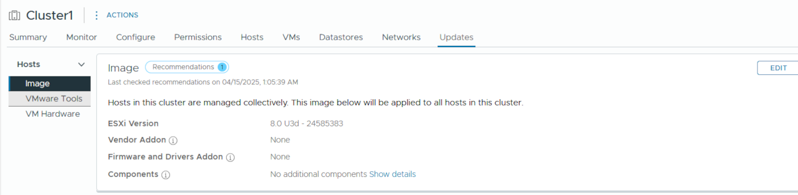
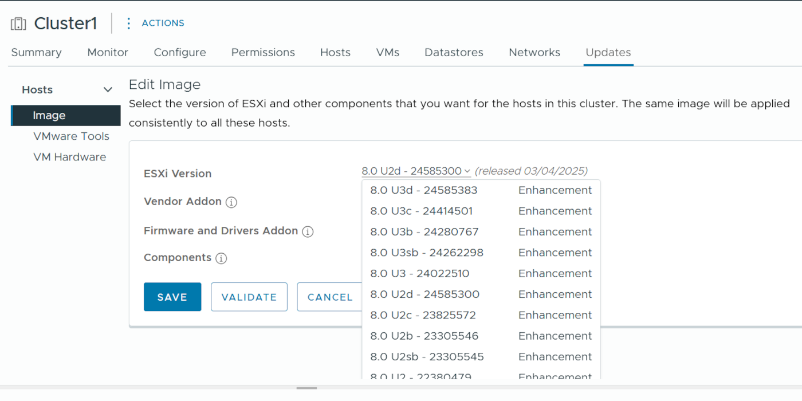

## Objective

This guide explains how to update your ESXi hosts using vSphere Lifecycle Management (vLCM), directly from the vSphere interface. vLCM helps you detect required updates and keep your hosts up to date quickly and securely by applying a complete image.

Unlike VMware Update Manager, vLCM provides a full lifecycle approach by including software updates, drivers, firmware, and hardware components.  This gives you a centralised view of your hosts’ status and helps you make informed decisions to maintain performance and security.

## Requirements

- Your vCenter must be running **vSphere 8** to access the vLCM feature.
- Make sure the **DRS (Distributed Resource Scheduler)** feature is enabled in automatic mode.
- Check that your `.iso` or `.vmdk` files are not stored locally on the hosts.

## Instructions

### Step 1: Log in to vSphere

Log in to your vSphere interface, then select the **host cluster** you want to update.

### Step 2: Select a new image

Go to `Updates > Hosts > Image`{.action} to view the current image.

{.thumbnail}

Click `Edit`{.action} to modify the image.

{.thumbnail}

From the dropdown list, select the desired ESXi version. The first option usually corresponds to the latest version published by Broadcom. 

Click `Save`{.action} to confirm and save the selected image.

{.thumbnail}

> ![primary]
> OVHcloud recommends always using the suggested version. Avoid downgrading to a previous version.

Your image is now loaded.

### Step 3: Launch the update

Click `Remediate All`{.action} to apply the image to all hosts in the cluster.

{.thumbnail}

This action triggers the maintenance mode for the affected hosts. Virtual machines will be automatically moved using **vMotion**.

Before launching the update, make sure that:
 - The **DRS** feature is enabled in automatic mode;
 - No anti-affinity rules are preventing virtual machine relocation;
 - No `.iso` or `.vmdk` files are stored locally on the hosts.

Click `Start Remediation`{.action} to begin the process.

{.thumbnail}

The update process is now running. It may take several minutes per host.

{.thumbnail}

## Go further

If you need training or technical assistance to implement our solutions, please contact your Technical Account Manager or click on [this link](/links/professional-services) to get a quote and ask our Professional Services experts for a custom analysis of your project.

Ask questions, give your feedback and interact directly with the team building our Hosted Private Cloud services on the dedicated [Discord](https://discord.gg/ovhcloud) channel.

Join our [community of users](/links/community).