## Objective

This guide explains how to configure the **OVHcloud Key Management System (KMS)** with **Nutanix on OVHcloud**.

Nutanix provides two options for securing data at rest:

- **Self-Encrypted Drives (SEDs)**
- **Software-only encryption** which offers key-based access management through either the cluster's native key manager or an **external key management system (KMS)**.

By following this guide, you will learn how to leverage **Nutanix's data-at-rest encryption** capabilities using the **OVHcloud KMS**.

## Requirements

- Access to your [OVHcloud Control Panel](/links/manager).
- A **valid OVHcloud KMS key** in your OVHcloud account.
    - Find more information in our guide [Getting started with OVHcloud Key Management Service (KMS)](/pages/manage_and_operate/kms/quick-start)
- A [Nutanix on OVHcloud](/links/hosted-private-cloud/nutanix) cluster in your OVHcloud account.
    - The cluster must be **compatible with Data-At-Rest Encryption**. Please confirm this with your OVHcloud sales representative or with [the support teams](https://help.ovhcloud.com/csm?id=csm_get_help).
    - A **Nutanix license** that supports the **Data-At-Rest Encryption** feature.
- Access to the Nutanix cluster via **Prism Central/Prism Element**.
- Compliance with Nutanix’s feature guidelines:
    - [Nutanix Security Guide](https://portal.nutanix.com/page/documents/details?targetId=Nutanix-Security-Guide-v7_0:wc-security-data-encryption-wc-c.html)
    - [Nutanix KMS Compatibility Matrix](https://portal.nutanix.com/page/documents/compatibility-interoperability-matrix/software?partnerName=OVHCloud&solutionType=KMS%20%28Key%20Management%20Solutions%29&componentVersion=External%20Key%20Managers&hypervisor=all&validationType=all)

## Instructions

### Step 1 - Access Prism Central and Prism Element

1\. Log in to Prism Central.

2\. Navigate to `Prism Element`{.action}.

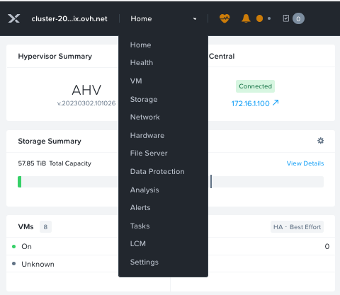{.thumbnail}

3\. Go to `Settings`{.action}.

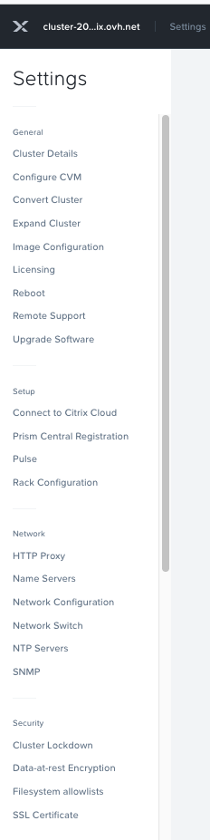{.thumbnail}

### Step 2 - Configure Data-at-Rest Encryption

1\. Scroll to `Data-at-Rest Encryption`{.action} in the settings menu.

2\. Click on `Edit Configuration`{.action}.

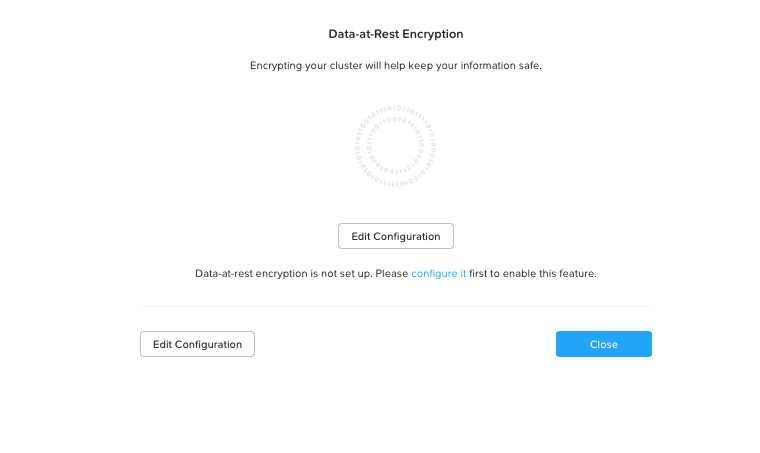{.thumbnail}

3\. Select the `Encryption Type`{.action} and `KMS Type`{.action}.

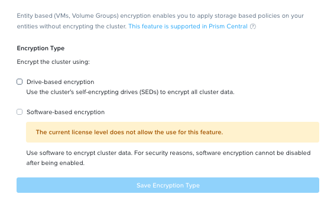{.thumbnail}

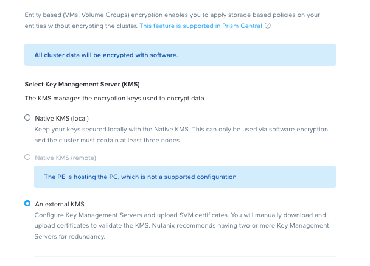{.thumbnail}

4\. Enter your configuration details to generate the **Certificate Signing Request (CSR)**.

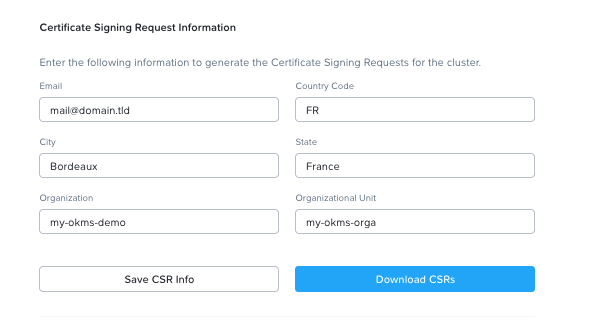{.thumbnail}

### Step 3 - Add and manage Certificates

1\. Add your **Key Management Server (KMS)**.

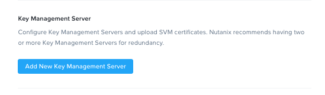{.thumbnail}

2\. Click on `Manage Certificates`{.action}.

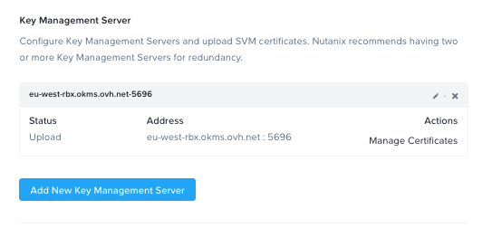{.thumbnail}

3\. Upload your `Certificate Authority (CA)`.

4\. Once the CA is uploaded, go back to `Key Management Server`{.action} and click `Manage Certificates`{.action}.

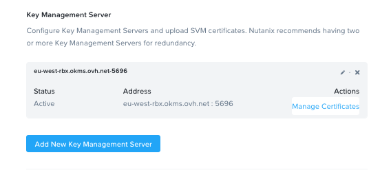{.thumbnail}

### Step 4 - Test and Enable Encryption

1\. **Test all nodes** in the cluster.

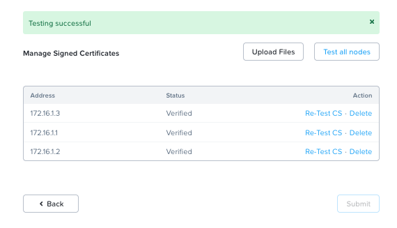{.thumbnail}

2\. If the test is successful, you can now enable encryption for your Nutanix cluster.

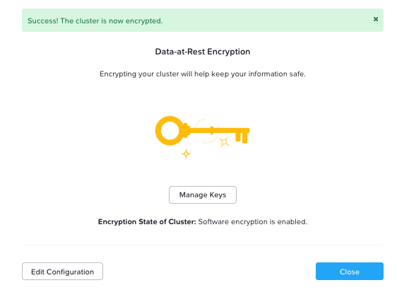{.thumbnail}

3\. You can enable both **software encryption** and **Self-Encrypting Drives (SEDs)**.

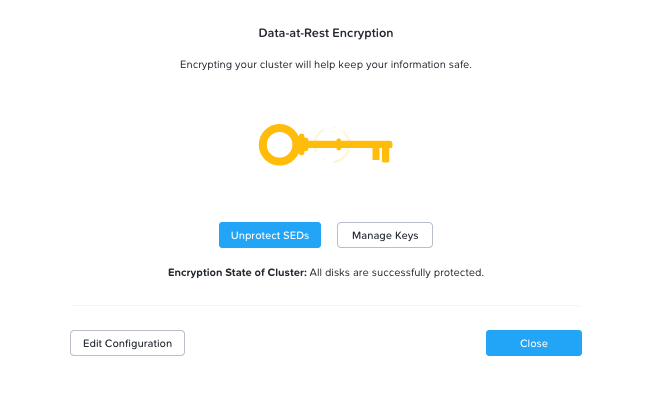{.thumbnail}

## Go Further

- [Nutanix Security Guide for Data-at-Rest Encryption](https://portal.nutanix.com/page/documents/details?targetId=Nutanix-Security-Guide-v7_0:wc-security-data-encryption-wc-c.html)
- [Getting started with OVHcloud Key Management Service (KMS)](/pages/manage_and_operate/kms/quick-start)
- [Nutanix Compatibility Matrix](https://portal.nutanix.com/page/documents/compatibility-interoperability-matrix/software?partnerName=OVHCloud&solutionType=KMS%20%28Key%20Management%20Solutions%29&componentVersion=External%20Key%20Managers&hypervisor=all&validationType=all)

If you need training or technical assistance to implement our solutions, contact your sales representative or click on [this link](/links/professional-services) to get a quote and ask our Professional Services experts for assisting you on your specific use case of your project.

Join our [community of users](/links/community).
