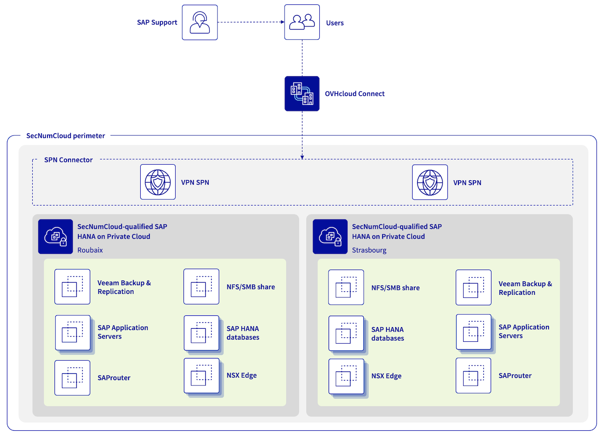

## Objective

The following concept enables you to build an architecture with SAP HANA databases up to 1.5 TB, and take advantage of all VMware on OVHcloud features (including OVF/OVA templates, NSX, DRS, Fault Tolerance, and even vSphere High Availability) for your SAP infrastructure in a single OVHcloud location or across multiple OVHcloud locations in a SecNumCloud context.

{.thumbnail}

| Objective | Description |
| --------- | ----------- |
| Objective #1 | Building an SAP infrastructure based on existing SecNumCloud-qualified SAP HANA on Private Cloud infrastructure. |
| Objective #2 | An infrastructure with high security requirements. |
| Objective #3 | An Infrastructure Recovery Point Objective (RPO) of 60 minutes. |
| Objective #4 (optional) | An SAP infrastructure available in a second region which can be activated in the event of a major issue impacting the primary region. This second region offers an Infrastructure Recovery Point Objective (RPO) near to zero for your SAP HANA databases. |

> [!primary]
>
> All information presented in this documentation is intended for informational purposes only. Please note that certain elements may differ based on your specific SAP environment. Before implementing any of the solutions or approaches described herein, it is recommended to consult with your SAP and/or infrastructure experts to ensure that they are suitable for your particular needs.
>

> [!primary]
>
> Keep equipments up-to-date with the latest patches and updates.
>
> Also the [ANSSI1 recommends](https://cyber.gouv.fr/publications/recommandations-relatives-ladministration-securisee-des-si) hosting production environments on a separate and dedicated infrastructure, and keeping them isolated from non-production environments such as development and test environments.
>

1 **A**gence **N**ationale de la **S**écurité des **S**ystèmes d'**I**nformation

## Concept elements

### 1 - Network connectivity

To ensure optimal communication quality between your local site and your SAP infrastructure hosted on OVHcloud, we recommend using OVHcloud Connect. This solution offers a secure and high-performance connection between your offices and OVHcloud. For more information, please refer to the [OVHcloud Connect](/links/network/ovhcloud-connect) product page.

In addition, a VPN Secure Private Network (VPN-SPN) can be deployed to ensure secure external communication using the IPsec protocol with the highest performance between your local site and your SecNumCloud-qualified VMware on OVHcloud infrastructure. For more details about this architecture, refer to our [documentation](/pages/hosted_private_cloud/hosted_private_cloud_powered_by_vmware/snc-connectivity-concepts-overview) on this topic.

Under no circumstances should your SAP environment be accessible from the internet without passing through several filtered gateways and a demilitarised zone (DMZ).

For SAProuter, used primarily to connect your SAP environment to SAP support, it is preferable to do its installation on a dedicated virtual machine that is not used for any other purposes, in a DMZ. The SAPROUTTAB should be configured with great vigilance.
However, ANSSI strongly recommends not opening the SecNumCloud environment to external support that is not PAMS-qualified. In this scenario, it is best to implement so-called “four-eye” work sessions to have visual control of the actions performed by an internal administrator.

It is recommended that you install the SAP Web Dispatcher, which is used primarily to publish HTTP(s) services for your SAP environment, on a dedicated virtual machine that is not used for any other purposed, within a DMZ. For security reasons, we recommend only enabling the HTTPS protocol. The access control lists (ACLs), the authentication manager and the HTTP rewrite manager must be configured with great care. Similarly, consider implementing a Web Application Firewall (WAF) to protect your SAP Web Dispatcher from common web attacks, such as SQL injection and cross-site scripting (XSS).

Regarding connections, it is a good practice to document them exhaustively, to open only the necessary connections and to outsource the associated logs in order to guarantee access to these logs.

Please note that all communications with an SAP service in SaaS mode, such as SAP Business Technology Platform (SAP BTP) or SAP Analytics Cloud (SAC), are considered to be outside the SecNumCloud-qualified scope.

The [ANSSI recommends](https://cyber.gouv.fr/publications/recommandations-relatives-ladministration-securisee-des-si) that the same ESXi host should be used for services within the same trusted zone. It does not recommend running a service located in your DMZ and a service located in your trusted zone, such as your SAP HANA databases on the same ESXi host.

It is important to regularly review and test your security measures to ensure they are effective and up-to-date. Perform regularly:

- vulnerability assessments;
- intrusion tests;
- audits on your network configuration and system.

### 2 - SAP HANA database

To define a compliant configuration between SAP and virtual machines, read the following:

- [SAP Note 2161991](https://me.sap.com/notes/2161991) (In particular Chapters 2 and 3)
- [SAP Note 2015392](https://me.sap.com/notes/2015392)
- [SAP Note 2937606](https://me.sap.com/notes/2937606)
- [SAP Note 3102813](https://me.sap.com/notes/3102813)

For virtualised SAP environments, it is essential to ensure that the Non-Uniform Memory Access (NUMA) share is configured correctly. Failure to do so may impact performance and cause system instability. For more information on NUMA sharing and its configuration, see [SAP Help Portal](https://wiki.scn.sap.com/wiki/display/VIRTUALIZATION/SAP+HANA+on+VMware+vSphere) and [SAP Note 2470289](https://me.sap.com/notes/2470289).

The Fault Tolerance functionality provided by VMware is not suitable for the protection of SAP HANA virtual machines due to the limitation of Fault Tolerance resources. However, we recommend that you enable the vSphere HA feature, which monitors the health of each ESXi host in the cluster, and automatically restarts the virtual machines hosted on the affected ESXi host.

For optimal business continuity, we recommend implementing a SAP HANA cluster. This reduces recovery time (RTO) and data loss (RPO). Consult our [dedicated documentation](/pages/hosted_private_cloud/sap_on_ovhcloud/cookbook_configure_sap_hana_cluster) to guide you through the process of configuring a SUSE cluster. When setting up an SAP HANA cluster, it is important to create an anti-affinity rule to avoid running both SAP HANA databases on the same ESXi host.

Starting with SAP HANA Platform 2.0 SPS 07, data and log encryption settings and backups are enabled by default during new installations. However, it is important to note that these settings are not changed during upgrades from previous releases. In addition, we strongly recommend that you enable VM encryption at the hypervisor level for added security. Our documentation [Virtual Machine Encryption on vSphere](/pages/hosted_private_cloud/hosted_private_cloud_powered_by_vmware/vm_encrypt) provides a step-by-step guide on how to enable this feature. You can also use the vSphere Native Key Provider (vNKP) for encryption key management if you do not yet have a Key Management Service (KMS). Our [documentation](/pages/hosted_private_cloud/hosted_private_cloud_powered_by_vmware/vm_encrypt-vnkp) provides instructions on how to use vNKP.

Administrators can authenticate to the SAP HANA database using various methods, including password, SAML, X.509 certificate, and Kerberos. We recommend using a strong authentication mechanism to prevent unauthorized access to the database. It is also essential to regularly review and update roles and privileges to ensure proper access control. Enabling audit logs is also essential to detect and respond to suspicious behavior. Outsource audit logs, as described in [SAP Note 2624117](https://me.sap.com/notes/0002624117).

It is recommended to restrict and monitor access to the SAP HANA database for administration through controlled and monitored entry points to improve security.

For more information about SAP HANA security, see the [SAP documentation](https://www.sap.com/documents/2016/06/3ea239ad-757c-0010-82c7-eda71af511fa.html).

### 3 - SAP Application Servers

The Fault Tolerance functionality provided by VMware ensures high availability of your SAP application servers, by automatically switching them to a different ESXi host in the event of failure. You may want to enable Fault Tolerance on virtual machines that host SAP Central Services (SCS), as long as you have not set up another SAP cluster solution for this service. Fault Tolerance can also be enabled on SAP application servers that host critical services. For instructions on enabling this feature, see [our documentation](/pages/hosted_private_cloud/hosted_private_cloud_powered_by_vmware/vmware_fault_tolerance).

To enable Fault Tolerance2, the virtual machine cannot have more than 8 vCPUs and 128 GB of memory. For SAP application servers that do not host critical services, we recommend the vSphere High Availability (HA) feature.

The vSphere Distributed Resource Scheduler (DRS) feature can also be enabled with VM/Host rules to avoid running all SAP application servers on the same ESXi host. This feature balances the load on the ESXi hosts in the cluster. You can find more details on this feature in our documentation [VMware DRS](/pages/hosted_private_cloud/hosted_private_cloud_powered_by_vmware/vmware_drs_distributed_ressource_scheduler_new).

External and internal exchanges with your SAP environment can be encrypted using SAP Secure Network Communications (SNC) for RFC Type 3 communications and HTTPS for RFC H/G communications. Refer to the SAP documentation [Securing Remote Function Call (RFC)](https://support.sap.com/content/dam/support/en_us/library/ssp/security-whitepapers/securing_remote-function-calls.pdf) for best practices and instructions. In addition, we strongly recommend enabling encryption for your SAP Application Server virtual machines at the hypervisor level. To find out how to enable VM encryption on vSphere, please refer to our [dedicated documentation](/pages/hosted_private_cloud/hosted_private_cloud_powered_by_vmware/vm_encrypt).

Authentication to the SAP system can be performed using various methods, such as passwords, Single Sign-On (SSO) with Kerberos, LDAP, or SAML. For best security, use a strong authentication mechanism to prevent unauthorized access to the SAP system. We recommend that you regularly review and update roles and privileges to ensure proper access control. Enabling and outsourcing audit logs can be considered to detect and respond to suspicious behavior. You can refer to [SAP Help Portal](https://help.sap.com/docs/ABAP_PLATFORM_NEW/025d1fb2f02c42c097f04f45df09106a/f64babd8c8a0489caf61c48d8bdc9478.html) for more information on configuring and managing audit logs in your SAP environment.

2 The Fault Tolerance feature is currently incompatible if your virtual machine uses a port group created and managed by NSX ([Article 317806](https://knowledge.broadcom.com/external/article?articleNumber=317806)).

### 4 - Backup infrastructure

To ensure the security and compliance of your SAP infrastructure, you can deploy a second SAP HANA on a SecNumCloud-qualified Private Cloud infrastructure in a separate OVHcloud region. This second region will be dedicated to hosting NFS servers for storing backups of your SAP infrastructure. These backups can be managed by a Veeam Backup and Replication server.

With Veeam Backup and Replication, you can easily create and manage backups and snapshots of your virtual machines. This ensures low recovery time (RTO) in the event of any issues with your SecNumCloud-qualified SAP HANA on Private Cloud infrastructure.

Veeam Backup and Replication provides a Veeam Plug-in for SAP HANA, allowing you to leverage all the Backint features offered by SAP for SAP HANA.

For detailed instructions on how to configure this backup infrastructure, please read our documentation: [Backup SAP HANA with Veeam Backup and Replication](/pages/hosted_private_cloud/sap_on_ovhcloud/cookbook_veeam_backup_sap_hana).

We recommend implementing regular backups and testing the restore process to ensure data can be recovered in the event of a disaster.

You can use the second region to store backups of other critical systems.

Finally, when implementing your backup infrastructure, make sure to follow best practices for backup configuration and management, such as encrypting backup data (both at rest and in transit), testing your restore process, and regularly reviewing and updating your backup strategy to ensure it remains effective and up-to-date against the latest threats and vulnerabilities.

### 5 - SAP Support connection

In line with our previous chapter on [network connectivity](#network-connectivity), it is best to deploy the SAProuter in a demilitarized zone (DMZ) and configure the SAPROUTTAB with great rigor. The SAP Secure Network Communications (SNC) protocol can be used to encrypt SAP connections.

It is a good practice to document and limit connections to those deemed exclusively necessary. Connection logs are essential for monitoring and detecting suspicious activity. Outsourcing them allows for readability and archiving, even if the SAProuter service deletion is required. For more information on best practices, see [SAP Note 1895350](https://me.sap.com/notes/1895350/E).

It is recommended that you place the SAProuter behind security features such as firewalls and intrusion detection systems (IDS). These devices can filter, scan, and monitor connections to the security-enhancing SAProuter.

As a reminder, the ANSSI strongly recommends not opening the SecNumCloud environment to unqualified external PAMS support.

### 6 - Dual regions (optional)

To ensure high availability and mitigate the risk of total service loss, you may consider deploying a second OVHcloud region with an identical service. In the event of a primary region failure, the secondary region can take over and maintain service continuity.

#### 6.1 - Network connectivity

For constant security and connectivity of your infrastructure, we recommend using OVHcloud Connect in the secondary OVHcloud region, similar to the primary region, as well as a Secure Private Network VPN (VPN-SPN) between your on-premises site and your SecNumCloud-qualified SAP HANA on Private Cloud infrastructure. This VPN-SPN connection must be attached to the same vRack and extended to your two SAP HANA on a SecNumCloud-qualifed Private Cloud infrastructure, using the InterDC feature. This way, a secure, wide-area network is created, enabling seamless communication between all the components of your infrastructure.

#### 6.2 - SAP HANA database

SAP HANA replication, known as SAP HSR, plays a key role in replicating data and configurations from your primary OVHcloud region to your secondary OVHcloud region. This replication process allows you to secure your data in a separate SAP HANA database, thereby minimizing the maximum tolerable data loss (RPO) to its lowest extent. SAP HSR provides high availability and disaster recovery capabilities by offering synchronous and asynchronous replication modes. For detailed information about the different replication modes supported by SAP HANA, see the SAP documentation on [SAP Help Portal](https://help.sap.com/docs/SAP_HANA_PLATFORM/6b94445c94ae495c83a19646e7c3fd56/c3fe0a3c263c49dc9404143306455e16.html).

For SAP HANA systems running in an OVHcloud environment with two regions, we strongly recommend that you enable data and log compression and use ASYNC replication mode. This combination improves replication efficiency and reduces network bandwidth requirements.

Starting with SAP HANA Platform 2.0 SPS 07, Secure Sockets Layer (SSL) is enabled by default using TLS/SSL for communications between primary and secondary sites. If you are using a lower version of SAP HANA, ensure that this security feature is enabled as described in [SAP documentation](https://help.sap.com/docs/SAP_HANA_PLATFORM/6b94445c94ae495c83a19646e7c3fd56/ec50b815f5b740d7a9777d80f7104a2c?html=US).

If you are resuming your secondary OVHcloud region, it is vital to migrate your SAP application servers. This failover ensures consistent performance between SAP application servers and the SAP HANA database during disaster recovery procedures.

#### 6.3 - SAP Application Servers

If a maximum allowable data loss (RPO) of a few hours is deemed acceptable, you may consider using Veeam Backup & Replication to maintain a copy of your VM snapshots between your SecNumCloud-qualified infrastructure. This approach provides minimal disaster recovery (RTO) and greatly shortens the recovery process for the secondary region.

However, we strongly advise not scheduling VM snapshots during busy periods, as this could have a negative impact on performance. Carefully plan and configure your snapshot schedule for the best balance between backup and performance.

You can pair these snapshots by backing up your SAP application servers’ critical volumes on a more regular basis — for example, the volumes that host /sapmnt, /usr/sap/trans. These shorter backups will not affect your business and will significantly reduce your data loss.

Refer to the [User Guide for VMware vSphere](https://helpcenter.veeam.com/docs/backup/vsphere/replication.html?ver=120) for detailed information on using Veeam Backup & Replication to maintain copies between your VMware infrastructure and best practices to balance data protection and performance.

#### 6.4 - Backup infrastructure

The concept remains similar to a single-region configuration that includes a SAP HANA on a SecNumCloud-qualified Private Cloud infrastructure, but with a major distinction: the ability to restore and resume SAP services on the second region without experiencing downtime due to infrastructure delivery.

This second region, with a SAP HANA on a SecNumCloud-qualified Private Cloud infrastructure, allows you to restore backups and snapshots of your SAP application servers, perform a disaster recovery operation on your secondary SAP HANA databases, and finally reboot your SAP systems within a controlled timeframe.

The difference between single-region and two-region configurations is faster recovery capabilities and timelines. With a two-region configuration, you not only reduce recovery time, but also reduce the risk of downtime due to infrastructure delivery constraints. This design enables faster recovery, continuous operation, and greater resilience.

#### 6.5 - SAP Support connection

If you would like to ensure continuity of the connection with SAP support during a disaster recovery scenario, you can configure a secondary SAProuter located in your secondary OVHcloud region. This configuration allows SAP support personnel to establish a secure connection to your SAP systems in the secondary region in the event of a disaster, without interruption or prolonged downtime.

If disaster recovery is enabled, only the public IP address in the SAP Support LaunchPad must be updated to re-establish the connection.

Configuring the secondary SAProuter requires the same care and vigilance as the primary SAProuter. Therefore, all best practices and recommendations mentioned in the [Network Connectivity](#network-connectivity) and [SAP Support Connection](#sap-support-connection) chapters apply.

## Go further

If you need training or technical assistance to implement our solutions, contact your sales representative or click on [this link](/links/professional-services) to get a quote and ask our Professional Services experts for assisting you on your specific use case of your project.

Join our [community of users](/links/community).
