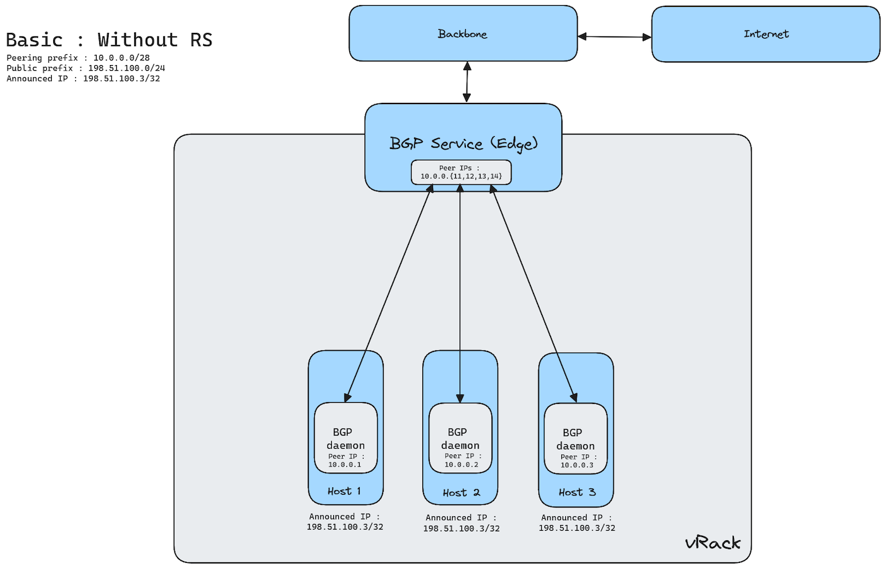
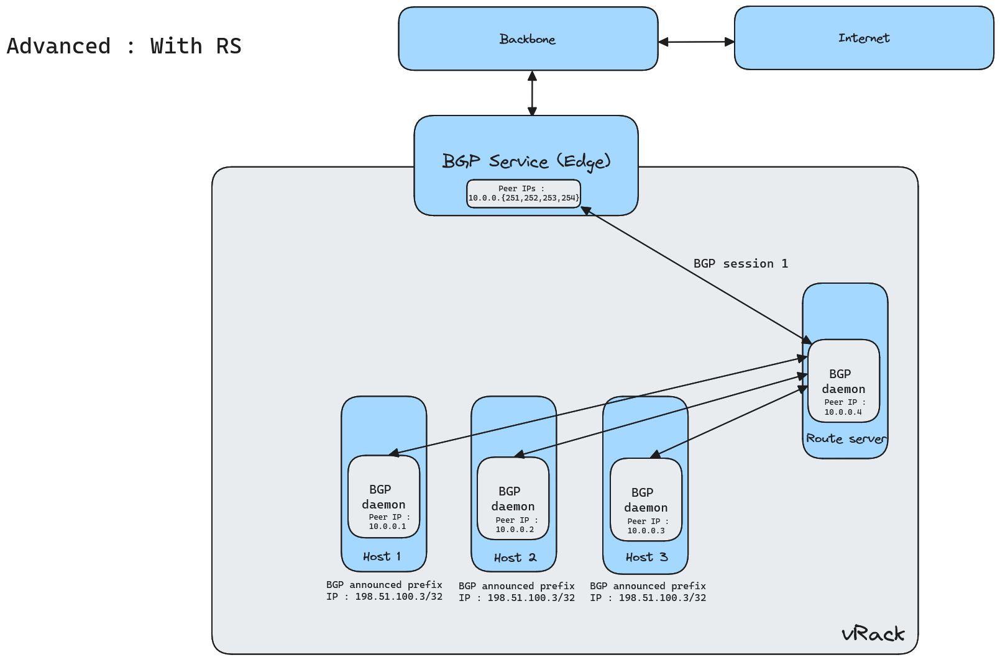
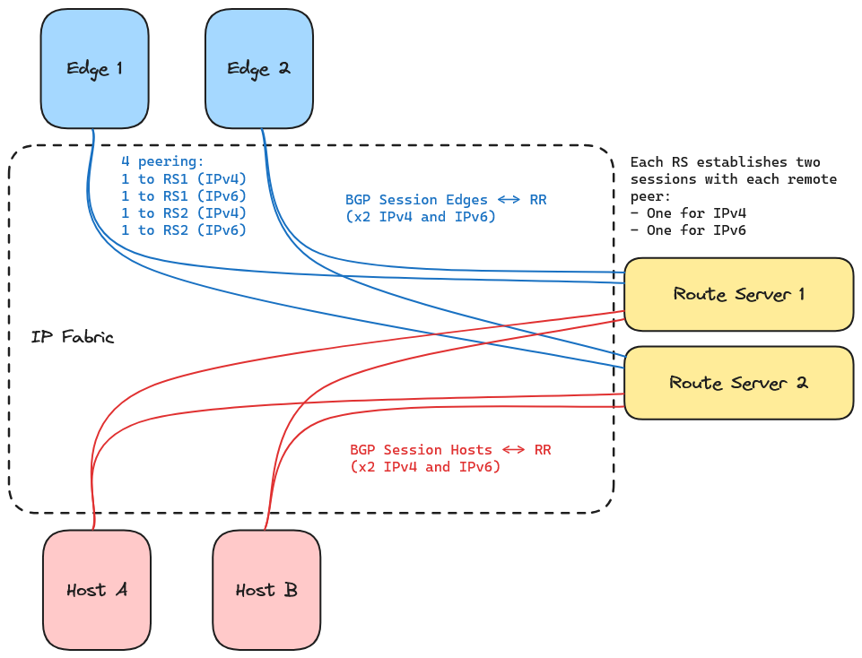

# Introduction

The Border Gateway Protocol (BGP) allows you to build highly available infrastructures by running standard BGP routing protocol straight from your OVHcloud hosts. It can be used with OVHcloud Additional IP or with your own IP addresses, by using BYOIP.

# Requirements

- At least one Bare Metal [dedicated server](/links/bare-metal/bare-metal) from the following range : High Grade, Scale, Advance Gen3. All servers that will participate in the BGP peering must be in the same 1-AZ Region.
- Access to the [OVHcloud Control Panel](/links/manager)
- If you use [Bring Your Own IP (BYOIP)](/links/network/byoip) : IP prefixes that you own and can announce
- A [vRack private network](/links/network/vrack)
- Knowledge in IP networks and BGP routing protocol
- Knowledge in Linux networking

# Instructions

## Step 1: Join the Alpha

First you need to request to join the beta on the following [page](labs.ovh.com). After we receive your application, we will contact you via email.

Important : BGP Service is currently in alpha. This product is not intended to be used in a production environment.

## Step 2: Prepare your IP addresses

You need to either buy Additional IP from OVHcloud or use your own IPs with BYOIP.

If you buy Additional IPs from us, you MUST NOT associate them to any service (e.g. Baremetal).

If you need to import your IPs, you need to use our BYOIP service. Please follow [this documentation](/pages/network/bring_your_own_ip/bring-your-own-IP/) to import your IPs to OVHcloud.

## Step 3: Configure your vRack

You need to have created a vRack, which is the private network where the peering between your servers and the BGP service will take place.

The vRack must contain the servers that will participate in the BGP peering.

Important : the vRack must contain only servers in one specific availability zone (AZ). For regions with 1-AZ, an AZ is equivalent to a region. Only 1-AZ regions are available in the alpha.

## Step 4: Provide configuration parameters of your BGP Service

You need to provide us the following parameters so that we can configure the BGP service on OVHcloud side :

| Parameter	| Value (example) | Description | Comment |
| :--- | :--- | :--- | :--- |
| Location	| RBX | The location on which to deliver the service | |
| vRack ID | 937 | vRack ID on which the BGP sessions will run | |
| BYOIP | Y | IP block coming from the customer ?	| |
| IP block | 17.13.2.0/24 | The IP block to be announced | <br> Allowed range size : <br>&bull; OVHcloud IP (/24 to /30) <br>&bull; BYOIP imported range (/19 to /24) <br>&bull; IPv6 (/56) |
| Private Subnet | 10.0.0.0 | Reserved subnet for BGP peer IPs <br> 4 last addresses will be used by OVHcloud for OVHcloud side BGP peers. Netmask should be /28 |  |
| Peering IP 1 | 10.0.0.1 | Customer IP should be explicitly specificed by customer (for OVH-side monitoring) | |
| Peering IP 2 | 10.0.0.2 | Customer IP should be explicitly specificed by customer (for OVH-side monitoring) | |
| Peering IP 3 | 10.0.0.3 | Customer IP should be explicitly specificed by customer (for OVH-side monitoring) | |
| Peering IP 4 | 10.0.0.4 | Customer IP should be explicitly specificed by customer (for OVH-side monitoring) | |

## Step 5: BGP Service delivery

After a approximatively 2 weeks, your service will be delivered. We will contact you back to notify you that the service is ready to use, and give you the following parameters that are needed on your side :

&bull; OVHcloud Edges IPs (4 IPs) <br>&bull; Customer AS and OVH AS to use for the BGP peering sessions
<br>&bull; BFD parameters

## Step 6: Customer-side setup

You now are able to setup the BGP sessions on your side. Below is a guide that walks you through a typical setup for simple load balancing using BGP ECMP.

# Use case : Basic BGP Configuration - Load Balancing using BGP ECMP

Here is a simple architecture that allows you to perform load balancing of your traffic on 3 hosts :



To achieve this setup, you need to install a BGP daemon, like FRR, on each hosts.

## Parameters

The following parameters are to be substituted with those agreed on with OVHcloud during the configuration and delivery steps.

| Parameter | Description |
| :--- | :--- |
| **OVHcloud_ASN** | Private ASN used on OVHcloud Edges |
| **CUSTOMER_ASN** | Private ASN given by OVHcloud. |
| **CUSTOMER_PREFIX_V4 <br> CUSTOMER_PREFIX_V6** | Public prefixes allocated for IPv4 and IPv6 usages |
| **RS_IPV4 <br> RS_IPV6** | Customer RS IP addresses in private/ULA range used for BGP peering and connectivity inside the vRack. |
| **EDGE_IPV4 <br> EDGE_IPV6** | OVHcloud Edges IP addresses in private/ULA range used for BGP peering and connectivity inside the customer vRack. |
| **HOST_IPV4 <br> HOST_IPV6** | Other Customer Hosts IP addresses in private/ULA range used as BGP Next Hop and peer inside the vRack |

## Configuring a BGP Daemon (FRR)

To establish a BGP session using FRR, follow these steps :

## Step 1: Install FRR

On a Debian-based system, install FRR with:

```bash
sudo apt update && sudo apt install frr frr-pythontools
```

## Step 2: Configure FRR

***All of the following parameters are present in the /etc/frr/frr.conf configuration file.***

#### Prefix list and Route Map Configuration

This configuration below is a suggested setup to prevent any unexpected announcement between BGP peers.

In the following example :
- Hosts only accept default routes from OVHcloud Edges;
- Hosts advertise customer's prefixes to OVHcloud Edges.


Related prefix lists and route maps to filter routes :

```bash
ip prefix-list PL_DEFAULT_ROUTE_V4 seq 10 permit 0.0.0.0/0
 
ip prefix-list PL_CUSTOMER_PREFIX_V4 seq 10 permit <CUSTOMER_PREFIX_V4> ge <length>
... <other sequences may be added depending of the customer setup>
 
ipv6 prefix-list PL_DEFAULT_ROUTE_V6 seq 10 permit ::/0
 
ipv6 prefix-list PL_CUSTOMER_PREFIX_V6 seq 10 permit <CUSTOMER_PREFIX_V6> eq <length>
... <other sequences may be added depending of the customer setup>
 
 
route-map RM_EDGE_V4_OUT permit 10
  match ip address prefix-list PL_CUSTOMER_PREFIX_V4
route-map RM_EDGE_V4_IN permit 10
  match ip address prefix-list PL_DEFAULT_ROUTE_V4
 
route-map RM_EDGE_V6_OUT permit 10
  match ipv6 address prefix-list PL_CUSTOMER_PREFIX_V6
route-map RM_EDGE_V6_IN permit 10
  match ipv6 address prefix-list PL_DEFAULT_ROUTE_V6
```

#### BFD Configuration

This configuration below is a suggested setup to improve BGP convergence time between Host and Edges over vRack.

```bash
bfd
 profile edge
  detect-multiplier 8
  receive-interval 500
  transmit-interval 500
 
 peer <EDGE_IPV4>
  profile edge
  no shutdown
...
 peer <EDGE_IPV6>
  profile edge
  no shutdown
...
```

#### BGP Configuration

Global configuration:

```bash
router bgp <CUSTOMER_ASN>
 bgp router-id <HOST_IPV4>
 no bgp default ipv4-unicast
 maximum-paths 16
 maximum-paths ibgp 16
```

BGP peering with OVHcloud Edge:

```bash
router bgp <CUSTOMER_ASN>
 neighbor PG_EDGE_V4 peer-group
 neighbor PG_EDGE_V4 remote-as <OVHcloud_ASN>
 neighbor PG_EDGE_V4 bfd
 neighbor PG_EDGE_V6 peer-group
 neighbor PG_EDGE_V6 remote-as <OVHcloud_ASN>
 neighbor PG_EDGE_V6 bfd
 neighbor <EDGE_IPV4> peer-group PG_EDGE_V4
...
 neighbor <EDGE_IPV6> peer-group PG_EDGE_V6
 ...
 
 address-family ipv4 unicast
  neighbor PG_EDGE_V4 activate
  neighbor PG_EDGE_V4 route-map RM_EDGE_V4_IN in
  neighbor PG_EDGE_V4 route-map RM_EDGE_V4_OUT out
 address-family ipv6 unicast
  neighbor PG_EDGE_V6 activate
  neighbor PG_EDGE_V6 route-map RM_EDGE_V6_IN in
  neighbor PG_EDGE_V6 route-map RM_EDGE_V6_OUT out
```

## Step 3: Restart FRR

After editing the configuration, restart FRR to apply changes:

```bash
sudo systemctl restart frr
```

## Step 4: Verify BGP Session

Check the status of your BGP session with:

```bash
TBD show protocols all
```

## Step 5: Verify Ingress and Egress Connectivity

To ensure your BGP session is functioning correctly, test both inbound and outbound traffic:

**Check Ingress Traffic (Incoming)**
Use a remote server to ping or traceroute to your advertised IP prefix:

```bash
ping YOUR_ADVERTISED_IP
traceroute YOUR_ADVERTISED_IP
```

Verify that traffic reaches your network via the expected BGP paths.

**Check Egress Traffic (Outgoing)**

From your server, check the routing table and ensure your BGP routes are in use:

```bash
ip route show
vtysh -c 'show ip route bgp'
```

Confirm that outbound traffic is following the correct BGP paths.

## Step 6: Verify connectivity with OVHcloud team

When your setup is done and after conducting basic tests, you should notify us via email at this address: <bgp_alpha@ovh.net>.

We'll make sure the BGP connectivity and IP announcements are OK from our side.


# Use Case: Advanced BGP configuration using Route Servers (RS)

The Route Servers are deployed and managed by the customer. They must deploy RS on dedicated Hosts.
RS peer with Load Balancing Edges (LBEdges) and Hosts and establish two sessions per peer (one for IPv4 and one for IPv6).

Here is an overview of the system:


And here is a detailed view of the BGP sessions between Edges, RS and Hosts:


## Parameters

The following parameters are to be substituted with those agreed on with OVHcloud during the configuration and delivery steps.

| Parameter | Description |
| :--- | :--- |
| **OVHcloud_ASN** | Private ASN used on OVHcloud Edges |
| **CUSTOMER_ASN** | Private ASN given by OVHcloud. |
| **CUSTOMER_PREFIX_V4 <br> CUSTOMER_PREFIX_V6** | Public prefixes allocated for IPv4 and IPv6 usages |
| **RS_IPV4 <br> RS_IPV6** | Customer RS IP addresses in private/ULA range used for BGP peering and connectivity inside the vRack. |
| **EDGE_IPV4 <br> EDGE_IPV6** | OVHcloud Edges IP addresses in private/ULA range used for BGP peering and connectivity inside the customer vRack. |
| **HOST_IPV4 <br> HOST_IPV6** | Other Customer Hosts IP addresses in private/ULA range used as BGP Next Hop and peer inside the vRack |

## Configuring a BGP Daemon (FRR)

To establish a BGP session using FRR, follow these steps :

## Step 1: Install FRR

On a Debian-based system, install FRR with:

```bash
sudo apt update && sudo apt install frr frr-pythontools
```

## Step 2: Configure FRR

### FRR configuration for Route Servers

***All of the following parameters are present in the /etc/frr/frr.conf configuration file.***

#### Prefix list and Route Map Configuration

***This configuration below is a suggested setup to prevent any unexpected announcement between BGP peers.***

Route Servers accept default routes from LBEdges and all routes from Hosts if they match the defined prefix length (cf. OVHcloud rules for IPv4 and IPv6 prefix length).
Route Servers advertise Hosts routes to LBEdges and Default routes to Hosts.

Related prefix lists and route maps to filter routes :

```bash
ip prefix-list PL_DEFAULT_ROUTE_V4 seq 10 permit 0.0.0.0/0
 
ip prefix-list PL_CUSTOMER_PREFIX_V4 seq 10 permit <CUSTOMER_PREFIX_V4> ge <length>
<other sequences may be added depending of the customer setup>
 
ipv6 prefix-list PL_DEFAULT_ROUTE_V6 seq 10 permit ::/0
 
ipv6 prefix-list PL_CUSTOMER_PREFIX_V6 seq 10 permit <CUSTOMER_PREFIX_V6> eq <length>
<other sequences may be added depending of the customer setup>
 
 
route-map RM_EDGE_V4_OUT deny 10
 match ip address prefix-list PL_DEFAULT_ROUTE_V4
route-map RM_EDGE_V4_OUT permit 20
  match ip address prefix-list PL_CUSTOMER_PREFIX_V4
 
route-map RM_EDGE_V4_IN permit 10
 match ip address prefix-list PL_DEFAULT_ROUTE_V4
 
route-map RM_HOST_V4_IN deny 10
  match ip address prefix-list PL_DEFAULT_ROUTE_V4
route-map RM_HOST_V4_IN permit 20
  match ip address prefix-list PL_CUSTOMER_PREFIX_V4
  
route-map RM_HOST_V4_OUT permit 10
match ip address prefix-list PL_DEFAULT_ROUTE_V4
 
 
route-map RM_EDGE_V6_OUT deny 10
 match ipv6 address prefix-list PL_DEFAULT_ROUTE_V6
route-map RM_EDGE_V6_OUT permit 20
  match ipv6 address prefix-list PL_CUSTOMER_PREFIX_V6
 
route-map RM_EDGE_V6_IN permit 10
 match ipv6 address prefix-list PL_DEFAULT_ROUTE_V6
 
route-map RM_HOST_V6_IN deny 10
  match ipv6 address prefix-list PL_DEFAULT_ROUTE_V6
route-map RM_HOST_V6_IN permit 20
  match ipv6 address prefix-list PL_CUSTOMER_PREFIX_V6
 
route-map RM_HOST_V6_OUT permit 10
 match ipv6 address prefix-list PL_DEFAULT_ROUTE_V6
```

#### BFD Configuration

***This configuration below is a suggested setup to improve BGP convergence time between RS and edges over vRack.***

```bash
bfd
 profile edge
  detect-multiplier 8
  receive-interval 500
  transmit-interval 500
 
 peer <EDGE_IPV4>
  profile edge
  no shutdown
 peer <EDGE_IPV6>
  profile edge_slow
  no shutdown
 ```

#### BGP Configuration

Global configuration:

```bash
router bgp <CUSTOMER_ASN>
 bgp router-id <RS_IPV4>
 no bgp default ipv4-unicast
```

BGP peering with OVHcloud Edges:

```bash
router bgp <CUSTOMER_ASN>
 neighbor PG_EDGE_V4 peer-group
 neighbor PG_EDGE_V4 remote-as <OVHcloud_ASN>
 neighbor PG_EDGE_V4 bfd
 neighbor PG_EDGE_V6 peer-group
 neighbor PG_EDGE_V6 remote-as <OVHcloud_ASN>
 neighbor PG_EDGE_V6 bfd
 neighbor <EDGE_IPV4> peer-group PG_EDGE_V4
 neighbor <EDGE_IPV6> peer-group PG_EDGE_V6
  
 address-family ipv4 unicast
  neighbor PG_EDGE_V4 activate
  neighbor PG_EDGE_V4 addpath-tx-all-paths 
  neighbor PG_EDGE_V4 attribute-unchanged next-hop
  neighbor PG_EDGE_V4 route-map RM_EDGE_V4_IN in
  neighbor PG_EDGE_V4 route-map RM_EDGE_V4_OUT out
 address-family ipv6 unicast
  neighbor PG_EDGE_V6 activate
  neighbor PG_EDGE_V4 addpath-tx-all-paths 
  neighbor PG_EDGE_V6 attribute-unchanged next-hop
  neighbor PG_EDGE_V6 route-map RM_EDGE_V6_IN in
  neighbor PG_EDGE_V6 route-map RM_EDGE_V6_OUT out
```

BGP peering with Hosts:

```bash
router bgp <CUSTOMER_ASN>
 neighbor PG_HOST_V4 peer-group
 neighbor PG_HOST_V4 remote-as <CUSTOMER_ASN>
 neighbor PG_HOST_V6 peer-group
 neighbor PG_HOST_V6 remote-as <CUSTOMER_ASN>
 neighbor <HOST_IPV4> peer-group PG_HOST_V4
 neighbor <HOST_IPV6> peer-group PG_HOST_V6
 
 address-family ipv4 unicast
  neighbor PG_HOST_V4 activate
  neighbor PG_HOST_V4 addpath-tx-all-paths
  neighbor PG_HOST_V4 route-map RM_HOST_V4_IN in
  neighbor PG_HOST_V4 route-map RM_HOST_V4_OUT out
 address-family ipv6 unicast
  neighbor PG_HOST_V6 activate
  neighbor PG_HOST_V6 addpath-tx-all-paths 
  neighbor PG_HOST_V6 route-map RM_HOST_V6_IN in
  neighbor PG_HOST_V6 route-map RM_HOST_V6_OUT out
```

### FRR configuration for Hosts

***All of the following parameters are present in the /etc/frr/frr.conf configuration file.***

#### Prefix list and Route Map Configuration

***This configuration below is a suggested setup to prevent any unexpected announcement between BGP peers.***

In the following example :
- Hosts only accept default routes from RS;
- Hosts only advertise customer's prefixes to RS.

Related prefix lists and route maps to filter routes :

```bash
ip prefix-list PL_DEFAULT_ROUTE_V4 seq 10 permit 0.0.0.0/0
 
ip prefix-list PL_CUSTOMER_PREFIX_V4 seq 10 permit <CUSTOMER_PREFIX_V4> ge <length>
... <other sequences may be added depending of the customer setup>
 
ipv6 prefix-list PL_DEFAULT_ROUTE_V6 seq 10 permit ::/0
 
ipv6 prefix-list PL_CUSTOMER_PREFIX_V6 seq 10 permit <CUSTOMER_PREFIX_V6> eq <length>
... <other sequences may be added depending of the customer setup>
 
 
route-map RM_RS_V4_OUT permit 10
  match ip address prefix-list PL_CUSTOMER_PREFIX_V4
route-map RM_RS_V4_IN permit 10
  match ip address prefix-list PL_DEFAULT_ROUTE_V4
 
route-map RM_RS_V6_OUT permit 10
  match ipv6 address prefix-list PL_CUSTOMER_PREFIX_V6
route-map RM_RS_V6_IN permit 10
  match ipv6 address prefix-list PL_DEFAULT_ROUTE_V6
```

#### BFD Configuration

This configuration below is a suggested setup to improve BGP convergence time between RS and edges over vRack.

The values below are just an example and the Customer may choose other values between its RS and Hosts.

```bash
bfd
 profile rs
  detect-multiplier 8
  receive-interval 500
  transmit-interval 500
 
 peer <RS_IPV4>
  profile rs
  no shutdown
...
 peer <RS_IPV6>
  profile rs
  no shutdown
...
```

#### BGP Configuration

Global configuration:

```bash
router bgp <CUSTOMER_ASN>
 bgp router-id <HOST_IPV4>
 no bgp default ipv4-unicast
 maximum-paths 16
 maximum-paths ibgp 16
```

BGP peering with RS:

```bash
router bgp <CUSTOMER_ASN>
 neighbor PG_RS_V4 peer-group
 neighbor PG_RS_V4 remote-as <CUSTOMER_ASN>
 neighbor PG_RS_V4 bfd
 neighbor PG_RS_V6 peer-group
 neighbor PG_RS_V6 remote-as <CUSTOMER_ASN>
 neighbor PG_RS_V6 bfd
 neighbor <RS_IPV4> peer-group PG_RS_V4
...
 neighbor <RS_IPV6> peer-group PG_RS_V6
 ...
 
 address-family ipv4 unicast
  neighbor PG_RS_V4 activate
  neighbor PG_RS_V4 route-map RM_RS_V4_IN in
  neighbor PG_RS_V4 route-map RM_RS_V4_OUT out
 address-family ipv6 unicast
  neighbor PG_RS_V6 activate
  neighbor PG_RS_V6 route-map RM_RS_V6_IN in
  neighbor PG_RS_V6 route-map RM_RS_V6_OUT out
```

## Step 3: Restart FRR

After editing the configuration, restart FRR to apply changes:

```bash
sudo systemctl restart frr
```

## Step 4: Verify BGP Session

Check the status of your BGP session with:

```bash
TBD show protocols all
```

## Step 5: Verify Ingress and Egress Connectivity

To ensure your BGP session is functioning correctly, test both inbound and outbound traffic:

**Check Ingress Traffic (Incoming)**
Use a remote server to ping or traceroute to your advertised IP prefix:

```bash
ping YOUR_ADVERTISED_IP
traceroute YOUR_ADVERTISED_IP
```

Verify that traffic reaches your network via the expected BGP paths.

**Check Egress Traffic (Outgoing)**

From your server, check the routing table and ensure your BGP routes are in use:

```bash
ip route show
vtysh -c 'show ip route bgp'
```

Confirm that outbound traffic is following the correct BGP paths.

## Step 6: Verify connectivity with OVHcloud team

When your setup is done and after conducting basic tests, you should notify us via email at this address: <bgp_alpha@ovh.net>.

We'll make sure the BGP connectivity and IP announcements are OK from our side.

# Limitations

The number of peers on OVHcloud side is limited to 4. If you need more than 4 peers, you will need to install a route reflector on your infrastructure in order to redistribute routes to your hosts.

&bull; BGP sessions : 4 BGP sessions per client (4IPv4 + 4IPv6) <br>&bull; prefixes : up to 32 IPv4 prefixes and 32 IPv6 prefixes per client <br>&bull; hosts : 10 hosts per client

# Available Regions

The product is available in the following regions:

| Region Location | Region Name | Region Type |
| :--- | :--- | :--- |
| Europe (France - Paris) (will be available only in beta) | eu-west-par | 3-AZ |
| Europe (France - Gravelines) | eu-west-gra | 1-AZ |
| Europe (France - Roubaix) | eu-west-rbx | 1-AZ |
| Europe (France - Strasbourg) | eu-west-sbg | 1-AZ |
| Europe (Germany - Limburg) | eu-west-lim | 1-AZ |
| Europe (Poland - Warsaw) | eu-central-waw | 1-AZ |
| Europe (UK - Erith) | eu-west-eri | 1-AZ |
| North America (Canada - East - Beauharnois) | ca-east-bhs | 1-AZ |
| North America (Canada - East - Toronto) | ca-east-tor | 1-AZ |
| Asia-Pacific (Singapore - Singapore) | ap-southeast-sgp | 1-AZ |
| Asia-Pacific (Australia - Sydney) | ap-southeast-syd | 1-AZ |
| Asia-Pacific (India - Mumbai) | ap-south-mum | 1-AZ |

# Troubleshooting

If you encounter issues with your BGP session:

&bull; Verify that your ASN and IP prefixes are correctly configured. <br>&bull; Check for any conflicting announcements. <br>&bull; Ensure your firewall and network policies allow BGP traffic. <br>&bull; Contact our team for further assistance via email : <bgp_alpha@ovh.net>

# Go further

Join our [community of users](/links/community)
