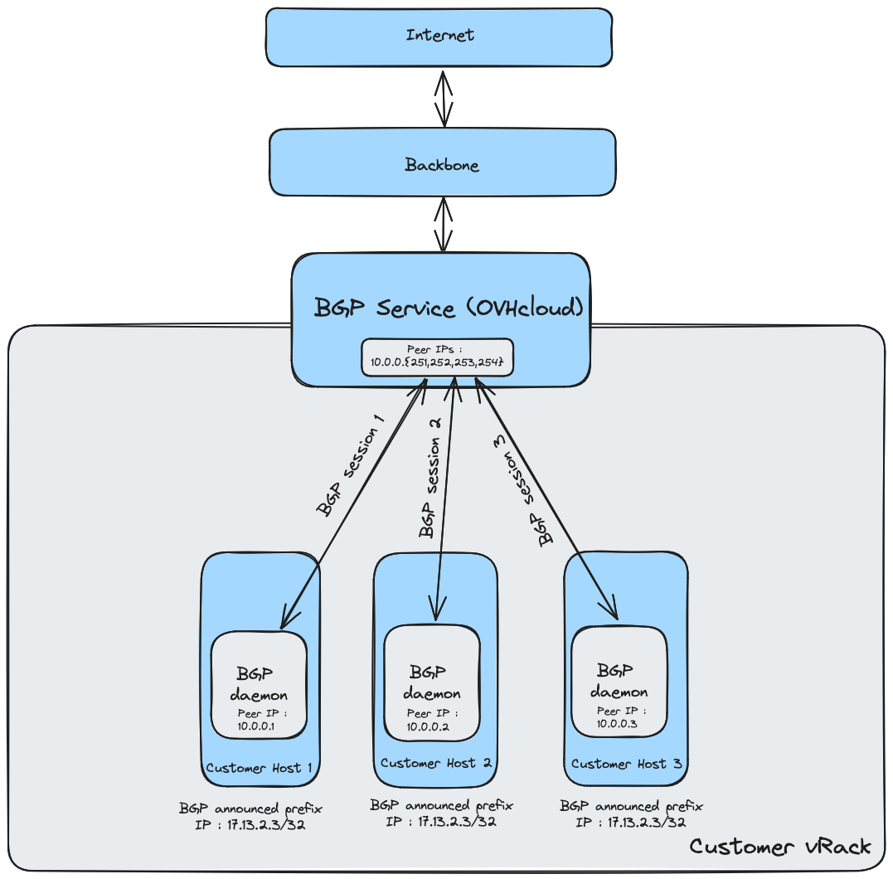

## Introduction

Le protocole Border Gateway Protocol (BGP) vous permet de construire des infrastructures hautement disponibles en exécutant le protocole de routage BGP standard directement à partir de vos hôtes OVHcloud. Il peut être utilisé avec les Additional IP d’OVHcloud ou avec vos propres adresses IP, en utilisant BYOIP.

## Prérequis

- Au moins un [serveur dédié Bare Metal](/links/bare-metal/bare-metal) de la gamme suivante : High Grade, Scale, Advance Gen3. Tous les serveurs qui participeront au peering BGP doivent être dans la même région 1-AZ.
- Un accès à l’[espace client OVHcloud](/links/manager)
- Si vous utilisez [Bring Your Own IP (BYOIP)](/links/network/byoip) : les préfixes IP que vous possédez et pouvez annoncer
- Un [réseau privé vRack](/links/network/vrack)
- Connaissance des réseaux IP et du protocole de routage BGP
- Connaissance des paramètres réseau Linux

## Instructions

### Étape 1 : rejoindre l'Alpha

Vous devez d'abord demander à rejoindre la bêta sur [cette page](labs.ovh.com). Après réception de votre candidature, nous vous contacterons par e-mail.

Important : le service BGP est actuellement en alpha. Ce produit n'est pas destiné à être utilisé dans un environnement de production.

### Étape 2 : préparer vos adresses IP

Vous devez soit acheter des adresses IP supplémentaires chez OVHcloud, soit utiliser vos propres IP avec BYOIP.

Si vous achetez des adresses IP auprès de nous, vous **NE DEVEZ PAS** les associer à un service (par exemple, un serveur Bare Metal).

Si vous souhaitez importer vos adresses IP, vous devez utiliser notre service BYOIP. Veuillez suivre [cette documentation](/pages/network/bring_your_own_ip/bring-your-own-IP/) pour importer vos IP chez OVHcloud.

### Étape 3 : configurer votre vRack

Vous devez avoir créé un vRack, qui est un réseau privé où se fera le peering entre vos serveurs et le service BGP.

Le vRack doit contenir les serveurs qui participeront au peering BGP.

Attention, le vRack ne doit contenir que des serveurs dans une zone de disponibilité (AZ) spécifique. Pour les régions 1-AZ, un AZ équivaut à une région. Seules les régions 1-AZ sont disponibles dans l'alpha.

### Étape 4 : fournir les paramètres de configuration de votre service BGP

Vous devez nous fournir les paramètres suivants afin que nous puissions configurer le service BGP côté OVHcloud :

| Paramètre	| Value (exemple) | Netmask | Description | Commentaire |
| :--- | :--- | :--- | :--- | :--- |
| Localisation	| RBX | | Emplacement de livraison du service | |
| ID vRack | 937 | | ID vRack sur lequel les sessions BGP vont s'exécuter | |
| BYOIP | Y | | Bloc d’IP provenant du client ?	| |
| Bloc IP | 17.13.2.0 | 24 | Le bloc d'IP à annoncer | Taille de plage autorisée : <br>&bull; IP OVHcloud (/24 à /30) <br>&bull; plage importée BYOIP (/19 à /24) <br>&bull; IPv6 (/56) |
| Sous-réseau privé | 10.0.0.0 | 28 | Sous-réseau réservé pour les IP des homologues BGP <br> 4 dernières adresses seront utilisées par OVHcloud pour les homologues BGP côté OVHcloud | |
| Peering IP 1 | 10.0.0.1 | | L'IP du client doit être explicitement spécifiée par le client (pour le monitoring côté OVH) | |
| Peering IP 2 | 10.0.0.2 | | L'IP du client doit être explicitement spécifiée par le client (pour le monitoring côté OVH) | |
| Peering IP 3 | 10.0.0.3 | | L'IP du client doit être explicitement spécifiée par le client (pour le monitoring côté OVH) | |
| Peering IP 4 | 10.0.0.4 | | L'IP du client doit être explicitement spécifiée par le client (pour le monitoring côté OVH) | |

### Étape 5 : livraison du service BGP

Après environ 2 semaines, votre service sera livré. Nous vous recontacterons pour vous informer que le service est prêt à être utilisé et vous donner les paramètres nécessaires suivants de votre côté :

&bull; Adresses IP des pairs OVHcloud (4 IPs) <br>&bull; AS clients et AS OVHcloud à utiliser pour les sessions de peering BGP<br>&bull; Paramètres BFD

### Étape 6 : configuration côté client

Vous pouvez maintenant configurer les sessions BGP de votre côté. Vous trouverez ci-dessous un guide qui vous guide à travers une configuration typique pour un équilibrage de charge simple à l'aide de BGP ECMP.

## Cas d'utilisation : Équilibreur de charges utilisant BGP et ECMP

Voici une architecture simple qui vous permet d'effectuer un load balancing de votre trafic sur 3 hosts :

{.thumbnail}

Pour réaliser cette installation, vous devez installer un daemon BGP, comme FRR, sur chaque hôte.

### Configuration d'un daemon BGP (FRR) <span style="color:red">TODO</span>

Pour établir une session BGP à l'aide de FRR, procédez comme suit :

### Étape 1: Installer FRR

Sur un système basé sur Debian, installez BIRD avec la commande suivante:

```bash
sudo apt update && sudo apt install frr frr-pythontools
```

### Étape 2: Configurer FRR

Modifiez le fichier de configuration FRR, le plus souvent localisé à l'emplacement /etc/frr/frr.conf:

```bash
router bgp YOUR_ASN
 bgp router-id YOUR_ROUTER_IP
 neighbor YOUR_PEER_IP remote-as PEER_ASN
 neighbor YOUR_PEER_IP ebgp-multihop 5
 address-family ipv4 unicast
  redistribute connected
 exit-address-family
!
```

### Étape 3: Redémarrer FRR

Après avoir modifié la configuration, redémarrez FRR pour appliquer les modifications:

```bash
sudo systemctl restart frr
```

### Étape 4: Vérifier l'état de la session BGP

Vérifiez l'état de votre session BGP avec la commande suivante:

```bash
TBD show protocols all
```

### Étape 5: Vérifier la connectivité entrante et sortante

Pour vous assurer que votre session BGP fonctionne correctement, testez le trafic entrant et sortant :

**Vérifier le trafic entrant (entrant)**

Utilisez un serveur distant pour effectuer un ping ou traceroute vers votre préfixe IP publié :

```bash
ping YOUR_ADVERTISED_IP
traceroute YOUR_ADVERTISED_IP
```

Vérifiez que le trafic atteint votre réseau via les chemins d'accès BGP attendus.

**Vérifier le trafic sortant (sortant)**

Depuis votre serveur, vérifiez la table de routage et assurez-vous que vos routes BGP sont bien utilisées :

```bash
ip route show
vtysh -c 'show ip route bgp'
```

Confirmez que le trafic sortant suit les chemins d'accès BGP corrects.

### Étape 6: Vérifier la connectivité auprès de l'équipe OVHcloud

Une fois votre installation terminée et après avoir effectué des tests de base, vous devez nous en informer par e-mail à l'adresse <bgp_alpha@ovh.net>.

Nous nous assurerons que la connectivité BGP et les annonces IP sont correctes de notre côté.

## Limitations

Le nombre de pairs côté OVHcloud est limité à 4. Si vous avez besoin de plus de 4 pairs, vous devrez installer un réflecteur de route sur votre infrastructure afin de redistribuer les routes vers vos hôtes.

&bull; Sessions BGP : 4 par client (4IPv4 + 4IPv6) <br>&bull; Préfixes IP : jusqu'à 32 préfixes IPv4 et 32 préfixes IPv6 par client <br>&bull; Hôtes : 10 par client

## Régions disponibles

Ce produit est disponible dans les régions suivantes:

| Region Location | Region Name | Region Type |
| :--- | :--- | :--- |
| Europe (France - Paris) (ne sera disponible qu'en version bêta) | eu-west-par | 3-AZ |
| Europe (France - Gravelines) | eu-west-gra | 1-AZ |
| Europe (France - Roubaix) | eu-west-rbx | 1-AZ |
| Europe (France - Strasbourg) | eu-west-sbg | 1-AZ |
| Europe (Germany - Limburg) | eu-west-lim | 1-AZ |
| Europe (Poland - Warsaw) | eu-central-waw | 1-AZ |
| Europe (UK - Erith) | eu-west-eri | 1-AZ |
| North America (Canada - East - Beauharnois) | ca-east-bhs | 1-AZ |
| North America (Canada - East - Toronto) | ca-east-tor | 1-AZ |
| Asia-Pacific (Singapore - Singapore) | ap-southeast-sgp | 1-AZ |
| Asia-Pacific (Australia - Sydney) | ap-southeast-syd | 1-AZ |
| Asia-Pacific (India - Mumbai) | ap-south-mum | 1-AZ |

## Résolution des problèmes

Si vous recontrez des problèmes avec votre session BGP:

&bull; Vérifiez que vos préfixes ASN et IP sont correctement configurés. <br>&bull; Vérifiez qu'il n'y a pas d'annonces en conflit. <br>&bull; Assurez-vous que vos stratégies de pare-feu et de réseau autorisent le trafic BGP. <br>&bull; Contactez notre équipe pour obtenir de l'aide par e-mail : <bgp_alpha@ovh.net>

## Allez plus loin

Échangez avec notre [communauté d'utilisateurs](/links/community).