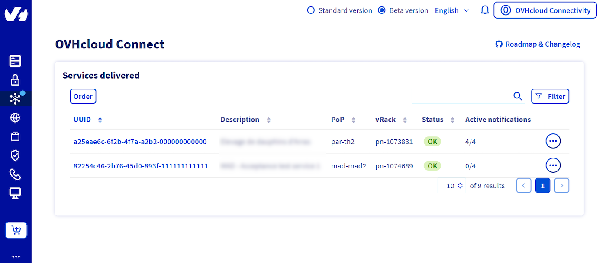
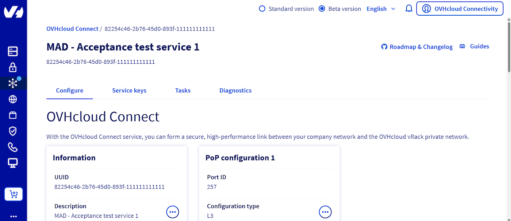
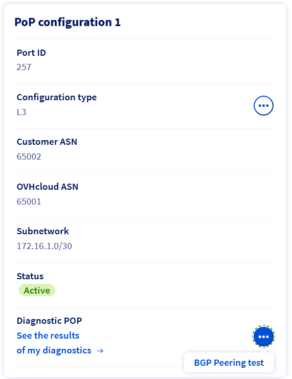
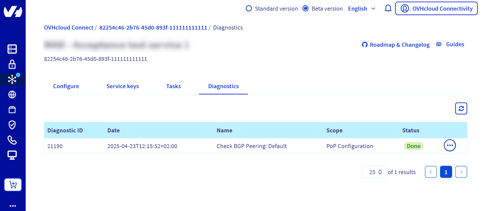
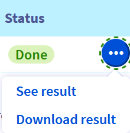
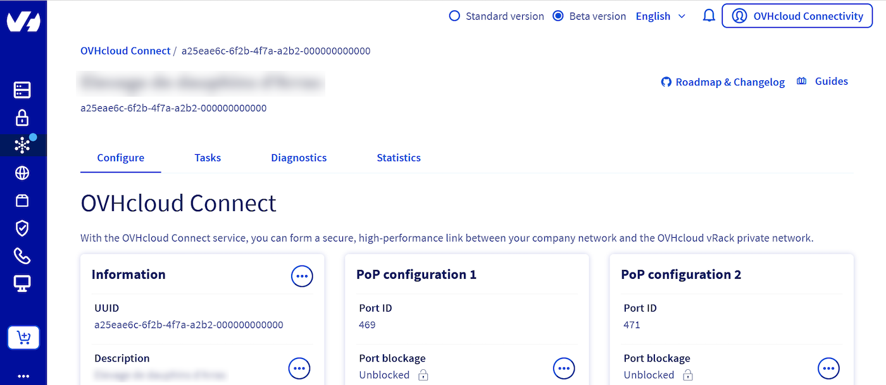
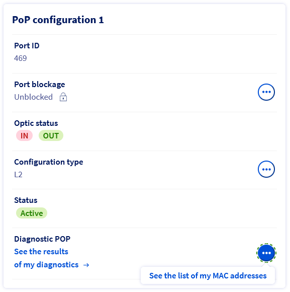
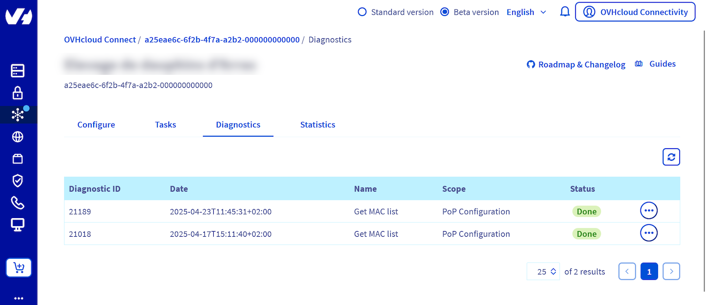

## Objective

With OVHcloud Connect, you can link your company network to your private OVHcloud vRack network, without creating a VPN tunnel through the internet. This will give you a quicker, more stable connection with guaranteed bandwidth. 

**This guide will show you how to get a status report of your OVHcloud Connect services via the OVHcloud Control Panel.**

## Requirements

- An [OVHcloud Connect solution](/links/network/ovhcloud-connect) with a valid POP configuration.
- Access to the [OVHcloud Control Panel](/links/manager).

## List of available diagnostics

### Layer 3 mode

- **Default**: Fetches the BGP session states and all related information.
- **Routes**: Fetches the routing table learned by OVHcloud via BGP.
- **Advertised-Routes**: Fetches the routing table advertised by OVHcloud via BGP.

### Layer 2 mode

- **MAC Address**: Fetches the list of MAC addresses of network devices and vRack.

## Instructions

### Layer 3 mode

You can find the list of your `OVHcloud Connect`{.action} services in the `Network`{.action} section of your [OVHcloud Control Panel](/links/manager).

{.thumbnail}

Open the service for which you want to get a diagnosis:

{.thumbnail}

At the bottom of the "POP Configuration" panel, you will find a segment named "Diagnostic POP", and an ellipsis button `...`{.action}. Click it, and then select "BGP Peering Test":

{.thumbnail}

A window will open. Select the type of diagnostics you wish to use, and click "launch diagnostic":

{.thumbnail}

You can now access the list of your diagnostics by opening the "Diagnostics" tab. 

{.thumbnail}

Each diagnostic is referred to using an ID and a timestamp. 
To access the diagnostics content, click the ellipsis button `...`{.action} located to the right of each one listed. You can select either "See result" to have a window open with the content of the desired diagnostic, or "Download result" to get a *.txt* file with the same content.

{.thumbnail}

### Layer 2 mode

You can find the list of your `OVHcloud Connect`{.action} services in the `Network`{.action} section of your [OVHcloud Control Panel](/links/manager).

{.thumbnail}

Open the service for which you want to get a diagnosis:

{.thumbnail}

At the bottom of the "POP Configuration" panel, you will find a segment named "Diagnostic POP", and an ellipsis button `...`{.action}. Click it, and then select "Get the list of my MAC addresses":

{.thumbnail}

You can now access the list of your diagnostics by opening the "Diagnostics" tab. 

{.thumbnail}

Each diagnostic is referred to using an ID and a timestamp. 
To access the diagnostics content, click the ellipsis button `...`{.action} located to the right of each one listed. You can select either "See result" to have a window open with the content of the desired diagnostic, or "Download result" to get a *.txt* file with the same content.

{.thumbnail}

## Limits

- **Retention time of diagnostics**: Only diagnostics initiated **within the last seven days** are accessible. We recommend you download them and properly archive them, in case you need future access.

- **Maximum number of diagnostics**: On a 24 hour period, you can initiate a maximum of 10 diagnostics per type of diagnostic, and per service. For example, if you have two OVHcloud Connect services configured on your OVHcloud Control Panel, both configured in Layer 3 mode, you can theoretically launch 10 of each diagnostic type per service, for a total of 60. 
This limit has been set in order to restrict the amount of resources used by the OVHcloud infrastructures, as the diagnostics are launched in real-time.  

## Go further

If you need training or technical assistance to implement our solutions, contact your sales representative or click on [this link](/links/professional-services) to get a quote and ask our Professional Services experts for assisting you on your specific use case of your project.

Join our [community of users](/links/community).