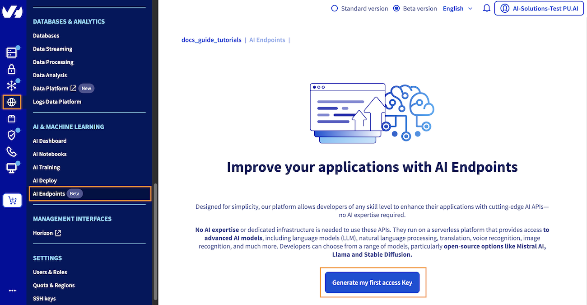
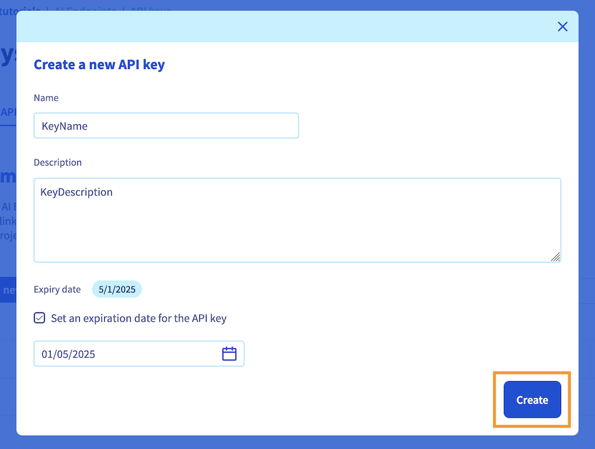
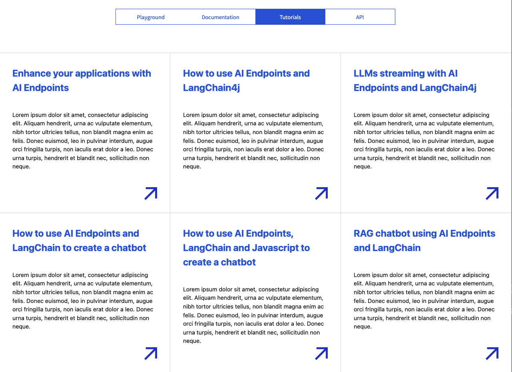
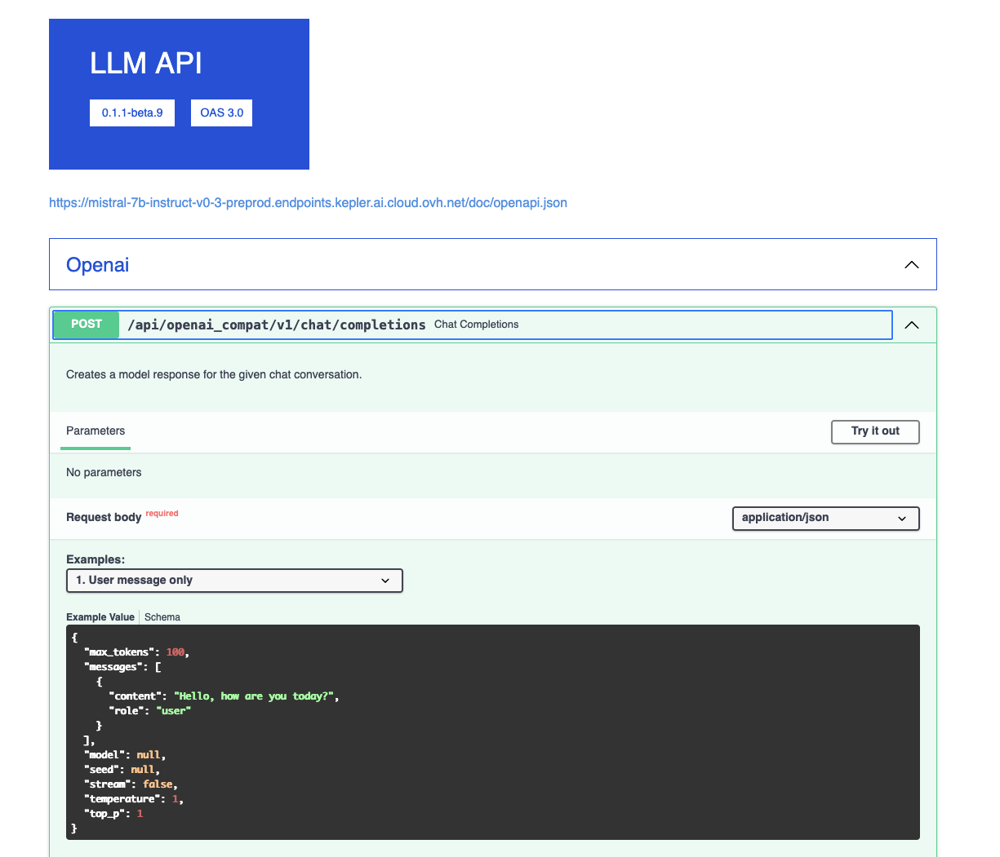

> [!primary]
>
> AI Endpoints is covered by the **[OVHcloud AI Endpoints Conditions](https://storage.gra.cloud.ovh.net/v1/AUTH_325716a587c64897acbef9a4a4726e38/contracts/48743bf-AI_Endpoints-ALL-1.1.pdf)** and the **[OVHcloud Public Cloud Special Conditions](https://storage.gra.cloud.ovh.net/v1/AUTH_325716a587c64897acbef9a4a4726e38/contracts/d2a208c-Conditions_particulieres_OVH_Stack-WE-9.0.pdf)**.
>

## Introduction

[AI Endpoints](https://endpoints.ai.cloud.ovh.net/) is a serverless platform provided by OVHcloud that offers easy access to a selection of world-renowned, pre-trained AI models. The platform is designed to be simple, secure, and intuitive, with **data privacy as a top priority**. Indeed, we do not store user data, making it an ideal solution for developers who want to enhance their applications with AI capabilities while keeping data private and secure. 

With no extensive AI expertise required, AI Endpoints is an ideal choice for developers seeking a convenient and secure way to integrate AI into their applications.

## Objective

The objective of this guide is to help developers interested in AI quickly and easily get started with [AI Endpoints](https://endpoints.ai.cloud.ovh.net/).

It explains how to obtain an access key, access AI models, and interact with AI APIs on the [AI Endpoints](https://endpoints.ai.cloud.ovh.net/) platform. By following this guide, you will learn how to integrate AI capabilities into your applications with ease.

## Requirements

- A [Public Cloud project](/links/public-cloud/public-cloud) in your OVHcloud account
- A payment method defined on your Public Cloud project. **Access keys created from Public Cloud projects in Discovery mode (without a payment method) cannot use the service**.

## Instructions

### Generating your first API access key

Getting an API key enables you to use the models available in our [catalog](https://endpoints.ai.cloud.ovh.net/catalog) and test their integration into your solutions. To obtain an API access key, please follow the steps below:

**1\. Access the AI Endpoints section**

Log in to the [OVHcloud Control Panel](/links/manager), navigate to the `Public Cloud`{.action} section, select your desired Public Cloud project, then go to the `AI & Machine Learning`{.action} category in the left menu and choose `AI Endpoints`{.action}.

{.thumbnail}

**2\. Generate an API access key**

From there, click the `Generate my first access Key`{.action} blue button to create your API access key. Next, click the `+ Create a new API key`{.action} button. You will be asked to provide a **name** for the key and an optional **description**. You can also set an **expiration date** for the key if desired.

Once you have filled in the required information, click the `Create`{.action} button to confirm the creation of your API key.

{.thumbnail}

*Note that this access key can be [revoked](#revoke-your-api-access-key) at any time.*

**3\. Store the created API access key**

Once created, the key will be displayed in the API keys table. You will see your new access key in this table, with its information (name, description, expiry date). 

Your key value will be displayed and you can copy it by clicking the copy icon.

> [!primary]
>
> It is essential that you **keep your API key private and confidential**.
>
> Moreover, the API key displayed will not be stored in the website's memory, so please **make sure to store it securely on your side** for future usage.
>

With your access API key in hand, you are now ready to access the AI models and their easy-to-use APIs.

### Accessing AI models

Once your API key has been generated, you can navigate to the [Catalog page](https://endpoints.ai.cloud.ovh.net/catalog) to choose the AI model you want to interact with.

AI Endpoints offers a variety of world-renowned AI models to choose from, including:

- **Large Language Models (LLM)**: Use models like LLaMa 3, Mistral and more, for conversations and RAG use cases.
- **Reasoning LLM**: Use reasoning models like DeepSeek-R1 distillations for maths, coding or complex tasks.
- **Code LLM**: Code generation and code completion from an IDE with models like Qwen Coder or Codestral.
- **Visual LLM**: Multimodal models such as LLaVa-Next, that are able to process images and text inputs, for image understanding or OCR use cases.
- **Embeddings**: Generate embeddings for use in machine learning applications (BGE Base, BGE Multilingual Gemma2, ...).
- **Natural Language Processing**: Use models like RoBERTa, Bert, and T5 for NLP tasks like sentiment analysis, entity recognition, and text summarization.
- **Image Generation**: Generate images using Stable Diffusion XL.
- **Audio Analysis**: Automatic Speech Recognition and Text to Speech using NVIDIA models.
- **Translation**: Translate text using NVIDIA Neural Machine Translation or T5 large.
- **Computer Vision**: Object detection and segmentation with YOLO models.

Once you have selected the category of model you want to use, you will be presented with a list of models to choose from.

For example, if you select the `Code LLM` category, you will see a list of available code assistant models.

To access one of them, simply click the name of the model you want to use. Let's take the `CodeLlama-13b-Instruct-hf` code assistant as our example.

This will take you to a dedicated page with several options for interacting with the chosen model, including the ability to view its specifications. Here is an overview of the available options:

> [!tabs]
> **Playground**
>>
>> This option provides a user-friendly interface to test and explore the model's capabilities, giving you a chance to see how it works before making an API call. Please note that Large Language Models (LLMs) in the playground are **currently limited to 1024 output tokens** for testing purposes. This means that LLMs will not generate responses longer than 1024 tokens in the playground, allowing you to test and validate their behavior.
>>
>> {.thumbnail}
>>
> **Documentation**
>>
>> The section provides detailed documentation for the model, including example Python code that demonstrates how to interact with the model using its API. The documentation also includes the OpenAI specification codes, as our **LLM APIs are compatible with the OpenAI specifications**.
>>
>> To ensure that these code examples work as intended, you should replace the placeholder value `(os.getenv('OVH_AI_ENDPOINTS_ACCESS_TOKEN'))` with your own API key and set it as an environment variable.
>>
>> {.thumbnail}
>>
> **Tutorials**
>>
>> There, you will find guides related to AI Endpoints that you may find helpful in learning how to use the model more effectively. Whether you're building a chatbot with Langchain and JavaScript or creating a video translator app, we provide step-by-step guidance to support your AI projects.
>>
>> {.thumbnail}
>>
> **API**
>>
>> The API section provides access to POST routes that you can use to send a request to the model and receive an output.
>>
>> {.thumbnail}
>>
>> For LLMs, two POST routes are available: `Chat Completions` and `Completions`. Here's an example of how to use the `Chat Completions` API:
>>
>> Click the `Chat Completions`{.action} endpoint in the API section. Once there, select one of the available input schemas.
>>
>> Here you can also find information on how to send a correct request to the model (existing parameters). Examples of usage are provided. You will also find there the output schema example. Click `Try it out`{.action} to prepare the request. There, you can modify the input schema if needed to customize the request you are sending. When you are ready, click `Execute`{.action} to send your modified request.
>>
>> Upon executing the request, a cURL command will be displayed, representing the request you just sent. This can be useful for re-sending the command using a terminal. Additionally, the server's response body will also be provided, displaying the output of the model.
>>
>> You can follow similar steps for using the `Completions` API.

### Revoke your API access key

To revoke one of your API keys, you can use the following commands in your terminal:

Set a shell variable with the key you want to revoke:

```bash
ACCESS_KEY=<YOUR_KEY_HERE>
```

Then you can use the following command to call the API Key revoke endpoint:

```bash
curl -vvv 'https://kepler.ai.cloud.ovh.net/v1/oauth/ovh/revoke' -H 'Content-Type: application/json' -X POST --data "{\"oauth2Token\": \"${ACCESS_KEY}\"}"
```

This will revoke the specified access key.

Alternatively, you can also revoke your API key using the `Revoke API key`{.action} button from the [AI Endpoints](https://endpoints.ai.cloud.ovh.net/) website. However, please note that this button will only allow you to revoke the most recently created API key.

Once done, you can confirm its deletion by trying to send a request using your revoked API key.

### Model rate limit

When using AI Endpoints, the **following rate limits apply**:

- **Anonymous**: 2 requests per minute, per IP and per model.
- **Authenticated with an API access key**: 400 requests per minute, per PCI project and per model.

If you exceed this limit, a **429 error code** will be returned.

If you require higher usage, please **[get in touch with us](https://help.ovhcloud.com/csm?id=csm_get_help)** to discuss increasing your rate limits.

### Billing and usage

For information on pricing and the models lifecycle of the platform, please refer to the [AI Endpoints - Billing and lifecycle](/pages/public_cloud/ai_machine_learning/endpoints_guide_04_billing_concept) documentation.

For your convenience, you can monitor your estimated consumption and resource usage through the [OVHcloud Control Panel](/links/manager). To do so, navigate to the `AI Endpoints`{.action} section of the `AI & Machine Learning` category, in the left-hand vertical menu.

## Going further

To discover how to build complete and powerful applications using AI Endpoints, explore our dedicated AI Endpoints guides which offer a wealth of knowledge and inspiration, including the following subjects:

- [Create your own Audio Summarizer assistant with AI Endpoints](/pages/public_cloud/ai_machine_learning/endpoints_tuto_01_audio_summarizer)
- [Implement chatbot memory management with LangChain and AI Endpoints](/pages/public_cloud/ai_machine_learning/endpoints_tuto_09_chatbot_memory_langchain)
- [Discover how to create a Retrieval Augmented Generation (RAG) system](/pages/public_cloud/ai_machine_learning/endpoints_tuto_11_rag_chatbot_langchain)
- [Discover more about AI Endpoints features and limitations](/pages/public_cloud/ai_machine_learning/endpoints_guide_02_capabilities)

If you need training or technical assistance to implement our solutions, contact your sales representative or click on [this link](/links/professional-services) to get a quote and ask our Professional Services experts for a custom analysis of your project.

## Feedback

Please feel free to send us your questions, feedback, and suggestions regarding AI Endpoints and its features:

- In the #ai-endpoints channel of the OVHcloud [Discord server](https://discord.gg/ovhcloud), where you can engage with the community and OVHcloud team members.
