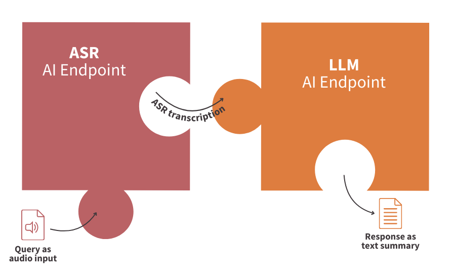
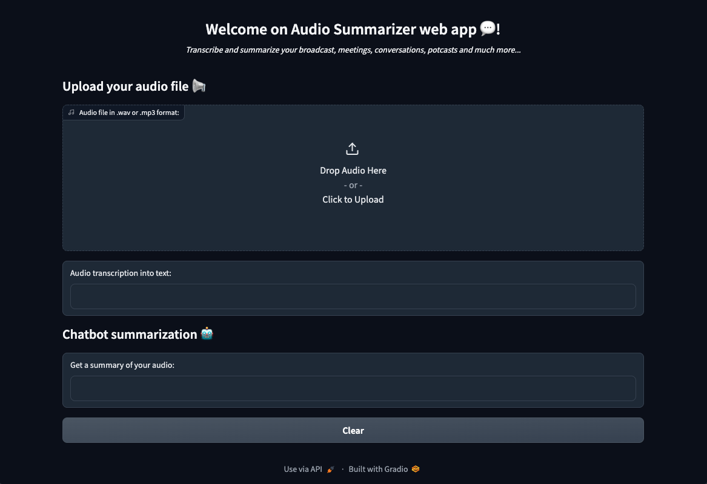

> [!primary]
>
> AI Endpoints is covered by the **[OVHcloud AI Endpoints Conditions](https://storage.gra.cloud.ovh.net/v1/AUTH_325716a587c64897acbef9a4a4726e38/contracts/48743bf-AI_Endpoints-ALL-1.1.pdf)** and the **[OVHcloud Public Cloud Special Conditions](https://storage.gra.cloud.ovh.net/v1/AUTH_325716a587c64897acbef9a4a4726e38/contracts/d2a208c-Conditions_particulieres_OVH_Stack-WE-9.0.pdf)**.
>

## Introduction

Are you looking for a way to efficiently summarize your meetings, broadcasts, and podcasts for quick reference or to provide to others? Look no further!

## Objective

In this tutorial, you will create an Audio Summarizer assistant that can not only transcribe but also summarize all your audio files.

Indeed, thanks to [AI Endpoints](https://endpoints.ai.cloud.ovh.net/), it’s never been easier to create a virtual assistant that can help you stay on top of your meetings and keep track of important information.

This tutorial will explore how AI APIs can be connected to create an advanced virtual assistant capable of transcribing and summarizing any audio file using **ASR (Automatic Speech Recognition)** technologies and popular **LLMs (Large Language Models)**. We will also build an app to use our assistant!



## Definitions

- **Automatic Speech Recognition (ASR)**: Technology that converts spoken language into written text. ASR will be used in this context to transcribe long audio recordings into text, which will then be summarized using LLMs.
- **Large Language Models (LLMs)**: Advanced models trained to understand context and generate human-like responses. In this use case, the LLM prompt will be designed to generate a summary of the input text based on the output from the ASR endpoint.

## Requirements

- A [Public Cloud project](/links/public-cloud/public-cloud) in your OVHcloud account
- An access token for **OVHcloud AI Endpoints**. To create an API token, follow the instructions in the [AI Endpoints - Getting Started](/pages/public_cloud/ai_machine_learning/endpoints_guide_01_getting_started) guide.

## Instructions

### Set up the environment

In order to use AI Endpoints APIs easily, create a `.env` file to store environment variables:

```bash
ASR_AI_ENDPOINT=https://nvr-asr-en-gb.endpoints.kepler.ai.cloud.ovh.net/api/v1/asr/recognize
LLM_AI_ENDPOINT=https://mixtral-8x22b-instruct-v01.endpoints.kepler.ai.cloud.ovh.net/api/openai_compat/v1
OVH_AI_ENDPOINTS_ACCESS_TOKEN=<ai-endpoints-api-token>
```

**Make sure to replace the token value (`OVH_AI_ENDPOINTS_ACCESS_TOKEN`) by yours.** If you do not have one yet, follow the instructions in the [AI Endpoints - Getting Started](/pages/public_cloud/ai_machine_learning/endpoints_guide_01_getting_started) guide.

Then, create a `requirements.txt` file with the following libraries:

```bash
openai==1.13.3
gradio==4.36.1
pydub==0.25.1
python-dotenv==1.0.1
```

Then, launch the installation of these dependencies:

```console
pip install -r requirements.txt
```

*Note that Python 3.11 is used in this tutorial.*

### Importing necessary libraries and variables

Once this is done, you can create a Python file named `audio-summarizer-app.py`, where you will first import Python librairies as follows:

```python
import gradio as gr
import io
import os
import requests
from pydub import AudioSegment
from dotenv import load_dotenv
from openai import OpenAI
```

After these lines, load and access the environnement variables of your `.env` file:

```python
# access the environment variables from the .env file
load_dotenv()

asr_ai_endpoint_url = os.environ.get("ASR_AI_ENDPOINT") 
llm_ai_endpoint_url = os.getenv("LLM_AI_ENDPOINT")
ai_endpoint_token = os.getenv("OVH_AI_ENDPOINTS_ACCESS_TOKEN")
```

💡 You are now ready to start coding your web app.

### Transcribe audio file with ASR

First, create the **Automatic Speech Recognition** function in order to transcribe audio files into text:

```python
def asr_transcription(audio):
    
    if audio is None:
        return " "

    else:
        # preprocess audio 
        processed_audio = "/tmp/my_audio.wav"
        audio_input = AudioSegment.from_file(audio, "mp3")
        process_audio_to_wav = audio_input.set_channels(1)
        process_audio_to_wav = process_audio_to_wav.set_frame_rate(16000)
        process_audio_to_wav.export(processed_audio, format="wav")
    
        # headers
        headers = headers = {
            'accept': 'application/json',
            "Authorization": f"Bearer {ai_endpoint_token}",
        }

        # put processed audio file as endpoint input
        files = [
            ('audio', open(processed_audio, 'rb')),
        ]

        # get response from endpoint
        response = requests.post(
            asr_ai_endpoint_url, 
            files=files, 
            headers=headers
        )

        # return complete transcription
        if response.status_code == 200:
            # Handle response
            response_data = response.json()
            resp=''
            for alternative in response_data:
                resp+=alternative['alternatives'][0]['transcript']
        else:
            print("Error:", response.status_code)
            
        return resp
```

**In this function:**

- The audio file is preprocessed as follows: `.wav` format, `1` channel, `16000` frame rate
- The transformed audio `processed_audio` is read
- An API call is made to the ASR endpoint named `nvr-asr-en-gb`
- The full response is stored in `resp` variable and returned by the function

🎉 Now that you have this function, you are ready to transcribe audio files.

Now it’s time to call an LLM to summarize the transcribed text.

### Summarize audio with LLM

In this second step, create the `chat_completion` function to use `Mixtral8x22B` effectively (or any other model):

**What to do?**

- Check that the transcription exists
- Use the OpenAI API compatibility to call the LLM
- Customize your prompt in order to specify LLM task
- Return the audio summary

```python
def chat_completion(new_message):

    if new_message==" ":
        return "Please, send an input audio to get its summary!"
    
    else:
        # auth
        client = OpenAI(
            base_url=llm_ai_endpoint_url,
            api_key=ai_endpoint_token
        )

        # prompt
        history_openai_format = [{"role": "user", "content": f"Summarize the following text in a few words: {new_message}"}]
        # return summary
        return client.chat.completions.create(
            model="Mixtral-8x22B-Instruct-v0.1",
            messages=history_openai_format,
            temperature=0,
            max_tokens=1024
        ).choices.pop().message.content
```

⚡️ You're almost there! The final step is to build your web app, making your solution easy to use with just a few lines of code.

### Build the app with Gradio

[Gradio](https://www.gradio.app/) is an open-source Python library that allows to quickly create user interfaces for Machine Learning models and demos.

**What does it mean in practice?**

Inside a Gradio Block, you can:

- Define a theme for your UI
- Add a title to your web app with gr.HTML()
- Upload audio thanks to the dedicated component, gr.Audio()
- Obtain the result of the written transcription with the gr.Textbox()
- Get a summary of the audio with the powerful LLM and a second gr.Textbox() component
- Add a clear button with gr.ClearButton() to reset the page of the web app

```python
with gr.Blocks(theme=gr.themes.Default(primary_hue="blue"), fill_height=True) as demo:

    # add title and description
    with gr.Row():
        gr.HTML(
            """
            <div align="center">
                <h1>Welcome on Audio Summarizer web app 💬!</h1>
                <i>Transcribe and summarize your broadcast, meetings, conversations, potcasts and much more...</i>
            </div>
            <br>
            """
        )
        
    # audio zone for user question
    gr.Markdown("## Upload your audio file 📢")
    with gr.Row():
        inp_audio = gr.Audio(
            label = "Audio file in .wav or .mp3 format:",
            sources = ['upload'],
            type = "filepath",
        )

    # written transcription of user question
    with gr.Row():
        inp_text = gr.Textbox(
            label = "Audio transcription into text:",
        )
        
    # chabot answer
    gr.Markdown("## Chatbot summarization 🤖")
    with gr.Row():
        out_resp = gr.Textbox(
            label = "Get a summary of your audio:",
        )

    with gr.Row():
        
        # clear inputs
        clear = gr.ClearButton([inp_audio, inp_text, out_resp])
  
    # update functions
    inp_audio.change(
        fn = asr_transcription,
        inputs = inp_audio,
        outputs = inp_text
      )
    inp_text.change(
        fn = chat_completion,
        inputs = inp_text,
        outputs = out_resp
      )
```

Then, you can launch it in the `main`:

```python
if __name__ == '__main__':
    demo.launch(server_name="0.0.0.0", server_port=8000)
```

### Launch Gradio web app locally

🚀 That’s it! Now, your web app is ready to be used! You can start this Gradio app locally by launching the following command:

```python
python audio-summarizer-app.py
```



You can upload your audio files, get a transcript and then a summary!

## Conclusion

Well done 🎉! You have learned how to build your own Audio Summarizer app in a few lines of code. You’ve also seen how easy it is to use AI Endpoints to create innovative turnkey solutions.

➡️ Access the full code [here](https://github.com/ovh/public-cloud-examples/tree/main/ai/ai-endpoints/audio-summarizer-assistant).

## Going further

If you want to go further and deploy your web app in the cloud, making your interface accessible to everyone, refer to the following articles and tutorials:

- [AI Deploy – Tutorial – Build & use a custom Docker image](/pages/public_cloud/ai_machine_learning/deploy_tuto_12_build_custom_image)
- [AI Deploy – Tutorial – Deploy a Gradio app for sketch recognition](/pages/public_cloud/ai_machine_learning/deploy_tuto_05_gradio_sketch_recognition)

If you need training or technical assistance to implement our solutions, contact your sales representative or click on [this link](/links/professional-services) to get a quote and ask our Professional Services experts for a custom analysis of your project.

## Feedback

Please feel free to send us your questions, feedback, and suggestions regarding AI Endpoints and its features:

- In the #ai-endpoints channel of the OVHcloud [Discord server](https://discord.gg/ovhcloud), where you can engage with the community and OVHcloud team members.
