## Objective

This guide is intended to help you use `S3* compatible Object Storage buckets` with the **OVHcloud AI Solutions** via the OVHcloud Control Panel and `ovhai` CLI.

Indeed, you will learn how to:

- [Create an S3 compatible Object Storage bucket](#create-an-s3-compatible-bucket)
- [Edit your S3 compatible user roles](#edit-your-s3-compatible-user-roles)
- [Retrieve user credentials](#retrieve-user-credentials)
- [Set up proper access permissions](#set-up-proper-access-permissions)
- [Add a datastore via the `ovhai` CLI](#add-a-datastore-via-the-ovhai-cli)
- [Create new buckets linked to this datastore using CLI (Optional)](#create-new-buckets-linked-to-this-datastore-using-cli-optional)
- [Upload files to your bucket](#upload-files-to-your-bucket)
- [Use S3 compatible buckets with AI Solutions](#use-s3-compatible-buckets-with-ai-solutions)

## Requirements

To follow this guide, ensure you meet the following requirements:

- Access to the [OVHcloud Control Panel (UI)](/links/manager).
- A **Public Cloud project**.
- A user account created on this Public Cloud project, with the **AI** and **Object Storage** roles assigned. For more information on how to create such a user, please consult the [Manage AI users and roles](/pages/public_cloud/ai_machine_learning/gi_01_manage_users) documentation.
- The `ovhai` CLI installed. Please refer to our guide on [how to install ovhai CLI](/pages/public_cloud/ai_machine_learning/cli_10_howto_install_cli) for assistance.

## Instructions

### Create an S3 compatible bucket

To create your first **S3 compatible Object Storage bucket**, first log in to the [OVHcloud Control Panel (UI)](/links/manager) and navigate to the `Public Cloud`{.action} section, in the horizontal menu at the top of the website and select the Public Cloud project you want to use.

Then, click the `Object Storage`{.action} button in the left-hand side bar, in the `Storage`{.action} section:

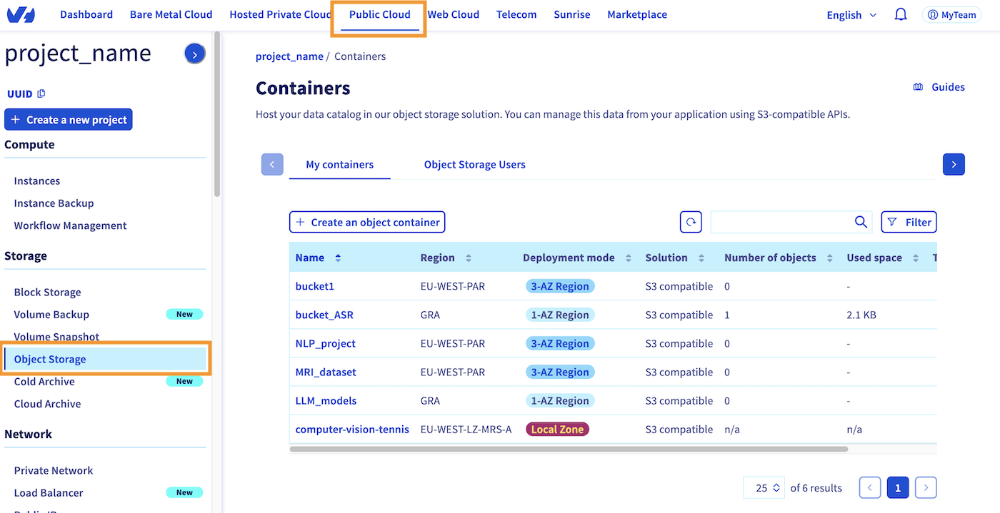

This should take you back to the page shown above, where you can see all the buckets you have already created on your Public Cloud project. By going to the `My Containers`{.action} section, where you are by default, you can create a new bucket by clicking the `Create an object container`{.action} button, just above the bucket list.

**If you haven't created a bucket yet**, the interface will be slightly different, but will also prompt you to `Create an object container`{.action}.

**1\. Container type**

Once you have clicked this button, you will be asked to specify the type of bucket you want to create. In this guide, we will choose the **S3-compatible API**:

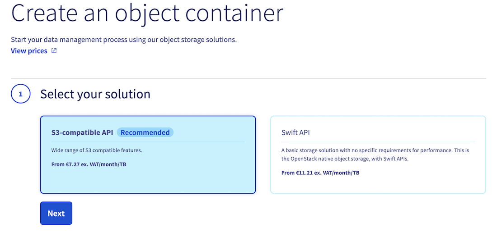

**2\. Deployment mode**

Then, specify the deployment mode you want to use (*3-AZ*, *1-AZ* or *Local Zone*). Find out more by reading the [deployment modes comparison](/pages/storage_and_backup/object_storage/s3_regions_comparison):

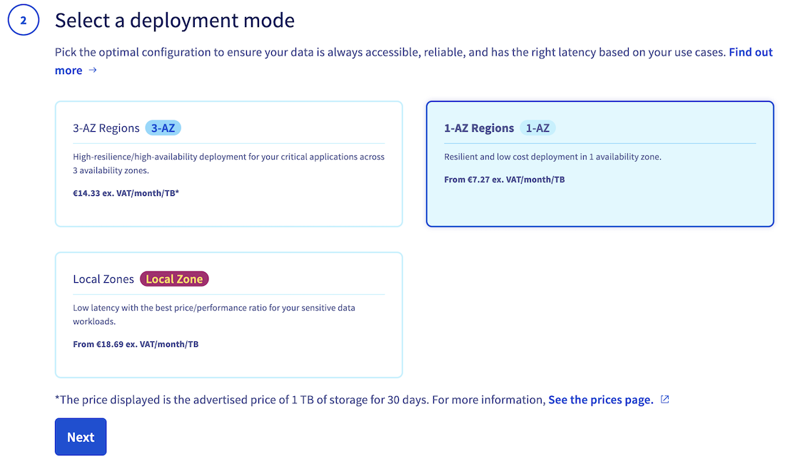

**3\. Region**

Select a region:


**4\. Associated user**

Once you have selected the deployment mode and region for your S3 compatible bucket, the following steps will vary based on the deployment mode you have chosen:

**For 1-AZ and 3-AZ deployment modes:**

You will need to link a user from your Public Cloud project to your new bucket.

To perform this step, you have two options. Firstly, you can choose from your existing users in your Public Cloud project. Alternatively, you can create a new user, which will be automatically linked to the bucket.

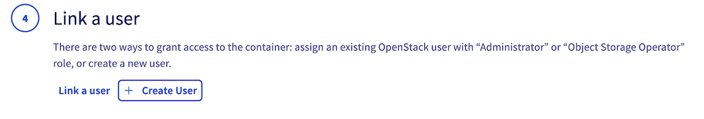

> [!warning]
>
> Warning! If you create a new user, make sure to save its credentials (username, access key, secret key). Of course, you can get them back later if you lose them.
>

**For Local Zone deployment mode:**

No additional steps are required to link a user to the bucket, as all users of your Public Cloud project will automatically have access to all containers in Local Zones.

**5\. Versioning, encryption and bucket name**

Finally, enable or disable object versioning and data encryption, and name your bucket. Note that the bucket name must be unique across all buckets in your Public Cloud account and must meet the following conditions:

- Between 3 and 63 characters
- Consist only of lower case letters, numbers, dots (.), and hyphens (-)
- Must start and end with lower case alphanumeric characters (a to z and 0 to 9)

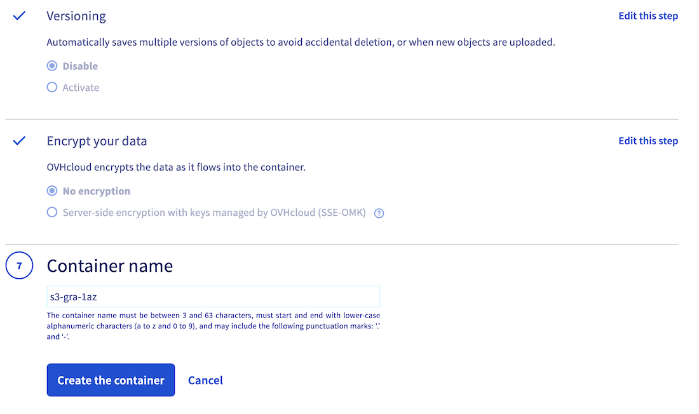

Once you have named your bucket and configured its settings, click the `Create the container`{.action} button to confirm S3 compatible bucket creation.

You should therefore find it in the list of your existing Object Storage buckets. 

By clicking on its name, you can see the objects it contains (empty for now), as well as information such as its endpoint and location (region), which we will use later:

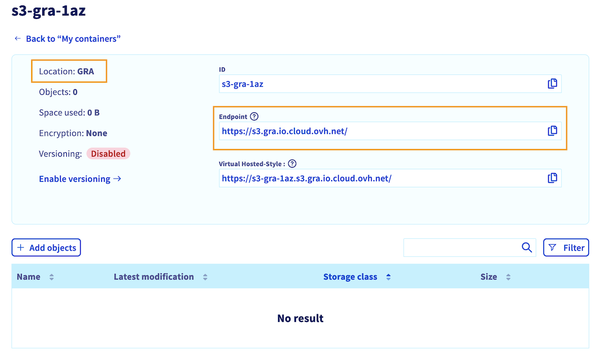

### Edit your S3 compatible user roles

Once your S3 compatible bucket has been created, you need to check that the associated user has the necessary rights to interact with your data and the OVHcloud AI Solutions (AI Notebooks, Training and Deploy).

For Local Zone deployment, you did not need to associate a user with your bucket. However, it is important to check that you also have at least one user with the necessary rights.

To do that, click on `Users & Roles`{.action} in the `Project management`{.action} category, in the OVHcloud Control Panel (UI) left-hand side bar.

Whether you have created a *new user* or use an *existing one*, check that this user has at least the following rights: `AI Training Operator` and `ObjectStore Operator`, as shown below:

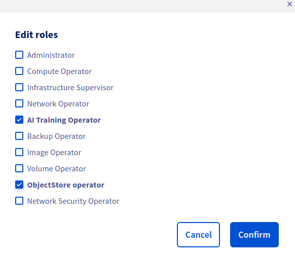

For more information about editing user rights, you can check the [dedicated documentation](/pages/public_cloud/ai_machine_learning/gi_01_manage_users).

### Retrieve user credentials

Before continuing, you need to ensure that you have the following information so that you can authenticate via the CLI and use your bucket:

- **Username**
- **Password**
- **S3 compatible access key**
- **S3 compatible secret key**

As we saw in the [previous step](#edit-your-s3-compatible-user-roles), all your Public Cloud project users are displayed in the `Users & Roles` menu in the `Project Management` category. You will find there your existing **usernames**. **The username we are interested in is the one to which you gave permissions in the [previous step](#edit-your-s3-compatible-user-roles)**.

If you have lost the password associated with this username, you can **regenerate it** by clicking the `...`{.action}, then on `Generate a password`{.action}, which will revoke the old one.

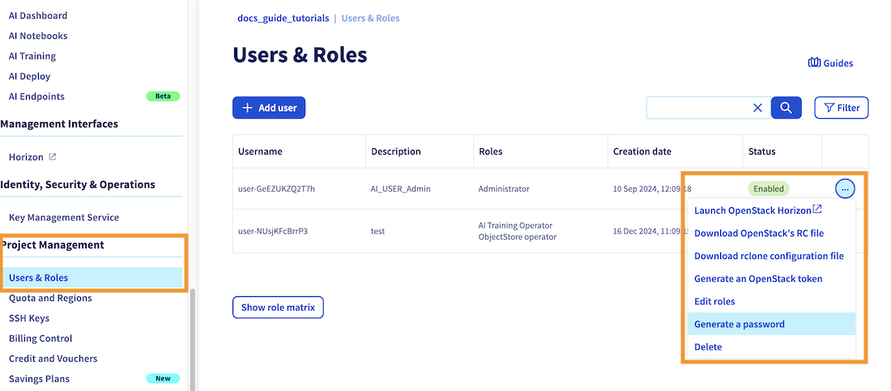

Then, you need to retrieve the **access key** and **secret key** associated to this user. To do that, return to the `Object Storage`{.action} section. By default, you will redirected to the `My containers`{.action} section. Click on the `Object Storage Users`{.action} category. Here you will find the **access key** for each of your existing users. You can also view the **secret key** by clicking the `...`{.action} button, then on `view the secret key`{.action}, as showed on the screnshot below:

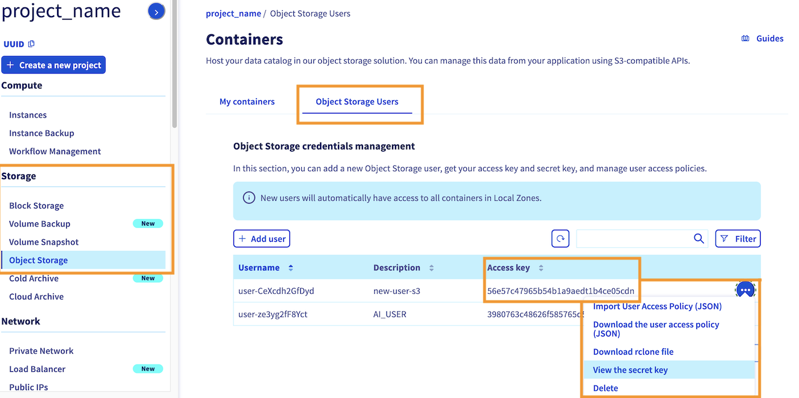

### Set up proper access permissions

It is also important to ensure that this user has the appropriate permissions to access all the files in the bucket. Otherwise, you may encounter permission issues during the AI Solution deployment process.

To grant access to your bucket for your user, click the `...`.{.action} button located next to your bucket name. Then, click the `Add a user to my container` option and select the same user you used during bucket creation.

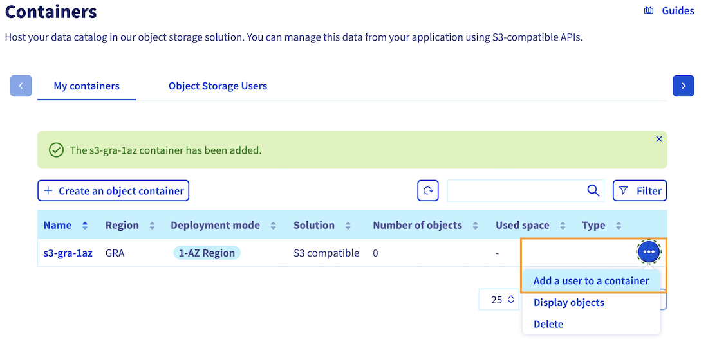

By following these steps, you can grant the necessary permissions to your user, ensuring a smooth deployment process for your notebook, job, or app.

### Add a datastore via the `ovhai` CLI

Now that your bucket has been created, and the associated user has the necessary permissions, you can move on to the `ovhai` CLI. If you have not installed it yet, please refer to the [ovhai CLI installation guide](/pages/public_cloud/ai_machine_learning/cli_10_howto_install_cli).

The first step is to authenticate with the user that you have granted access to your bucket. To do this, use the following command:

```console
ovhai login
```

We recommend that you choose the Terminal authentication mode, and enter your username and associated password to log in.

If you encounter an authentication error, please [recheck this step](#edit-your-s3-compatible-user-roles) and make sure you have the AI right.

Once authenticated, you can list your existing datastores with the following command:

```console
ovhai datastore list
```

You should obtain the following result:

```console
ALIAS STORE_TYPE OWNER    ENDPOINT
BHS   swift      ovhcloud ~
DE    swift      ovhcloud ~
GRA   swift      ovhcloud ~
SBG   swift      ovhcloud ~
SGP   swift      ovhcloud ~
UK    swift      ovhcloud ~
WAW   swift      ovhcloud ~
```

> [!primary]
>
> Here you can see that there are **no S3 compatible data stores** in the list yet. That is why you will add your own, to then access the buckets of a given region, and for a specific access key and secrey key combination!
>

To add this datastore, you will use the `ovhai datastore add s3` command pattern. You can use the `--help` flag to know more about adding **S3 compatible datastores**:

```console
ovhai datastore add s3 --help
```

This will give us the different arguments to fill in:

```console
Add an S3 compatible data store

Usage: ovhai datastore add s3 [OPTIONS] <ALIAS> <ENDPOINT_URL> <REGION> <ACCESS_KEY> <SECRET_KEY>

Arguments:
  <ALIAS>         Alias for the data store
  <ENDPOINT_URL>  Data store connection URL
  <REGION>        Data store region
  <ACCESS_KEY>    Connection access key
  <SECRET_KEY>    Connection secret key

Options:
      --store-credentials-locally  Whether or not to store the data store credentials locally when creating or updating a data store
      --token <TOKEN>              Authentication using Token rather than OAuth
      --no-color                   Remove colors from output
  -h, --help                       Print help
```

**Here is the command pattern to add an OVHcloud S3 compatible datastore:**

```console
ovhai datastore add s3 <ALIAS> <endpoint_url> <region> <my-access-key> <my-secret-key> --store-credentials-locally
```

You will need to replace:
- `<alias>` by the name you want to give for your datastore
- `<endpoint_url>` by the Endpoint value you have retrieved at the end of [bucket creation step](#create-a-s3-compatible-bucket). This endpoint should start with: *https://s3...*.
- `<region>` by the region where you have created your bucket. This region is indicated as the `Location` of your bucket, on the last screenshot of the [bucket creation step](#create-a-s3-compatible-bucket). **Make sure you use lower case letters.**
- `<my-access-key>` by the [access key](#retrieve-user-credentials) of the associated user
- `my-secret-key` by the [secret key](#retrieve-user-credentials) of the associated user

> [!primary]
>
> **Note**: This endpoint also allows you to choose between **Standard** and **High Performance** storage classes. The storage class you select will determine the storage class used during file upload to the bucket when using the `ovhai` CLI. If you plan to upload files using the Control Panel (UI), you will have the option to choose between Standard and High Performance storage. However, when using the CLI, the **default endpoint will use Standard storage**. If you require **High Performance** storage, please **ensure that the endpoint ends with `.perf.cloud.ovh.net`**.
>
> For more information on storage classes, please consult this [documentation](/pages/storage_and_backup/object_storage/s3_choosing_the_right_storage_class_for_your_needs).
>

Here is an example to add a datastore named `1azgra` that will handle 1-AZ buckets created in Gravelines (`gra`) region (since they share the same `endpoint_url`):

```console
ovhai datastore add s3 1azgra https://s3.gra.io.cloud.ovh.net/ gra <my-access-key> <my-secret-key> --store-credentials-locally
```

You can now check the datastore list:

```console
ovhai datastore list
```

You should see your new datastore in the list:

```console
ALIAS STORE_TYPE OWNER    ENDPOINT
BHS   swift      ovhcloud ~
DE    swift      ovhcloud ~
GRA   swift      ovhcloud ~
1azgra s3         customer https://s3.gra.io.cloud.ovh.net/
SBG   swift      ovhcloud ~
SGP   swift      ovhcloud ~
UK    swift      ovhcloud ~
WAW   swift      ovhcloud ~
```

Now that you have a datastore dedicated for the specified region, you can list the buckets associated to this region and access and secret keys combination by running the following command (replace <alias> by your datastore name, *1azgra* in previous example):

```console
ovhai bucket list <alias> 
DATE                     NAME
2024-12-25T09:00:00.000Z s3-gra-1az
```

You can see that the bucket `s3-gra-1az` you created using the Control Panel (UI) has been retrieved.

### Create new buckets linked to this datastore using CLI (Optional)

*This step is optional and for information only.*

Now that your datastore is configured, you can simply create new buckets for the region and user associated with your datastore using the following command, rather than using the OVHcloud Control Panel (UI):

```
ovhai bucket create <alias> <new_bucket-name>
```

> [!warning]
>
> Keep in mind that the bucket name must be between 3 and 63 characters, can consist only of lower case letters, numbers, dots (.), and hyphens (-) and must start and end with lower case alphanumeric characters (a to z and 0 to 9). 
>

Then you can check that your S3 compatible bucket has been created correctly, and linked to your datastore (replace <alias> by your datastore name, *1azgra* in previous example):

```console
ovhai bucket list <alias>
```

You should see your bucket in the list:

```console
DATE                     NAME
2024-12-25T09:00:00.000Z s3-gra-1az
2024-12-25T10:00:00.000Z new-bucket-name
```

### Upload files to your bucket

Before connecting your bucket to the AI solutions, you are going to upload a few objects to it (images, codes, models, ...) so that you can then retrieve these files from the AI Solutions. You can do this using the Control Panel (UI) or the `ovhai` CLI:

> [!tabs]
> **Using the Control Panel (UI)**
>>
>> Go to the `Object Storage`{.action} section (in the Storage category) and click on your bucket name. Then, click the `+ Add objects`{.action} button:
>>
>> 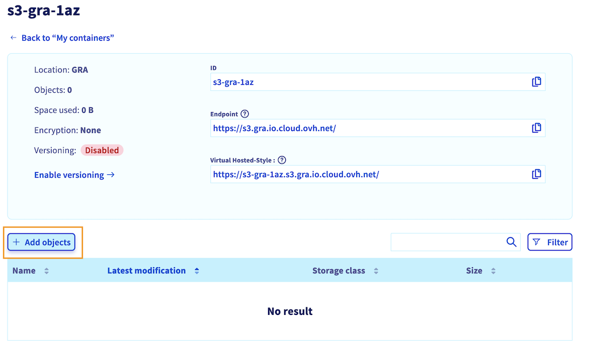
>>
>> Select the files you want to upload to your bucket. If needed, you can prefix their names. Then, choose between Standard or High performance storage (find more information about storage classes [here](/pages/storage_and_backup/object_storage/s3_choosing_the_right_storage_class_for_your_needs)). Once you have made your selection, confirm by clicking on `Import`.
>>
>> 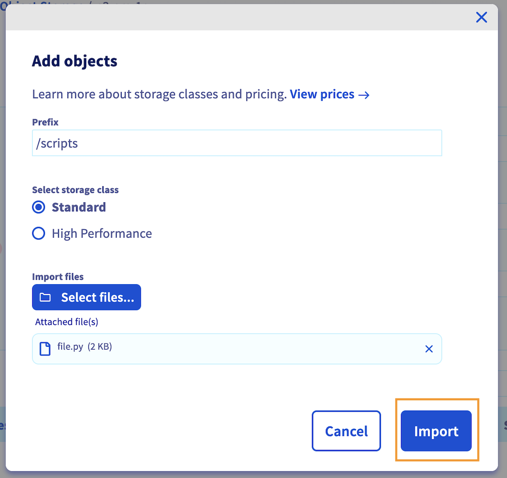
>>
>> *In this example, the python file `file.py` is added and prefixed by `/scripts`, resulting in the file path `/scripts/file.py`.*
>>
>> Once the upload is completed, you should see uploaded files in the object list.
>>
>> 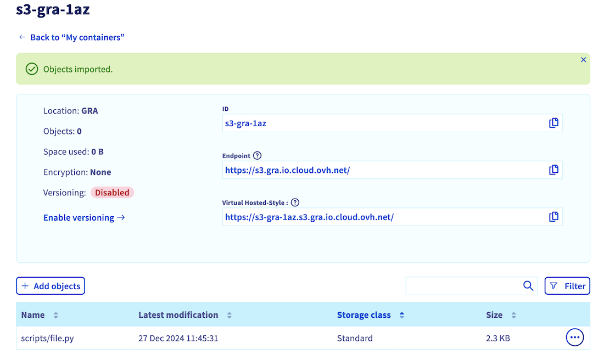
>>
> **Using ovhai CLI**
>>
>> Here is the basic command pattern to upload an object to your bucket:
>>
>> ```console
>> ovhai bucket object upload <bucket-name>@<datastore-alias> <file_path_to_upload>
>> ```
>>
>> For example, you can use the following command to upload a file named `file.py` to a bucket named `s3-gra-1az`, connected to the `1azgra` datastore. You will prefix the filename with /scripts, resulting in the file path `/scripts/file.py`:
>>
>> ```console
>> ovhai bucket object upload s3-gra-1az@1azgra file.py --add-prefix /scripts/
>> ```
>>
>> > [!warning]
>> >
>> > **Warning**: When using this command, the current directory will be included in the resulting file path. It is recommended to change to the desired directory using the `cd` command before uploading objects, to avoid any unexpected file paths. We recommend using the `--dry-run` flag to preview the actions that will be taken during the upload process.
>> >
>>
>> Once your file has been uploaded, you can list the content of your bucket:
>>
>> ```console
>> ovhai bucket object list <bucket-name>@<datastore-alias>
>> ```
>>
>> Where you should see your uploaded object (`file.py` in this example):
>>
>> ```console
>> DATE                     BYTES    NAME      DESCRIPTION
>> 2024-12-26T16:00:00.000Z 10.4 KiB /scripts/file.py   STANDARD
>> ```
>>
>> To see the full list of options, you can also use the `--help` flag:
>>
>> ```console
>> ovhai bucket object upload --help
>> ```

### Use S3 compatible buckets with AI Solutions

Now that your **S3 compatible bucket** has been created and populated with some objects, you can mount it on any OVHcloud AI Solution to access your data.

> [!primary]
>
> Please note that for the moment this S3 compatible feature can be used through `ovhai` CLI only. It will soon be available from the OVHcloud Control Panel (UI).
>

> [!tabs]
> **AI Notebooks**
>>
>> To launch an AI notebook with an S3 compatible bucket mounted as remote data, you can use the following command pattern:
>>
>> ```console
>> ovhai notebook run <framework-id> <editor-id> \
>>    --volume <bucket-name>@<datastore-alias>:<mount_path>:<permission>
>> ```
>>
>> Just make sure to replace the **framework** and **editor** by those of your choice. Also, specify the right `<bucket-name>` and `<datastore-alias`, and designate the destination where you want the bucket data to be stored (`<mount_path>`) and its access permission (`rw` for read & write, or `ro` for read only).
>>
>> For example, to launch a basic **Jupyter** notebook on **2 CPUs**, with a **Conda** pre-packaged environment, and the bucket **s3-gra-1az** from the **1azgra** datastore mounted as remote data on **/workspace/my-codes** with **read and write (RW)** permissions, use the following command:
>>
>> ```console
>> ovhai notebook run conda jupyterlab \
>>    --volume s3-gra-1az@1azgra/:/workspace/my-codes:rw \
>>    --cpu 2
>> ```
>>
>> This command will create an AI notebook with the specified framework and editor, and will mount the specified bucket at the specified destination with the specified permissions. After logging in to your notebook interface (using the same credentials you have used to `ovhai login`), you should see the uploaded file in your notebook's workspace:
>>
>> 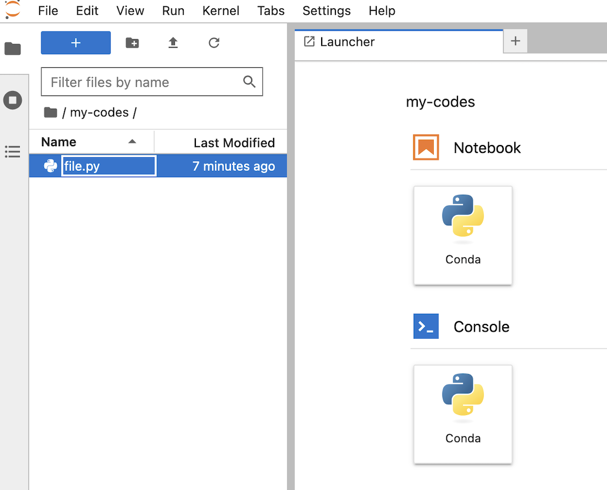
>>
>> For more information on the capabilities of the `ovhai notebook run` command, you can run the following command:
>>
>> ```console
>> ovhai notebook run --help
>> ```
>> 
>> You can also consult the dedicated [CLI - Launch an AI notebook documentation](/pages/public_cloud/ai_machine_learning/cli_11_howto_run_notebook_cli) to know more about the possible options, frameworks, and editors available.
>>
> **AI Training**
>>
>> To launch an AI Training job with an S3 compatible bucket mounted as remote data, you can use the following command pattern:
>>
>> ```console
>> ovhai job run <docker-image> \
>>    --volume <bucket-name>@<datastore-alias>:<mount_path>:<permission>
>> ```
>>
>> Just make sure to replace the `<docker-image>` by yours. Also, specify the right `<bucket-name>` and `<datastore-alias`, and designate the destination where you want the bucket data to be stored (`<mount_path>`) and its access permission (`rw` for read & write, or `ro` for read only).
>>
>> For example, to launch a basic job on **1 L40S GPU** and the bucket **s3-gra-1az** from the **1azgra** datastore mounted as remote data on **/workspace/my-codes** with **read and write (RW)** permissions, use the following command:
>>
>> ```console
>> ovhai job run ovhcom/ai-training-pytorch:2.4.0 \
>>    --volume s3-gra-1az@1azgra/:/workspace/my-codes:rw \
>>    --gpu 1 \
>>    --flavor l40s-1-gpu
>> ```
>>
>> This command will create an AI Training job with the specified Docker image, and will mount the specified bucket at the specified destination with the specified permissions.
>>
>> For more information on the capabilities of the `ovhai job run` command, you can run the following command:
>>
>> ```console
>> ovhai job run --help
>> ```
>> 
>> You can also consult the dedicated [CLI - Launch an AI Training job documentation](/pages/public_cloud/ai_machine_learning/cli_12_howto_run_job_cli) to know more about the possible job commands.
>>
> **AI Deploy**
>>
>> To launch an AI Deploy app with an S3 compatible bucket mounted as remote data, you can use the following command pattern:
>>
>> ```console
>> ovhai app run <docker-image> \
>>    --volume <bucket-name>@<datastore-alias>:<mount_path>:<permission>
>> ```
>>
>> Just make sure to replace the `<docker-image>` by yours. Also, specify the right `<bucket-name>` and `<datastore-alias`, and designate the destination where you want the bucket data to be stored (`<mount_path>`) and its access permission (`rw` for read & write, or `ro` for read only).
>>
>> For example, to launch a basic app on **2x A100 GPUs** and the bucket **s3-gra-1az** from the **1azgra** datastore mounted as remote data on **/workspace/my-codes** with **read and write (RW)** permissions, use the following command:
>>
>> ```console
>> ovhai app run ovhcom/ai-training-pytorch:2.4.0 \
>>    --volume s3-gra-1az@1azgra/:/workspace/my-codes:rw \
>>    --gpu 2 \
>>    --flavor a100-1-gpu
>> ```
>>
>> This command will create an AI Deploy app with the specified Docker image, and will mount the specified bucket at the specified destination with the specified permissions.
>>
>> For more information on the capabilities of the `ovhai app run` command, you can run the following command:
>>
>> ```console
>> ovhai app run --help
>> ```
>> 
>> You can also consult the dedicated [CLI - Launch an AI Deploy app documentation](/pages/public_cloud/ai_machine_learning/cli_18_howto_deploy_app) to know more about the possible job commands.
>>

If you want to use the `boto3` library to manage your S3 compatible bucket objects, here is a [notebook](https://github.com/ovh/ai-training-examples/blob/main/notebooks/getting-started/S3/use-s3-buckets-with-ai-tools.ipynb) that contains basic commands.

## Feedback

Please send us your questions, feedback and suggestions to improve the service:

- On the OVHcloud [Discord server](https://discord.gg/ovhcloud)

If you need training or technical assistance to implement our solutions, contact your sales representative or click on [this link](/links/professional-services) to get a quote and ask our Professional Services experts for a custom analysis of your project.

**\***: S3 is a trademark of Amazon Technologies, Inc. OVHcloud’s service is not sponsored by, endorsed by, or otherwise affiliated with Amazon Technologies, Inc.
