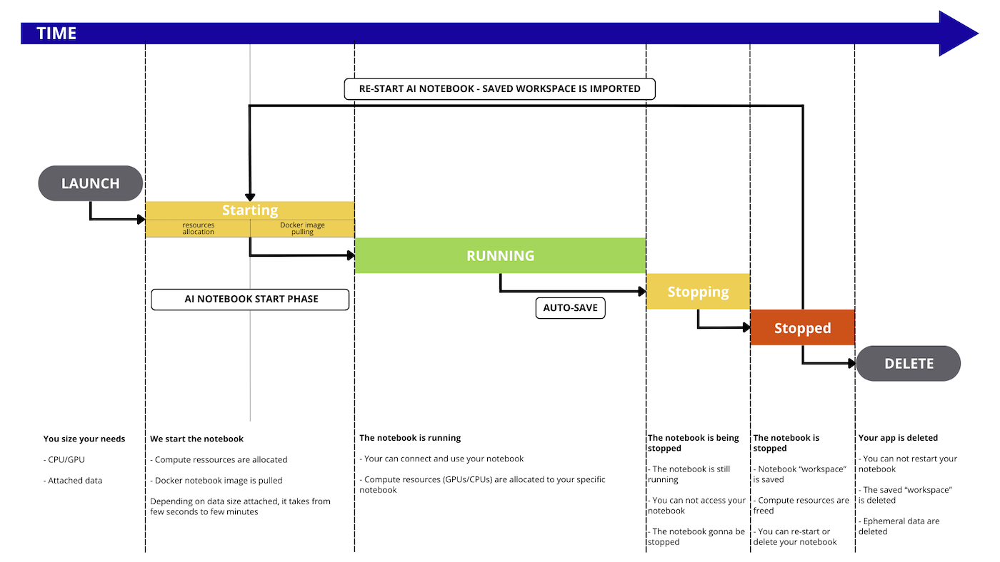
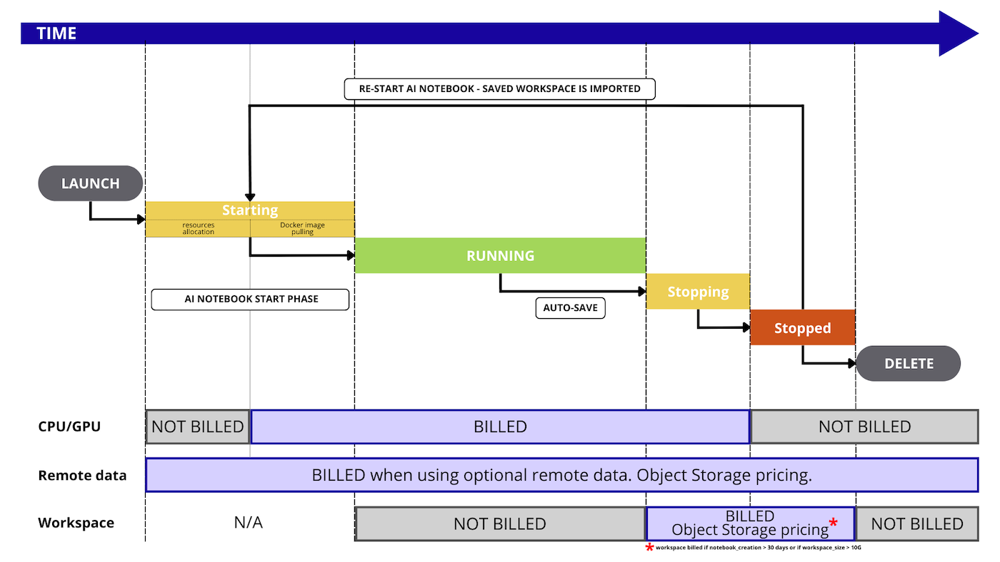

## Objective

**OVHcloud AI Notebooks** are managed Jupyter and VSCode notebooks with assigned CPU or GPU resources, eliminating the need for installation and maintenance. This documentation will detail the notebook **lifecycle and billing**.

## Introduction

AI Notebooks are linked to a Public Cloud project. The whole project is billed at the end of the month, with **pay-as-you-go**. It means you will only pay for what you consume, based on the compute resources you use (CPUs and GPUs), their running time and data.

## AI Notebooks lifecycle

During its lifetime, the notebook will go through the following statuses:

- `STARTING`: the notebook is being started and, if any, the remote data is synchronized from the Object Storage. To learn more about data synchronization, please check out the [Data - Concept and best practices](/pages/public_cloud/ai_machine_learning/gi_02_concepts_data#how-it-works) documentation. Then, the system allocates the necessary compute resources (CPUs/GPUs) for your Notebook. Finally, the base framework you have chosen is pulled for use in the notebook.
- `RUNNING`: the notebook is running, you can connect to it using its endpoint and benefit from your compute resources and your attached data.
- `STOPPING`: the notebook is stopping, your compute resources are freed, your work and status is saved and, if any, the data is synchronized back to the Object Storage.
- `STOPPED`: the notebook ended normally. You can restart it whenever you want or delete it. It will keep the same endpoint.
- `FAILED`: the notebook ended in error, e.g. the process in the notebook finished with a non 0 exit code. For more information, refer to [this section of our Troubleshooting documentation](/pages/public_cloud/ai_machine_learning/notebook_guide_troubleshooting#cli-my-notebook-is-in-failed-status).
- `ERROR`: the notebook ended due to a backend error. You may reach our support.
- `DELETING`: the notebook is being removed. When it is deleted, you will no longer see it, it will no longer exist.

{.thumbnail}

## Billing principles

AI Notebooks is a **pay-per-use solution**. You only pay for the **resources** consumption.

**Included** in AI Notebooks resources:

- Dedicated CPU/GPU compute resources (based on the selected amount during notebook creation)
- Ephemeral local notebook storage (size depends on the selected compute resources). First 10GB are free.
- Workspace remote storage (Optional)
- Ingress/Egress network traffic (Optional)

Here is a detailed graph that illustrates every step that is billed or not during the AI Notebook workflow:

{.thumbnail}

### Compute resources details

During the notebook creation, you can select **compute resources**, known as CPUs or GPUs. Their official pricing is available in the [OVHcloud Control Panel](/links/manager) or on the [OVHcloud Public Cloud website](/links/public-cloud/prices).

Rates for compute are mentioned per hour to facilitate reading of the prices, but the billing granularity remains **per minute**. 

As stated above and shown in the image above, you pay for these resources as long as you consume them. This happens when the image of your notebook is pulled, during the `STARTING` phase, but also during `RUNNING` and `STOPPING` phases, until you reach the `STOPPED` phase.

### Storage details

There are three types of storage within AI Notebooks:

- Remote Object storage
- Workspace storage
- Ephemeral local storage

The pricing of these different storages is different.

#### Remote Object storage

Remote data is the one that comes from the OVHcloud Object Storage solution. During notebook creation, you are able to mount some Object Storage containers into your notebook.

In situations where you are utilizing notebooks with attached remote data, you will be charged separately for the storage of this data. The cost of Object Storage is independent of the pricing for notebooks.

#### Workspace storage

By default, your notebook will be mounted a remote Object Storage container on the `/workspace` location. This will be your default folder when you access your notebook.

You can store your data there.

The first 10GB are free for 30 consecutive days once your notebook is stopped, then you pay at the price of OVHcloud Object Storage.

#### Ephemeral local storage

Each compute resource (CPU or GPU) comes with local storage, that we can consider ephemeral since this storage space is not saved when you stop or delete your notebook.

The sizing depends on the selected amount of compute resources, check the details on the [OVHcloud Public Cloud website](/links/public-cloud/prices).

This concerns locations outside your `/workspace`, as well as outside any other remote Object Storage containers you may have mounted on your notebook.

This storage is not billed as it is directly linked to the compute resource(s) you have chosen.

### Pricing examples

#### Example 1: one GPU notebook for 10 hours then deleted

We start one AI Notebook, with two GPUs and we keep it running for 10 hours then we **delete it**.

- compute resources: 2 x GPU NVIDIA V100s (1,93€ / hour)
- remote storage:  nothing
- duration: 10 hours then deleted

Price calculation for compute: 10 (hours) x 2 (GPU) x 1,93€ (price / GPU) = **38,6 euros**, billed at the end of the month

#### Example 2: one GPU notebook for 10 hours but stopped, not deleted

We start one AI Notebook, with two GPUs and we keep it running for 10 hours then we stop it and finally we **delete it after 10 days**.

- compute resources: 2 x GPU NVIDIA V100s (1,93 / hour)
- remote storage: nothing
- workspace storage: 100GB used. First 10GB are free
- duration: 10 hours then stopped for 10 days

Price calculation for compute : 10 (hours) x 2 (GPU) x 1,93 (price / GPU) = **38,6 euros**, billed at the end of the month
Price calculation for workspace : 90 (GB) x 0,01€ (price for object storage / GB) = **0,9 euros**, billed at the end of the month

#### Example 3: one GPU notebook for 10 hours with 1TB remote storage

We start one AI Notebook, with two GPUs and 1TB remote storage. We keep it running for 10 hours then we delete it.

- compute resources: 2 x GPU NVIDIA V100s (1,93 / hour)
- remote storage: 1TB in OVHcloud Object Storage
- workspace storage: 100GB used. First 10GB are free
- duration: 10 hours then we delete it.

Price calculation for compute: 10 (hours) x 2 (GPU) x 1,93 (price / GPU) = **38,6 euros**, billed at the end of the month
Price calculation for workspace: 90 (GB) x 0,01€ (price for object storage / GB) = **0,9 euros**, billed at the end of the month

Also, price calculation for remote Object Storage : 1000 (GB) x 0,01€ (price for object storage / GB) = **10 euros**, billed at the end of the month

#### Example 4: 15 CPU notebooks for 5 hours then deleted

We start 15 AI Notebooks, each of them with one vCPU

 - compute resources: 1 x vCPU (0,03€ /hour /cpu)
 - remote storage: nothing
 - duration: 5 hours then we delete it.

Price calculation for compute: 15 (notebooks) x 5 (hours) x 1 (CPU) x 0,03€ (price / CPU) = **2,25 euros**, billed at the end of the month

## Feedback

Please send us your questions, feedback and suggestions to improve the service:

- On the OVHcloud [Discord server](https://discord.gg/ovhcloud)

If you need training or technical assistance to implement our solutions, contact your sales representative or click on [this link](/links/professional-services) to get a quote and ask our Professional Services experts for a custom analysis of your project.
