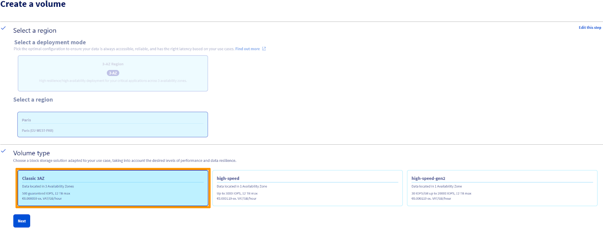

## Introduction

Classic Multi-Attach 3AZ est un type de volume régional multi-zone, disponible exclusivement dans les régions Public Cloud disposant de trois zones de disponibilité (3AZ). Il permet à un même volume d’être attaché simultanément à plusieurs instances situées dans la même région, offrant ainsi une meilleure résilience et une haute disponibilité pour les applications critiques.

Cette fonctionnalité est conçue spécifiquement pour les cas d’usage en actif/actif ou actif/passif, où plusieurs instances doivent accéder de manière coordonnée à des données partagées.

Pour mieux comprendre l’architecture sous-jacente des déploiements multi-zones utilisant le Block Storage régional, consultez la [documentation dédiée](/pages/public_cloud/public_cloud_cross_functional/3az_ref_architecture#2az-with-regional-block-storage).

> [!warning]
> 
> Il est de la responsabilité de l’utilisateur de s’assurer qu’un système de fichiers compatible multi-attach ou clusterisé est utilisé avec les volumes Classic Multi-Attach.
> 
> Dans le cas contraire, cela peut entraîner une corruption des données.
> 
> Utilisez uniquement des systèmes de fichiers conçus pour l’accès partagé, tels que GFS2 ou OCFS2.
> 
> Les systèmes de fichiers classiques (ex. : XFS, EXT4, NTFS) ne sont pas compatibles sans mécanismes de protection spécifiques (fencing).
> 

## Usage

La création et l'attachement d'un volume Classic Multi-Attach suivent le même processus que celui décrit dans la [documentation OVHcloud sur la création de volume](/pages/public_cloud/compute/starting_with_managing_volumes_openstack_api). La principale différence est que le type de volume est « classic-multiattach », et pas seulement « classic ».

Si le type de volume est omis lors de la création, OpenStack utilisera par défaut « classic-multiattach » (similaire à la façon dont « classic » est défini par défaut dans les régions ordinaires).

Dans l'espace client OVHcloud, il suffit de sélectionner le volume classique disponible dans la région 3AZ.

{.thumbnail}

## Informations complémentaires

Les points suivants doivent être pris en compte lors de l'utilisation de volumes Classic Multi-Attach dans les régions 3AZ :

- Les volumes Classic 3AZ Multi-Attach peuvent être attachés à un maximum de 16 instances simultanément dans la même région.
- La fonctionnalité multi-attach n'est disponible qu'avec ce type de volume spécifique et exclusivement dans les régions 3AZ, telles que la région parisienne.
- L'utilisation de systèmes de fichiers compatibles avec les clusters est nécessaire, mais peut entraîner une dégradation des performances en fonction de la charge de travail et de la configuration.

## Limitations

Les volumes Classic Multi-attach sont assortis de limitations spécifiques qu'il convient de prendre en compte avant de les déployer :

- La réécriture du volume n'est pas prise en charge lorsque le volume est en cours d'utilisation - le passage d'un type compatible avec le multi-attach à un type non compatible avec le multi-attach (ou vice-versa) n'est pas autorisé.
- Le chiffrement n'est pas disponible pour les volumes Classic Multi-attach.

## Aller plus loin 

Échangez avec notre [communauté d'utilisateurs](/links/community).