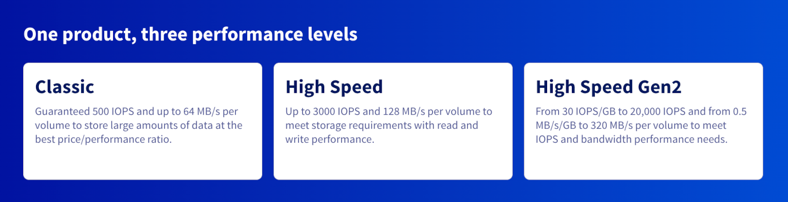

<style>
details>summary {
    color:rgb(33, 153, 232) !important;
    cursor: pointer;
}
details>summary::before {
    content:'\25B6';
    padding-right:1ch;
}
details[open]>summary::before {
    content:'\25BC';
}
</style>

## Objetivo

Puede crear discos adicionales para sus instancias de Public Cloud.
Esto puede ser útil en los siguientes casos:

- Si quiere aumentar su capacidad de almacenamiento sin tener que cambiar el modelo de instancia.
- Si quiere disponer de un espacio de almacenamiento de alta disponibilidad y buen rendimiento.
- Si desea transferir su almacenamiento y sus datos a otra instancia.
- Si desea preparar el entorno para utilizar [Terraform](/pages/public_cloud/public_cloud_cross_functional/how_to_use_terraform), debe preparar el entorno.

**Esta guía explica cómo crear un disco adicional y configurarlo en una instancia.**

## Requisitos

- Tienes acceso a tu [área de cliente de OVHcloud](/links/manager).
- Disponer de una instancia de [Public Cloud](/pages/public_cloud/compute/public-cloud-first-steps) en su cuenta de OVHcloud.
- Tener acceso de administrador (sudo) a su instancia a través de SSH.
- Preparar el entorno si desea utilizar [Terraform](/pages/public_cloud/public_cloud_cross_functional/how_to_use_terraform).

> [!warning]
>
> Esta funcionalidad no está actualmente disponible para instancias Metal.
>

## Procedimiento

### Los diferentes tipos de volúmenes

OVHcloud ofrece tres tipos de volúmenes Block Storage, cada uno de ellos adaptado a las necesidades específicas en materia de rendimiento, capacidad y costes. Estas soluciones permiten asociar volúmenes de almacenamiento persistentes a sus instancias, garantizando un alto nivel de fiabilidad y disponibilidad.

/// details | **Classic - 500 IOPS garantizadas**

El volumen Classic es una solución de almacenamiento fiable y rentable, ideal para cargas de trabajo que requieren un rendimiento moderado. Ofrece 500 IOPS garantizadas, lo que lo hace adecuado para los siguientes usos:

- Alojamiento de aplicaciones web clásicas
- Almacenamiento de bases de datos de tamaño pequeño a mediano
- Backup y archivado de datos

///

/// details | **High-Speed - Hasta 3000 IOPS**

El volumen High-Speed está diseñado para aplicaciones que requieren un acceso más rápido a los datos. Con un rendimiento de hasta 3000 IOPS, es ideal para los siguientes casos de uso:

- Bases de datos transaccionales (MySQL, PostgreSQL, etc.)
- Entornos de virtualización y contenedores
- Aplicaciones que requieren una latencia reducida y un rendimiento elevado

///

/// details | **High-Speed Gen2 - 30 IOPS/GB y hasta 20.000 IOPS**

La generación 2 de los volúmenes High-Speed está optimizada para las cargas de trabajo más exigentes. Con un rendimiento de 30 IOPS/GB, hasta 20.000 IOPS, este tipo de volumen se recomienda para:

- Big Data y análisis en tiempo real
- Inteligencia artificial y Machine Learning
- Procesamiento de grandes bases de datos y almacenamiento de altas prestaciones

///

{.thumbnail}

### Asociar un nuevo volumen

> [!tabs]
> **Desde el área de cliente de OVHcloud**
>>
>> Conéctese al [área de cliente de OVHcloud](/links/manager), acceda a la sección `Public Cloud`{.action} y seleccione el proyecto de Public Cloud correspondiente. A continuación, abra `Block Storage`{.action} en el menú de la izquierda bajo **Storage and Backup**.
>>
>> En esta sección, haga clic en el botón `Crear un volumen`{.action}.
>>
>> > [!warning]
>> >
>> > Nota: El volumen debe crearse en la misma región que la instancia a la que desea asociarlo. Si lo crea en otra región, puede eliminarlo y volver a crearlo en la región correcta o puede migrar la región siguiendo [esta guía](/pages/public_cloud/compute/transfer_volume_backup_from_one_datacentre_to_another).
>> >
>>
>> {.thumbnail}
>>
>> Siga los pasos de configuración para seleccionar las opciones de ubicación, tipo de disco y capacidad de disco. Introduzca un nombre para el volumen y haga clic en `Crear el volumen`{.action}.
>>
>> {.thumbnail}
>>
>> El nuevo disco se mostrará en el área de cliente.
>>
>> {.thumbnail}
>>
>> A la derecha del volumen, haga clic en el botón `...`{.action} y seleccione `Asociar a la instancia`{.action}.
>>
>> {.thumbnail}
>>
>> En la nueva ventana, seleccione una instancia de la lista y haga clic en `Confirmar`{.action} para asociar el disco.
>>
>> {.thumbnail}
>>
>> El proceso de asociar el disco a su instancia comenzará. La operación puede tardar unos minutos.
>>
>> > [!warning]
>> >
>> > No abandone la página actual del área de cliente de OVHcloud cuando se esté conectando el disco. Esto podría interrumpir el proceso.
>> >
>>
> **Via Terraform**
>> Para crear un volumen block storage simple, necesita 3 elementos:
>>
>> * El nombre del volumen
>> * La región
>> * El tamaño del volumen en GB
>>
>> En nuestro ejemplo, vamos a crear un block storage en la región **GRA11** con un tamaño de **10 GB**. Agregue las siguientes líneas a un archivo denominado *simple_blockstorage.tf*:
>>
>> ```python
>> # Creación de un volumen block storage
>> resource "openstack_blockstorage_volume_v3" "terraform_blockstorage" {
>>   name   = "terraform_blockstorage" # Nombre del volumen block storage
>>   size   = 10                       # Tamaño del volumen
>>   region = "GRA11"                  # Región o volumen que se va a crear
>> }
>> ```
>>
>> A continuación, vamos a asociarlo a la instancia de destino.
>>
>> > [!warning]
>> > La instancia y el volumen deben estar en la misma región.
>> >
>>
>> Agregue las siguientes líneas debajo de las anteriores:
>>
>> ```python
>> # Asociar el volumen a la instancia
>> resource "openstack_compute_volume_attach_v2" "volume_attach" {
>>   instance_id = "<su_instance_id>"
>>   volume_id   = openstack_blockstorage_volume_v3.terraform_volume.id
>> }
>> ```
>> 
>> Puede crear su volumen de tipo block storage y asociarlo a la instancia deseada introduciendo el siguiente comando:
>>
>> ```console
>> terraform apply
>> ```
>>
>> El resultado debería ser similar al siguiente:
>>
>> ```console
>> $ terraform apply
>> Terraform used the selected providers to generate the following execution plan. Resource actions are indicated with the following symbols:
>>   + create
>>
>> Terraform will perform the following actions:
>>
>>   # openstack_blockstorage_volume_v3.terraform_blockstorage will be created
>>   + resource "openstack_blockstorage_volume_v3" "terraform_blockstorage" {
>>       + attachment        = (known after apply)
>>       + availability_zone = (known after apply)
>>       + id                = (known after apply)
>>       + metadata          = (known after apply)
>>       + name              = "terraform_blockstorage"
>>       + region            = "GRA11"
>>       + size              = 10
>>       + volume_type       = (known after apply)
>>     }
>>
>>   # openstack_compute_volume_attach_v2.volume_attach will be created
>>   + resource "openstack_compute_volume_attach_v2" "volume_attach" {
>>       + device      = (known after apply)
>>       + id          = (known after apply)
>>       + instance_id = "11cc1279-xxxx-xxxx-xxxx-3ace4c954780"
>>       + region      = (known after apply)
>>       + volume_id   = (known after apply)
>>     }
>>
>> Plan: 2 to add, 0 to change, 0 to destroy.
>>
>> Do you want to perform these actions in workspace "test_terraform"?
>>   Terraform will perform the actions described above.
>>   Only 'yes' will be accepted to approve.
>>
>>   Enter a value: yes
>>
>> openstack_blockstorage_volume_v3.terraform_blockstorage: Creating...
>> openstack_blockstorage_volume_v3.terraform_blockstorage: Still creating... [10s elapsed]
>> openstack_blockstorage_volume_v3.terraform_blockstorage: Creation complete after 12s [id=daf3a86e-xxxx-xxxx-xxxx-ac7b6ffbb806]
>> openstack_compute_volume_attach_v2.volume_attach: Creating...
>> openstack_compute_volume_attach_v2.volume_attach: Still creating... [10s elapsed]
>> openstack_compute_volume_attach_v2.volume_attach: Creation complete after 14s [id=11cc1279-xxxx-xxxx-xxxx-3ace4c954780/daf3a86e-xxxx-xxxx-xxxx-ac7b6ffbb806]
>>
>> Apply complete! Resources: 2 added, 0 changed, 0 destroyed.
>> ```

### Configuración del nuevo disco

Los siguientes ejemplos implican que está conectado como usuario con los permisos suficientes.

#### En Linux

Abra una [conexión SSH a su instancia](/pages/public_cloud/compute/public-cloud-first-steps#connect-instance) y utilice el siguiente comando para mostrar los discos asociados.

```bash
lsblk
```

```console
NAME MAJ:MIN RM SIZE RO TYPE MOUNTPOINT
vda 254:0 0 10G 0 disk
└─vda1 254:1 0 10G 0 part /
vdb 254:16 0 10G 0 disk
```

> [!primary]
>
> En este ejemplo, `vda` hace referencia al disco por defecto de la instancia. El disco adicional se llamará `vdb`.
>

Cree una partición en el disco adicional con los siguientes comandos.

Si tu disco adicional es inferior a 2TB:

```bash
sudo fdisk /dev/vdb
```

```console
Welcome to fdisk (util-linux 2.25.2).
Changes will remain in memory only, until you decide to write them.
Be careful before using the write command.

Device does not contain a recognized partition table.
Created a new DOS disklabel with disk identifier 0x95c4adcc.

Command (m for help): n

Partition type
p primary (0 primary, 0 extended, 4 free)
e extended (container for logical partitions)
Select (default p):
Using default response p.
Partition number (1-4, default 1):
First sector (2048-20971519, default 2048):
Last sector, +sectors or +size{K,M,G,T,P} (2048-20971519, default 20971519):

Created a new partition 1 of type 'Linux' and of size 10 GiB.

Command (m for help): w

The partition table has been altered.
Calling ioctl() to re-read partition table.
Syncing disks.
```

Si tu disco adicional es mayor de 2TB:

```bash
sudo parted /dev/vdb
```

```console
GNU Parted 3.5
Using /dev/vdb
Welcome to GNU Parted! Type 'help' to view a list of commands.
(parted) help                                                             
  align-check TYPE N                       check partition N for TYPE(min|opt) alignment
  help [COMMAND]                           print general help, or help on COMMAND
  mklabel,mktable LABEL-TYPE               create a new disklabel (partition table)
  mkpart PART-TYPE [FS-TYPE] START END     make a partition
  name NUMBER NAME                         name partition NUMBER as NAME
  print [devices|free|list,all]            display the partition table, or available devices, or free space, or all found partitions
  quit                                     exit program
  rescue START END                         rescue a lost partition near START and END
  resizepart NUMBER END                    resize partition NUMBER
  rm NUMBER                                delete partition NUMBER
  select DEVICE                            choose the device to edit
  disk_set FLAG STATE                      change the FLAG on selected device
  disk_toggle [FLAG]                       toggle the state of FLAG on selected device
  set NUMBER FLAG STATE                    change the FLAG on partition NUMBER
  toggle [NUMBER [FLAG]]                   toggle the state of FLAG on partition NUMBER
  unit UNIT                                set the default unit to UNIT
  version                                  display the version number and copyright information of GNU Parted
(parted) mklabel gpt                                                      
(parted) mkpart primary 0 3750G                                           
Warning: The resulting partition is not properly aligned for best performance: 34s % 2048s != 0s
Ignore/Cancel? I                                                          
(parted) quit
```

A continuación, forme la nueva partición `vdb1` con el siguiente comando:

```bash
sudo mkfs.ext4 /dev/vdb1
```

```console
mke2fs 1.42.12 (29-Aug-2014)
Creating filesystem with 2621184 4k blocks and 655360 inodes
Filesystem UUID: 781be788-c4be-462b-b946-88429a43c0cf
Superblock backups stored on blocks:
32768, 98304, 163840, 229376, 294912, 819200, 884736, 1605632

Allocating group tables: done
Writing inode tables: done
Creating journal (32768 blocks): done
Writing superblocks and filesystem accounting information: done
```

Monte la partición con los siguientes comandos:

```bash
sudo mkdir /mnt/disk
```

```bash
sudo mount /dev/vdb1 /mnt/disk/
```

Por último, compruebe el punto de montaje utilizando el siguiente comando:

```bash
df -h
```

```console
Filesystem Size Used Avail Use% Mounted on
/dev/vda1 9.8G 840M 8.6G 9% /
udev 10M 0 10M 0% /dev
tmpfs 393M 5.2M 388M 2% /run
tmpfs 982M 0 982M 0% /dev/shm
tmpfs 5.0M 0 5.0M 0% /run/lock
tmpfs 982M 0 982M 0% /sys/fs/cgroup
/dev/vdb1 9.8G 23M 9.2G 1% /mnt/disk
```

> [!primary]
>
> El montaje no es persistente, ya que el disco se desvinculará al reiniciar la instancia. Para automatizar el montaje, es necesario editar el archivo `fstab`.
>

En primer lugar, consulte el UUID (block ID) del nuevo volumen:

```bash
sudo blkid
```

```console
/dev/vda1: UUID="51ba13e7-398b-45f3-b5f3-fdfbe556f62c" TYPE="ext4" PARTUUID="000132ff-01"
/dev/vdb1: UUID="2e4a9012-bf0e-41ef-bf9a-fbf350803ac5" TYPE="ext4" PARTUUID="95c4adcc-01"
```

Abra `/etc/fstab` con un editor de texto:

```
sudo nano /etc/fstab
```

Añada la siguiente línea al archivo y sustituya el UUID por el suyo:

```console
UUID=2e4a9012-bf0e-41ef-bf9a-fbf350803ac5 /mnt/disk ext4 nofail 0 0
```

Guarde y salga del editor. El disco debe montarse automáticamente cada vez que se reinicie.

#### En Windows

Establezca una conexión RDP (Remote Desktop) con su instancia Windows.

Una vez que se haya conectado, haga clic derecho en el botón `Iniciar`{.action} y abra `Gestión de discos`{.action}.

{.thumbnail}

El nuevo disco se mostrará como volumen desconocido con espacio no asignado.

{.thumbnail}

Si el disco está marcado como desconectado, deberá inicializarlo primero. Para ello, puede utilizar la [interfaz de usuario Windows](#initDiskManagement) o la [utilidad DISKPART](#initDiskpart). De lo contrario, realice el [formateo del disco en Gestión de discos](#formatDiskManagement).

##### **Iniciar el disco en Gestión de discos** <a name="initDiskManagement"></a>

Haga clic derecho en el disco y seleccione `En línea`{.action}.

Si el disco está indicado aquí como desconectado, probablemente se deba a una política en la instancia. Para solucionar el problema, haga clic derecho en el disco y seleccione `On-line`{.action}.

{.thumbnail}

Haga clic derecho de nuevo y seleccione `Inicializar disco`{.action}.

{.thumbnail}

A continuación, seleccione `MBR`{.action} si su disco adicional es inferior a 2TB, o `GPT`{.action} si es superior a 2TB, y haga clic en `OK`{.action}.

{.thumbnail}

##### **Iniciar el disco con DISKPART** <a name="initDiskpart"></a>

Haga clic derecho en el botón `Iniciar`{.action} y abra `Ejecutar`{.action}.

{.thumbnail}

Pulse `cmd` y haga clic en `Aceptar`{.action} para abrir la aplicación de línea de órdenes.

{.thumbnail}

En el pedido, abra DISKPART:

```console
C:\> diskpart
```

Utilice la siguiente serie de comandos DISKPART para poner el disco `en línea`:

```console
DISKPART> san

SAN Policy : Offline Shared

DISKPART> san policy = OnlineAll

DiskPart successfully changed the SAN policy for the current operating system .

- Implementation of the strategy on the extra disk:
[Code] DISKPART> list disk

Disk ### Status Size Free Dyn Gpt
-------- ------------- ------- ------- --- ---
Disk 0 Online 200 GB 0 B
* Disk 1 Offline 10 GB 1024 KB

DISKPART> select disk 1

Disk 1 is now the selected disk.

DISKPART> attributes disk clear readonly

Disk attributes cleared successfully.

DISKPART> attributes disk

Current Read-only State : No
Read-only : No
Boot Disk : No
Pagefile Disk : No
Hibernation File Disk : No
Crashdump Disk : No
Clustered Disk : No

DISKPART> online disk

DiskPart successfully onlined the selected disk.
```

##### **Formateado del disco** <a name="formatDiskManagement"></a>

En la herramienta de `gestión de discos`{.action}, haga clic derecho en el nuevo disco y seleccione `Nuevo volumen simple...`{.action}.

{.thumbnail}

En el asistente, haga clic en `Siguiente`{.action} para especificar el tamaño del volumen. Por defecto, debe estar al máximo. Haga clic en `Siguiente`{.action} para continuar.

{.thumbnail}

Deje la nueva letra predeterminada o seleccione otra y haga clic en `Siguiente`{.action}.

{.thumbnail}

Asigne un nombre al volumen (opcional) y confirme las opciones de formato haciendo clic en `Siguiente`{.action}.

{.thumbnail}

En la última ventana, haga clic en `Finalizar`{.action} para dar formato al disco.

{.thumbnail}

El disco estará disponible como lector en el explorador de archivos.

### Desvincular un volumen

Si desea desvincular un volumen de su instancia, la mejor práctica es desmontar el volumen del sistema operativo antes de desvincularlo de la instancia.

> [!warning]
>
> Se puede mostrar un mensaje de error si se están ejecutando programas o procesos en el disco adicional. En ese caso, se recomienda detener todos los procesos antes de continuar.
>

Así es como **desmonta el volumen** del sistema operativo antes de desmontarlo de la instancia:

> [!tabs]
> **En Linux**
>>
>> Abra una [conexión SSH a su instancia](/pages/public_cloud/compute/public-cloud-first-steps#3-crear-una-instancia) y utilice el siguiente comando para mostrar los discos asociados.
>>
>> ```bash
>> lsblk
>> ```
>>
>> ```console
>> NAME MAJ:MIN RM SIZE RO TYPE MOUNTPOINT
>> vda 254:0 0 10G 0 disk
>> └─vda1 254:1 0 10G 0 part /
>> vdb       8:0    0   10G  0 disk
>> └─vdb1    8:1    0   10G  0 part /mnt/disk
>> ```
>>
>> Desmonte la partición utilizando el siguiente comando:
>>
>> ```bash
>> sudo umount /dev/vdb1
>> ```
>>
>> Elimine el ID del dispositivo fstab para finalizar el proceso de desmontaje. Si no se realiza, la partición se recuperará después de un reinicio.
>>
>> ```bash
>> sudo nano /etc/fstab
>> ```
>>
>> Guarde y salga del editor.
>>
> **En Windows**
>>
>> Establezca una conexión RDP (Remote Desktop) con su instancia Windows.
>>
>> Una vez que se haya conectado, haga clic derecho en el menú `Iniciar`{.action} y abra `Administración de discos`{.action}.
>>
>> {.thumbnail}
>>
>> Haga clic derecho en el volumen que desee desmontar y seleccione `Cambiar la letra y rutas de acceso de unidad...`{.action}.
>>
>> {.thumbnail}
>>
>> Haga clic en `Quitar`{.action} para eliminar el disco.
>>
>> {.thumbnail}
>>
>> Haga clic en `Sí`{.action} para confirmar la eliminación de la letra de la unidad de disco.
>>
>> {.thumbnail}
>>
>> Una vez que haya terminado, puede cerrar la ventana de gestión del disco.
>>

Por último, vamos a desvincular el volumen de la instancia:

> [!tabs]
> **Desde el área de cliente de OVHcloud**
>> Acceda a la sección `Public Cloud`{.action} de su área de cliente de OVHcloud y haga clic en `Block Storage`{.action} en el menú de la izquierda bajo **Storage and Backup**.
>>
>> Haga clic en el botón `...`{.action} junto al volumen correspondiente y seleccione `Desvincular de la instancia`{.action}.
>>
>> {.thumbnail}
>>
>> Haga clic en `Confirmar`{.action} en la nueva ventana para iniciar el proceso.
>>
>> {.thumbnail}
>>
> **Via Terraform**
>>
>> Comience por eliminar las líneas creadas anteriormente en su archivo Terraform:
>>
>> ```python
>> # Asociar el volumen a la instancia
>> resource "openstack_compute_volume_attach_v2" "volume_attach" {
>>   instance_id = "<su_instance_id>"
>>   volume_id   = openstack_blockstorage_volume_v3.terraform_volume.id
>> }
>> ```
>>
>> Introduzca el siguiente comando para comprobar si se va a eliminar el recurso correcto:
>>
>> ```console
>> terraform plan
>> ```
>>
>> El resultado debería ser similar al siguiente:
>>
>> ```console
>> $ terraform plan
>> openstack_compute_volume_attach_v2.va_1: Refreshing state... [id=11cc1279-xxxx-xxxx-xxxx-3ace4c954780/daf3a86e-xxxx-xxxx-xxxx-ac7b6ffbb806]
>> openstack_blockstorage_volume_v3.terraform_volume: Refreshing state... [id=daf3a86e-xxxx-xxxx-xxxx-ac7b6ffbb806]
>>
>> Terraform used the selected providers to generate the following execution plan. Resource actions are indicated with the following symbols:
>>   - destroy
>>
>> Terraform will perform the following actions:
>>
>>   # openstack_compute_volume_attach_v2.va_1 will be destroyed
>>   # (because openstack_compute_volume_attach_v2.va_1 is not in configuration)
>>   - resource "openstack_compute_volume_attach_v2" "va_1" {
>>       - device      = "/dev/sdb" -> null
>>       - id          = "11cc1279-xxxx-xxxx-xxxx-3ace4c954780/daf3a86e-xxxx-xxxx-xxxx-ac7b6ffbb806" -> null
>>       - instance_id = "11cc1279-xxxx-xxxx-xxxx-3ace4c954780" -> null
>>       - region      = "GRA11" -> null
>>       - volume_id   = "daf3a86e-xxxx-xxxx-xxxx-ac7b6ffbb806" -> null
>>     }
>> 
>> Plan: 0 to add, 0 to change, 1 to destroy.
>> ```
>>
>> A continuación, aplique los cambios introduciendo este comando:
>>
>> ```console
>> terraform apply
>> ```
.>
>> El resultado debería ser similar al siguiente:
>>
>> ```console
>> $ terraform apply
>> openstack_compute_volume_attach_v2.va_1: Refreshing state... [id=11cc1279-xxxx-xxxx-xxxx-3ace4c954780/daf3a86e-xxxx-xxxx-xxxx-ac7b6ffbb806]
>> openstack_blockstorage_volume_v3.terraform_volume: Refreshing state... [id=daf3a86e-xxxx-xxxx-xxxx-ac7b6ffbb806]
>>
>> Terraform used the selected providers to generate the following execution plan. Resource actions are indicated with the following symbols:
>>   - destroy
>>
>> Terraform will perform the following actions:
>>
>>   # openstack_compute_volume_attach_v2.va_1 will be destroyed
>>   # (because openstack_compute_volume_attach_v2.va_1 is not in configuration)
>>   - resource "openstack_compute_volume_attach_v2" "va_1" {
>>       - device      = "/dev/sdb" -> null
>>       - id          = "11cc1279-xxxx-xxxx-xxxx-3ace4c954780/daf3a86e-xxxx-xxxx-xxxx-ac7b6ffbb806" -> null
>>       - instance_id = "11cc1279-xxxx-xxxx-xxxx-3ace4c954780" -> null
>>       - region      = "GRA11" -> null
>>       - volume_id   = "daf3a86e-xxxx-xxxx-xxxx-ac7b6ffbb806" -> null
>>     }
>>
>> Plan: 0 to add, 0 to change, 1 to destroy.
>> 
>> Do you want to perform these actions in workspace "test_terraform"?
>>   Terraform will perform the actions described above.
>>   Only 'yes' will be accepted to approve.
>>
>>   Enter a value: yes
>>
>> openstack_compute_volume_attach_v2.va_1: Destroying... [id=11cc1279-xxxx-xxxx-xxxx-3ace4c954780/daf3a86e-xxxx-xxxx-xxxx-ac7b6ffbb806]
>> openstack_compute_volume_attach_v2.va_1: Still destroying... [id=11cc1279-xxxx-xxxx-xxxx-3ace4c954780/daf3a86e-xxxx-xxxx-xxxx-ac7b6ffbb806, 10s elapsed]
>> openstack_compute_volume_attach_v2.va_1: Destruction complete after 17s
>>
>> Apply complete! Resources: 0 added, 0 changed, 1 destroyed.
>> ```

## Más información

[Aumentar el tamaño de un disco adicional](/pages/public_cloud/compute/increase_the_size_of_an_additional_disk)

Interactúe con nuestra [comunidad de usuarios](/links/community).
