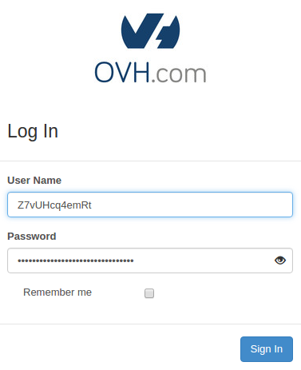

## Ziel

Der Zugriff auf Horizon und die OpenStack API erfolgt über Benutzername/Passwort-Kombinationen, die als "OpenStack User" bezeichnet werden. Sie können so viele OpenStack User wie nötig erstellen und ihnen verschiedene Zugriffsrechte zuweisen.

Mithilfe des Horizon-Interface kann jedem Benutzer ein Passwort zugewiesen werden. Beachten Sie, dass mit dem Ändern eines Benutzer-Passworts die bisherigen Login-Daten unmittelbar deaktiviert werden.

**Diese Anleitung erklärt, wie OpenStack-Benutzer über das OVHcloud Kundencenter und das Horizon-Interface verwaltet werden.**

<iframe class="video" width="560" height="315" src="https://www.youtube.com/embed/NC69nrb6QlA" title="YouTube video player" frameborder="0" allow="accelerometer; autoplay; clipboard-write; encrypted-media; gyroscope; picture-in-picture" allowfullscreen></iframe>

## Voraussetzungen

- Sie haben ein [Public Cloud Projekt](/pages/public_cloud/compute/create_a_public_cloud_project) in Ihrem OVHcloud Kunden-Account.
- Sie haben Zugriff auf Ihr [OVHcloud Kundencenter](/links/manager).

## In der praktischen Anwendung

### Erstellung eines OpenStack Benutzers

Loggen Sie sich in Ihrem OVHcloud Kundencenter ein und öffnen Sie Ihr `Public Cloud`{.action} Projekt. Klicken Sie auf `Users & Roles`{.action} im linken Menü unter "Project management". 

Klicken Sie auf den Button `Benutzer erstellen`{.action}.

{.thumbnail}

Die "Beschreibung des Benutzers", die Sie hier eingeben können ist nicht der Benutzername für den OpenStack User, sondern eine erläuternde Bezeichnung, um Ihnen bei der Organisation der Benutzer und deren Berechtigungen zu helfen. Geben Sie eine Beschreibung für den Benutzer ein und klicken Sie auf `Weiter`{.action}.

{.thumbnail}

Sie können nun Rollen auswählen, welche die Berechtigungen repräsentieren, die der Benutzer erhalten soll. Für jedes angehakte Feld erhält der Benutzer Zugriffsrechte gemäß der nachstehenden Tabelle.

{.thumbnail}

Klicken Sie auf `Bestätigen`{.action}, um den OpenStack Benutzer zu erstellen. Der Benutzername und das Passwort werden automatisch erzeugt und in Ihrem Kundencenter angezeigt.

{.thumbnail}

Achten Sie darauf, das Passwort, das nur zu diesem Zeitpunkt im grünen Rahmen angezeigt wird, in einem Passwortmanager zu speichern. Das Passwort kann später nicht mehr abgerufen werden. Sie können jedoch stets ein neues Passwort erstellen, indem Sie auf `...`{.action} klicken und `Passwort neu generieren`{.action} auswählen.

{.thumbnail}

Sobald der OpenStack User erstellt ist, können Sie seine Zugangsdaten für den Login zum [Horizon Interface](/pages/public_cloud/compute/introducing_horizon) verwenden, indem Sie im linken Menü auf den Eintrag `Horizon`{.action} klicken.

### Passwörter von OpenStack-Benutzern verwalten

Nachdem Sie sich bei [OpenStack Horizon](https://horizon.cloud.ovh.net){.external} eingeloggt haben, können Sie ein OpenStack-Passwort erstellen:

{.thumbnail}

Die Benutzerkennung für Horizon sehen Sie oben rechts im Horizon-Interface. Klicken Sie auf die Kennung, um im Menü alle Optionen zu sehen.  
Wählen Sie `Settings`{.action} und dann links `Change password`{.action}.

{.thumbnail}

Tragen Sie im ersten Feld Ihr aktuelles Passwort und in den beiden folgenden Feldern Ihr neues Passwort ein.

> [!primary]
>
> Beachten Sie beim Ändern des Passworts folgende Richtlinie:
>
> - Das Passwort muss mindestens 8 Zeichen umfassen.
> - Es darf maximal 30 Zeichen umfassen.
> - Es muss mindestens einen Großbuchstaben enthalten.
> - Es muss mindestens einen Kleinbuchstaben enthalten.
> - Es muss mindestens eine Zahl enthalten.
> - Es darf nur aus Zahlen und Buchstaben bestehen.
>

Bestätigen Sie anschließend das neue Passwort, indem Sie auf `Change`{.action} klicken.

{.thumbnail}

Beachten Sie, dass beim Ändern des Benutzerkonto-Passworts die bisherigen Login-Daten sofort gelöscht werden.

### Löschung eines OpenStack Benutzers

Sie können OpenStack Benutzer im [OVHcloud Kundencenter](/links/manager) löschen. Klicken Sie auf `Users & Roles`{.action} im linken Menü unter "Project management". 

{.thumbnail}

Klicken Sie auf `...`{.action} und wählen Sie `Löschen`{.action} aus.

> [!warning]
>
> Die Löschung eines Benutzers ist endgültig und führt zur Ungültigkeit aller zugehörigen Token, auch derjenigen, deren Ablaufdatum noch nicht überschritten ist.
> 

## Weiterführende Informationen

[Einführung in das Horizon Interface](/pages/public_cloud/compute/introducing_horizon)

Treten Sie unserer [User Community](/links/community) bei.
