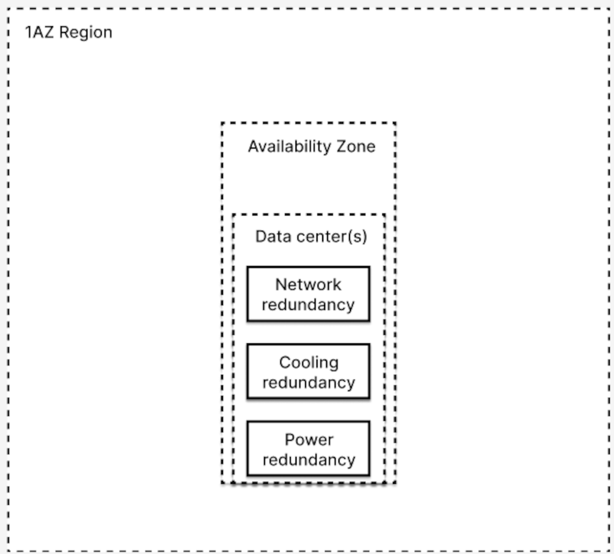
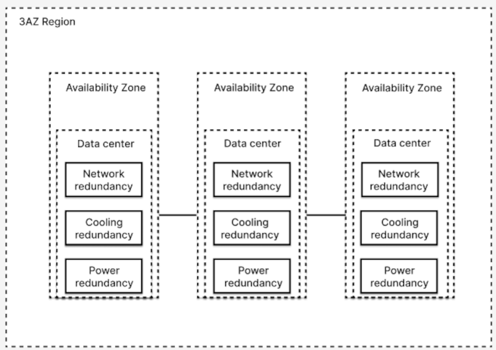
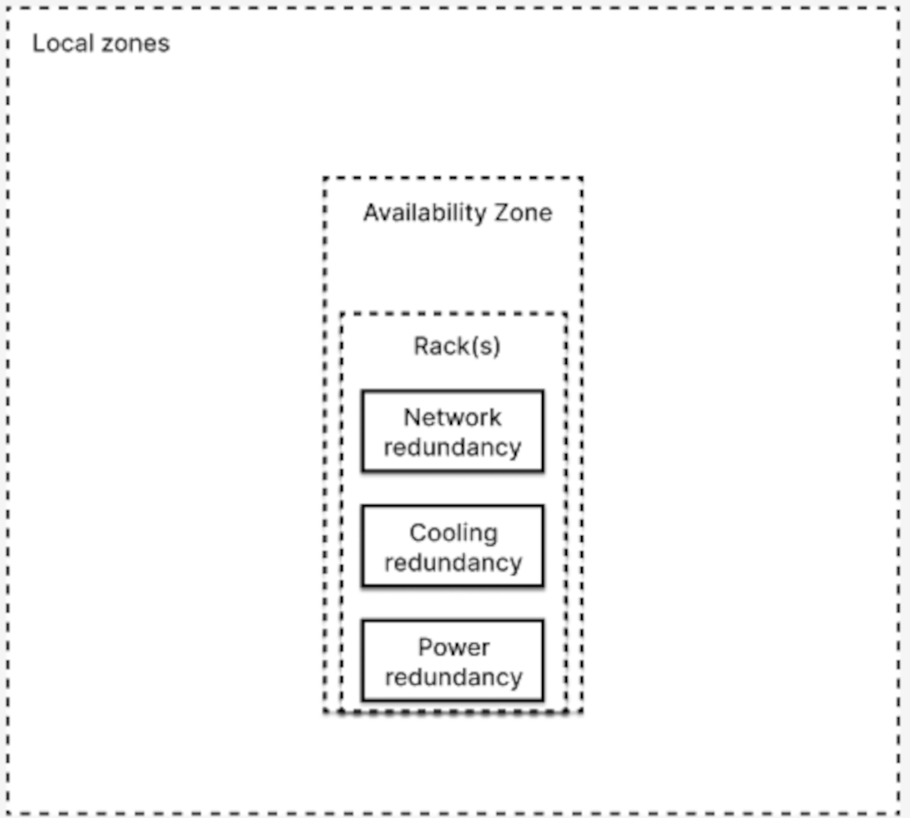

## Objectif

OVHcloud propose plusieurs modèles de déploiement répondant à des besoins divers en termes de résilience, de disponibilité, de performance et de latence. Ce guide fournit une vue d’ensemble des principales caractéristiques des options de déploiement disponibles : 1-AZ, 3-AZ et Local Zones. Il détaille leurs spécificités, avantages et limitations pour vous aider à faire les meilleurs choix stratégiques pour vos déploiements cloud.

En proposant une comparaison claire et détaillée, ce guide permettra aux utilisateurs de prendre une décision éclairée en fonction de leurs priorités spécifiques, qu'il s'agisse d'assurer une haute disponibilité pour les applications critiques, de minimiser les coûts tout en offrant une tolérance aux pannes, ou de répondre aux exigences de conformité locale et de latence ultra-faible.

En outre, nous mettrons en évidence les défis concrets auxquels les utilisateurs peuvent être confrontés, tels que l'impact sur la continuité des activités, l'évolutivité des services et la gestion des coûts dans chaque mode de déploiement. Ce guide est particulièrement utile pour les architectes cloud, les responsables informatiques et les développeurs qui cherchent à optimiser leur infrastructure en fonction de besoins commerciaux et techniques spécifiques.

## Concepts

Qu'est ce qu'une **AZ** ? 

Une Availability Zone (AZ) est une unité d'infrastructure composée d'un ou plusieurs centres de données isolés ou séparés, situés dans une région géographique spécifique où les services cloud publics sont hébergés et opérés

OVHcloud fournit une infrastructure robuste et adaptable, conçue pour répondre à une grande variété de cas d'utilisation grâce à des modèles de déploiement qui équilibrent rentabilité, redondance et tolérance aux pannes. Ces différentes options permettent aux utilisateurs de choisir l’approche la plus adaptée à leurs exigences en matière de résilience, de disponibilité et de performance.

1. **Région 1-AZ** : Ces régions à zone unique sont optimales pour les charges de travail où l’optimisation des coûts est prioritaire. Elles conviennent parfaitement aux besoins généraux tels que le stockage, la sauvegarde ou les applications dont les exigences en matière de disponibilité ne nécessitent pas une redondance multi-zones. Elles offrent un bon compromis entre fiabilité, performance et maîtrise des coûts.
2. **Région 3-AZ** : Ce modèle est conçu pour les applications critiques nécessitant une haute disponibilité et une résilience accrue. Grâce à la réplication des données sur trois zones de disponibilité distinctes, les régions 3-AZ réduisent significativement les risques de temps d’arrêt, garantissant une continuité d’activité même en cas d’incidents affectant une ou plusieurs zones. Ce niveau de redondance est particulièrement adapté aux environnements de production exigeants.
3. **Local Zones** : Ces infrastructures sont spécifiquement pensées pour répondre aux besoins nécessitant une latence ultra-faible ou des contraintes géographiques strictes. En plaçant les ressources à proximité des utilisateurs finaux, les Local Zones sont idéales pour des cas d’usage tels que l’informatique de pointe, les jeux vidéo, la diffusion de contenu ou encore les solutions nécessitant une conformité réglementaire locale.

Chacune de ces options repose sur les principes fondamentaux de résilience, de performance et de tolérance aux pannes.

## Modes de déploiement

> [!primary]
>
> OVHcloud propose plusieurs modèles de déploiement régionaux, conçus pour répondre aux besoins variés des entreprises en offrant différents niveaux de redondance, de tolérance aux pannes et de distribution géographique. Ces options assurent flexibilité, évolutivité et résilience, permettant aux clients d’aligner leur infrastructure sur leurs priorités opérationnelles et stratégiques.

### Région 1-AZ

#### Infrastructure et redondance

Une région 1-AZ consiste en **une zone de disponibilité unique composée de un ou plusieurs centres de données dans une même région géographique**. Elle utilise une architecture de redondance 2N+1, conçue pour garantir la résilience contre les défaillances matérielles locales, telles que les pannes de disques ou de serveurs. Cependant, cette configuration reste vulnérable aux pannes affectant l'ensemble du centre de données.

Les services et les données sont protégés contre les incidents localisés grâce à une redondance interne efficace, mais une panne majeure ou totale d'un centre de données pourrait compromettre la disponibilité des services. Notez que chaque centre de données OVHcloud dispose d'une alimentation électrique et d'un réseau redondants pour éviter ces pannes.

{.thumbnail}

> [!info]
>
> Dans une région 1AZ, vos instances ou autres ressources peuvent être réparties sur plusieurs centres de données au sein de la même zone de disponibilité. Cette architecture permet de bénéficier d’une redondance locale, tout en restant dans une seule et même zone de disponibilité.

#### Caractéristiques

- **Erasure Coding :** met en œuvre des mécanismes tels que la réplication ou l'*erasure coding* (en fonction du service) pour assurer la continuité en cas de défaillance matérielle. Les données sont réparties sur plusieurs serveurs et unités de stockage au sein de la zone de disponibilité afin d'atténuer l'impact de problèmes localisés.
- **Coût optimisé :** Ce modèle de déploiement est économique et idéal pour les charges de travail générales, les environnements de développement et les sauvegardes. Il donne la priorité à l'accessibilité financière par rapport à la tolérance aux pannes améliorée fournie par les configurations multi-AZ.
- **Simplicité opérationnelle** : Une zone de disponibilité unique facilite la gestion tout en offrant une tolérance minimale aux pannes internes.

#### Limites

- **Risque de panne :** La dépendance à une seule zone de disponibilité peut affecter les services critiques si le centre de données subit une panne complète.
- **Redondance régionale absente** : Contrairement aux déploiements multi-AZ, il n'y a pas de réplication des données ou services entre différentes zones de disponibilité dans la région.

> [!success]
>
> Pour améliorer la résilience des applications critiques dans une région 1-AZ, envisagez d'utiliser la réplication asynchrone pour une protection accrue. Cela permet de renforcer la résilience des applications et des données. Une autre option pour atténuer ce risque consiste à utiliser un [**mode de déploiement 3-AZ**](#3azregion).

#### Spécifications de redondance - Région 1-AZ

| Spécification         | Description                                                               |
|-------------------|---------------------------------------------------------------------------|
| **Type de redondance**   | Redondance au niveau de l'infrastructure (alimentation, réseau et refroidissement).   Réplication locale des données à l'intérieur de la zone pour assurer la résilience.                                       |
| **Tolérance aux pannes**   | Protège contre les pannes de disques et de serveurs, mais pas contre une panne totale d'un centre de données.           |
| **Protection des données** | Données répliquées à l'intérieur de l'AZ pour garantir la résilience locale.                                    |
| **Limites** | Pas de protection inter-régions ou inter-Zones ; dépend d'une seule AZ.                                    |

#### Mise à l'échelle

Dans une région 1-AZ, les options de mise à l'échelle sont quelque peu limitées en raison de l'existence d'une seule zone de disponibilité. Voici comment fonctionne la mise à l'échelle dans cette configuration :

- **Mise à l'échelle verticale :** Augmenter la capacité des ressources existantes (CPU, mémoire) est une solution courante, mais elle ne garantit pas une tolérance accrue aux pannes.
- **Mise à l'échelle horizontale :** Bien que possible à l'intérieur de l'AZ, elle ne permet pas de bénéficier d'une redondance entre plusieurs zones de disponibilité.
- **Contrainte géographique :** Toutes les ressources restent confinées dans une même zone de disponibilité.

#### Exemple d'architecture

/// details | Application de gestion interne

> [!primary]
>
> **Scénario:**
>
> Une organisation utilise le mode Region 1-AZ pour son application de gestion interne et ses services de sauvegarde. Cette configuration est idéale pour les applications qui ne nécessitent pas une haute disponibilité 24 heures sur 24 et 7 jours sur 7, mais qui ont besoin d'une redondance pour se protéger contre les défaillances matérielles.

Architecture:

- **Zone de disponibilité unique (AZ) :** Composée de plusieurs centres de données interconnectés, elle garantit la résilience face aux pannes localisées tout en s'inscrivant dans un modèle adapté à des besoins d'application modérés.
- **Réplication interne :** Les données sont répliquées en interne pour se prémunir contre les pannes de disque ou de serveur dans la zone.
- **Intégration des sauvegardes :** L'application utilise l'object storage pour des sauvegardes régulières, ce qui garantit que les données peuvent être restaurées en cas de besoin.
- **Instances :** Les tâches applicatives de base sont gérées par des instances de calcul dans le même AZ, avec une mise à l'échelle automatique pour la gestion des ressources.

///

### Région 3-AZ

#### Infrastructure et redondance

> [!warning]
>
> Le déploiement d'instances dans une configuration 3AZ nécessite une intervention manuelle pour la configuration de chaque instance. Assurez-vous de configurer correctement chaque instance dans les zones de disponibilité respectives pour garantir une répartition et une redondance optimales.

La Région 3-AZ consiste en **trois zones de disponibilité indépendantes** et distinctes, conçues selon des normes strictes de séparation. Chaque zone dispose de systèmes d'alimentation, de refroidissement et de réseau isolés, garantissant une véritable isolation des pannes. Ces zones sont géographiquement réparties à une distance optimisée ( 30 km ) pour prévenir tout impact d’un sinistre régional sur plusieurs zones simultanément.

Cette configuration assure une haute disponibilité des services, même en cas de défaillance complète d’une zone de disponibilité. Grâce à cette séparation, l’architecture permet une réplication efficace des données et des services entre les zones, tout en maintenant une faible latence pour garantir une performance optimale des applications. Ainsi, si une zone tombe en panne, les autres continuent à traiter le trafic et à maintenir les performances.

{.thumbnail}

#### Caractéristiques

- **Haute disponibilité :** Les données restent disponibles pour les opérations de lecture et d'écriture, même en cas de défaillance d'une zone. Cette architecture est idéale pour les applications nécessitant une tolérance aux pannes, car les données sont répliquées dans les trois zones de disponibilité. Même en cas d'interruption dans une zone, la continuité des services régionaux est maintenue. Les services zonaux peuvent être exploités pour une haute disponibilité.
- **Isolation des pannes :** Chaque zone de disponibilité est indépendante en termes d'alimentation, de réseau et de refroidissement, ce qui signifie que les problèmes d'une zone n'auront pas d'impact direct sur les autres. Cela permet d'atteindre un niveau de redondance plus élevé et de minimiser les interruptions de service.
- **Latence optimisée :** La faible latence entre les zones garantit des communications rapides et fiables, optimales pour des charges de travail exigeantes.

#### Limites

- **Coût plus élevé :** Cette configuration exige un investissement initial plus important, en raison de la duplication des services et de la mise en place de mécanismes de réplication inter-zones.
- **Non résilient à une panne régionale complète :** Bien que robuste face à des pannes locales, une Région 3-AZ ne garantit pas de tolérance en cas de panne affectant l’ensemble de la région.
- **Complexité de gestion :** Les charges de travail doivent être conçues pour tirer parti de cette architecture, ce qui peut nécessiter une expertise et des efforts supplémentaires.

#### Spécifications de redondances - Région 3-AZ

| Spécification         | Description                                                               |
|-------------------|---------------------------------------------------------------------------|
| **Type de redondance**      | Redondance au niveau de l'infrastructure (alimentation, réseau et refroidissement) et réplication inter-zones* sur 3 sites distincts selon le modèle 3AZ, garantissant une disponibilité accrue et une tolérance aux pannes.   Réplication des données inter-zone pour la résilience.                                 |
| **Tolérance aux pannes** | Garantit la résilience contre la perte d'une zone entière, avec basculement automatique.                      |
| **Protection des données** | Données répliquées de manière synchrone entre les zones pour garantir leur disponibilité continue. |
| **Limites** | Ne protège pas contre une panne complète de la région ; nécessite une architecture multirégionale pour une résilience maximale. |

<!-- schema -->

***réplication inter-zones** :

Dans cette architecture, les ressources sont triplées (3N) et réparties entre trois zones de disponibilité (AZ) distinctes. Les données sont répliquées de manière synchrone entre les zones, garantissant une résilience totale contre la perte d'une zone entière grâce au basculement automatique. Cependant, cette architecture ne protège pas contre une panne régionale complète.

#### Mise à l'échelle

Dans une Région 3-AZ, la mise à l'échelle est plus flexible, offrant la possibilité d'une mise à l'échelle horizontale sur plusieurs zones de disponibilité. Voici ce à quoi vous pouvez vous attendre :

- **Mise à l'échelle horizontale optimisée :** Grâce à la réplication et à la distribution des services dans trois zones indépendantes, la mise à l'échelle horizontale devient plus transparente, garantissant une haute disponibilité, des performances optimales et une distribution efficace des ressources.
- **Équilibrage optimisé de la charge :** Avec plusieurs zones de disponibilité, l'équilibrage de la charge et la distribution du trafic sont optimisés, ce qui garantit de meilleures performances et une plus grande résilience.
- **Résilience accrue :** Les capacités de mise à l'échelle entre les zones permettent de répondre à une demande croissante tout en maintenant une tolérance aux pannes.

#### Exemple d'architecture

/// details | Plateforme de e-commerce

> [!primary]
>
> **Scénario:**
>
> Une plateforme de commerce électronique qui exige une disponibilité et des performances élevées. Ce mode de déploiement assure la continuité du service même en cas de défaillance d'une zone de disponibilité entière.

Architecture:

- **Trois zones de disponibilité (AZs) :** Chaque zone est géographiquement isolée pour éviter tout impact d'un sinistre local.
- **Réplication des données :** Réplication synchrone des données entre les trois zones pour garantir leur disponibilité continue.
- **Instances réparties :** Les instances applicatives sont déployées dans chaque zone, assurant la redondance et la haute disponibilité.
- **Load balancers :** Les Load balancers gèrent le trafic utilisateur en répartissant les requêtes entre les zones, même en cas de panne.
- **Sauvegardes régionales :** Les sauvegardes sont externalisées dans une solution S3 régionale pour protéger contre une perte totale des données.

///

### Local Zones

#### Infrastructure et conception

Les Local Zones rapprochent les services OVHcloud de certains utilisateurs finaux en réduisant la latence et en permettant le traitement des données localement. Elles sont conçues pour offrir des performances optimales pour les applications nécessitant une faible latence et une proximité avec les utilisateurs, tout en répondant aux exigences de conformité locale.

Chaque Local Zone fonctionne comme une zone de disponibilité unique avec un ensemble limité de services., ce qui la rend idéale pour les scénarios où la latence est une priorité, mais où une redondance multi-AZ n'est pas essentielle.

{.thumbnail}

#### Caractéristiques

- **Réduction de la latence :** Les Local Zones garantissent des temps de réponse rapides aux utilisateurs qui en sont proches, ce qui est idéal pour les applications en temps réel telles que les jeux en ligne ou les vidéoconférences.
- **Conformité locale :** Les données peuvent être traitées et stockées dans des emplacements spécifiques, facilitant ainsi le respect des exigences de localisation et de réglementation.
- **Extension régionale :** Les Local Zones peuvent être utilisées comme une extension des régions 1-AZ ou 3-AZ pour exécuter les charges de travail critiques localement, tout en bénéficiant des services supplémentaires disponibles dans les régions.

#### Limites

- **Absence de redondance inter-zones :** Contrairement aux régions multi-AZ, les Local Zones ne proposent pas de redondance entre plusieurs zones, ce qui limite la continuité des services en cas de panne.
- **Limitation à une seule zone :** Les Local Zones opèrent dans une seule zone de disponibilité, ce qui les rend vulnérables aux défaillances locales.
- **Ensemble limité de services:** Les Local Zones n'offrent qu'un ensemble limité de services Public Cloud (Compute et Storage).

#### Spécifications de redondances - Local Zones

| Avantage        | Description                                           |
|------------------|-------------------------------------------------------|
| **Type de redondance**      | Redondance au niveau de l'infrastructure (alimentation, réseau et refroidissement).   Réplication locale des données à l'intérieur de la zone pour assurer la résilience.            |
| **Tolérance aux pannes**  |  Garantit la continuité des opérations en cas de panne de disque ou de serveur au sein de la zone, mais ne protège pas contre une panne totale de la zone de disponibilité. |
| **Protection des données**| Données répliquées dans la zone pour garantir leur disponibilité locale. |
| **Limites**| Pas de protection contre les pannes globales ou régionales, dépend d’une seule Local Zone. |

<!-- schema -->

#### Mise à l'échelle

Dans les Local Zones, la mise à l'échelle est conçue pour répondre aux exigences des applications à faible latence tout en étant limitée à une seule zone de disponibilité. Voici comment la mise à l'échelle est structurée :

- **Options de scalabilité horizontale et verticale :** Les Local Zones prennent en charge la mise à l'échelle des instances, mais restent limitées par la capacité locale et l'absence de zones supplémentaires pour équilibrer la charge.
- **Latence ultra-faible :** La mise à l'échelle est centrée sur le maintien d'une latence minimale, idéale pour les charges de travail temps réel.
- **Planification nécessaire :** En raison de la limitation à une seule zone, une planification rigoureuse est indispensable pour éviter la saturation des ressources disponibles et garantir des performances stables.

#### Exemple d'architecture

/// details | Plateforme de jeux en ligne

> [!primary]
>
> **Scenario:**
>
> Plate-forme de jeux en ligne en temps réel qui nécessite une latence ultra-faible et des performances élevées pour les utilisateurs d'une région géographique spécifique.

Architecture:

- **Local Zones :** Situées à proximité de la base d'utilisateurs, ce qui permet de réduire considérablement la latence et d'améliorer les performances globales.
- **Réplication interne :** Les données critiques sont répliquées localement dans la zone pour garantir la résilience face aux pannes matérielles.
- **Traitement localisé :** Les serveurs d'applications et de traitement sont déployés dans les Local Zones pour offrir des performances optimales.
- **Données réglementées :** Stockées dans les Local Zones pour respecter les lois sur la localisation des données, ce qui réduit les coûts de la bande passante.
- **Load balancers :** Le trafic est redirigé vers d'autres Local Zones (si elles sont disponibles) ou régions afin d'assurer une continuité de service minimale en cas de défaillance locale.

///

### Comparaison des modes de déploiement

| Caractéristiques        | Région 1-AZ                         | Région 3-AZ                     | Local Zones                              |
|------------------------|-------------------------------------|---------------------------------|------------------------------------------|
| **Structure de déploiement**   | Zone de disponibilité unique            | Trois zones indépendantes | Zone de disponibilité unique               |
| **service disponible** | Tous ou la plupart des services Public Cloud | Tous ou la plupart des services Public Cloud | La plupart des services Compute et Storage
| **Redondance**             | Redondance sur l'infrastructure et réplication locale des données | Redondance inter-zones (ressources répliquées entre zones) et réplication inter-zones des données | Redondance sur l'infrastructure et réplication locale des données |
| **Disponibilité des données**      | Limitée pendant les pannes du centre de données, protégée contre les pannes de serveur/disque | Maintenue dans toutes les zones, résiliente aux pannes de zone | Limitée pendant les pannes du centre de données, protégée contre les pannes de serveur/disque |
| **Latence**                | Faible pour les utilisateurs finaux proches                            | Faible pour les utilisateurs finaux proches et très faible entre les zones de disponibilité   | Faible pour les utilisateurs finaux proches |
| **Cas d'utilisation**        | Développement, environnements de transition, applications sensibles aux coûts, services non critiques | Applications à haute disponibilité, services commerciaux essentiels, reprise après sinistre et charges de travail critiques | Applications en temps réel, informatique de pointe, jeux, flux vidéo, services conformes à la réglementation |
| **Coût**                   | Optimisé                               | Plus élevé en raison de la redondance accrue | Dépend des Local Zones spécifiques |

## Aller plus loin

Si vous avez besoin d'une formation ou d'une assistance technique pour la mise en œuvre de nos solutions, contactez votre commercial ou cliquez sur [ce lien](/links/professional-services) pour obtenir un devis et une analyse personnalisée de votre projet.

Échangez avec notre [communauté d'utilisateurs](/links/community) et notre communauté sur [Discord](https://discord.gg/ovhcloud).
