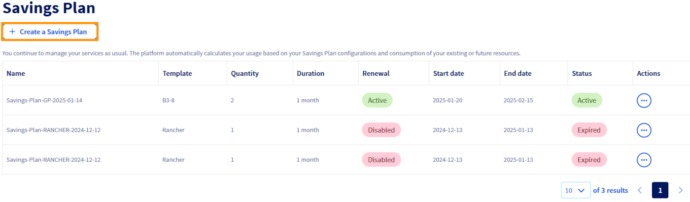
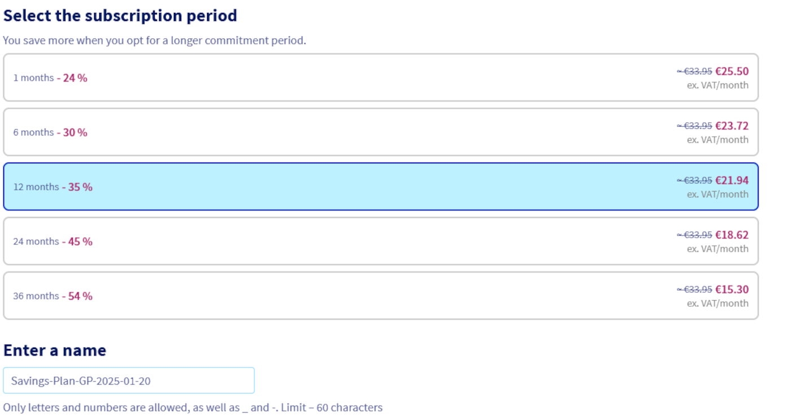
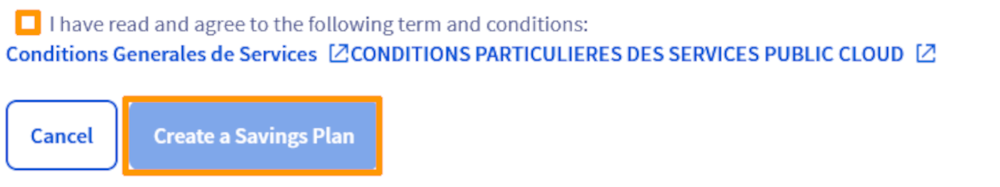

## Objectifs

Ce guide a pour objectif de fournir une méthode claire et détaillée pour la création et la mise à jour des Savings Plans pour vos ressources. Vous découvrirez comment gérer vos Savings Plans en utilisant l'espace client OVHcloud, l'API, ainsi que Terraform. En suivant ce guide, vous serez en mesure de :

- Créer un savings plan pour vos ressources. 
- Modifier un savings plan.
- Automatiser la gestion des Savings Plans via l'API ou Terraform pour une plus grande efficacité et flexibilité.

### Requirements

- Accès à l'[API OVHcloud](https://api.ovh.com/) (créez vos identifiants en consultant [ce guide](/pages/manage_and_operate/api/first-steps))
- Un [projet Public Cloud OVHcloud](https://www.ovhcloud.com/fr/public-cloud/) dans votre compte OVHcloud.
- Accès à votre [espace client OVHcloud](https://www.ovh.com/auth/?action=gotomanager&from=https://www.ovh.com/fr/&ovhSubsidiary=fr) ou à l'[API OVHcloud](https://api.ovh.com/)   
- Connaître [Terraform] (/pages/public_cloud/compute/how_to_use_terraform) si vous souhaitez l'utiliser.
- Connaitre les principes d'un [savings plan](...)

## En pratique

Connectez-vous à votre [espace client OVHcloud] (https://www.ovh.com/auth/?action=gotomanager&from=https://www.ovh.com/fr/&ovhSubsidiary=fr) et passez à la section `Public Cloud`{.action}. Après avoir sélectionné votre projet Public Cloud, cliquez sur `Savings Plans`{.action} dans la barre de navigation de gauche sous **Project Management**.

### Créer un savings plan

Vous pouvez créer votre savings plan pour le type de ressource voulue en suivant ces étapes :

> [!tabs]
> Via Espace client OVHcloud
>> Cliquez sur le bouton `Create a Savings Plan`{.action}.
>>
>> {.thumbnail}
>>
>> Sélectionnez le type de ressource pour lequel le Savings Plan s'appliquera, définissez le modèle spécifique de ressource et indiquez le nombre de ressources concernées par ce plan.
>>
>> {.thumbnail}
>>
>> Choisissez la durée de votre Savings Plan parmi les durées disponibles et écrivez le nom de celui-ci. 
>>
>> {.thumbnail}
>>
>> Lisez attentivement les termes et conditions, puis cochez la case pour confirmer votre acceptation. connaissances de ceux-ci. Une fois tous les paramètres configurés, cliquez sur le bouton `Create a Savings Plan`{.action} pour finaliser la création.
>>
>> {.thumbnail}
>>
> Via API
>> Pour créer un Savings plan, utilisez la route suivante :
>> > [!api]
>> >
>> > @api {v1} /services 
> Via Terraform
>> Pour créer un Savings plan, vous aurez besoin de 5 éléments minimum :
>> 
>> * L'ID de votre projet public cloud.
>> * La flavor concerné par votre Savings Plan
>> * La durée de votre Savings Plan ( au format standard ISO 8601 )
>> * Le nombre de ressources concernées.
>> * Le nom de votre Savings Plan
>>
>> Dans notre exemple, nous allons créer un Savings Plan pour 10 instances de type **b3-8**, pour une durée de 1 mois. Ajoutez les lignes suivantes à un fichier nommé *savings_plan.tf* :
>>
>> ```python
>> # creation of a Savings Plan
>> resource "ovh_savings_plan" "savings_plan_b3_8" {
>>   service_name = "<public cloud project ID>"
>>   flavor = "B3-8"
>>   period = "P1M" # P obligatoire, chiffre pour la durée et M pour "mois", Y pour "year" ..
>>   size = 10
>>   display_name = "Savings_plan_simple_b3_8"
>>   auto_renewal = true # optionnel, "true" pour activer.
>> }
>> ```
>>
>> Vous pouvez créer votre Savings Plan en entrant la commande suivante dans votre console :
>>
>> ```console
>> terraform apply
>> ```
>>
>> The output should look like this:
>> 
>> ```console
>> $ terraform apply
>> 

### Modifier un Savings plan

## Go further

Join our [community of users](/links/community).
