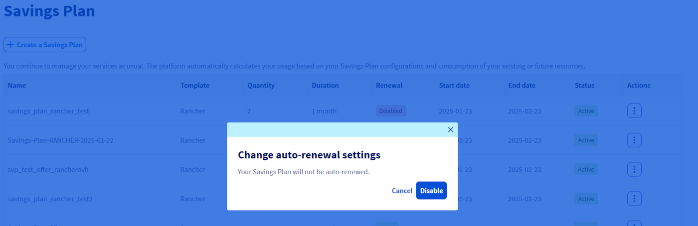
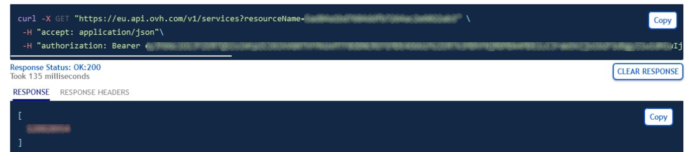
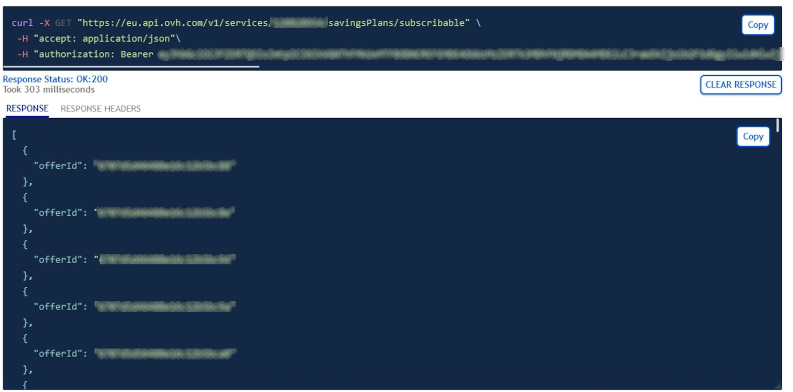

<style>
details>summary {
    color:rgb(33, 153, 232) !important;
    cursor: pointer;
}
details>summary::before {
    content:'\25B6';
    padding-right:1ch;
}
details[open]>summary::before {
    content:'\25BC';
}
</style>

## Objectifs

Ce guide a pour objectif de fournir une méthode claire et détaillée pour la création et la mise à jour des Savings Plans pour vos ressources. Vous découvrirez comment gérer vos Savings Plans en utilisant l'espace client OVHcloud, l'API, ainsi que Terraform. En suivant ce guide, vous serez en mesure de :

- Créer un savings plan pour vos ressources. 
- Modifier un savings plan.
- Automatiser la gestion des Savings Plans via l'API ou Terraform pour une plus grande efficacité et flexibilité.

### Requirements

- Accès à l'[API OVHcloud](https://api.ovh.com/) (créez vos identifiants en consultant [ce guide](/pages/manage_and_operate/api/first-steps))
- Un [projet Public Cloud OVHcloud](https://www.ovhcloud.com/fr/public-cloud/) dans votre compte OVHcloud.
- Accès à votre [espace client OVHcloud](https://www.ovh.com/auth/?action=gotomanager&from=https://www.ovh.com/fr/&ovhSubsidiary=fr) ou à l'[API OVHcloud](https://api.ovh.com/)   
- Connaître [Terraform] (/pages/public_cloud/compute/how_to_use_terraform) si vous souhaitez l'utiliser.
- Connaitre les principes d'un [savings plan](...)

## En pratique

Connectez-vous à votre [espace client OVHcloud] (https://www.ovh.com/auth/?action=gotomanager&from=https://www.ovh.com/fr/&ovhSubsidiary=fr) et passez à la section `Public Cloud`{.action}. Après avoir sélectionné votre projet Public Cloud, cliquez sur `Savings Plans`{.action} dans la barre de navigation de gauche sous **Project Management**.

### Créer un Savings plan

Vous pouvez créer votre avings plan pour le type de ressource voulue en suivant ces étapes :

> [!tabs]
> Via Espace client OVHcloud
>> Cliquez sur le bouton `Create a Savings Plan`{.action}.
>>
>> {.thumbnail}
>>
>> Sélectionnez le type de ressource pour lequel le Savings Plan s'appliquera, définissez le modèle spécifique de ressource et indiquez le nombre de ressources concernées par ce plan.
>>
>> {.thumbnail}
>>
>> Choisissez la durée de votre Savings Plan parmi les durées disponibles et écrivez le nom de celui-ci. 
>>
>> {.thumbnail}
>>
>> Lisez attentivement les termes et conditions, puis cochez la case pour confirmer votre acceptation. connaissances de ceux-ci. Une fois tous les paramètres configurés, cliquez sur le bouton `Create a Savings Plan`{.action} pour finaliser la création.
>>
>> {.thumbnail}
>>
> Via Terraform
>> Pour créer un Savings plan, vous aurez besoin de 5 éléments minimum :
>> 
>> * L'ID de votre projet Public Cloud.
>> * La flavor concerné par votre Savings Plan
>> * La durée de votre Savings Plan ( au format standard ISO 8601 )
>> * Le nombre de ressources concernées.
>> * Le nom de votre Savings Plan
>>
>> Dans notre exemple, nous allons créer un Savings Plan pour 10 instances de type **b3-8**, pour une durée de 1 mois. Ajoutez les lignes suivantes à un fichier nommé *savings_plan.tf* :
>>
>> ```python
>> # creation of a Savings Plan
>> resource "ovh_savings_plan" "Savings_plan_simple_b3_8" {
>>   service_name = "<public cloud project ID>"
>>   flavor = "b3-8" # type de l'instance ou rancher/rancher_standard ou rancher_ovhcloud_edition
>>   period = "P1M" # P obligatoire, chiffre pour la durée et M pour "mois", Y pour "year" ..
>>   size = 10
>>   display_name = "Savings_plan_simple_b3_8"
>>   auto_renewal = true # optionnel, "true" pour activer.
>> }
>> ```
>>
>> Vous pouvez créer votre Savings Plan en entrant la commande suivante dans votre console :
>>
>> ```console
>> terraform apply
>> ```

### Modifier un Savings plan

> [!tabs]
> Via Espace client OVHcloud
>> > [!info]
>> >
>> > Les options modifiables via l'Espace client OVHcloud se limitent au **nom** et à **l'activation/désactivation** du renouvellement automatique du Savings Plan.
>>
>> {.thumbnail}
>>
>> Si vous souhaitez modifier le nom, cliquez sur le bouton `Modifier le nom`{.action}, changez le puis cliquez sur `Comfirmer`{.action}.
>>
>> {.thumbnail}
>>
>> Si vous souhaitez activer/désactiver le renouvellement automatique de votre Savings Plan, cliquez sur le bouton `Activer/Dés le renouvellement automatique`{.action} puis sur le bouton `Activer`{.action} / `Désactiver`{.action} selon votre cas.
>>
>> {.thumbnail}
>>
> Via API
>> Retrouver d'abord l'id de votre service dans la liste de vos service qui s'obtient via l'API :
>>
>> > [!api]
>> >
>> > @api {v1} /services GET /services
>> >
>> > Dans laquelle vous devez inscrire en paramètre, dans le champs **resourceName** l'id de votre projet Public Cloud.
>>
>> Vous obtenez une liste contenant l'id de vos services comme suit :
>>
>> {.thumbnail}
>>
>> Vous pouvez vérifier si le service correspond au projet Public Cloud concerné via cette route :
>>
>> > [!api]
>> >
>> > @api {v1} /services GET /services/{serviceId}
>> >
>> > Avec **serviceId** correspond à l'id récupéré dans la route précedente.
>>
>> Vous obtenez une liste contenant l'id de vos services comme suit :
>>
>> {.thumbnail}
>>
>> Cherchez ensuite le service concerné dans la liste et copier l'**id**.
>>
>> Vous pouvez retrouver l'id de votre Savings Plan dans la liste de vos Savings Plan qui s'obtient via l'API :
>>
>> > [!api]
>> >
>> > @api {v1} /services GET /services/{serviceId}/savingsPlans/subscribed
>> >
>> > Avec **serviceId** correspondant à l'id récupéré précedemment.
>>
>> Vous obtenez une liste de Savings Plan comme suit :
>>
>> {.thumbnail}
>>
>> Cherchez ensuite le Savings Plan concerné dans la liste et copier le champs **id**.
>>
>> /// details | Modifier le nom d'un Savings Plan
>>
>> Pour modifier le nom d'un Savings plan, utilisez la route suivante :
>>
>> > [!api]
>> >
>> > @api {v1} /services PUT /services/{serviceId}/savingsPlans/subscribed/{savingsPlanId}
>> >
>> > Avec **savingsPlanId** correspondant à l'id de votre Savings Plan copié précedemment.
>>
>> ///
>>
>> /// details | Activer/désactiver le renouvellement automatique d'un Savings Plan
>>
>> Pour **activer/désactiver** le renouvellement automatique du Savings Plan, utilisez la route suivante :
>>
>> > [!api]
>> >
>> >  @api {v1} /services POST /services/{serviceId}/savingsPlans/subscribed/{savingsPlanId}/changePeriodEndAction
>>
>> ///
>>
>> /// | Augmenter le nombre de ressources d'un Savings Plan
>>
>> Pour augmenter le nombre de ressources souscrites par votre Savings Plan, utilisez cette route :
>>
>> > [!info]
>> >
>> > Le nombre de ressources peut uniquement être augmenté.
>>
>> > [!api] 
>> >
>> > @api {v1} /services POST /services/{serviceId}/savingsPlans/subscribed/{savingsPlanId}/changeSize
>>
>> ///
>>
> Via Terraform
>> Modifier votre ressource dans le fichier Terraform *savings_plan.tf* précedemment crée.
>>
>> > [!info]
>> >
>> > A noter que seul les champs **service_name**, **size** et **auto_renewal** sont modifiables avec **size** qui peut seulement être augmenté.

## Go further

Join our [community of users](/links/community).
