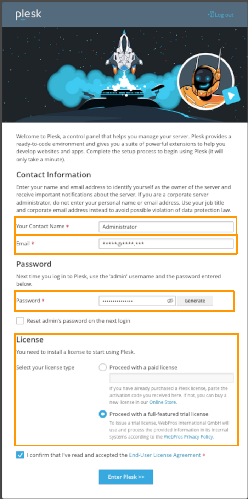

## Objective

Plesk is an easy-to-use hosting control panel. You can install and use it on OVHcloud Public Cloud instances.

**Find out how to install Plesk on an OVHcloud Public Cloud instance.** 

> [!warning]
> 
> OVHcloud provides services which you are responsible for.  In fact, as we do not have administrative access to these machines, we are not administrators and we cannot provide you with support. This means that it is up to you to manage the software and security daily.
>
> We have provided you with this guide in order to help you with common tasks. However, we advise contacting a specialist provider if you experience any difficulties or doubts about administration, usage or server security. Feel free to visit our [community forum](/links/community) to interact with other users.
>

## Requirements

- [An instance created via the OVHcloud Control Panel](/pages/public_cloud/compute/create_a_public_cloud_project)
- [Administrative access to the instance](/pages/public_cloud/compute/public-cloud-first-steps#connect-instance)

## Instructions

### Step 1: Install Plesk.

Plesk can be installed easily via an SSH connection. To do this, download and launch the Plesk installation script using the command that best suits your situation below.

> [!primary]
>
> Depending on your instance's OS, the sudo command alone may not be sufficient. If you encounter an error, switch to superuser mode before starting the installation:
>
> ```bash
> sudo su
> ```
>

- **For a default, non-custom Plesk installation**:

```bash
sudo sh <(curl https://autoinstall.plesk.com/one-click-installer || wget -O - https://autoinstall.plesk.com/one-click-installer)
```

- **For a custom Plesk installation**:

```bash
sudo sh <(curl https://autoinstall.plesk.com/plesk-installer || wget -O - https://autoinstall.plesk.com/plesk-installer)
```

Then wait for the installation process to complete. 

### Step 2: Finalize configuration and add a license

Once the installation is complete, the command-line interface (CLI) will display the following information:

- Two URLs are generated:
    - One with the server’s IP address (HTTPS with a self-signed SSL certificate, which may trigger a security warning in most browsers).
    - Another with a Plesk domain (HTTPS with a signed SSL certificate, which will not trigger any warnings).
    - Both are secure, but it is recommended to use the second one.
- A message states: "You can also log in as 'root' using your 'root' password.". However, by default, no root password is generated. If needed, customers can follow [this guide](/pages/bare_metal_cloud/dedicated_servers/changing_root_password_linux_ds) to enable the root user and set a password.

Once on the Plesk page, follow the on-screen instructions to complete the setup.

{.thumbnail}

To add your Plesk licence, take the key that was sent to you by your service provider.

> [!primary]
>
> We do not sell Plesk licences for our Public Cloud solutions. However, you can order one from the [Plesk](https://www.plesk.com/){.external} website.
>

Want to change your licence, to replace a test key or change your solution, for example? From the Plesk interface, go to the section `Tools & Settings`{.action}. Then go to the **Plesk** section, and select `License information`{.action}.

## Go further

[Official Plesk documentation](https://docs.plesk.com/en-US/obsidian/){.external}.

Join our [community of users](/links/community).