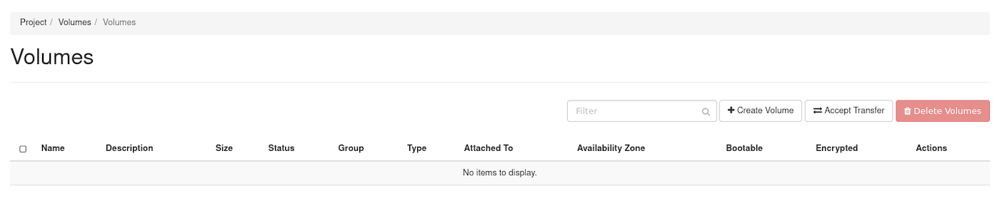
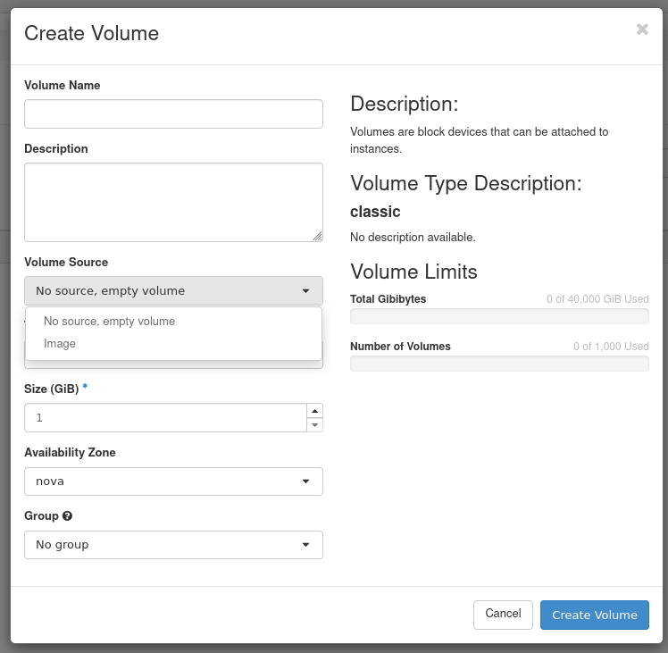
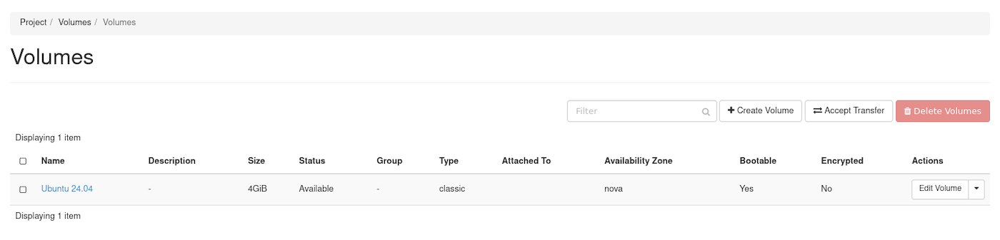
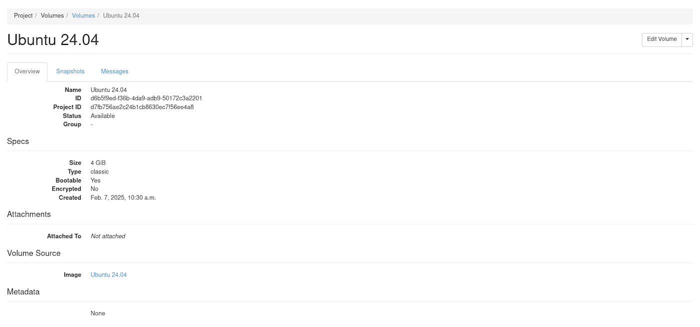
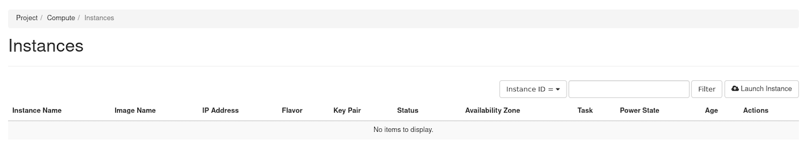
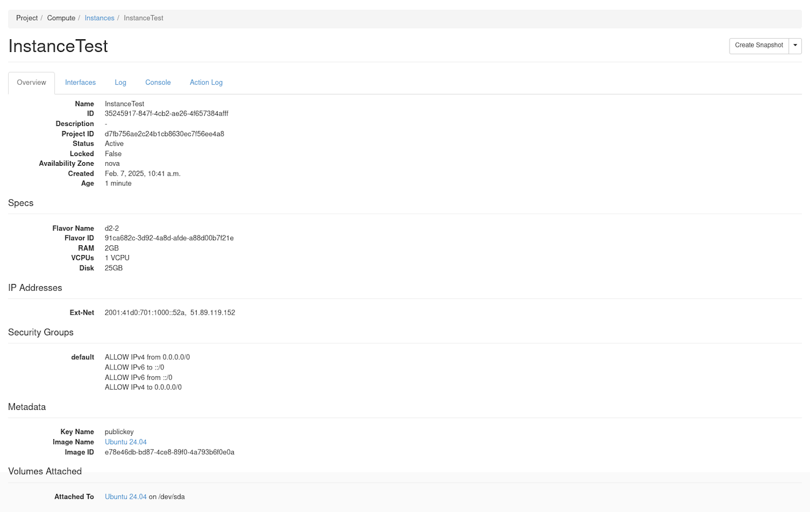

## Obiettivo

Le istanze Public Cloud vengono consegnate con un disco di origine copiato a partire da un'immagine di sistema (Debian 12, Windows Server, etc.). È inoltre possibile utilizzare volumi aggiuntivi, dischi persistenti che permettono di archiviare dati.

È inoltre possibile distribuire un sistema operativo da e verso un volume. L’istanza Public Cloud si avvierà quindi su questo volume al posto del disco originale.

**Questa guida ti mostra come avviare un’istanza su un volume associato.**

{.thumbnail}

> [!success]
>
> OpenStack ti permette di iniziare da un volume.
> Rendere avviabile il volume e avviare l'istanza da esso.
> Le modifiche comportano la scomparsa del disco originale man mano che il nuovo volume viene sostituito.
> Le funzionalità descritte in questa guida eliminano la necessità di accedere al disco originale e sfruttano al meglio il volume.

> [!warning]
>
> Con la versione attuale di OpenStack, la modalità rescue-pro non è disponibile su un’istanza avviata tramite un volume avviabile.
>

## Prerequisiti

- [Accesso all’interfaccia Horizon](/pages/public_cloud/compute/introducing_horizon)
- [Carica variabili d’ambiente OpenStack](/pages/public_cloud/compute/loading_openstack_environment_variables)

## Procedura

### Creazione di un volume di avvio da un'immagine.

> [!tabs]
> **Horizon**
>> Accedi all’[interfaccia Horizon](https://horizon.cloud.ovh.net/auth/login/).
>>
>> Selezionate la regione appropriata dal menu a comparsa nell'angolo in alto a sinistra.
>>
>> Nella scheda Progetto, apri la scheda `Volumes`{.action} e clicca sulla categoria `Volumes`{.action}.
>>
>> Clicca su `Create Volume`{.action}.
>>
>> {.thumbnail width="800"}
>>
>> Nella finestra di dialogo visualizzata, immettete o selezionate i seguenti valori:
>>
>> | Informazione | Descrizione |
>> | --- | --- |
>> | Volume Name | Specificare un nome per il volume |
>> | Description | Facoltativo, breve descrizione del volume |
>> | Volume Source | Scegli l’opzione `Image`.<br><br> {.thumbnail} |
>> | Utilizzo di un'immagine as a source | È possibile selezionare l’immagine dalla lista.<br><br> {.thumbnail} |
>> | Type | Dipende dal tipo di volume che si desidera utilizzare |
>> | Size (GB) | Dimensione del volume in gigabyte (GiB) |
>> | Availability Zone | nova <br><br> {.thumbnail} |
>>
>> Clicca su `Create Volume`{.action}.
>>
>> Il volume sarà nello stato *`creating`* e quindi nello stato *`downloading`* prima di essere disponibile.
>>
>> {.thumbnail width="800"}
>>
>> Come si può vedere nell'immagine qui sotto o facendo clic sul nome del volume, è impostato come avviabile (*bootable*).
>>
>> {.thumbnail width="800"}
>>
> **Client OpenStack**
>> È possibile creare un volume di avvio a partire da un'immagine, da un volume o da uno Snapshot di volumi esistenti. In questa procedura viene illustrato come creare un volume da un'immagine e come utilizzarlo per avviare un'istanza.
>>
>> ```console
>> $ openstack image list
>> ```
>>
>> > [!primary]
>> >
>> > Annotare l'ID o il nome dell'immagine che si desidera utilizzare.
>>
>> Crea un volume avviabile da 10 GB ad alta velocità denominato **volume_ubuntu** da un'immagine Ubuntu 24.04:
>>
>> È possibile installare un'immagine in un volume utilizzando l'argomento `--image`:
>>
>> ```console
>> $ openstack volume create --type high-speed --image 2c2e28dc-9124-49c3-b92d-7f00bd83ac86 --size 10 volume_ubuntu
>> +---------------------+--------------------------------------+
>> | Field | Value |
>> +---------------------+--------------------------------------+
>> | attachments | [] |
>> | availability_zone | nova |
>> | bootable | false |
>> | consistencygroup_id | None |
>> | created_at | 2025-02-06T17:04:34.000000 |
>> | description | None |
>> | encrypted | False |
>> | id | d7611318-fd7b-4b6a-8a7a-8d368049f747 |
>> | multiattach | False |
>> | name | volume_ubuntu |
>> | properties | |
>> | replication_status | None |
>> | size | 20 |
>> | snapshot_id | None |
>> | source_volid | None |
>> | status | creating |
>> | type | high-speed |
>> | updated_at | None |
>> | user_id | 1a67934f87ef481d9cb617a913bfa8bb |
>> +---------------------+--------------------------------------+
>> ```
>>
>> In questo comando, **2c2e28dc-9124-49c3-b92d-7f00bd83ac86** è l'ID immagine Ubuntu 24.04.
>>
>> > [!primary]
>> >
>> > Cinder rende avviabile un volume quando il parametro `--image` viene passato.
>>

### Avviare un'istanza utilizzando un volume avviabile

> [!tabs]
> **Horizon**
>> Accedi all’[interfaccia Horizon](https://horizon.cloud.ovh.net/auth/login/).
>>
>> Selezionate la regione appropriata dal menu a comparsa nell'angolo in alto a sinistra.
>>
>> Nella scheda Progetto, apri la scheda `Compute`{.action} e clicca su `Instance`{.action} categoria.
>>
>> Clicca su `Launch Instance`{.action}.
>>
>> {.thumbnail width="800"}
>>
>> Nella finestra di dialogo `Launch Instance`, nella scheda Sorgente, selezionare "Volume" nel campo `Select Boot Source`.
>>
>> {.thumbnail}
>>
>> Viene visualizzato un nuovo campo per la selezione del volume. È possibile selezionare il volume creato in precedenza dall'elenco.
>>
>> {.thumbnail}
>>
>> Clicca su `Launch Instance`{.action}.
>>
>> L’istanza sarà nello stato `build` e poi nello stato `Block Device Mapping` prima di essere disponibile.
>>
>> L'istanza alla fine avrà il volume associato.
>>
>> {.thumbnail width="800"}
>>
> **Client OpenStack**
>> Create un'istanza, specificando il volume avviabile **volume_ubuntu** come dispositivo di avvio.
>>
>> ```console
>> openstack server create --volume volume_ubuntu --flavor d2-2 --key-name publickey --nic net-id=Ext-Net InstanceTest
>> ```
>>
>> Elenca volumi per verificare che lo stato sia cambiato in *in-use* e che il volume riferisca correttamente l'associazione:
>>
>> ```console
>> $ openstack volume list
>> +--------------------------------------+---------------+--------+------+--------------------------------------+
>> | ID | Name | Status | Size | Attached to |
>> +--------------------------------------+---------------+--------+------+--------------------------------------+
>> | d7611318-fd7b-4b6a-8a7a-8d368049f747 | volume_ubuntu | in-use | 10 | Attached to InstanceTest on /dev/sda |
>> +--------------------------------------+---------------+--------+------+--------------------------------------+
>> ```
>>
>> Elenca i volumi associati all'istanza **InstanceTest**:
>>
>> ```console
>> $ openstack server volume list InstanceTest
>> +--------------------------------------+----------+--------------------------------------+--------------------------------------+------+
>> | ID | Device | Server ID | Volume ID | Tag |
>> +--------------------------------------+----------+--------------------------------------+--------------------------------------+------+
>> | d7611318-fd7b-4b6a-8a7a-8d368049f747 | /dev/sda | 5d97c190-f2e3-4af4-a010-6fa7bffbf88b | d7611318-fd7b-4b6a-8a7a-8d368049f747 | None |
>> +--------------------------------------+----------+--------------------------------------+--------------------------------------+------+
>> ```
>>
>> > [!primary]
>> >
>> > È inoltre possibile creare un'istanza, utilizzando l'immagine scelta e richiedendo il comportamento "boot from volume".
>>
>> ```console
>> $ openstack server create --flavor d2-2 --key-name publickey --nic net-id=Ext-Net --image b680f0aa-8eb8-4ac8-b008-2a90bb71af4f --boot-from-volume 10 InstanceTest2
>> +-----------------------------+---------------------------------------------+
>> | Field | Value |
>> +-----------------------------+---------------------------------------------+
>> | OS-DCF:diskConfig | MANUAL |
>> | OS-EXT-AZ:availability_zone | |
>> | OS-EXT-STS:power_state | NOSTATE |
>> | OS-EXT-STS:task_state | scheduling |
>> | OS-EXT-STS:vm_state | building |
>> | OS-SRV-USG:launched_at | None |
>> | OS-SRV-USG:terminated_at | None |
>> | accessIPv4 | |
>> | accessIPv6 | |
>> | addresses | |
>> | adminPass | dP4e4iY3eWWC |
>> | config_drive | |
>> | created | 2025-02-06T17:20:06Z |
>> | flavor | d2-2 (dc3fe9e7-e374-4ad8-b200-fa3bdf45069f) |
>> | hostId | |
>> | id | a4632249-e1b4-4047-be1c-87f8b0328f7c |
>> | image | N/A (booted from volume) |
>> | key_name | publickey |
>> | name | InstanceTest2 |
>> | progress | 0 |
>> | project_id | d7fb756ae2c24b1cb8630ec7f56ee4a8 |
>> | properties | |
>> | security_groups | name='default' |
>> | status | BUILD |
>> | updated | 2025-02-06T17:20:06Z |
>> | user_id | 1a67934f87ef481d9cb617a913bfa8bb |
>> | volumes_attached | |
>> +-----------------------------+---------------------------------------------+
>> ```
>>
>> Nel comando sopra, `b680f0aa-8eb8-4ac8-b008-2a90bb71af4f` è l'ID immagine Debian 12.
>>
>> - Elenca volumi:
>>
>> Elenca volumi per verificare che lo stato sia stato modificato in *in-use* e che il volume segnali correttamente l'associazione.
>>
>> ```console
>> $ openstack volume list
>> +--------------------------------------+---------------+--------+------+----------------------------------------+
>> | ID | Name | Status | Size | Attached to |
>> +--------------------------------------+---------------+--------+------+----------------------------------------+
>> | 27f8332d-8bfd-4515-b0a8-18667ae50ff8 | | in-use | 10 | Attached to InstanceTest2 on /dev/sda |
>> | d7611318-fd7b-4b6a-8a7a-8d368049f747 | volume_ubuntu | in-use | 10 | Attached to InstanceTest on /dev/sda |
>> +--------------------------------------+---------------+--------+------+----------------------------------------+
>> ```
>>
>> Elencare il volume sul server per assicurarsi che sia collegato correttamente.
>>
>> ```console
>> $ openstack server volume list InstanceTest2
>> +--------------------------------------+----------+--------------------------------------+--------------------------------------+------+
>> | ID | Device | Server ID | Volume ID | Tag |
>> +--------------------------------------+----------+--------------------------------------+--------------------------------------+------+
>> | d7611318-fd7b-4b6a-8a7a-8d368049f747 | /dev/sda | 5d97c190-f2e3-4af4-a010-6fa7bffbf88b | d7611318-fd7b-4b6a-8a7a-8d368049f747 | None |
>> +--------------------------------------+----------+--------------------------------------+--------------------------------------+------+
>> ```

## Per saperne di più

Contatta la nostra [Community di utenti](/links/community).