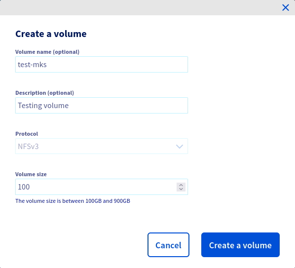
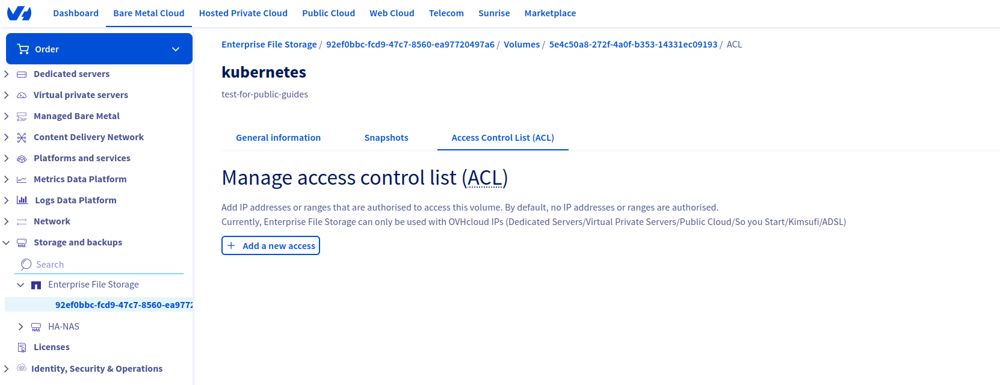
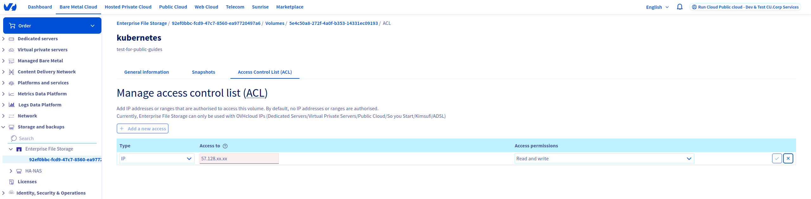
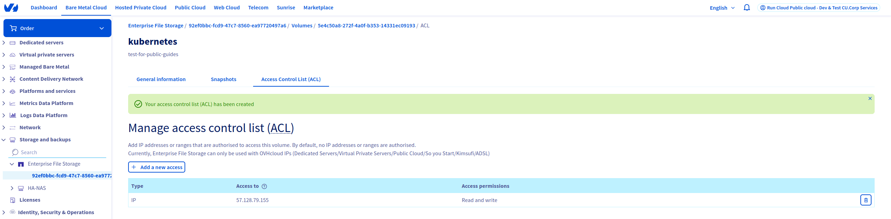

<style>
 pre {
     font-size: 14px;
 }
 pre.console {
   background-color: #300A24;
   color: #ccc;
   font-family: monospace;
   padding: 5px;
   margin-bottom: 5px;
 }
 pre.console code {
   border: solid 0px transparent;
   font-family: monospace !important;
   font-size: 0.75em;
   color: #ccc;
 }
 .small {
     font-size: 0.75em;
 }
</style>

## Objective

OVHcloud Managed Kubernetes currently offers Block Storage for persistent volumes by default, but that may not be suited for applications that require a shared file system between multiple nodes. This tutorial shows how to configure a shared [Kubernetes Persistent Volumes](https://kubernetes.io/docs/concepts/storage/persistent-volumes/#access-modes) (AccessMode `ReadWriteMany` or `RWX`) using [OVHcloud Enterprise File Storage](/links/storage/enterprise-file-storage) as a storage backend.

## Requirements

This tutorial assumes that you already have a working [OVHcloud Managed Kubernetes](/links/public-cloud/kubernetes) cluster, and some basic knowledge of how to operate it. If you want to know more on those topics, please look at the [deploying a Hello World application](/pages/public_cloud/containers_orchestration/managed_kubernetes/deploying-hello-world) documentation.

It also assumes you have an OVHcloud Enterprise File Storage already available. If you don't, you can [order one in the OVHcloud Control Panel](/links/manager).

You also need to have [Helm](https://docs.helm.sh/) installed on your workstation, please refer to the [How to install Helm on OVHcloud Managed Kubernetes Service](/pages/public_cloud/containers_orchestration/managed_kubernetes/installing-helm) tutorial.

## Instructions

### Step 1 - Creating a partition and granting your Managed Kubernetes Service access to it

Your Enterprise File Storage service can expose multiple volumes, and supports a variety of protocols. Each volume is accessible only from a specific range of IPs. We will create a new EFS volume and make it accessible from your Kubernetes worker nodes.

You can find more informations about our Entreprise File Storage product by clicking [here](/pages/storage_and_backup/file_storage/enterprise_file_storage/netapp_control_panel).

Access the UI for OVHcloud Enterprise File Storage by clicking the `Storage and backups`{.action} then `Enterprise File Storage`{.action} menu in the [Bare Metal Cloud section of the OVHcloud Control Panel](/links/manager)

Click your Enterprise File Storage service, then click the `Volumes`{.action} tab. Click the `Create a volume`{.action} button and create the new Enterprise File Storage volume with the following content:

{.thumbnail}

Provide the following parameters to create a volume:

| Name                | Description                | Required      |
| ------------------- | -------------------------- | ------------- |
| Volume name         | Name of the volume         | False         |
| Volume description  | Description of the volume  | False         |
| Protocol            | Protocol used to connect   | True          |
| Volume size         | Size of the volume         | True          |

The volume size needs to be adapted with your needs. For this guide, we define a volume size to 100GiB.

Once your volume is created, click on its ID and select `Access Control List`{.action}.
Enter your Nodes' Public IPs and/or your Public Cloud Gateway Public IP into the volume's ACLs. This will ensure your kubernetes worker nodes can reach the storage service.

#### Your cluster is installed with Public Network or a private network without using an OVHcloud Internet Gateway or a custom one as your default route

Once the volume is created, we need to allow our Kubernetes nodes to access it.

Get our Kubernetes nodes IP:

```bash
kubectl get nodes -o jsonpath='{ $.items[*].status.addresses[?(@.type=="InternalIP")].address }'
```

```console
$ kubectl get nodes -o jsonpath='{ $.items[*].status.addresses[?(@.type=="InternalIP")].address }'
51.128.xx.xx 37.59.xx.xx
```

#### Your cluster is installed with Private Network and a default route via your Private Network (OVHcloud Internet Gateway/OpenStack Router or a custom one)

Because your nodes are configured to be routed by the private network gateway, you need to add the gateway IP address to the ACLs.

By using Public Cloud Gateway through our Managed Kubernetes Service, Public IPs on nodes are only for management purposes: [MKS Known Limits](/pages/public_cloud/containers_orchestration/managed_kubernetes/known-limits)

You can get your OVHcloud Internet Gateway's Public IP by navigating through the OVHcloud Control Panel:

`Public Cloud`{.action} > Select your tenant > `Network / Gateway`{.action} > `Public IP`{.action}

You can also get your OVHcloud Internet Gateway's Public IP via the following API:

> [!api]
>
> @api {v1} /cloud GET  /cloud/project/{serviceName}/region/{regionName}/gateway/{id}
>

> [!success]
> If you are not familiar with the OVHcloud API, read our [First Steps with the OVHcloud API](/pages/manage_and_operate/api/first-steps) guide.

If you want to use your Kubernetes cluster to know your Gateway Public's IP, you can run this command:

```bash
kubectl run get-gateway-ip --image=ubuntu:latest -i --tty --rm 
```

This command will create a temporary pod and open a console.

You may have to wait a bit to let the pod be created. Once the shell appears, you can run this command:

```bash
apt update && apt upgrade -y && apt install -y curl && curl ifconfig.ovh
```

The Public IP of the Gateway you're using should appear.

Click on the `Manage IP Access (ACL)`{.action} menu of our newly created volume:

{.thumbnail}

Add either the nodes' IPs one by one or the Gateway's Public IP depending on your configuration:

{.thumbnail}

You should now have something similar to this:

{.thumbnail}

### Step 2 - Configuring Kubernetes to use our newly created EFS volume

Your Kubernetes cluster needs some additional piece of software to make use of the Enterprise File Storage volume. We will install those and then create a first volume, shared across multiple pods.

To do so, you can install the [csi-driver-nfs](https://github.com/kubernetes-csi/csi-driver-nfs):

```bash
helm repo add csi-driver-nfs https://raw.githubusercontent.com/kubernetes-csi/csi-driver-nfs/master/charts
helm install csi-driver-nfs csi-driver-nfs/csi-driver-nfs --namespace kube-system --version v4.7.0 --set driver.name="nfs2.csi.k8s.io" --set controller.name="csi-nfs2-controller" --set rbac.name=nfs2
```

```console
$ helm install csi-driver-nfs -n kube-system csi-driver-nfs/csi-driver-nfs --version v4.7.0 --set driver.name="nfs2.csi.k8s.io" --set rbac.name=nfs --set controller.name="csi-nfs2-controller"
NAME: csi-driver-nfs
LAST DEPLOYED: Mon Dec 16 16:13:31 2024
NAMESPACE: kube-system
STATUS: deployed
REVISION: 1
TEST SUITE: None
NOTES:
The CSI NFS Driver is getting deployed to your cluster.

To check CSI NFS Driver pods status, please run:

  kubectl --namespace=kube-system get pods --selector="app.kubernetes.io/instance=csi-driver-nfs" --watch
```

Let's verify our installation:

```bash
kubectl --namespace=kube-system get pods --selector="app.kubernetes.io/instance=csi-driver-nfs"
```

```console
$ kubectl --namespace=kube-system get pods --selector="app.kubernetes.io/instance=csi-driver-nfs" --watch
NAME                                   READY   STATUS              RESTARTS   AGE
csi-nfs-node-7kdwj                     0/3     ContainerCreating   0          5s
csi-nfs-node-7smkb                     0/3     ContainerCreating   0          5s
csi-nfs2-controller-68d7768f64-pzs74   0/4     ContainerCreating   0          5s
csi-nfs-node-7kdwj                     3/3     Running             0          11s
csi-nfs-node-7smkb                     3/3     Running             0          20s
csi-nfs2-controller-68d7768f64-pzs74   4/4     Running             0          21s
```

### Step 3 - Create the NFS StorageClass Object

Let's create a `efs-storageclass.yaml` file:


> [!primary]
>
> Don't forget to replace `[EFS_IP]`, `[EFS_PATH]` and `[PARTITION_NAME]` with the correct information.
>

```yaml
apiVersion: storage.k8s.io/v1
kind: StorageClass
metadata:
  name: nfs-csi
provisioner: nfs2.csi.k8s.io
parameters:
  server: '[EFS_IP]'
  share: '[EFS_PATH]'
reclaimPolicy: Delete
volumeBindingMode: Immediate
mountOptions:
  - nfsvers=3
  - tcp
```

> [!primary]
>
> The `EFS_IP` is the private IP of your Enterprise File Storage and the `EFS_PATH` is the path to access your volume.
>
> The `tcp` parameter instructs the NFS mount to use the TCP protocol.
>

Then apply the YAML file to create the StorageClass:

```bash
kubectl apply -f efs-storageclass.yaml
```

### Step 4 - Create and use an NFS persistent volume

Let’s create a `efs-persistent-volume-claim.yaml` file:

```yaml
kind: PersistentVolumeClaim
apiVersion: v1
metadata:
  name: efs-pvc
  namespace: default
spec:
  accessModes:
  - ReadWriteMany
  storageClassName: nfs-csi
  resources:
    requests:
      storage: 1Gi
```

And apply this to create the persistent volume claim:

```bash
kubectl apply -f efs-persistent-volume-claim.yaml
```

You can find more information about the PVC by running this command:

```bash
kubectl describe pvc efs-pvc
```

```console
$ kubectl describe pvc efs-pvc
Name:          efs-pvc
Namespace:     default
StorageClass:  nfs-csi
Status:        Bound
Volume:        pvc-8217340a-d2f0-42b3-80f6-bbeff5b61153
Labels:        <none>
Annotations:   pv.kubernetes.io/bind-completed: yes
               pv.kubernetes.io/bound-by-controller: yes
               volume.beta.kubernetes.io/storage-provisioner: nfs2.csi.k8s.io
               volume.kubernetes.io/storage-provisioner: nfs2.csi.k8s.io
Finalizers:    [kubernetes.io/pvc-protection]
Capacity:      1Gi
Access Modes:  RWX
VolumeMode:    Filesystem
Used By:       <none>
Events:
  Type    Reason                 Age   From                                                                                             Message
  ----    ------                 ----  ----                                                                                             -------
  Normal  Provisioning           10s   nfs2.csi.k8s.io_nodepool-452e0669-d9dd-4ecf-a7-node-6a9890_04dc0447-d875-4d29-883d-b91bb89ef053  External provisioner is provisioning volume for claim "default/efs-pvc"
  Normal  ExternalProvisioning   10s   persistentvolume-controller                                                                      Waiting for a volume to be created either by the external provisioner 'nfs2.csi.k8s.io' or manually by the system administrator. If volume creation is delayed, please verify that the provisioner is running and correctly registered.
  Normal  ProvisioningSucceeded  9s    nfs2.csi.k8s.io_nodepool-452e0669-d9dd-4ecf-a7-node-6a9890_04dc0447-d875-4d29-883d-b91bb89ef053  Successfully provisioned volume pvc-8217340a-d2f0-42b3-80f6-bbeff5b61153
```

By reading the events on this PersistentVolumeClaim, our PVC has been provisioned from our Enterprise File Storage.

If you encounter errors such as: 

```console
  Warning  ProvisioningFailed    2s (x3 over 6s)  nfs2.csi.k8s.io_nodepool-452e0669-d9dd-4ecf-a7-node-6a9890_04dc0447-d875-4d29-883d-b91bb89ef053  failed to provision volume with StorageClass "nfs-csi": rpc error: code = Internal desc = failed to mount nfs server: rpc error: code = Internal desc = mount failed: exit status 32
Mounting command: mount
Mounting arguments: -t nfs -o nfsvers=3,tcp 10.201.xx.xx:/share_xxx /tmp/pvc-7f86e647-4632-4188-bfbe-84d11ea03426
Output: mount.nfs: mounting 10.201.xx.xx:/share_xxx failed, reason given by server: No such file or directory
```

or similar to:

```console
  Warning  ProvisioningFailed    1s (x3 over 4s)  nfs2.csi.k8s.io_nodepool-cc5ad1db-f645-465c-85-node-6f9649_95fd7b5e-94aa-4c90-9ffa-9765beadfbe6  failed to provision volume with StorageClass "nfs-csi": rpc error: code = Internal desc = failed to mount nfs server: rpc error: code = Internal desc = mount failed: exit status 32
Mounting command: mount
Mounting arguments: -t nfs -o nfsvers=3,tcp 10.201.xx.xx:/share_xxx /tmp/pvc-ebab8dfa-7ce8-4102-9ef5-5a626638f3b8
Output: mount.nfs: access denied by server while mounting 10.201.xx.xx:/share_xxx

```

It may indicate an issue with the Enterprise File Storage ACLs configuration. Check the authorized IPs which can access to the wanted partition on the ACLs list.

> [!warning]
> If the number of __PersistentVolumes__ to schedule simultaneously is too important, some slowness can be encountered and volume creation can be delayed.


Let’s now create a DaemonSet of Nginx pods using the persistent volume claim as their webroot folder.

Using a DaemonSet will create a pod on each deployed node and make troubleshooting easier in case of a misconfiguration or to isolate a node issue.

Let's create a file named `nginx-daemonset.yaml`:

```yaml
apiVersion: apps/v1
kind: DaemonSet
metadata:
    name: nfs-nginx
    namespace: default
spec:
    selector:
      matchLabels:
        name: nginx
    template:
        metadata:
          labels:
            name: nginx
        spec:
          volumes:
          - name: nfs-volume
            persistentVolumeClaim:
              claimName: nfs-pvc
          containers:
          - name: nginx
            image: nginx
            ports:
            - containerPort: 80
              name: "http-server"
            volumeMounts:
            - mountPath: "/usr/share/nginx/html"
              name: nfs-volume
```

And apply this to create the Nginx DaemonSet:

```bash
kubectl apply -f nginx-daemonset.yaml
```

Both pods should be running:

```bash 
kubectl get pods
NAME              READY   STATUS    RESTARTS   AGE
nfs-nginx-9z7wk   1/1     Running   0          11s
nfs-nginx-sfthh   1/1     Running   0          11s
```

Let’s enter inside the first Nginx pod and container to check if the Enterprise File Storage Volume is properly mounted and create a file on the NFS persistent volume:

```bash
$ FIRST_POD=$(kubectl get pod -l name=nginx --no-headers=true -o custom-columns=:metadata.name | head -1)
kubectl exec -it $FIRST_POD -n default -- bash
```

```bash
root@nfs-nginx-9z7wk:/# mount -l | grep nfs
10.201.xx.xx:/share_xxx/pvc-8217340a-d2f0-42b3-80f6-bbeff5b61153 on /usr/share/nginx/html type nfs (rw,relatime,vers=3,rsize=65536,wsize=65536,namlen=255,hard,proto=tcp,timeo=600,retrans=2,sec=sys,mountaddr=10.201.xx.xx,mountvers=3,mountport=635,mountproto=tcp,local_lock=none,addr=10.201.xx.xx)
```

Now, we will check if the EFS volume is properly shared between the deployed pods.

Create a new `index.html` file:

```bash
echo "NFS volume!" > /usr/share/nginx/html/index.html
```

And exit the Nginx container:

```bash
exit
```

Let’s try to access our new web page:

```bash
kubectl proxy
```

Generate the URL to open in your broswer:

```bash
URL=$(echo "http://localhost:8001/api/v1/namespaces/default/pods/http:$FIRST_POD:/proxy/")
echo $URL
```

You can open the URL which is displayed to access the Nginx Service.

Now let’s try to see if the data is shared with the second pod (if you have more than one node deployed).

```bash
$ SECOND_POD=$(kubectl get pod -l name=nginx --no-headers=true -o custom-columns=:metadata.name | head -2 | tail -1)
URL2=$(echo "http://localhost:8001/api/v1/namespaces/default/pods/http:$SECOND_POD:/proxy/")
echo $URL2
```

You can open the URL which is displayed to access the Nginx Service on the other pod.

As you can see the data is correctly shared between the two Nginx pods running on two different Kubernetes nodes.

Congratulations, you have successfully set up a multi-attach persistent volume with OVHcloud Enterprise File Storage!

## Go further

To learn more about using your Kubernetes cluster the practical way, we invite you to look at our [OVHcloud Managed Kubernetes doc site](/products/public-cloud-containers-orchestration-managed-kubernetes-k8s).

- If you need training or technical assistance to implement our solutions, contact your sales representative or click on [this link](/links/professional-services) to get a quote and ask our Professional Services experts for assisting you on your specific use case of your project.

Join our [community of users](/links/community).


