<style>
 pre {
     font-size: 14px;
 }
 pre.console {
   background-color: #300A24;
   color: #ccc;
   font-family: monospace;
   padding: 5px;
   margin-bottom: 5px;
 }
 pre.console code {
   b   font-family: monospace !important;
   font-size: 0.75em;
   color: #ccc;
 }
 .small {
     font-size: 0.75em;
 }
</style>

> [!primary]
> This document describes the features and "how-to" for the Managed Kubernetes Service Premium Plan currently in beta version. For additional details on the Managed Kubernetes Service Standard plan, refer to the [following documentation](/pages/public_cloud/containers_orchestration/managed_kubernetes/known-limits).

## Standard vs Premium comparison

| Plan                  | Standard                                            | Premium                                   |
| --------------------- | --------------------------------------------------- | ----------------------------------------- |
| ControlPlane          | Managed                                             | Managed & Cross-AZ resilient              |
| Availability          | 99,5% SLO                                           | 99,99 SLA (at General Availability stage) |
| etcd                  | Shared, up to 400MB                                 | Dedicated, up to 8GB                      |
| Max cluster size      | Up to 100 nodes                                     | Up to 500 nodes                           |
| Regional availability | Single-zone regions (3-AZ regions planned for 2025) | 3-AZ region for now                       |

## Limitations / Upcoming features

In order to help you make the best use of our new Managed Kubernetes Service (MKS) Premium Plan, we have listed some limitations and guidelines related to specific features.

This list is subject to change as new features will be introduced during the Beta period. The end of the Beta phase and General Availability are planned for the end of summer 2025.

### Cluster upgrade

Upgrading an existing cluster is not supported at the moment, we'll deliver this functionality once we support the next Kubernetes release (1.33).

### Cluster rename

Renaming an existing cluster is not supported at the moment.

### Logs Data Platform integration

Audit logs forwarding to the [Logs Data Platform](/pages/public_cloud/containers_orchestration/managed_kubernetes/forwarding-audit-logs-to-logs-data-platform) is not supported at the moment.

### ETCD Quota

Real-time monitoring of the etcd storage usage is not supported at the moment, current etcd quota is 8GB per cluster.

### API server admission plugins configuration

The configuration of the [API server admission plugins](/pages/public_cloud/containers_orchestration/managed_kubernetes/apiserver-flags-configuration) is not available at the moment.

### API Server IP restrictions

To enable IP filtering on the API server, the IP of the gateway in the cluster's OpenStack subnet should be specified.
This allows worker nodes to communicate with the API server.

Retrieve the gateway IP of your cluster's gateway in the [OVHcloud Control Panel](/links/manager), or by using the following command:

```bash
openstack router show ROUTER_ID -c external_gateway_info
```

### Security Policies

Changing the Security Policy after the cluster creation is not supported yet.

### Anti-affinity

This feature allows worker nodes to be deployed on different hypervisors (physical servers) within the same availability zone, guaranteeing better fault tolerance. It is currently supported on the MKS Premium Plan (region EU-WEST-PAR).

We recommend using multiple Availability Zones (AZs) instead by using node pool to spread worker nodes between AZ.

### Ports

The OpenStack security group for worker nodes is the `default` one. It allows all egress and ingress traffic by default on your private network.

```bash
openstack security group rule list default
+--------------------------------------+-------------+-----------+-----------+------------+-----------+-----------------------+----------------------+
| ID                                   | IP Protocol | Ethertype | IP Range  | Port Range | Direction | Remote Security Group | Remote Address Group |
+--------------------------------------+-------------+-----------+-----------+------------+-----------+-----------------------+----------------------+
| 0b31c652-b463-4be2-b7e9-9ebb25d619f8 | None        | IPv4      | 0.0.0.0/0 |            | egress    | None                  | None                 |
| 25628717-0339-4caa-bd23-b07376383dba | None        | IPv6      | ::/0      |            | ingress   | None                  | None                 |
| 4b0b0ed2-ed16-4834-a5be-828906ce4f06 | None        | IPv4      | 0.0.0.0/0 |            | ingress   | None                  | None                 |
| 9ac372e3-6a9f-4015-83df-998eec33b790 | None        | IPv6      | ::/0      |            | egress    | None                  | None                 |
+--------------------------------------+-------------+-----------+-----------+------------+-----------+-----------------------+----------------------+
```

For now it is recommended to leave these security rules in their "default" configuration or the nodes could be disconnected from the cluster.

### Reserved IP ranges

The following ranges are used by the cluster, and should not be used elsewhere on the private network attached to the cluster.

```text
10.240.0.0/13 # Subnet used by pods
10.3.0.0/16 # Subnet used by services
```

These ranges will be configurable in a future version.

## Getting started

### Prerequisites

To create an MKS Premium cluster, a private network and subnet with an attached [OVHcloud Gateway](/links/public-cloud/gateway) (an OpenStack router) is mandatory. Before starting the cluster creation process, please make sure that you have an existing subnet that meets these requirements or create a new one accordingly.

If you want to use an use an existing subnet:

- **If the Subnet's GatewayIP is already used by an OVHcloud Gateway**, nothing needs to be done. The current OVHcloud Gateway (OpenStack Router) will be used.
- **If the subnet does not have an IP reserved for a Gateway**, you will have to provide or create a compatible subnet. Two options are available:
    - Edit an existing subnet to reserve an IP for a Gateway: please refer to the [Update a subnet properties](/pages/public_cloud/public_cloud_network_services/configuration-04-update_subnet) documentation, then create a gateway ([Creating a private network with Gateway](/links/public-cloud/gateway))
    - Provide another compatible subnet: a subnet with an existing OVHcloud Gateway ([Creating a private network with Gateway](/links/public-cloud/gateway))
- **If the GatewayIP is already assigned to a non-OVHcloud Gateway (OpenStack Router)**.
    - Provide another compatible subnet: a subnet with an existing OVHcloud Gateway ([Creating a private network with Gateway](/links/public-cloud/gateway))

> [!primary]
> Please remember to avoid the MKS Reserved IP ranges (cf above) for your networkd CIDR

> [!primary]
> Using the OVHcloud Control Panel, make sure to check the `Declare the first address of a CIDR given as the default gateway (DHCP option 3)` and `Assign a Gateway and connect to the private network` boxes at network creation.
>
> 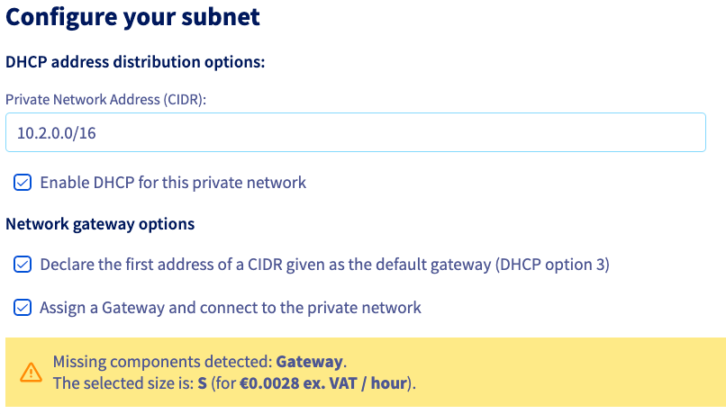{.thumbnail}
>

### Create a MKS Premium cluster

The following methods are supported to create an MKS Premium cluster:

> [!tabs]
> Using the OVHcloud Control Panel
>>
>> Log in to the [OVHcloud Control Panel](/links/manager), go to `Public Cloud`{.action} and select the Public Cloud project where you want to deploy the cluster.
>>
>> Access the OVHcloud Managed Kubernetes Service by clicking on `Managed Kubernetes Service`{.action} under Containers & Orchestration in the left-hand menu and click on `Create a cluster`{.action}.
>>
>> 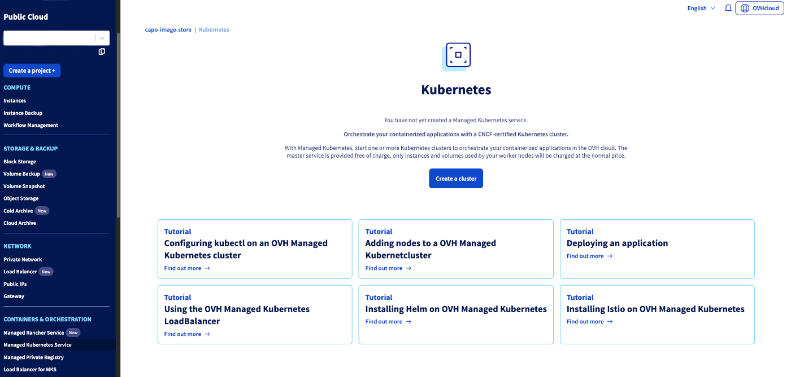{.thumbnail}
>>
>> Enter a name for your cluster.
>>
>> 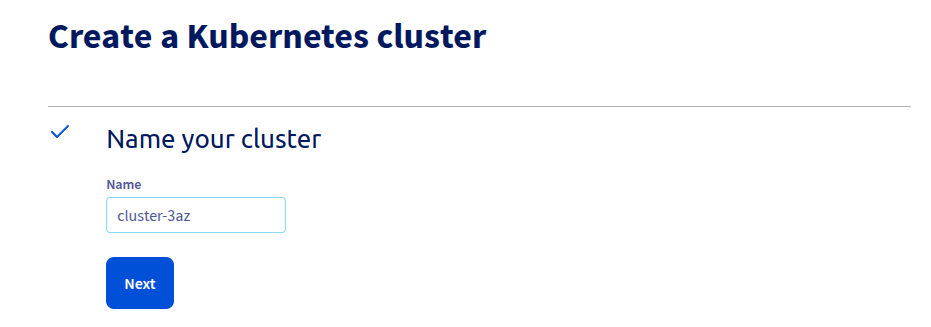{.thumbnail}
>>
>> Select '3-AZ Region' as deployment mode.
>>
>> 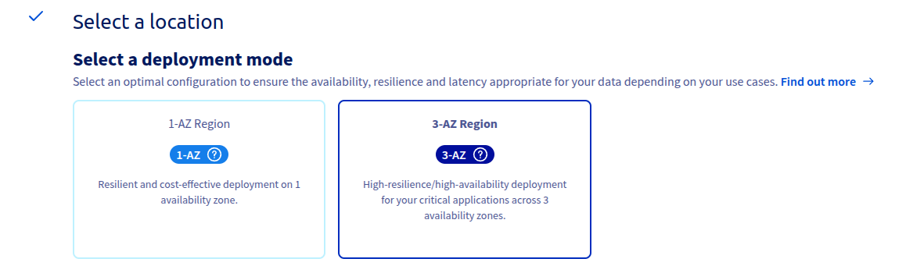{.thumbnail}
>>
>> Select 'Paris (EU-WEST-PAR)' as location.
>>
>> 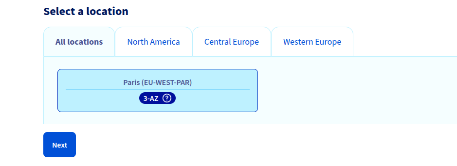{.thumbnail}
>>
>> Select the `Premium`{.action} plan and click `Next`{.action}.
>>
>> 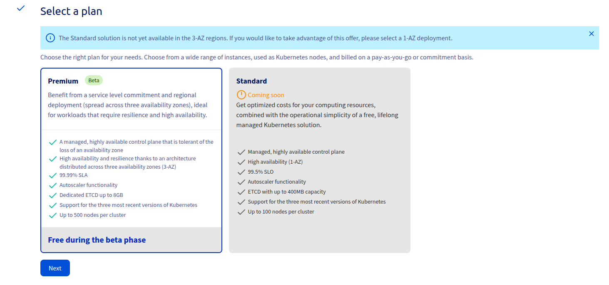{.thumbnail}
>>
>> Choose the minor version of Kubernetes and the Security Policy.
>>
>> > [!primary]
>> > We recommend to always use the lastest stable version.
>> > Please read our [End of life / end of support](/pages/public_cloud/containers_orchestration/managed_kubernetes/eos-eol-policies) page to understand our version policy.
>>
>> 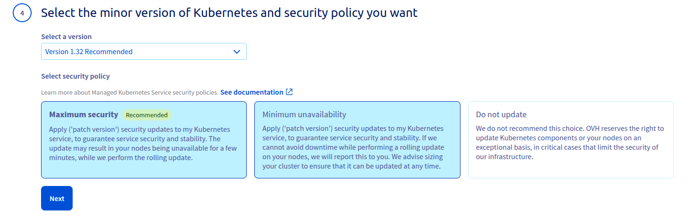{.thumbnail}
>>
>> Select a private network for your cluster.
>>
>> 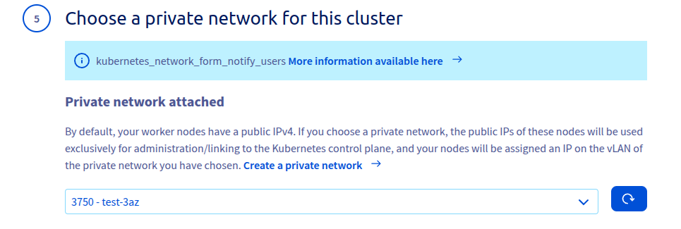{.thumbnail}
>>
>> Select a private subnet for your cluster.
>>
>> 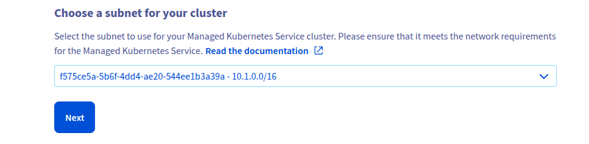{.thumbnail}
>>
>> (Optional) Now you can configure your nodepools. A node pool is a group of nodes sharing the same configuration, allowing you a lot of flexibility in your cluster management. Enter a name and select the instance flavor.
>>
>> 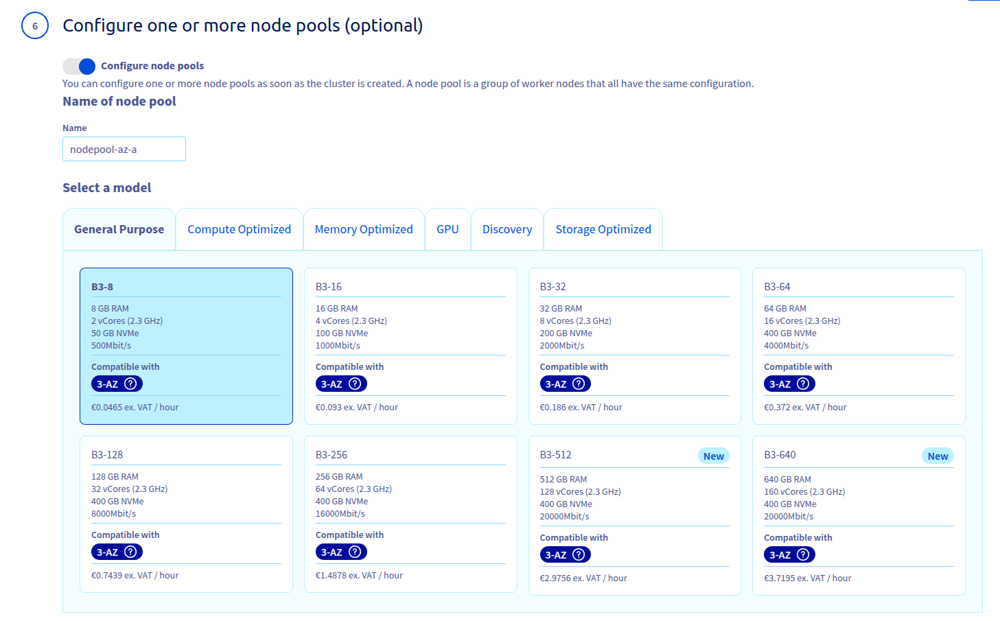{.thumbnail}
>>
>> Select the Availability Zone for your node pool.
>>
>> 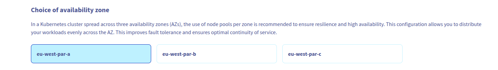{.thumbnail}
>>
>> Define the size of your first node pool.
>>
>> You can enable the `Autoscaling`{.action} feature for the cluster. Define the minimum and maximum pool size in that case.
>>
>> 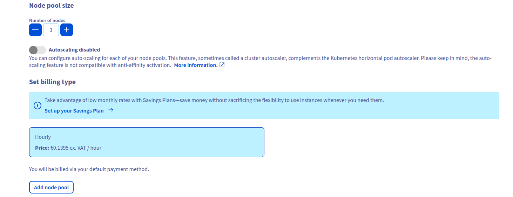{.thumbnail}
>>
>> Click `Add node pool`{.action}.
>>
>> 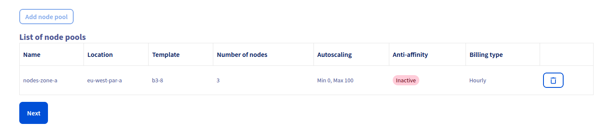{.thumbnail}
>>
>> If you want to create a nodepool on each Availability Zone you can repeat this operation by clicking the `Add node pool`{.action} button again and changing the AZ parameter.
>>
>> Finally, click the `Confirm cluster`{.action} button.
>>
>> 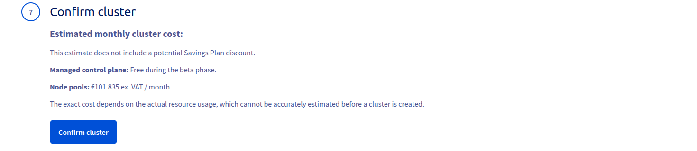{.thumbnail}
>>
>> The cluster creation is now in progress. It should be available within a few minutes in your OVHcloud Control Panel.
>>
> Using Terraform
>>
>> Refer to the [dedicated documentation](/pages/public_cloud/containers_orchestration/managed_kubernetes/creating-a-cluster-through-terraform) to create a Managed Kubernetes cluster.
>>
>> Here is a sample Terraform file that creates an MKS Premium cluster and three nodepools on three different availability zones in the `EU-WEST-PAR` region.
>>
>> ```bash
>> terraform {
>>  required_providers {
>>    ovh = {
>>      source  = "ovh/ovh"
>>    }
>>  }
>> }
>>
>> provider "ovh" {
>>   endpoint           = "ovh-eu"
>>   application_key    = "<your_access_key>"
>>   application_secret = "<your_application_secret>"
>>   consumer_key       = "<your_consumer_key>"
>> }
>>
>> resource "ovh_cloud_project_kube" "my_kube_cluster" {
>>   service_name = var.service_name
>>   name         = "lgr-terraform-test-3az"
>>   region       = "EU-WEST-PAR"
>>   version      = "1.31"
>>   private_network_id = "<OpenStack Network Id>"
>>   nodes_subnet_id = "<Openstack Subnet Id>"
>> }
>> resource "ovh_cloud_project_kube_nodepool" "node_pool_a" {
>>   service_name  = var.service_name
>>   kube_id       = ovh_cloud_project_kube.my_kube_cluster.id
>>   name          = "my-pool-a-1"
>>   flavor_name   = "b3-8"
>>   availability_zones = ["eu-west-par-a"]
>>   desired_nodes = 1
>> }
>> resource "ovh_cloud_project_kube_nodepool" "node_pool_b" {
>>   service_name  = var.service_name
>>   kube_id       = ovh_cloud_project_kube.my_kube_cluster.id
>>   name          = "my-pool-b-1"
>>   flavor_name   = "b3-8"
>>   availability_zones = ["eu-west-par-b"]
>>   desired_nodes = 1
>> }
>> resource "ovh_cloud_project_kube_nodepool" "node_pool_c" {
>>   service_name  = var.service_name
>>   kube_id       = ovh_cloud_project_kube.my_kube_cluster.id
>>   name          = "my-pool-c-1"
>>   flavor_name   = "b3-8"
>>   availability_zones = ["eu-west-par-c"]
>>   desired_nodes = 1
>> }
>> output "kubeconfig_file" {
>>   value     = ovh_cloud_project_kube.my_kube_cluster.kubeconfig
>>   sensitive = true
>> }
>> ```

## Go further

- If you need training or technical assistance to implement our solutions, contact your sales representative or click on [this link](/links/professional-services) to get a quote and ask our Professional Services experts for assisting you on your specific use case of your project.

- Join our [community of users on Discord](https://discord.gg/ovhcloud)!
