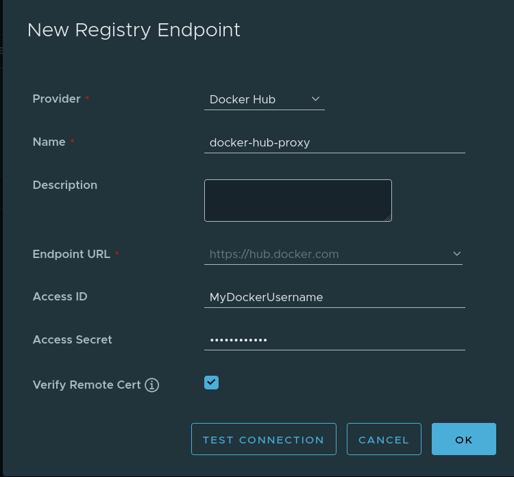
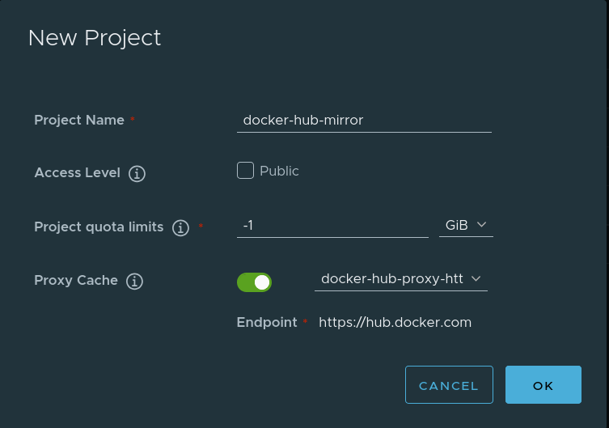

## Objective

Harbor provides a **proxy cache** feature that helps you mirror and cache images from external registries like **Docker Hub**, **Github Container Registry**, **Quay**, **JFrog Artifactory Registry**, etc. This improves performance and reduces rate limits imposed by external registries.

We **strongly recommend** using a **Docker account** (even a free one) to **avoid rate limits** when pulling images. Without authentication, Docker Hub enforces strict pull limits, which may cause failures when pulling frequently used images.

## Requirements

- A running **[Managed Private Registry](/pages/public_cloud/containers_orchestration/managed_private_registry/creating-a-private-registry)**.
- Access to the **Harbor Web UI** (with admin access).
- A **Docker Hub account** (recommended to prevent rate limits).

## Instructions

### 1. Enable proxy cache

1. Log in to [Harbor Web UI](/pages/public_cloud/containers_orchestration/managed_private_registry/connecting-to-the-ui) as an **Administrator**.
2. Go to `Administration`, then `Registries`{.action}.
3. Click `+ New Endpoint`{.action}, then select `Docker Hub`{.action} as the provider.
4. Fill in the details:
    - **Registry Type**: Docker Hub
    - **Registry Name**: (e.g., `docker-hub-proxy`)
    - **Registry Endpoint**: `https://hub.docker.com`
    - **Access ID**: *(your Docker Hub username)*
    - **Access Secret**: *(your Docker Hub password or personal access token)*
5. Click `OK`{.action}.

> [!primary]
> If you do not provide Docker Hub credentials, your requests may hit **rate limits** (10 pulls/hour per IPV4 for anonymous users).

{.thumbnail width="500"}

### 2. Create a proxy cache project

1. In the **Harbor Web UI**, go to `Projects`{.action}.
2. Click `+ New Project`{.action}.
3. Enter a **Project Name** (e.g., `docker-hub-mirror`).
4. Select `Proxy Cache`{.action}.
5. Under **Upstream Registry**, choose the **Docker Hub proxy registry** created earlier.
6. Click `Save`{.action}.

> [!primary]
> By default, Harbor creates a **7 day retention policy** for each new proxy cache project. See more about [Tag Retention Policies](https://goharbor.io/docs/2.1.0/working-with-projects/working-with-images/create-tag-retention-rules/).

{.thumbnail width="500"}

### 3. Configure Docker to use Harbor proxy cache

#### 3.1 Log in to the Managed Private Registry 

```sh
docker login <your-managed-registry-domain> -u <username> -p <password>
```

#### 3.2 Pull images via proxy cache

Instead of pulling directly from Docker Hub, use your **Private Managed Registry** as an intermediary:

```bash
docker pull <your-managed-registry-domain>/dockerhub-mirror/library/nginx:latest
```

Harbor will cache the image locally, so subsequent pulls will be much faster and won’t count against Docker Hub rate limits.

## Benefits of using proxy cache

- ✅ Avoid Docker Hub rate limits (with authentication).
- ✅ Faster image pulls for frequently used images.
- ✅ Reduced dependency on external registries.
- ✅ Improved reliability by caching images locally.

## Troubleshooting

### Getting "Too Many Requests" errors

- Ensure you configured Docker Hub authentication in Harbor.

## Conclusion

Using Harbor's proxy cache helps optimize Docker image pulls, avoiding rate limits and improving performance. Be sure to authenticate with Docker Hub in Harbor to prevent rate limit issues.
