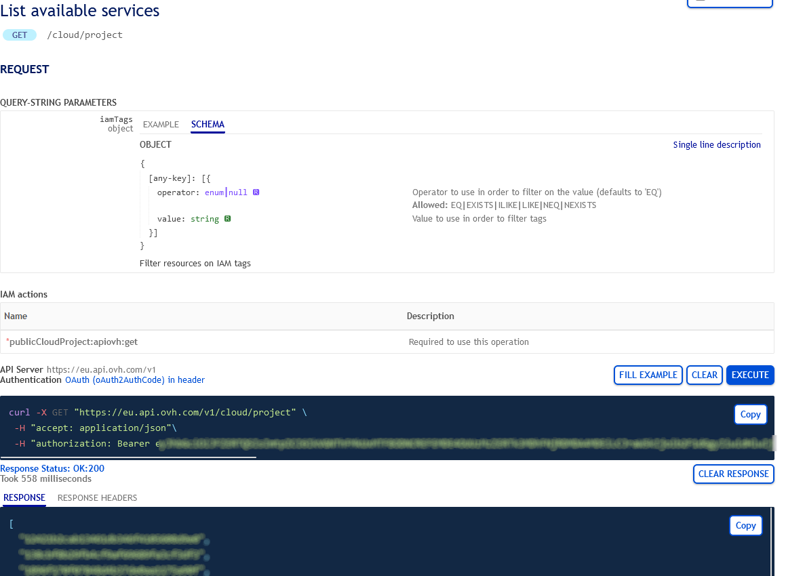
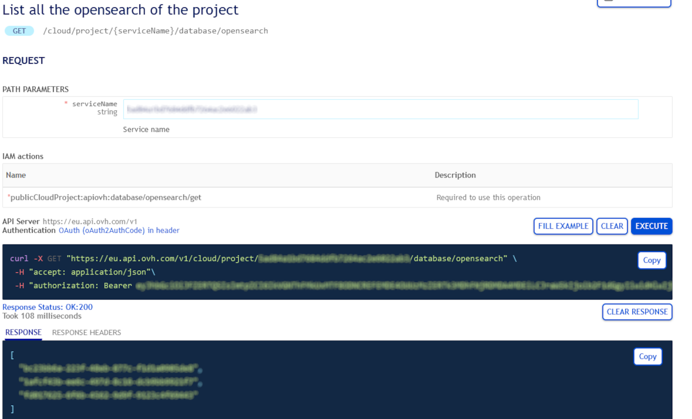
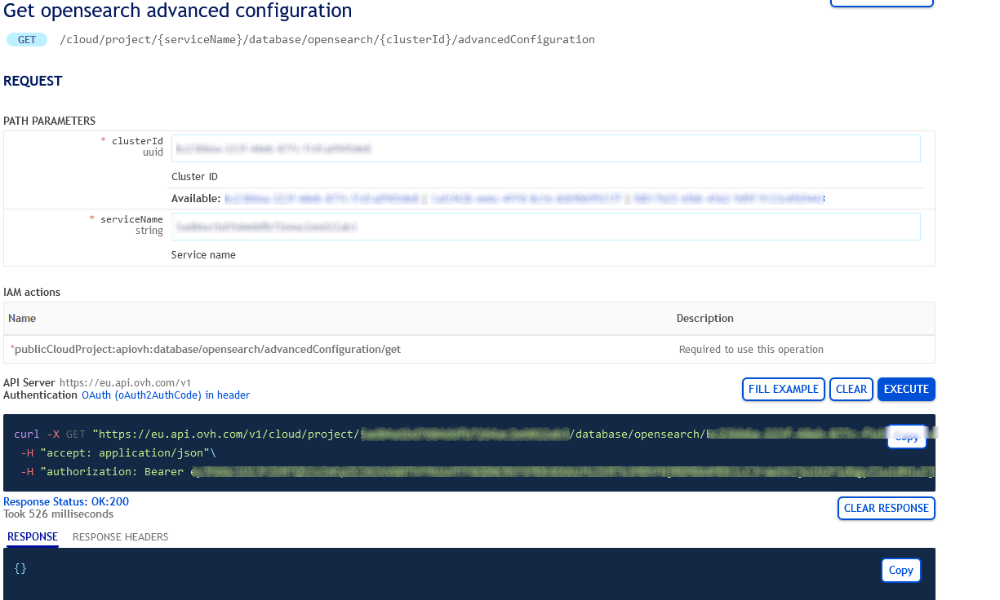
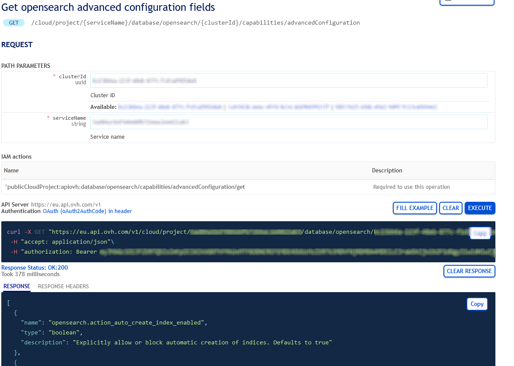
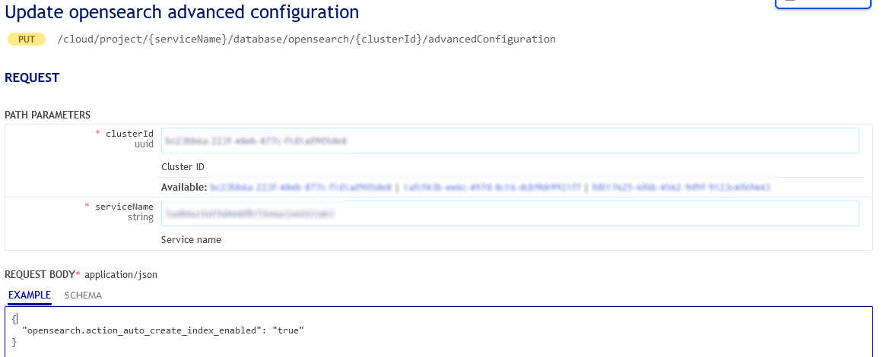

## Objective

Analytics engines are managed services, which means that they are not fully configurable. For example, it is not possible to modify *pg_hba.conf*.

> [!primary]
>
> Advanced configuration is available for the following Analytics engines :
>
> - Managed Dashboards (Grafana)
> - Kafka
> - Kafka Connect
> - OpenSearch

## Requirements

- A [Public Cloud project](/links/public-cloud/public-cloud) in your OVHcloud account
- An analytics service running on your OVHcloud Analytics ([this guide](/pages/public_cloud/data_analytics/analytics/analytics_getting_started) can help you to meet this requirement)
- Access to your [OVHcloud Control Panel](/links/manager) or to the [OVHcloud API](/links/api)

## Instructions

> [!warning]
>
> Please note that changes to the advanced settings apply at the cluster level and therefore to all the analytics services in the cluster.
>

> [!primary]
>
> Depending on the engine, some settings may already be defined.
>

> [!primary]
>
> Once the advanced configuration has been submitted, it is not possible to reset it to initial values. It is only possible to update the values, so we recommend that you take note of the initial values before changing them.
>
> See the [Checking](#checking) section below.
>

### Using the OVHcloud Control Panel

To change the advanced configuration, you first need to log in to your [OVHcloud Control Panel](/links/manager) and open your `Public Cloud`{.action} project. Click on `Data Streaming`{.action} or `Data Analysis`{.action} in the left-hand navigation bar, select your engine instance then the `Advanced configuration`{.action} tab.

Select the key of the advanced setting you want to define, then set its value.

When ready, click on `Update advanced configuration`{.action}.

> [!primary]
>
> On the top-right of the advanced configuration tab, you can see the settings which are already defined.
>

### Using API

> [!primary]
>
> If you are not familiar with using the OVHcloud API, please refer to our guide on [First Steps with the OVHcloud APIs](/pages/manage_and_operate/api/first-steps).
>

#### Get your service and cluster IDs

You first need to identify the service and the cluster you want to apply the changes to.

##### **Get the desired service ID**

Execute the following API call:

> [!api]
>
> @api {v1} /cloud GET /cloud/project
>

{.thumbnail}

From the resulting list, select and copy the service identifier corresponding to the desired service, also known as serviceName.

##### **Get the desired cluster ID**

Open the following API call, paste your service ID into the `serviceName` input field and click `Execute`{.action}:

> [!tabs]
> Kafka
>> > [!api]
>> >
>> > @api {v1} /cloud GET /cloud/project/{serviceName}/database/kafka
>> >
> Kafka Connect
>> > [!api]
>> >
>> > @api {v1} /cloud GET /cloud/project/{serviceName}/database/kafkaConnect
>> >
> OpenSearch
>> > [!api]
>> >
>> > @api {v1} /cloud GET /cloud/project/{serviceName}/database/opensearch
>> >
> Dashboards
>> > [!api]
>> >
>> > @api {v1} /cloud GET /cloud/project/{serviceName}/database/grafana
>> >

{.thumbnail}

From the resulting list, select and copy the cluster ID, also known as clusterId.

#### Get the existing advanced configuration

Open the following API call and paste the corresponding inputs (serviceName, clusterId) and click `Execute`{.action}:

> [!tabs]
> Kafka
>> > [!api]
>> >
>> > @api {v1} /cloud GET /cloud/project/{serviceName}/database/kafka/{clusterId}/advancedConfiguration
>> >
> Kafka Connect
>> > [!api]
>> >
>> > @api {v1} /cloud GET /cloud/project/{serviceName}/database/kafkaConnect/{clusterId}/advancedConfiguration
>> >
> OpenSearch
>> > [!api]
>> >
>> > @api {v1} /cloud GET /cloud/project/{serviceName}/database/opensearch/{clusterId}/advancedConfiguration
>> >
> Dashboards
>> > [!api]
>> >
>> > @api {v1} /cloud GET /cloud/project/{serviceName}/database/grafana/{clusterId}/advancedConfiguration
>> >

{.thumbnail}

#### Advanced configuration settings list

Open the following API call and paste the corresponding inputs (serviceName, clusterId) and click `Execute`{.action}:

> [!tabs]
> Kafka
>> > [!api]
>> >
>> > @api {v1} /cloud GET /cloud/project/{serviceName}/database/kafka/{clusterId}/capabilities/advancedConfiguration
>> >
> Kafka Connect
>> > [!api]
>> >
>> > @api {v1} /cloud GET /cloud/project/{serviceName}/database/kafkaConnect/{clusterId}/capabilities/advancedConfiguration
>> >
> OpenSearch
>> > [!api]
>> >
>> > @api {v1} /cloud GET /cloud/project/{serviceName}/database/opensearch/{clusterId}/capabilities/advancedConfiguration
>> >
> Dashboards
>> > [!api]
>> >
>> > @api {v1} /cloud GET /cloud/project/{serviceName}/database/grafana/{clusterId}/capabilities/advancedConfiguration
>> >

{.thumbnail}

#### Change advanced configuration

Open the following API call and paste the corresponding inputs (serviceName, clusterId)

> [!tabs]
> Kafka
>> > [!api]
>> >
>> > @api {v1} /cloud PUT /cloud/project/{serviceName}/database/kafka/{clusterId}/advancedConfiguration
>> >
> Kafka Connect
>> > [!api]
>> >
>> > @api {v1} /cloud PUT /cloud/project/{serviceName}/database/kafkaConnect/{clusterId}/advancedConfiguration
>> >
> OpenSearch
>> > [!api]
>> >
>> > @api {v1} /cloud PUT /cloud/project/{serviceName}/database/opensearch/{clusterId}/advancedConfiguration
>> >
> Dashboards
>> > [!api]
>> >
>> > @api {v1} /cloud PUT /cloud/project/{serviceName}/database/grafana/{clusterId}/advancedConfiguration
>> >

Now, according to the settings you chose, set the different values into the string arrays, such as in the example below:

{.thumbnail}

When ready, click on `Execute`{.action} to update the advanced configuration.

## We want your feedback!

We would love to help answer questions and appreciate any feedback you may have.

If you need training or technical assistance to implement our solutions, contact your sales representative or click on [this link](/links/professional-services) to get a quote and ask our Professional Services experts for a custom analysis of your project.

Are you on Discord? Connect to our channel at <https://discord.gg/ovhcloud> and interact directly with the team that builds our Analytics service!

Join our [community of users](/links/community).