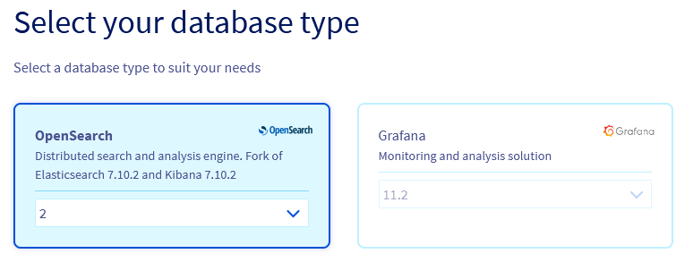
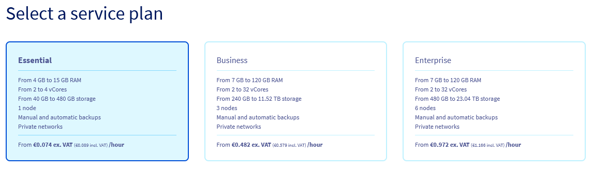
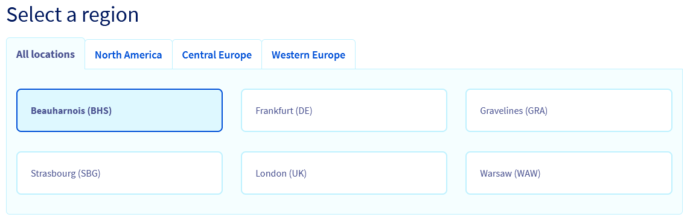
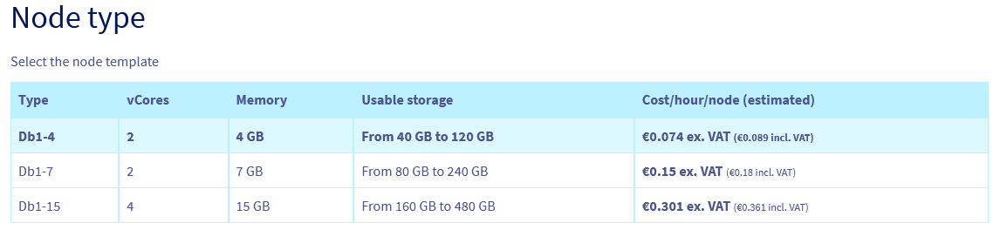
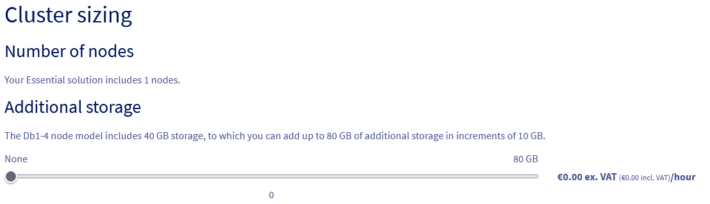
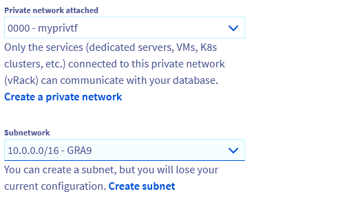
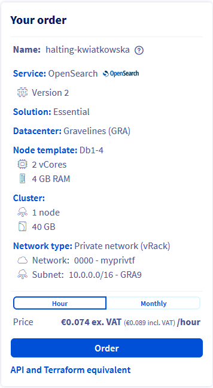

## Objective

OVHcloud Analytics allows you to focus on building and deploying cloud applications while OVHcloud takes care of the analytics infrastructure and maintenance.

**This guide explains how to order an analytics solution in the OVHcloud Control Panel.**

## Requirements

- Access to the [OVHcloud Control Panel](/links/manager)
- A [Public Cloud project](/links/public-cloud/public-cloud) in your OVHcloud account

## Instructions

Log in to your [OVHcloud Control Panel](/links/manager) and switch to the `Public Cloud`{.action} section. After selecting your Public Cloud project, go in the left-hand navigation bar under **Databases & Analytics**:

- Clicking on `Data Streaming`{.action} will give you access to `Kafka`, `Kafka Connect` and `KafkaMirrorMaker` services.
- Clicking on `Data Analysis` will give you access to `Dashboards` and `OpenSearch` services.

Click the `Create a database instance`{.action} button (or the `Create a service`{.action} button if your project already contains analytics services).

### Step 1: Select your analytics type

Click on the type of analytics you want to use and then select the version to install from the respective drop-down menu.

{.thumbnail}

### Step 2: Select a Plan

Choose an appropriate service plan. You will be able to upgrade the plan after its creation.

Please visit the [capabilities page](/products/public-cloud-data-analytics) of your selected analytics type for detailed information on each plan's properties.

{.thumbnail}

### Step 3: Select a location

Choose the geographical region of the data centre in which your analytics service will be hosted.

{.thumbnail}

### Step 4: Configure analytics service nodes

You can choose the node template in this step.

{.thumbnail}

Please visit the [capabilities page](/products/public-cloud-data-analytics) of your selected analytics service type for detailed information on the hardware resources and other properties of the analytics service installation.

Take note of the pricing information.

### Step 5: Sizing

Additional storage can be ordered and, depending on the engine, the number of nodes in your cluster can be adjusted:

{.thumbnail}

### Step 6: Configure your options

Define your network configuration:

{.thumbnail}

#### Connecting a private network (optional)

{.thumbnail}

If you already have a private subnet available, check the box **Private** and select it from the drop-down menu. Note that this option might not be available for the selected service type.

You can be forwarded to create a private network or subnet by clicking on the respective links. You will have to start the analytics service order process anew in that case.

Please follow [this guide](/pages/public_cloud/public_cloud_network_services/getting-started-07-creating-vrack) for detailed instructions.

### Step 7: Summary and confirmation

The final section will display a summary of your order as well as the API equivalent of creating this analytics service instance with the [OVHcloud API](/pages/manage_and_operate/api/first-steps).

{.thumbnail}

Within a few minutes your new analytics service will be deployed. Messages in the OVHcloud Control Panel will inform you when the analytics service is ready to use.

Continue with the *Configure your instance to accept incoming connections* guide of your selected analytics service type available [here](/products/public-cloud-databases) to configure your service after installation.

Note that the configuration options might be different, depending on the analytics type. You will find example on this repository: <https://github.com/ovh/public-cloud-databases-examples>.

## We want your feedback!

Visit our dedicated Discord channel: <https://discord.gg/PwPqWUpN8G>. Ask questions, provide feedback and interact directly with the team that builds our databases services.

If you need training or technical assistance to implement our solutions, contact your sales representative or click on [this link](/links/professional-services) to get a quote and ask our Professional Services experts for a custom analysis of your project.

Join our [community of users](/links/community).
