## Objective

The Analytics service allows you to focus on building and deploying cloud applications while OVHcloud takes care of the Analytics infrastructure and maintenance.

**This guide explains how to restore a backup of an Analytics service solution in the OVHcloud Control Panel.**

We continuously improve our offers. You can follow and submit ideas to add to our roadmap at <https://github.com/orgs/ovh/projects/16/views/5>.

## Requirements

- Access to the [OVHcloud Control Panel](/links/manager)
- An [Analytics service](/links/public-cloud/analytics) up and running

## Instructions

### Step 1: Select the Analytics service you want to restore data from

First, you need to go to the overview page of the service you want to restore the backup from.

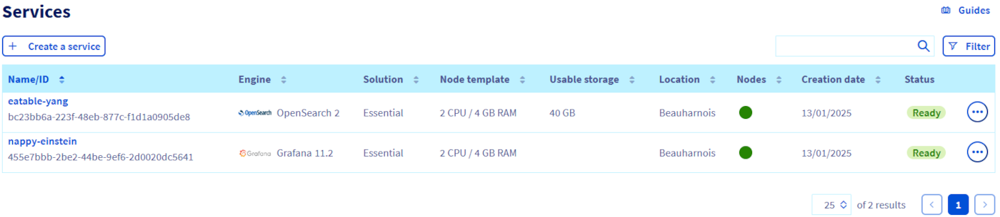{.thumbnail}

### Step 2: Go to the backup tab

In the tab list, click on `Backups`{.action}.

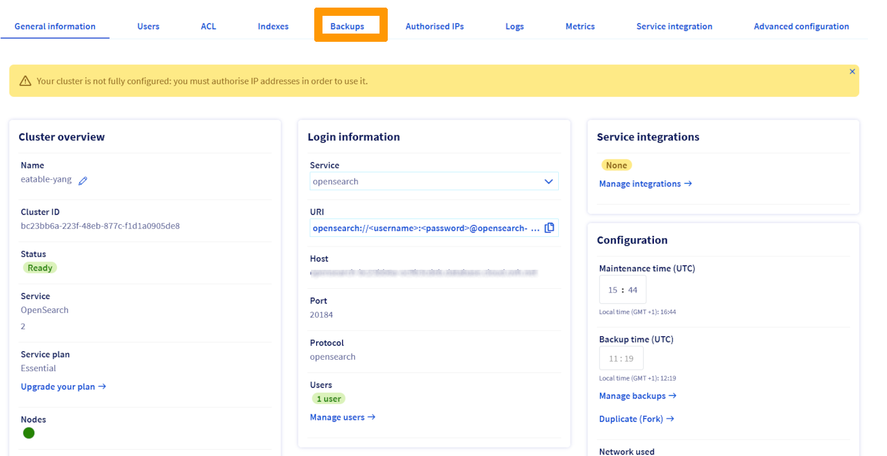{.thumbnail}

### Step 3: Select the backup to restore from

Select the backup from which you want to restore. To help you choose, observe the dates at which the backups have been performed in the "Creation date" column.

Click on the `...`{.action} button corresponding to the chosen backup. Then click on `Duplicate (Fork)`{.action} to go to the configuration page of the new service.

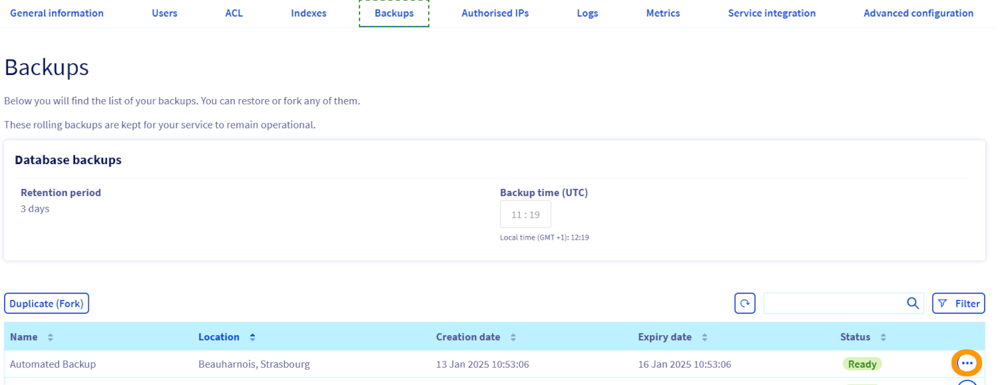{.thumbnail}

### Step 4: Configure the target service

As seen before, when restoring a backup, you create a new separate Analytics service on which the backup data will be imported. You are able to configure this new service as you wish.

#### Immutable options

For obvious reasons, you cannot change the engine, this option is not offered. The same goes for the engine version, you will be able to update it once the new service is running.

You will find a reminder of all these options in the order summary.

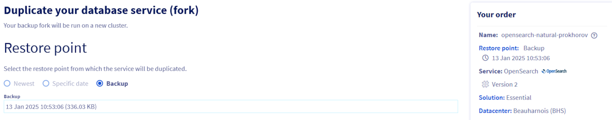{.thumbnail}

#### Region

You can choose a different region for your new service.

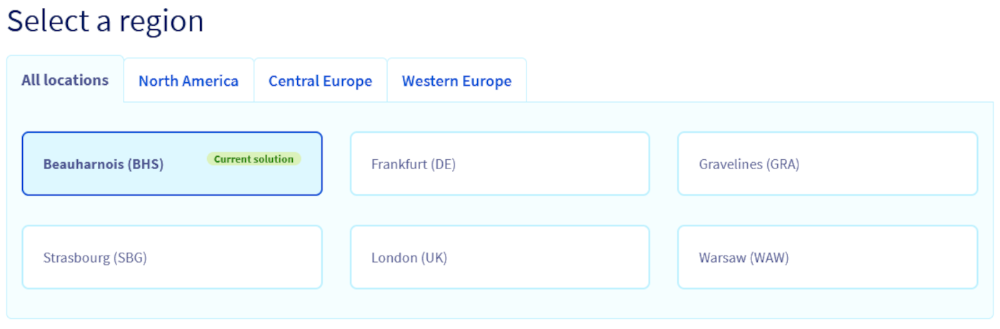{.thumbnail}

#### Restore point

You have to choose a restore point from which the service will be duplicated.

##### **Backup**

The most common option is to restore from a backup.

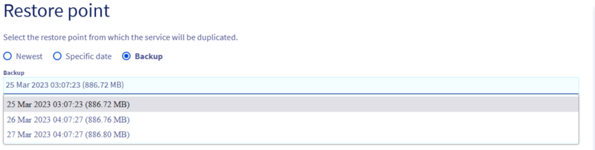{.thumbnail}

##### **Specific date and latest**

If your service supports point in time recovery (see the [Automated Backup guide](/pages/public_cloud/data_analytics/analytics/information_05_automated_backups) for more details), you will also be offered the option to restore from a specific date and time.

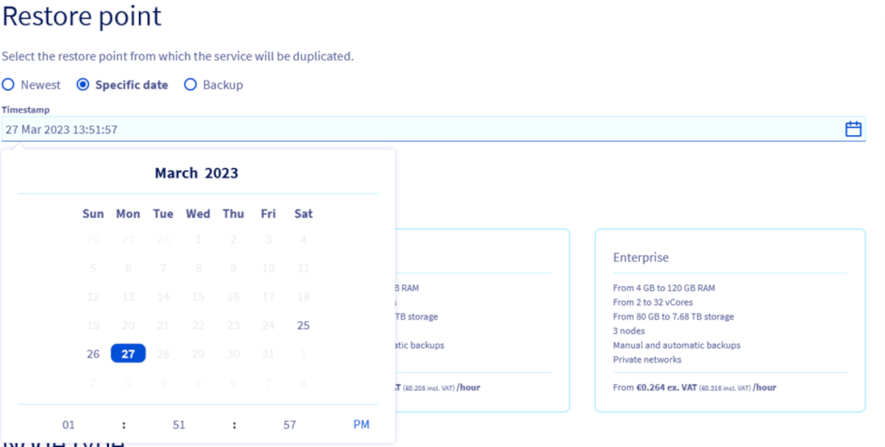{.thumbnail}

You will also be offered the ease to choose the most recent date directly.

{.thumbnail}

#### Plan

When restoring a backup, you can select another service plan.

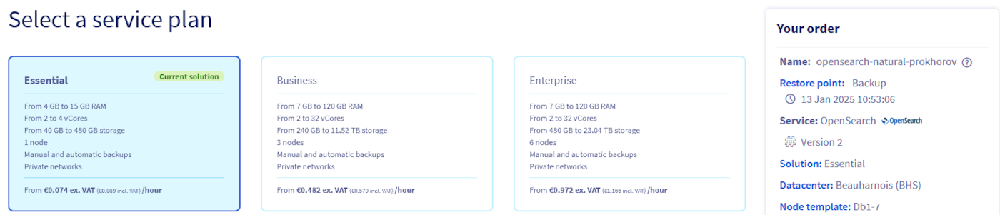{.thumbnail}

#### Nodes

You can choose to upgrade the node to a bigger flavor.

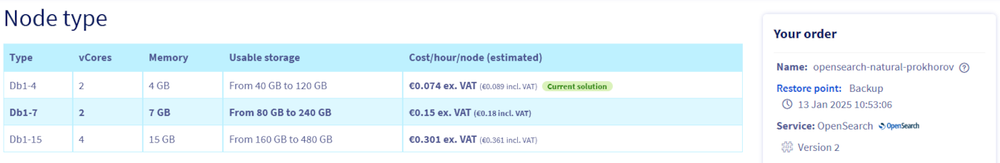{.thumbnail}

> [!primary]
> The flavor downgrade will soon be offered. The limitation being that the targeted flavor must have enough storage to restore the backup.

#### Sizing

Additional storage can be ordered while forking the service.

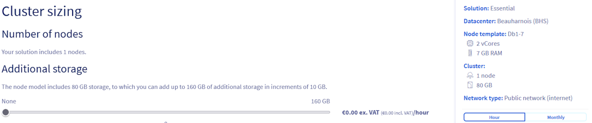{.thumbnail}

> [!primary]
> The storage reduction will soon be offered. The limitation being that the targeted total storage must be large enough to restore the backup.

#### Options

You can update the network options.

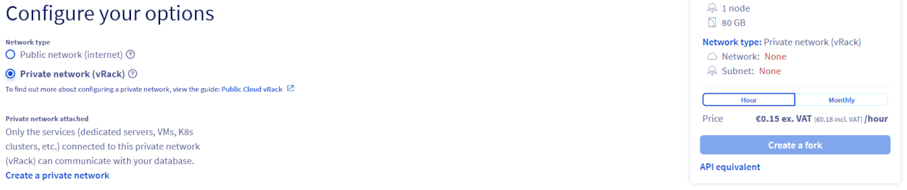{.thumbnail}

Now click on `Create a fork`{.action} and the new service will be created. Please note that depending on the backup size, it can take some time before the service is available.

### Step 5: Wait for service creation

Now all you have to do is wait for your service to be ready.
This new service is now completely independent from the one you forked the backup from. You can safely delete the old service without impacting the new one.

> [!warning]
> The newly created service does not duplicate IP restrictions nor users which were created on the old service. You will have to recreate those before using your new service.

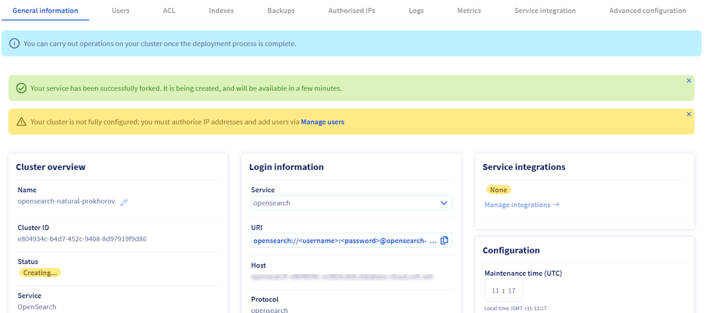{.thumbnail}

## We want your feedback!

We would love to help answer questions and appreciate any feedback you may have.

If you need training or technical assistance to implement our solutions, contact your sales representative or click on [this link](/links/professional-services) to get a quote and ask our Professional Services experts for a custom analysis of your project.

Are you on Discord? Connect to our channel at <https://discord.gg/ovhcloud> and interact directly with the team that builds our analytics service!

Join our [community of users](/links/community).
