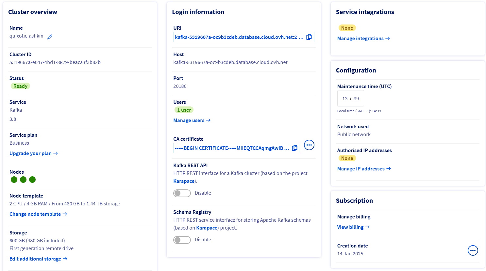
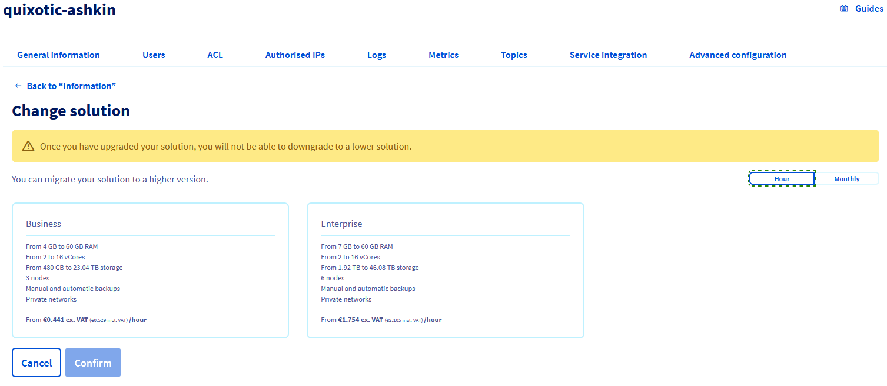

## Objective

Learn how to upgrade the service plan of your cluster according to your needs.

> [!warning]
>
> Once you have upgraded your solution, you will not be able to downgrade to a lower solution.

## Requirements

- Access to the [OVHcloud Control Panel](/links/manager) or to the [OVHcloud API](/links/api)
- A [Public Cloud project](/links/public-cloud/public-cloud) in your OVHcloud account

## Instructions

### Using the OVHcloud Control Panel

To upgrade the service plan of your cluster, log in to the [OVHcloud Control Panel](/links/manager) and open your Public Cloud project. Click `Data Analysis`{.action} or `Data Streaming`{.action} in the left navigation bar, then select your engine instance.

{.thumbnail}

Click `Change solution`{.action} and adjust the Plan of your cluster.

{.thumbnail}

### Using the OVHcloud API

> [!success]
>
> If you are not familiar with using the OVHcloud API, please refer to our guide on [Getting started with the OVHcloud API](/pages/manage_and_operate/api/first-steps).

To upgrade or downgrade the service plan of your cluster, use the following API call:

> [!api]
>
> @api {v1} /cloud PUT /cloud/project/{serviceName}/database/{engine}/{clusterId}
>

```console
body : {
    plan: <essential|business|enterprise>
}
```

If you downgrade to an Essential plan, your current flavor and/or number of nodes will be downgraded automatically if they exceed the limits of the Essential plan.

## We want your feedback!

We would love to help answer questions and appreciate any feedback you may have.

If you need training or technical assistance to implement our solutions, contact your sales representative or click on [this link](/links/professional-services) to get a quote and ask our Professional Services experts for a custom analysis of your project.

Are you on Discord? Connect to our channel at <https://discord.gg/ovhcloud> and interact directly with the team that builds our analytics service!

Join our [community of users](/links/community).