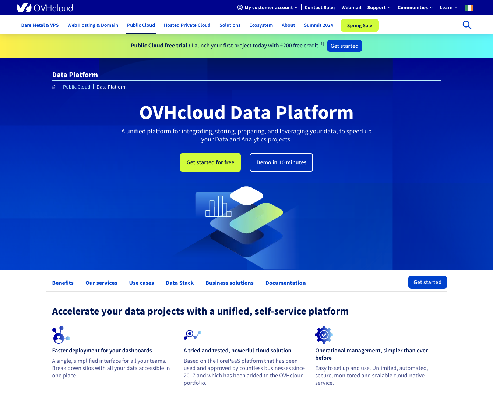
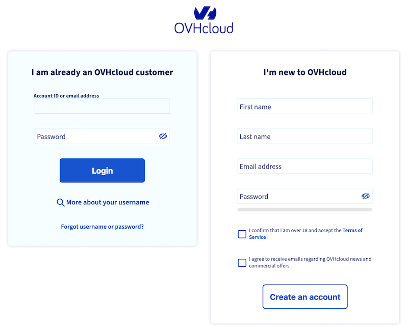
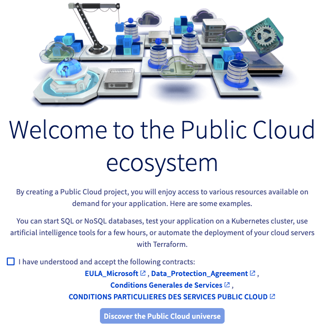
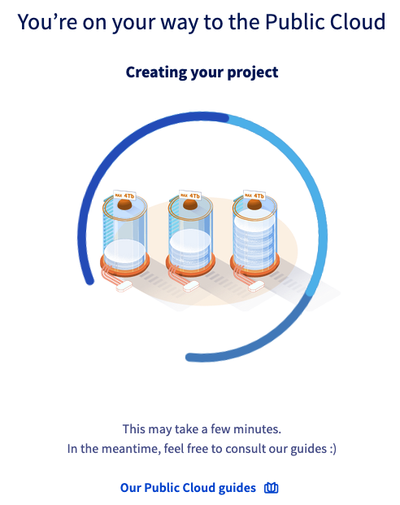
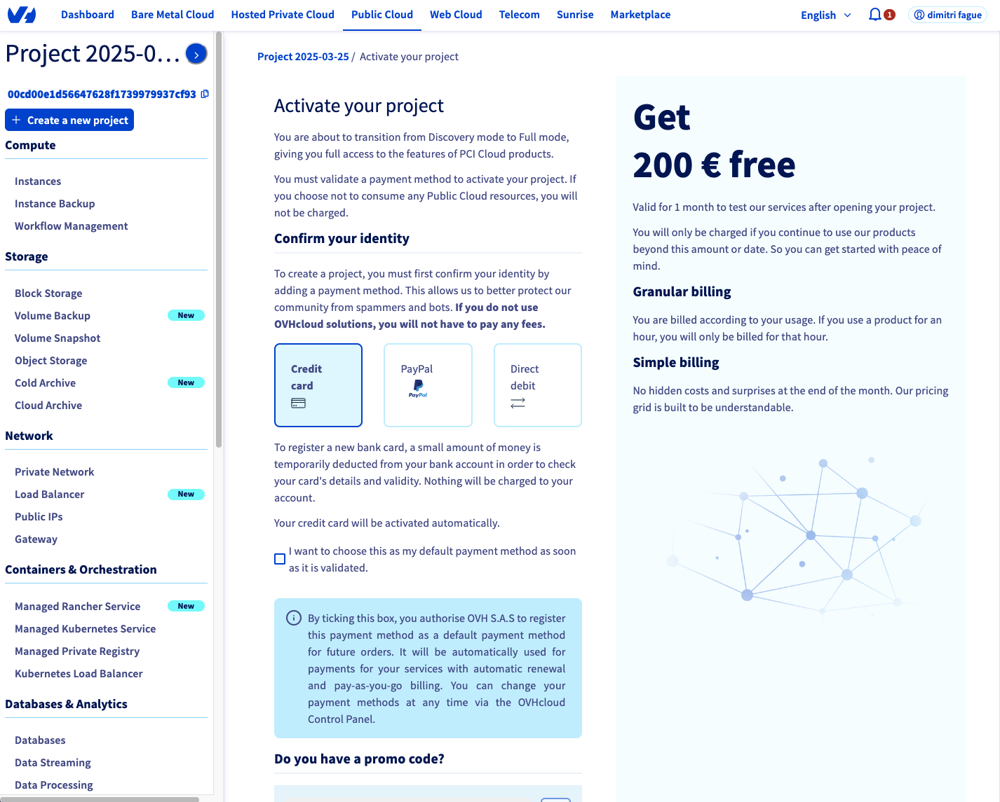
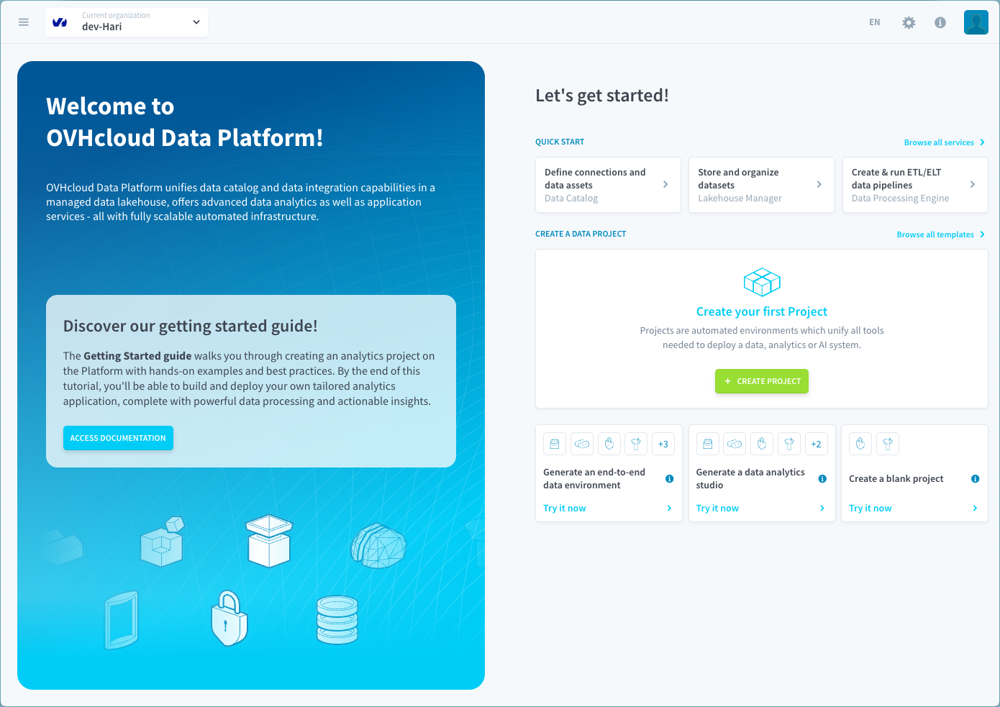
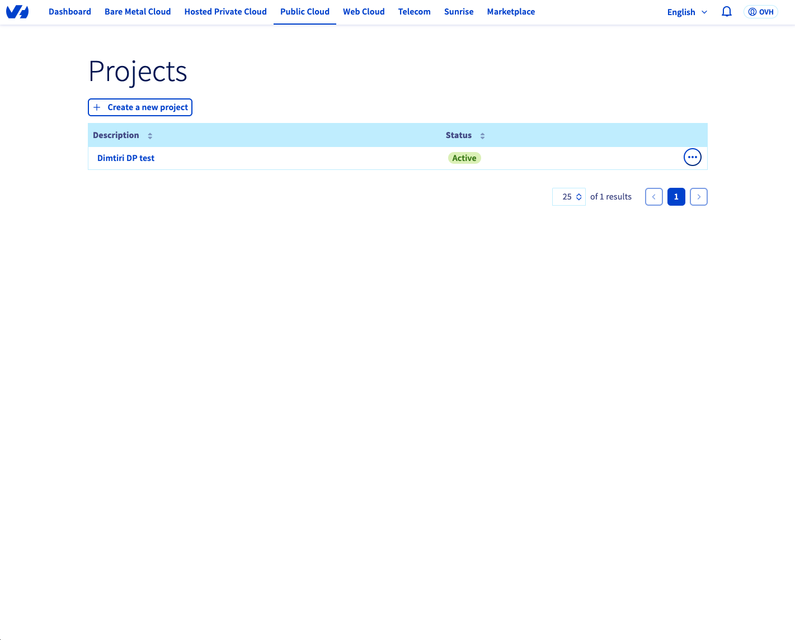
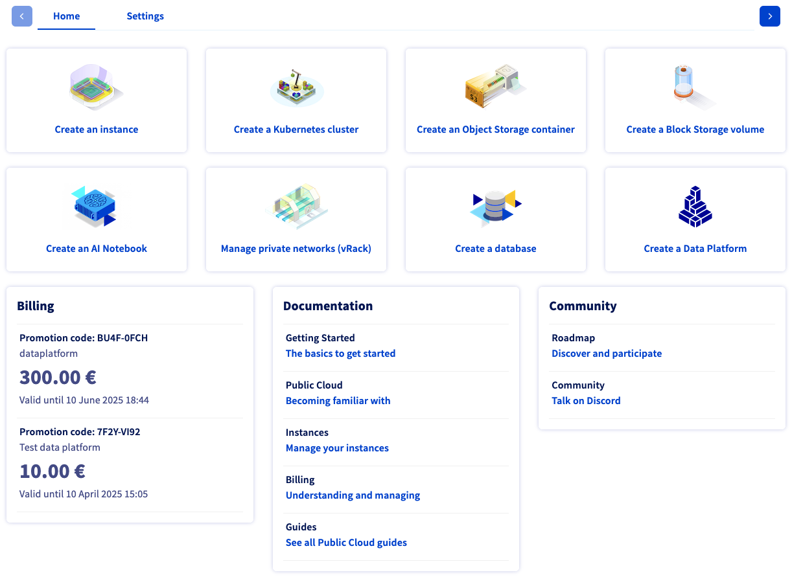
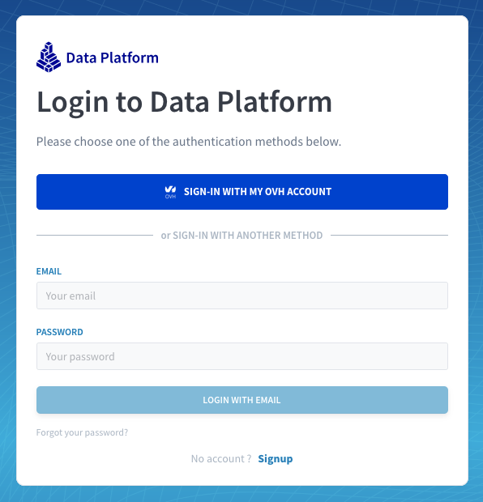

## Objective

You can sign up if you are new to Data Platform or sign in if you have an existing Data Platform organization.

## Sign-up

> [!primary]
> If you have received an invitation to join an existing Data Platform Organization from an admin, you can alternatively sign up with your email.

To access OVHcloud Data Platform for the first time, you need an [OVHcloud account](/pages/account_and_service_management/account_information/ovhcloud-account-creation) and a [Public Cloud project](/pages/public_cloud/compute/create_a_public_cloud_project).

You have different options: sign up from the website or from the OVHcloud Control Panel.

### Option 1: Sign-up from the OVHcloud Website Data Platform Product Page

1. Go to the [Data Platform website](/links/public-cloud/data-platform).
    {.thumbnail}
2. Click the `Get started for free`{.action} button.
3. If you are not logged in, you will be redirected to the OVHcloud account-creation/login-page.
    {.thumbnail}

#### If you do not have any active Public Cloud project:

1. Accept the Public Cloud service Terms and Conditions.
    {.thumbnail}

2. Wait for your project to be created.
    {.thumbnail}

3. You will then be asked to add a payment method - **You will benefit from a €200 credit to try the service for free during 30 days**
    {.thumbnail}

4. You are then invited to your Data Platform organization.
    {.thumbnail}

#### If you have at least one active Public Cloud project:

1. Select your Public Cloud project or create a new one.
    {.thumbnail}

2. You are then invited to your Data Platform organization
    {.thumbnail}

> [!primary]
> Each Public Cloud project can only have one organization linked to it. Based on your project name, an organization will be automatically created for you when the Data Platform is launched.

### Option 2: Sign-up from the OVHcloud Control Panel

If you have an existing OVHcloud account and an active Public Cloud project, you can launch the Data Platform service from the [OVHcloud Control Panel](/links/manager).

You can access it via two links:

- From the left-side menu in the `Databases & Analytics section.
- Directly via the `Create a Data Platform`{.action} card on the right side.

{.thumbnail}

## Sign-in

Click [here](https://eu.dataplatform.ovh.net/) to access the Data Platform sign-in page.

Click on `SIGN-IN WITH MY OVH ACCOUNT`{.action}.

{.thumbnail}

> [!primary]
> Signing-in with email and password is only available for people who have been previously invited by their admin to an existing organization.

##  Need help?

At any step, you can create a ticket to raise an incident or if you need support at the [OVHcloud Help Centre](https://help.ovhcloud.com/csm?id=csm_get_help).

Additionally, you can ask for support by reaching out to us on the Data Platform Channel within the [Discord Server](https://discord.gg/ovhcloud).
