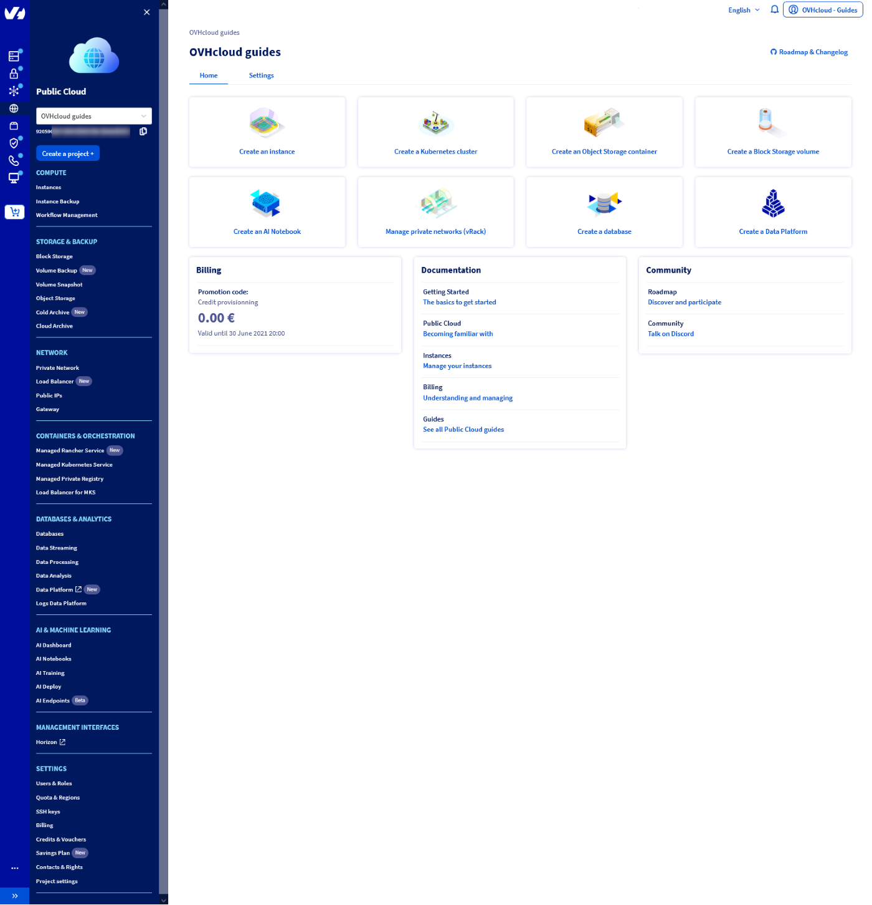
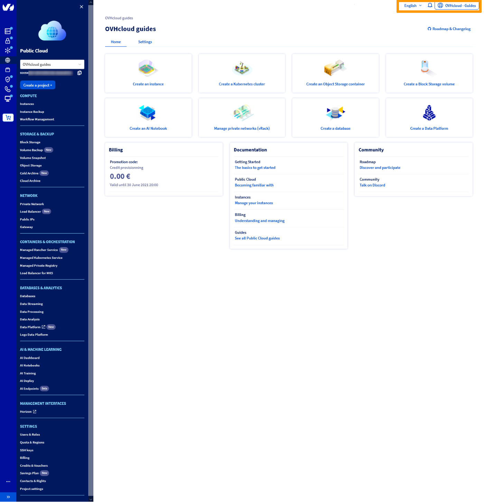
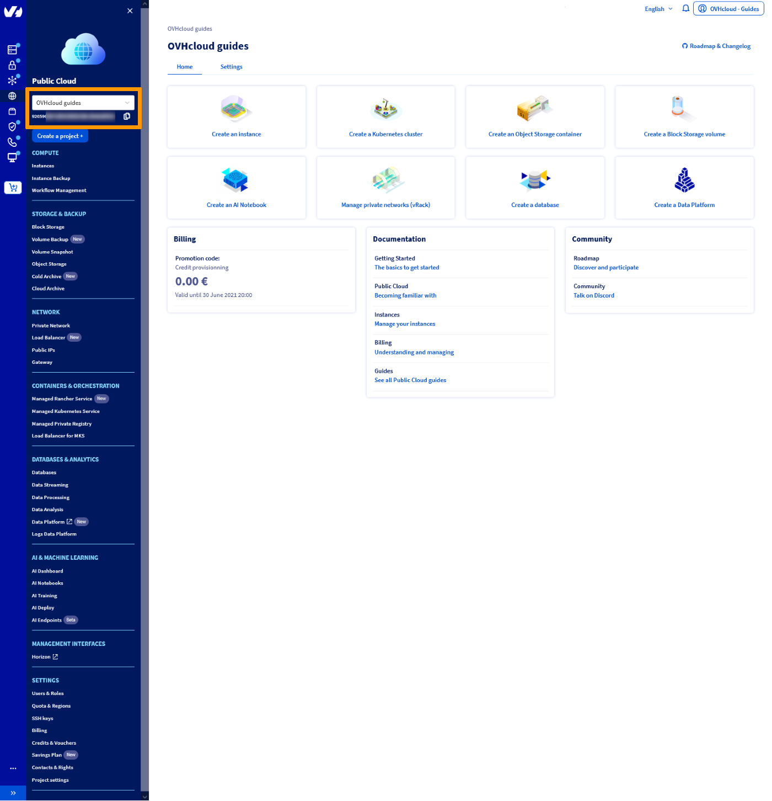
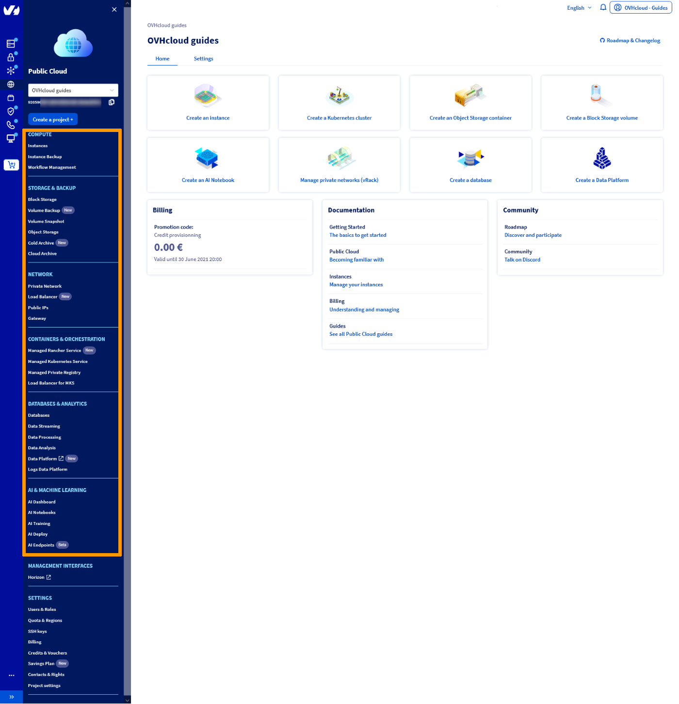
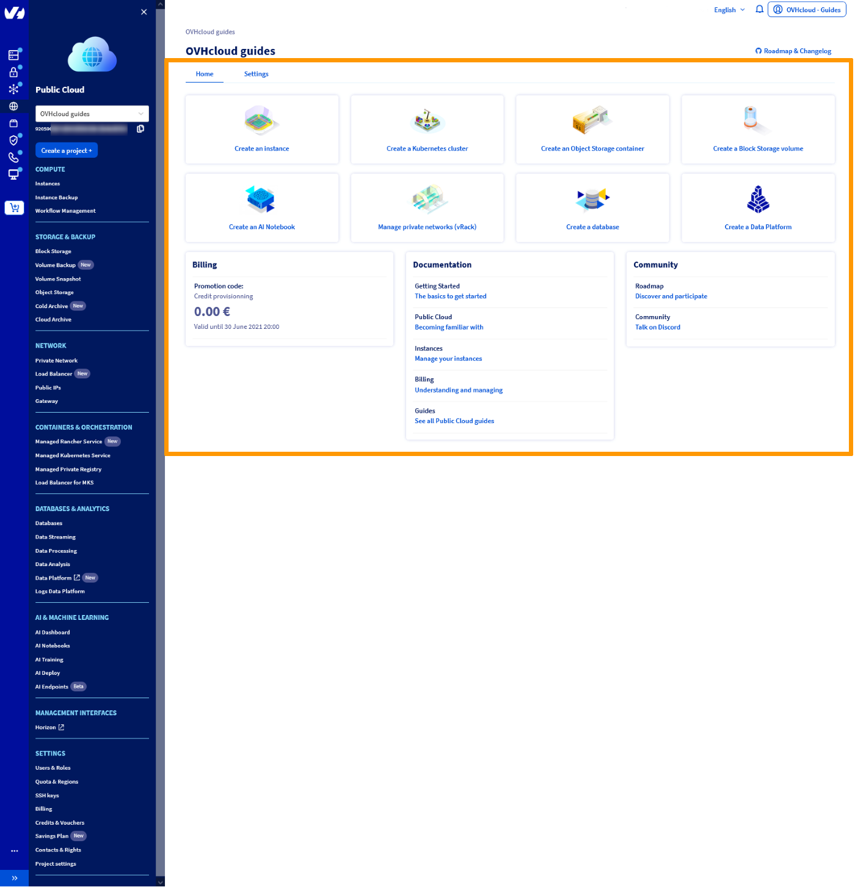
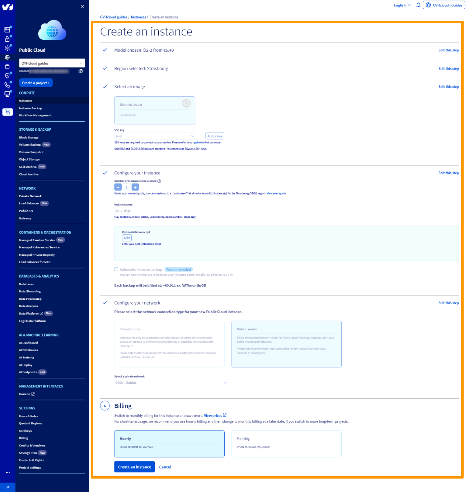
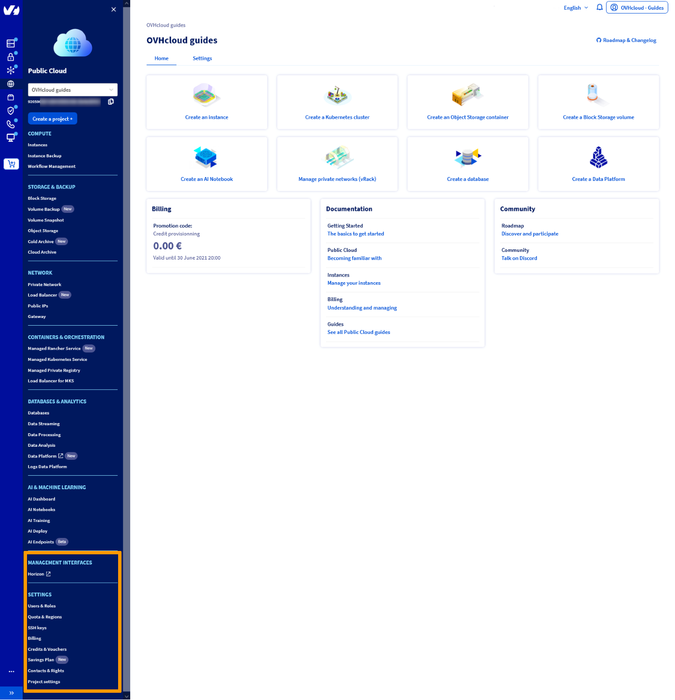

## Ziel

Sie haben gerade Ihr Public Cloud Projekt erstellt und möchten mehr über das Benutzerinterface im OVHcloud Kundencenter erfahren.

**Diese Anleitung erklärt die wichtigsten Bereiche des Public Cloud Interface im OVHcloud Kundencenter.**

## Voraussetzungen

- Sie haben Zugriff auf Ihr [OVHcloud Kundencenter](/links/manager).
- Sie haben ein erstes [Public Cloud Projekt](/pages/public_cloud/public_cloud_cross_functional/create_a_public_cloud_project) erstellt.

## In der praktischen Anwendung

Sobald Ihr erstes Public Cloud Projekt erstellt wurde, werden Sie zum primären Public Cloud Interface weitergeleitet.

{.thumbnail}

### Zugriff auf Ihre OVHcloud Account-Informationen

Die Einstellungen Ihres OVHcloud Accounts bleiben jederzeit verfügbar, ebenso wie Benachrichtigungen oder die Spracheinstellung im Kundencenter.

{.thumbnail}

### Ihr Public Cloud Projekt

Da es möglich ist, mehrere Projekte (je nach Ihren Quotas) zu verwenden, werden Projektname und -ID links angezeigt. Somit ist stets ersichtlich, welches Projekt bearbeitet wird.

{.thumbnail}

Die Projekt-ID kann bei der Verwendung der CLI, manchen Support-Anfragen oder bei anderen Anfragen erforderlich sein. Sie können sie kopieren, indem Sie rechts auf das Icon klicken.

Sie können den Projektnamen im Tab `Einstellungen`{.action} bearbeiten. Geben Sie einen neuen Namen ein und klicken Sie auf `Update`{.action}.

{.thumbnail}

### Das Public Cloud Hauptmenü

{.thumbnail}

|Abschnitt|Beschreibung der Optionen|
|---|---|
|**Compute**|In diesem Bereich können Sie Instanzen erzeugen; diese Cloud Server sind *on demand* verfügbar.|
|**Storage und Backups**|In diesem Abschnitt finden Sie verschiedene Storage- und Datenbanklösungen, die jeweils einem bestimmten Bedarf und einer bestimmten Nutzung entsprechen.|
|**Network**|In diesem Abschnitt können Sie Ihre Public Cloud Ressourcen untereinander oder mit anderen OVHcloud Diensten vernetzen.|
|**Container & Orchestrierung**|Diese Rubrik bietet Ihnen verschiedene Tools zur Automatisierung Ihrer Architekturen und zur Erhöhung der Flexibilität.|
|**Datenbanken und Analysen**|Diese Dienste unterstützen Sie bei der Lösung von Big Data und Data Analytics Problemen.|
|**AI & Machine Learning**|In diesem Abschnitt finden Sie OVHcloud Tools für künstliche Intelligenz.|

### Shortcuts

Im Hauptsegment finden Sie Direktlinks zum schnellen Zugriff auf die Konfigurationsassistenten und relevante Anleitungen.

{.thumbnail}

#### Assistent zur Erstellung von Ressourcen

Für jede Ressource, die Sie im Kundencenter erstellen, wird Ihnen ein Konfigurationsassistent zur Verfügung gestellt, mit dem Sie die Ressource nach Ihren Bedürfnissen einrichten können.
 Die Einrichtungsschritte umfassen meistens den Standort der Ressource, das Modell, einige individuelle Parameter und in manchen Fällen den Abrechnungsmodus auswählen.

{.thumbnail}

### Die Verwaltungswerkzeuge

In Ihrem Public Cloud Projekt sind mehrere Management-Tools verfügbar, die sich im unteren Bereich der linken Menüleiste befinden.

{.thumbnail}

|Menüeintrag|Beschreibung|
|---|---|
|**Horizon**|Dies ist die unveränderte [grafische Oberfläche](/pages/public_cloud/public_cloud_cross_functional/introducing_horizon), die für Openstack verfügbar ist. Benutzer, die mit diesem Interface vertraut sind, können es wie gewohnt verwenden.|
|**User und Rollen**|Ermöglicht die [Erstellung von Benutzern](/pages/public_cloud/public_cloud_cross_functional/create_and_delete_a_user) und deren Berechtigungen. Diese Benutzer können direkt auf die APIs oder das Horizon-Interface zugreifen. Sie können zum Beispiel einen Benutzer für Ihre klassischen Wartungsarbeiten und einen Benutzer für Automatisierungswerkzeuge wie Terraform erstellen.|
|**Quota und Regionen**|Dieses Tool erlaubt es Ihnen, die Standorte und die Begrenzungen der für Ihr Projekt verfügbaren Ressourcen zu steuern.  **Quota**: Unser System setzt nach bestimmten Kriterien (Anzahl bereits bezahlter Rechnungen, Verwendung anderer OVHcloud Produkte) Quotas (Limitierungen) für die Neuerstellung von Ressourcen ein, um Probleme mit Zahlungsausfällen zu vermeiden. Im Normalfall erhöht das System Ihre Quotas automatisch, wenn bestimmte Kriterien erfüllt werden. Hier können Sie beantragen, [eine Quota manuell zu erhöhen](/pages/public_cloud/public_cloud_cross_functional/increasing_public_cloud_quota#manuelle-erhohung-der-ressourcenquote).  **Die Standorte**: Die Public Cloud ist an mehreren Standorten weltweit verfügbar. Darüber hinaus kann jeder Standort mehrere "Regionen" (OpenStack-spezifisches Konzept) umfassen. Für einen europäischen Kunden beispielsweise ist die APAC-Zone (Asien-Pazifik) standardmäßig deaktiviert. Bei Bedarf können Sie über dieses Menü neue Regionen aktivieren.|
|**SSH-Schlüssel**|Ein Werkzeug, mit dem Sie Ihre [SSH-Schlüssel](/pages/public_cloud/compute/creating-ssh-keys-pci) zentral verwalten können.|
|**Abrechnung**|Public Cloud funktioniert nach dem Prinzip *pay as you go*, wobei die Rechnungen am Ende des Monats ausgestellt werden. In [diesem Menü](/pages/public_cloud/public_cloud_cross_functional/analyze_billing) können Sie Ihren aktuellen Verbrauch einsehen, eine Prognose für die nächste Rechnung einsehen und natürlich Ihre vorherigen Rechnungen einsehen.|
|**Guthaben & Gutscheine**|Dieses Menü erlaubt es Ihnen, den Verbrauch eines Coupons einzusehen, einen Coupon hinzuzufügen oder Guthaben direkt zu Ihrem Public Cloud Projekt [hinzuzufügen](/pages/account_and_service_management/managing_billing_payments_and_services/add_cloud_credit_to_project).|
|**Savings Plan**| Dieses Preismodell bietet Rabatte auf bestimmte Ressourcen, wenn Sie sich für Vertragslaufzeiten von bis zu 36 Monaten entscheiden.|
|**Kontakt & Rechte**|Neben der Möglichkeit, den technischen Kontakt oder den Rechnungskontakt Ihres Projekts zu ändern, können Sie weitere [Kontakte (OVHcloud Kunden-Account) hinzufügen](/pages/public_cloud/compute/change_project_contacts), um Ihr Projekt technisch zu verwalten. Sie können auch Benutzer mit Berechtigung *read-only* hinzufügen.|
|**Projektparameter**|Dieses Tool erlaubt es Ihnen, die allgemeinen Einstellungen des Projekts wie den Namen, die Konfiguration als "Standardprojekt Ihres Accounts" sowie HDS-Kompatibilität zu konfigurieren oder Ihr [Public Cloud Projekt zu entfernen](/pages/public_cloud/public_cloud_cross_functional/delete_a_project).|

### Verwaltung von Dienstleistungen

<iframe class="video" width="560" height="315" src="https://www.youtube-nocookie.com/embed/2mHcXQC6mTM?si=8_0aQCfBtmumGRbh" title="YouTube video player" frameborder="0" allow="accelerometer; autoplay; clipboard-write; encrypted-media; gyroscope; picture-in-picture; web-share" referrerpolicy="strict-origin-when-cross-origin" allowfullscreen></iframe>

> [!primary]
>
> Dieser Abschnitt bietet einen Überblick über die Optionen zur Verwaltung Ihrer OVHcloud Dienste, wofür drei Tools zur Verfügung stehen: das OVHcloud Kundencenter, Horizon und die OpenStack API. Jedes dieser Tools ist auf spezifische Nutzeranforderungen zugeschnitten und bietet Verwaltungsoptionenn für alle Anforderungen je nach Ihrem Fachwissen, bevorzugten Verwaltungstypen sowie Ihren Leistungs- und Anpassungsbedürfnissen.
>
> Die folgende Tabelle vergleicht die wichtigsten Merkmale jedes Tools, um Ihnen die Auswahl der passenden Lösung zu erleichtern. Egal ob Sie Anfänger, fortgeschrittener Benutzer oder Automatisierungsexperte sind, dieser Vergleich hilft Ihnen, die Vorteile, die Benutzerfreundlichkeit, die erforderlichen Kompetenzniveaus und die Skalierbarkeit jedes Tools besser zu verstehen.
>

| Kriterien/Eigenschaften                     | OVHcloud Kundencenter  | Horizon | OpenStack API |
| ------------------------------------------- | ---------------------- | ------- | ------------- |
| Hauptvorteile                               | Intuitive Benutzeroberfläche, ideal für einen schnellen Einstieg. | Bietet mehr Kontrolle für erfahrene Nutzer mit einer erweiterten Ansicht der Einstellungen. | Vollständige Automatisierung mit nahtloser Integration in andere Tools. |
| Erforderliches Kompetenzniveau              | Für jeden zugänglich, ideal für Anfänger oder einfache Bedürfnisse | Mittelstufe, erfordert eine gewisse Expertise (z.B. Systemadministratoren, Cloud-Ingenieure) | Fortgeschritten, erfordert Skripting-/API-Kenntnisse (Cloud-Architekten, DevOps-Ingenieure, Automatisierungsexperten) |
| Einfache Handhabung                         | Intuitiv und zugänglich | Fortgeschritten, aber visuell | Technik |
| Individuelle Gestaltung                     | Niedrig - Ideal für schnelle Standardkonfigurationen mit begrenzter erweiterter Kontrolle | Mittelstufe - Grafische Benutzeroberfläche, die erweiterte Einstellungen (Netzwerk, Speicher, etc.) bietet, wenn auch durch die Benutzeroberfläche eingeschränkt. | Sehr hoch - Nahezu vollständige Anpassung über APIs, mit der Möglichkeit, Skripte, automatisierte Workflows und maßgeschneiderte Architekturen zu erstellen. |
| Performance und Skalierbarkeit              | Begrenzte Performance und grundlegende Skalierbarkeit. Geeignet für kleine und nicht kritische Bereitstellungen. Die Skalierbarkeit ist in der Regel manuell und langsamer. Ideal für statische Umgebungen oder kleine Projekte. | Durchschnittliche Performance mit verbessertem Skalierbarkeitsmanagement über die grafische Benutzeroberfläche. Schnellere Skalierbarkeit als mit dem OVHcloud Kundencenter, jedoch begrenzt durch das Interface. Geeignet für mittelgroße Projekte oder Projekte, die eine gewisse Skalierbarkeit erfordern. | Maximale Performance und vollständige Skalierbarkeit. Ermöglicht große, automatisierte und schnelle Deployments über Skripte oder Tools von Drittanbietern. Ideal für dynamische Infrastrukturen, hohe Lasten und Umgebungen, die eine hohe Elastizität erfordern. Empfohlen für kritische Architekturen. |
| Einsatzbereiche (Compute)          | - Erstellung und vereinfachte Verwaltung der virtuellen Maschinen (VMs).  - Größenänderung von VMs nach der Erstellung (Änderung des Flavour-Modells bei laufendem oder kaltem Betrieb, abhängig von den verfügbaren Ressourcen).  - Auswahl der Standardkonfigurationen für die VMs (RAM, CPU, Speicherplatz).  - Verwaltung der wichtigsten Aktionen: Starten, Anhalten und Löschen von VMs.  - Snapshot-Zugriff für schnelle Backups und vereinfachte Wiederherstellungen.  - Zuweisung und Verwaltung von Floating IP-Adressen.  - Erstellung und grundlegende Verwaltung von zusätzlichen Disks.  - Ressourcenüberwachung Grundlegendes Monitoring (CPU, Speicher, Speicherplatz). | - Erweiterte Zugriffsverwaltung: Unterstützung der rollenbasierten Zugriffskontrolle (RBAC) für eine sichere Mehrbenutzerverwaltung.  - Fortgeschrittene Netzwerkadministration: Erstellung und Verwaltung komplexer privater Netzwerke, die mit VMs verbunden sind (interne Netzwerke, Subnetze).  - Einsatz von VMs mit spezifischen Netzwerkkonfigurationen, einschließlich der Verwaltung mehrerer Netzwerkschnittstellen.  - Verwendung personalisierter Images für die Erstellung von VMs als Alternative zu den von OVHcloud angebotenen Standard-Images.  - Integration vorkonfigurierter Workflows über Horizon zur Automatisierung von Bereitstellung und Konfiguration. | - Vollständige Automatisierung: Alle im OVHcloud Kundencenter und Horizon verfügbaren Aktionen können über die API durchgeführt werden, mit der Möglichkeit, sie zu automatisieren und zu skriptieren.  - Bereitstellung von Infrastrukturen im Infrastructure as Code (IaC) Modus mit Tools wie Terraform, Ansible oder benutzerdefinierten Skripten.  - Integration mit CI/CD-Pipelines für automatisierte Bereitstellungen (z.B. Integration mit GitLab CI).  - Fortgeschrittene Verwaltung der Ressourcen-Quotas (Anzahl der CPUs, RAM, etc.).  - Dynamische Skalierbarkeit: Automatische Anpassung von Instanzen an die Last über APIs oder Skripte.  - Monitoring und Erfassung personalisierter Metriken über die API, die eine höhere Granularität als das Horizon-Interface oder das OVHcloud Kundencenter bieten. |
| Nutzungsperimeter (Network)          | - Erstellung und Verwaltung von privaten Netzwerken.  - Zuordnung von Floating IPs und Additional IPs.  - Basiskonfiguration für Routing (Basic Routing). | - Erweiterte Verwaltung von Sicherheitsregeln über Sicherheitsgruppen (Security Groups).  - Visualisierung von Netzwerktopologien für eine vereinfachte Verwaltung.  - Vollständige Unterstützung von IPv6-Subnetzen für moderne Konnektivität.  - Konfiguration von QoS-Richtlinien (Quality of Service) zur Priorisierung von Netzwerkressourcen. | - Zugriff auf alle verfügbaren Funktionen in Horizon und im OVHcloud Kundencenter.  - Erstellung personalisierter Routen für eine flexiblere Netzwerkverwaltung.  - Genaue Konfiguration der QoS-Richtlinien (Quality of Service).  - Erweiterte Verwaltung von Virtual Router Redundancy Protocol (VRRP) zur Sicherstellung der Redundanz der Router.  - Automatisierung von Netzwerkaktionen mit Skripten (Infrastructure as Code).  - Integration mit Software-Defined Networking (SDN)-Lösungen für ein agiles Netzwerkmanagement. |
| Nutzungsbereiche (Storage und Backups) | - Erstellung und Verwaltung von Speichervolumes: Object Storage, Block Storage und File Storage.  - Grundlegende automatische Sicherung (Snapshots) von Volumes, mit der Möglichkeit der Wiederherstellung.  - Die Zuordnung von Speichervolumes zu Instanzen ermöglicht einen vereinfachten Zugriff.  - Verwaltung von Object Storage Containern (Swift) zur Organisation der Daten.  - Visualisierung des Status von Volumes und des verwendeten Speicherplatzes.  - Hinzufügen und Verwalten von Dateien in einem Object Storage. | - Erweiterte Snapshot-Verwaltung: Aufbewahrung, Duplizierung und andere Optionen für eine genaue Kontrolle der Backups.  - Detaillierte Verwaltung der Freigabe von Volumes (Multi-Attach) für mehr Flexibilität.  - Erstellen und Verwalten von geplanten Backups mit anpassbaren Backup-Richtlinien.  - Überwachen der Speicherkontingentnutzung für eine optimale Nachverfolgung des verfügbaren Speicherplatzes. | - Funktionen über Horizon und das OVHcloud Kundencenter verfügbar.  - Integration und Automatisierung über Skripte (Infrastructure as Code) für eine reibungslose Verwaltung.  - Erweiterte Konfiguration von Netzwerkfreigaben (NFS, CIFS) für mehr Flexibilität bei der Organisation von Dateien.  - Präzise Verwaltung der Objektmetadaten in Object Storage für eine optimale Datenkontrolle.  - Erweiterte Konfiguration der Replikation und Versionierung von Objekten für hohe Verfügbarkeit und umfassende Versionsverwaltung.  - Direkter Zugriff auf die Swift-API für eine nahtlose Integration mit Tools von Drittanbietern.  - Erstellung von benutzerdefinierten Workflows zur Automatisierung und effizienten Verwaltung von Sicherungsprozessen. |

## Weiterführende Informationen

[Public Cloud Instanz erstellen und verwenden](/pages/public_cloud/compute/public-cloud-first-steps)

Wenn Sie Schulungen oder technische Unterstützung bei der Implementierung unserer Lösungen benötigen, wenden Sie sich an Ihren Vertriebsmitarbeiter oder klicken Sie auf [diesen Link](/links/professional-services), um einen Kostenvoranschlag zu erhalten und eine persönliche Analyse Ihres Projekts durch unsere Experten des Professional Services Teams anzufordern.

Treten Sie unserer [User Community](/links/community) bei.
