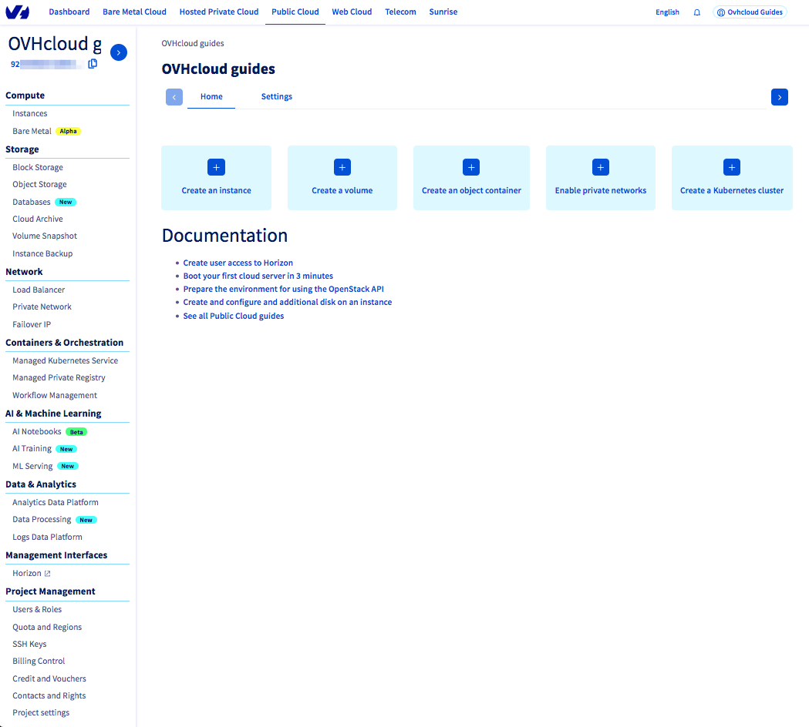
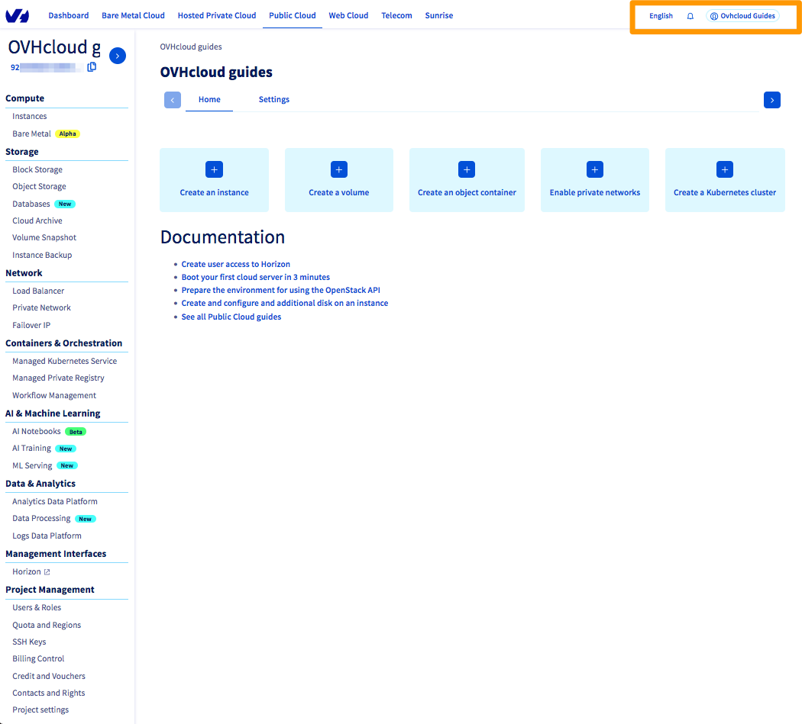
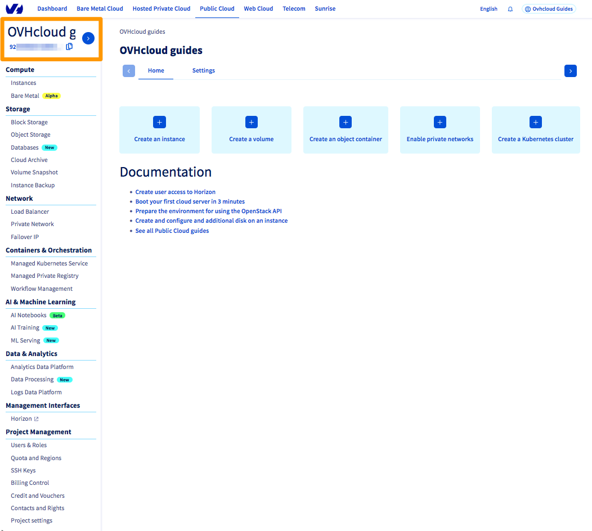
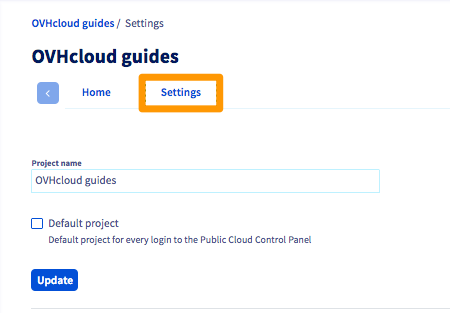
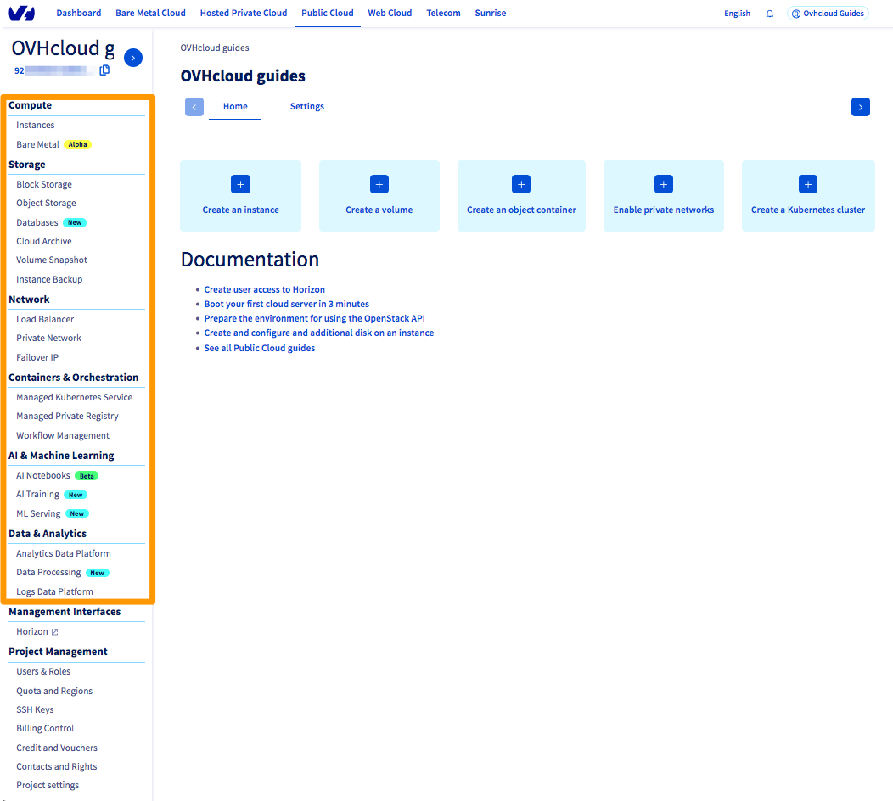
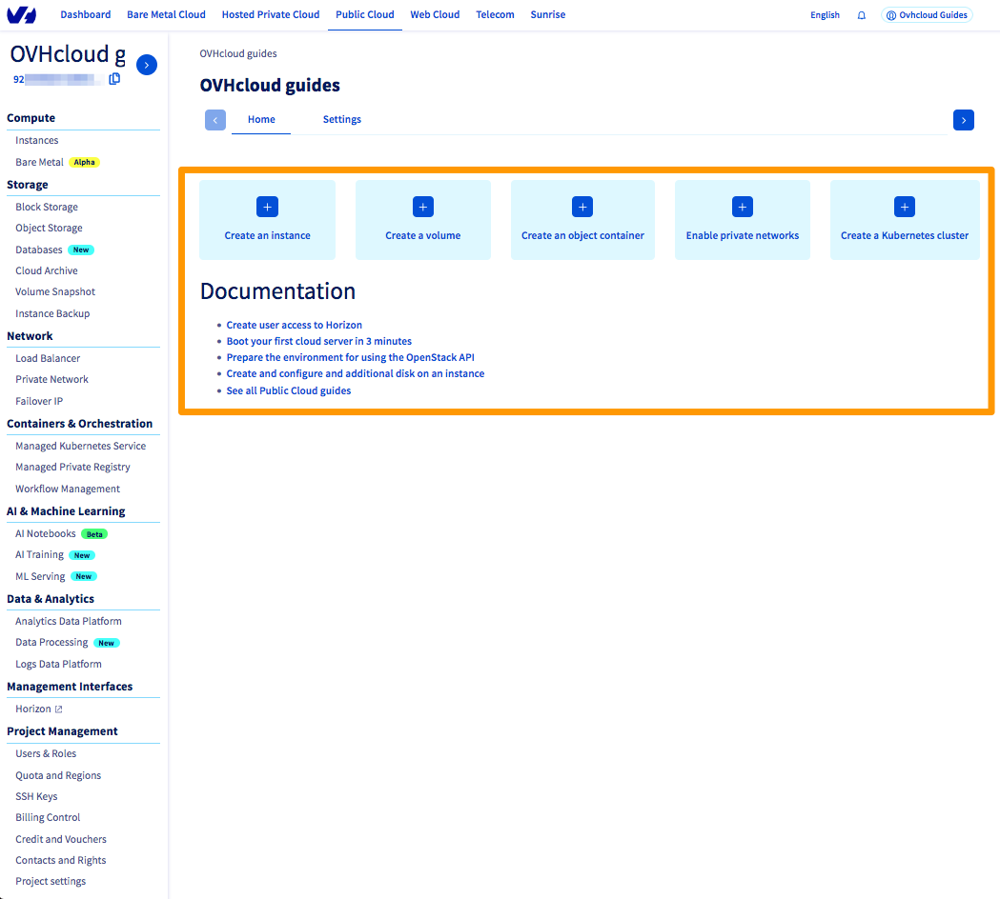
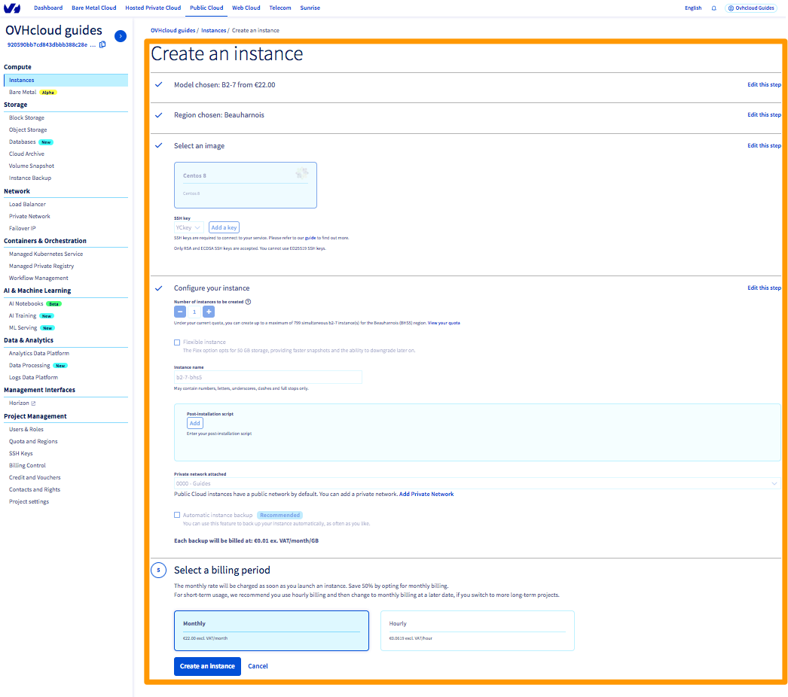
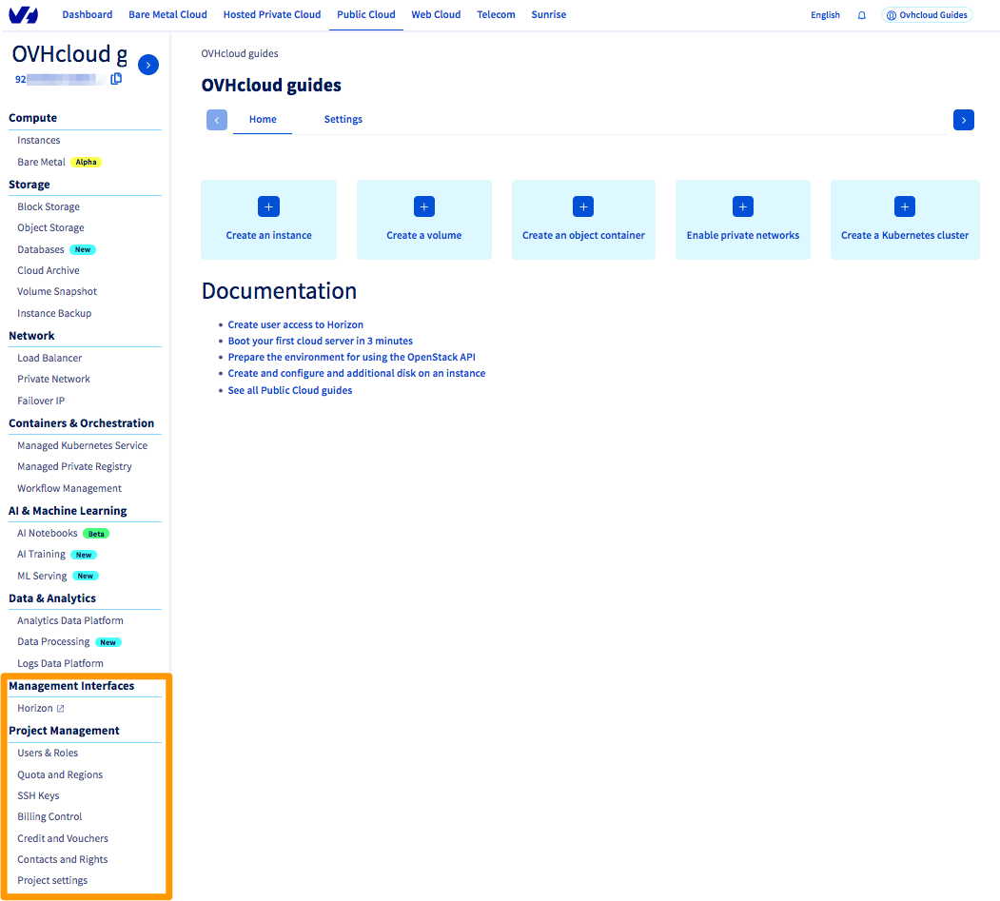

## Objective

You have just created your Public Cloud project, and you would like to find out more about the user interface in the OVHcloud Control Panel.

**Explore the main sections of the Public Cloud interface in the OVHcloud Control Panel.**

## Requirements

- access to the [OVHcloud Control Panel](/links/manager){.external}.
- You need to have created your [first Public Cloud project](/pages/public_cloud/public_cloud_cross_functional/create_a_public_cloud_project).

## Instructions

Once you have created your first Public Cloud project, you will be redirected to the main Public Cloud interface.

{.thumbnail}

### Access to your OVHcloud account information

Your OVHcloud account settings are accessible at any time, as are notifications or a change of language in the OVHcloud Control Panel.

{.thumbnail}

### Your Public Cloud project

Because you can use multiple projects (depending on your quotas), the project name and ID are always displayed, regardless of which screen you are visiting, so you know what environment you are acting on.

{.thumbnail}

The ID may be required when using the CLI, for certain support requests or otherwise. You can copy it by clicking on the icon to the right of it.

You can change the project name via the `Settings`{.action} tab. Enter a new name, then click on `Update`{.action}.

{.thumbnail}

### The Public Cloud main menu

{.thumbnail}

|Section|Options description|
|---|---|
|**Compute**|This section allows you to start instances, these are cloud servers available on demand.|
|**Storage**|In this section, you will find different storage solutions and databases, each corresponding to a specific need and use.|
|**Network**|In this section, you will find everything you need to interconnect your Public Cloud resources, and how to connect them to other OVHcloud products.|
|**Containers and Orchestration**|This section offers you various tools to automate your architectures and gain flexibility.|
|**AI & Machine Learning**|In this section, you will find the OVHcloud artificial intelligence tools.|
|**Data & Analytics**|These services will help you solve your Big Data and Data Analytics problems.|

### Shortcuts

The center of the screen provides shortcuts for quick access to the most useful configuration wizards and guides.

{.thumbnail}

#### Assistance for the creation of resources

For each resource you want to create, you will be accompanied by a configuration wizard which, step by step, allows you to set up the resource according to your needs. 
 Most of the time, you will have to choose the location of the resource, the model, some customisable settings and, in some cases, the billing method.

{.thumbnail}

### Management tools

There are several management tools available in your Public Cloud project, they are located at the bottom of the left-side menu bar.

{.thumbnail}

|Menu entry|Description|
|---|---|
|**Horizon**|This is the [graphical interface](/pages/public_cloud/public_cloud_cross_functional/introducing_horizon) usually available on OpenStack. It is not altered, which allows users who are used to this interface to easily navigate it.|
|**Users and Roles**|Allows you to [create users](/pages/public_cloud/compute/create_and_delete_a_user) and assign them a role. These users can also access the APIs or the Horizon interface directly. For example, you can create a user for your standard maintenance operations, and a user for your automation tools, such as Terraform.|
|**Quota and Regions**|This tool allows you to control the locations and resource limits available on your project.  **Quotas**: Based on certain criteria (number of bills already paid, use of other OVHcloud products), our system sets quotas (limits) on the number of resources you can create, in order to avoid any outstanding amounts. By default, the system increases your quotas automatically when certain criteria are met. However, you can [manually increase a quota](/pages/public_cloud/public_cloud_cross_functional/increasing_public_cloud_quota#increasing-your-resources-quota-manually) from this tool.  **Regions**: Public Cloud is available in several locations around the world. Furthermore, each location can contain several “regions” (a concept unique to OpenStack). For example, for a European customer, the APAC (Asia Pacific) zone is disabled by default. If it suits your needs, you can activate new regions from this menu.|
|**SSH Keys**|A tool that allows you to [manage your SSH keys](/pages/public_cloud/compute/creating-ssh-keys-pci) in a centralised way.|
|**Billing Control**|Since the Public Cloud is based on *pay as you go*, invoices are issued at the end of the month. In [this menu](/pages/public_cloud/public_cloud_cross_functional/analyze_billing), you can track your current usage, see a forecast for the next invoice, and of course see your previous invoices.|
|**Credit and Vouchers**|This menu allows you to view the consumption of a voucher, add a voucher, or [add credit](/pages/account_and_service_management/managing_billing_payments_and_services/add_cloud_credit_to_project) directly to your Public Cloud project.|
|**Contacts and Rights**|In addition to changing the technical contact or billing contact for your project, you will have the option of [adding other contacts](/pages/public_cloud/compute/change_project_contacts) (OVHcloud account) to manage your project technically. You can also add users in read-only mode.|
|**Project settings**|With this tool, you can configure the project’s general settings, such as its name, its configuration as a "default project for the account", HDS compatibility, or [delete your Public Cloud project](/pages/public_cloud/public_cloud_cross_functional/delete_a_project).|

### Services management

> [!primary]
>
> In this section, we present an overview of the different service management options offered by OVHcloud, through three main tools: the OVHcloud Control Panel, Horizon and the OpenStack API. Each of these tools has been designed to meet specific needs according to your level of expertise, management preferences, and performance and customization requirements.
>
> The matrix below compares the key features of each tool to help you choose the solution best suited to your needs. Whether you're a beginner, intermediate user or automation expert, this comparison will help you better understand the benefits, ease of use, skill levels required, and scalability of each tool.
>

| Criteria/Characteristics                   | OVHcloud Control Panel | Horizon | OpenStack API |
| ------------------------------------------ | ---------------------- | ------- | ------------- |
| Key benefits | Intuitive interface, ideal for quick start-up. | Increased control for experienced users, with an advanced view of parameters. | Complete automation, with seamless integration with other tools.
| Skill level required                       | Accessible to all, ideal for beginners or simple needs | Intermediate, requires some expertise (System Administrators, Cloud Engineers, etc.) | Advanced, requires scripting/API skills (Cloud Architects, DevOps Engineers, Automation Experts) |
| Ease of use                                | Intuitive and accessible | Advanced but visual | Technical |
| Customisation                            | Low - Ideal for fast, standard configurations, with limited advanced control. |  Medium - Graphical interface offering advanced settings (network, storage, etc.), albeit restricted by the user interface. | Very high - Virtually complete customization via API, with the ability to create scripts, automated workflows and customized architectures. |
| Performance and scalability                | Limited performance and basic scalability. Suitable for small or non-critical deployments. Scalability is generally manual and slower. Ideal for static environments or small projects. | Average performance with improved scalability management via GUI. Faster scalability than in the OVHcloud Control Panel, but limited by the interface. Suitable for medium-sized projects or those requiring scalability. |  Optimal performance and complete scalability. Enables rapid, automated mass deployments via scripts or third-party tools. Ideal for dynamic infrastructures, heavy loads and environments requiring high elasticity. Recommended for mission-critical architectures. |
| Perimeters of use (Compute)                | - Simplified creation and management of virtual machines (VMs).  - Resize VMs after creation (hot or cold modification of the flavor model, depending on available resources).  - Select standard VM configurations (RAM, CPU, storage).  - Management of essential actions: start, stop and delete VMs.  - Access to snapshots for fast backups and simplified restores.  - Assign and manage Floating IP addresses.  - Creation and basic administration of additional disks.  - Essential resource monitoring (CPU, memory, storage). | - Advanced access management: support for role-based access control (RBAC) for secure multi-user management.  - Advanced network administration: creation and management of complex private networks associated with VMs (internal networks, subnets).  - Deploy VMs with specific network configurations, including management of multiple network interfaces.  - Use of customised images for VM creation, as an alternative to the standard images offered by OVHcloud.  - Integration of pre-configured workflows via Horizon to automate deployment and configuration. | - Complete automation: all actions available in the OVHcloud Control Panel and Horizon can be carried out via the API, with the option of automating and scripting them.  - Infrastructure deployment in Infrastructure as Code (IaC) mode, using tools such as Terraform, Ansible or customized scripts.  - Integration with CI/CD pipelines for automated deployments (e.g. integration with GitLab CI).  - Advanced resource quota management (number of CPUs, total RAM, etc.).  - Dynamic scalability: automatic adjustment of instances according to load via API or scripts.  - Monitoring and collection of customised metrics via API, offering greater granularity than Horizon or OVHcloud Control Panel interfaces. |
| Perimeters of use (Network)                | - Create and manage private networks.  - Association of Floating IP addresses and additional IP addresses.  - Basic Routing configuration. | - Advanced management of security rules via Security Groups.  - Visualization of network topologies for simplified management.  - Full IPv6 subnet support for modern connectivity.  - Configuration of QoS (Quality of Service) policies to prioritize network resources. | - Access to all Horizon and OVHcloud Control Panel functionalities.  - Create customized routes for more flexible network management.  - Precise configuration of QoS (Quality of Service) policies.  - Advanced VRRP (Virtual Router Redundancy Protocol) management to ensure router redundancy.  - Automation of network actions through scripting (Infrastructure as Code).  - Integration with SDN (Software-Defined Networking) solutions for agile network management. |
| Perimeters of use (Storage & Backup)       | - Create and manage storage volumes: Object Storage, Block Storage and File Storage.  - Basic automatic backup (snapshots) of volumes, with the option of restoring them.  - Association of storage volumes with instances for simplified access.  - Object Storage (Swift) containers to organize data.  - Visualize volume status and used storage space.  - Add and manage files in Object Storage. | - Advanced snapshot management: retention, duplication and other options for precise backup control.  - Detailed multi-attach management for greater flexibility.  - Creation and management of scheduled backups with customisable backup policies.  - Monitoring of storage quota usage for optimal monitoring of available space. | - Features accessible via Horizon and the OVHcloud Control Panel.  - Integration and automation via scripts (Infrastructure as Code) for seamless management.  - Advanced configuration of network shares (NFS, CIFS) for greater flexibility in file organisation.  - Precise management of object metadata in Object Storage for optimal data control.  - Advanced configuration of object replication and versioning for high availability and complete version management.  - Direct access to Swift API for seamless integration with third-party tools.  - Customised workflows to automate and efficiently manage backup processes. |

## Go further

[Creating and connecting to your first Public Cloud instance](/pages/public_cloud/compute/public-cloud-first-steps)

If you need training or technical assistance to implement our solutions, contact your sales representative or click on [this link](/links/professional-services) to get a quote and ask our Professional Services experts for a custom analysis of your project.

Join our [community of users](/links/community).
