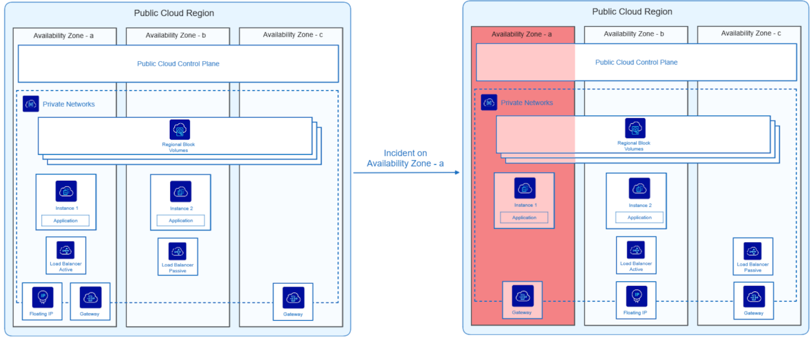
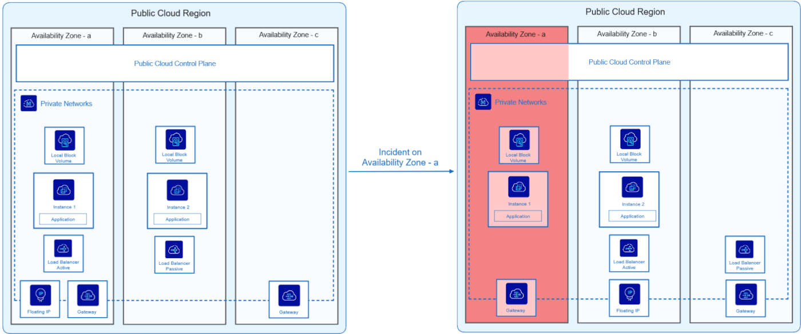

## Objectif

Ce guide a pour objectif d’éduquer et d’accompagner les clients sur les principes de résilience en **3-AZ** et les architectures de référence associées. Il détaille comment les services OVHcloud sont conçus pour fonctionner dans un environnement multi-AZ, les bonnes pratiques de déploiement et les mécanismes permettant d'assurer une haute disponibilité. Un tableau des spécifications des services **3-AZ** est fourni, ainsi que des exemples d’architectures en **2-AZ** pour aider les utilisateurs à structurer leurs infrastructures de manière résiliente.

## Déploiement et résilience des services en 3-AZ

Dans un environnement cloud, la disponibilité et la résilience des services sont essentielles pour garantir la continuité des opérations, même en cas de panne d’une zone de disponibilité (AZ). Ce document présente les différentes offres cloud et leurs mécanismes de résilience lorsqu’elles sont déployées sur trois Availability Zones (3-AZ).

Le tableau ci-dessous liste les services proposés, leur périmètre (zonal ou régional) et les bonnes pratiques de configuration pour assurer une résilience optimale. Enfin, il détaille le comportement attendu en cas de défaillance de l'AZ, afin d'aider les clients à anticiper les risques et à mettre en place des architectures adaptées.

| Service | Zonal/Local | Régional | Architecture/Bonnes pratiques de configuration | En cas de panne de l'AZ                                                              |
| ------- | ----------- | -------- | ---------------------------------------------- | ------------------------------------------------------------------------------------ |
| Instances | 
X
 | | Les instances étant des services zonaux, elles ne sont déployées que dans une seule zone de disponibilité. Pour assurer la résilience, les clients doivent répartir manuellement leurs instances sur plusieurs Availability Zones. La mise en place d'un Load Balancer régional peut être une solution, selon votre architecture et vos services. Par exemple, une base de données en cluster actif/passif répartie sur deux AZ peut basculer automatiquement d'une instance à l'autre sans Load Balancer. | En cas de défaillance d'une AZ, avec des mécanismes de résilience, la continuité de service est assuré par vos instances dans les autres AZ. |
| Private Network | | 
X
 | | Les agents DHCP/DNS fonctionnent dans deux AZ. En cas de défaillance d'une AZ, ils seront automatiquement réactivés dans l'AZ où ils ne sont pas déjà en cours d'exécution. |
| Public Cloud Load Balancer ( Octavia ) | | 
X
 | Le Load Balancer régional se compose d'un Load Balancer actif et d'un Load Balancer passif, chacun étant déployé dans une AZ distincte. | Le service restera disponible sans interruption. En cas de défaillance d'une AZ contenant un nœud de Load Balancer, celui-ci sera automatiquement déplacé vers la dernière AZ. |
| Gateway | | 
X
 | La Gateway régionale se compose d'une Gateway active et d'une Gateway passive, chacune étant déployée dans une AZ distincte.| Le service restera disponible sans interruption. |
| Floating Ip | | 
X
 | Le client peut attacher une Floating IP multi-AZ à n'importe quelle instance ou à n'importe quel Load Balancer dans n'importe quelle AZ. | Le service restera disponible sans interruption. |
| Object Storage ( Standard class ) | | 
X
 | L’Object Storage est un service régional offrant des options avancées de protection des données, dont la réplication hors site intégrée via l'espace client et la réplication asynchrone compatible S3 via l’API pour une configuration personnalisée. | Aucun impact sur le service Object Storage ni sur les données. Les données restent disponibles pour les opérations de lecture et d'écriture, même en cas de défaillance d'une AZ. Cette configuration est idéale pour les applications à haute disponibilité et tolérance de pannes. Une fois l'AZ rétablie, les blocs sont déplacés vers l'AZ affectée. Pour en savoir plus, [cliquez ici](/pages/storage_and_backup/object_storage/s3_regions_comparison). |
| Block storage High Speed | 
X
 | | L'offre HighSpeed est un service zonal avec une triple réplication au sein d'une seule zone de stockage. Pour assurer la résilience, les clients doivent déployer manuellement leur service Block Storage HighSpeed sur plusieurs AZ pour assurer la continuité du service. L'utilisation de backup de volume (locaux ou distants) peut également être intéressante dans certains cas d'utilisation pour restaurer un service block storage local. | En cas de panne majeure, le service étant zonal, les clients peuvent perdre leurs données et devront recréer leur volume Block (à partir de backup par exemple) lorsque l'AZ sera rétabli. |
| Block storage Classic Multi-Zone | | 
X
 | Le Block Storage Classic est un service régional utilisant le codage par effacement réparti sur plusieurs AZ. Une réplication hors site est recommandée pour se prémunir contre une défaillance régionale. | Les données du Block Storage resteront disponibles sans impact ni temps d'arrêt. En cas d'incident majeur, les chunks seront recréés dès que l'AZ sera rétablie. |
| Managed Kubernetes Service | | 
X
   
(À venir)
 | Avec les régions Managed Kubernetes en 3-AZ, le Control Plane est réparti sur 3 AZ. Le client doit déployer des worker nodes sur plusieurs AZ et utiliser des Block Storage Multi-Zone/Regionaux pour les volumes persistants. | En cas de défaillance d'une AZ, le Control Plane reste disponible et le workload du client est reprogrammé sur les nœuds d'une autre AZ disponible.   Il est à noter que les workloads utilisant des volumes persistants de classes single-zone ne peuvent pas être migrées vers d'autres AZ. Lorsque l'AZ est restaurée, le Control Plane redevient disponible dans l'AZ et le workload non migré reprend. |
| DBaaS | | 
X
   
(À venir)
 | Les nœuds de base de données sont répartis sur plusieurs nœuds dans différentes AZ. Le backup est utile en cas de défaillance régionale ou pour une base de données à un seul nœud. | En cas de défaillance de l'AZ, les bases de données et les données restent disponibles. Les offres Production et Advanced comprennent au moins deux nœuds, ce qui garantit l'absence d'interruption de service. Les backups sont automatiquement gérés par nos services et stockés hors site. Pour en savoir plus, [cliquez ici](/pages/public_cloud/public_cloud_databases/databases_05_automated_backups). |
<!-- | Private Registry | | 
X
 | Based on S3, with a control plane distributed over several geographical zones. Off-site replication is recommended in the event of regional failure. | In the event of AZ failure, the registry remains available.   On the basis of S3 3-AZ/regional storage, the data will remain available without impact.   The chunks will be recreated once the AZ is operational again. | -->
<!-- | Rancher | | 
X
 | Rancher managed service is a “global” service | No impact | -->
<!-- | File storage | | | File Storage is a zonal service with EC/triple replication within a single AZ. It is recommended to set up a backup or snapshot in another AZ. | In the event of a major outage, as the service is zonal, customers could lose their data and will have to recreate their file (from backups for example) when the AZ is restored. | -->

## Architecture de référence pour un déploiement Multi-AZ

> [!warning]
>
> Lors du déploiement d'un service zonal/local (par exemple, instances Compute ou Block storage HighSpeed), cela signifie que le service est compatible avec les régions 3-AZ, mais qu'il n'est pas automatiquement déployé dans chaque AZ de la région.
>
> - Pour une architecture 2-AZ, vous devez manuellement créer une instance en AZ-a et AZ-b.
> - Pour une architecture 3-AZ, il faut en créer une en AZ-a, AZ-b et AZ-c.
>

Cette section présente des architectures de référence pour un déploiement multi-AZ, illustrant différents scénarios de résilience face à la défaillance d’une AZ. À travers des schémas détaillés et des explications techniques, nous mettons en avant les bonnes pratiques pour concevoir des infrastructures robustes, garantir la disponibilité des services et optimiser la reprise après incident.

> [!primary]
>
> Le Control Plane Public Cloud, distribué dans toutes les Availability Zones (AZ), joue un rôle clé dans la gestion et l'orchestration des services cloud. Il gère l'équilibrage des charges, la gestion du Private Network et la coordination des ressources et du stockage.
> 
> Lors d'un incident sur l'AZ-a, le Control Plane reste disponible et opérationnel, garantissant la continuité des services critiques. Cela permet à la Floating IP et au Load Balancer d'adapter dynamiquement le trafic aux instances encore disponibles, garantissant ainsi une expérience utilisateur ininterrompue.
> 
> Lorsque AZ-a est rétabli, le Control Plane réintègre progressivement les ressources et les instances concernées dans l'infrastructure globale. Pour les services zonaux (ex. instances, High Speed Block), si des données ont été perdues, la récupération dépend de la mise en œuvre d'une stratégie de backup. En l'absence de backup, certaines données récentes peuvent rester irrécupérables, sauf pour les services tels que Block Storage Classic Multi-Zone ou Object Storage, qui disposent de mécanismes de résilience intégrés.
>

/// details | **Déploiement en 2-AZ avec Block Storage régional** 

{.thumbnail}

Ce schéma illustre une application déployée sur deux Availability Zones (AZ) en s’appuyant sur un service Block Storage régional pour assurer la résilience.

**Fonctionnement normal** (Côté gauche) :

- L’application est répartie sur deux AZ (a et b).
- Les 2 AZ sont dans le même Private Network.
- L'instance 1 fonctionne sur l’AZ-a et l'instance 2 sur l’AZ-b.
- Un Load Balancer actif répartit le trafic sur l’AZ-a, avec un Load Balancer passif en attente sur l’AZ-b.
- Le service Block Storage est régional, partagé entre les AZ.
- La connectivité est assurée par une Floating IP et une Gateway (dont une seconde disponible en cas de défaillance).

**Incident sur l’AZ-a** (Côté droit) :

- L’AZ-a tombe en panne, rendant l’Instance 1 et le Load Balancer actif indisponibles.
- La Gateway de l'AZ-a devient inacessible mais une seconde se trouvant dans une autre AZ prend le relais.
- Le Load Balancer passif devient actif pour assurer la continuité du service.
- La Floating IP peut être basculée dynamiquement via le Private Network vers l'AZ-b pour permettre un accès continu à l'application.
- L’Instance 2 (qui se trouve dans l’AZ-b) prend automatiquement le relais.
- L’application reste disponible, mais l’application ne fonctionne plus en mode haute disponibilité (High Availability - HA).

Grâce au transfert dynamique de services entre Availability Zones, l’application est restée active tout au long de l’incident, sans interruption pour les utilisateurs. Une fois AZ-a rétabli, l'application revient à son état initial et redevient hautement disponible.

///

/// details | **Déploiement en 2-AZ avec Block Storage local**

Ce schéma illustre une architecture de déploiement en 2-AZ avec du service Block Storage local.

{.thumbnail}

**Fonctionnement normal** (Côté gauche) :

- L’application est répartie sur deux AZ (a et b).
- L'instance 1 fonctionne sur l’AZ-a, et Instance 2 sur l’AZ-b.
- Un Load Balancer actif distribue le trafic sur l'AZ-a, avec un Load Balancer passif en attente sur l'AZ-b.
- Le service Block Storage est local, ce qui signifie que chaque instance dispose de son propre volume attaché à son AZ et non partagé avec l'autre AZ.
- Les 2 AZ sont dans le même Private Network.
- La connectivité est assurée par une Floating IP et une Gateway (dont une seconde disponible en cas de défaillance).

**Incident sur l’AZ-a** (Côté droit) :

- L'AZ-a tombe en panne, rendant l'Instance 1 et le Load Balancer actif indisponibles.
- La Gateway de l'AZ-a devient inacessible mais une seconde se trouvant dans une autre AZ prend le relais.
- Le Load Balancer passif devient actif pour assurer la continuité du service.
- La Floating IP peut être basculée dynamiquement via le Private Network vers l'AZ-b pour permettre un accès continu à l'application.
- L'instance 2 (située dans l'AZ-b) prend automatiquement le relais.
- L'application reste disponible, mais elle ne fonctionne plus en mode haute disponibilité (HA).
- Comme le service de stockage est local et non régional, les données stockées sur l'instance AZ-a peuvent être perdues temporairement ou définitivement (en cas de panne majeure) jusqu'à ce que la zone soit restaurée.

Grâce au transfert dynamique des services entre les Availability Zones, l'application est restée active pendant toute la durée de l'incident, sans interruption pour les utilisateurs. Une fois AZ-a rétabli, l'application revient à son état initial et redevient hautement disponible. Un backup programmé à l'avance peut être utile pour récupérer les données et restaurer le volume Block Storage en cas de panne majeure.

///

## Aller plus loin

Si vous avez besoin d'une formation ou d'une assistance technique pour la mise en œuvre de nos solutions, contactez votre commercial ou cliquez sur [ce lien](/links/professional-services) pour obtenir un devis et une analyse personnalisée de votre projet.

Échangez avec notre [communauté d'utilisateurs](/links/community) et notre communauté sur [Discord](https://discord.gg/ovhcloud).
