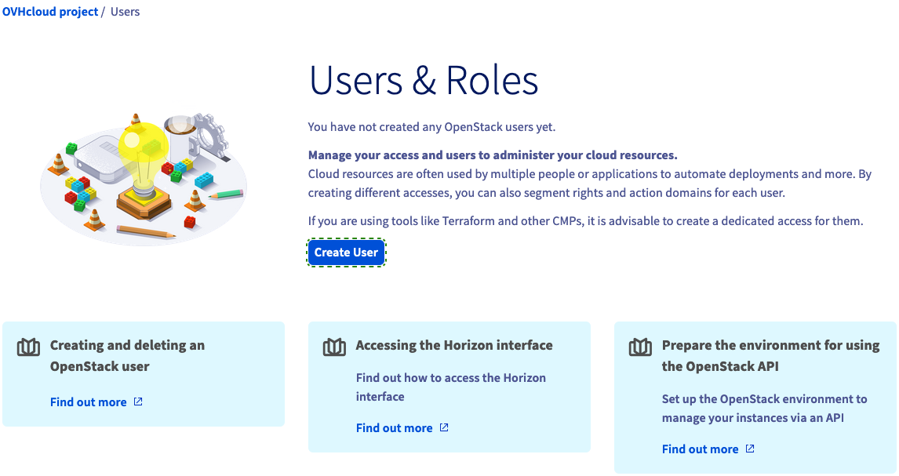
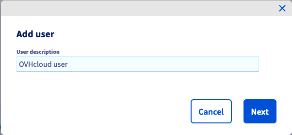
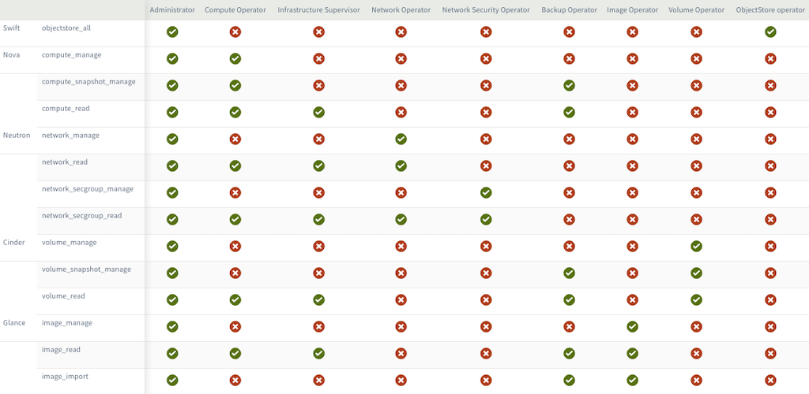
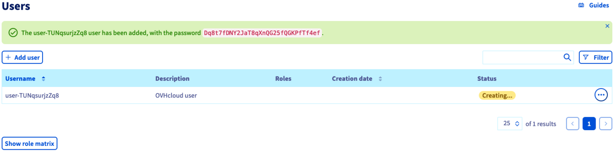
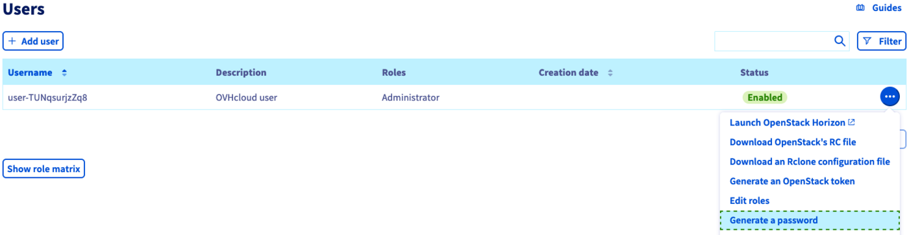
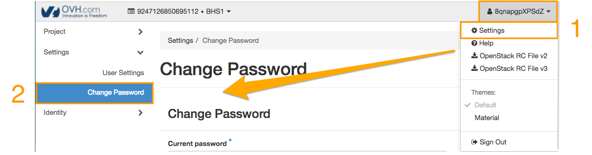
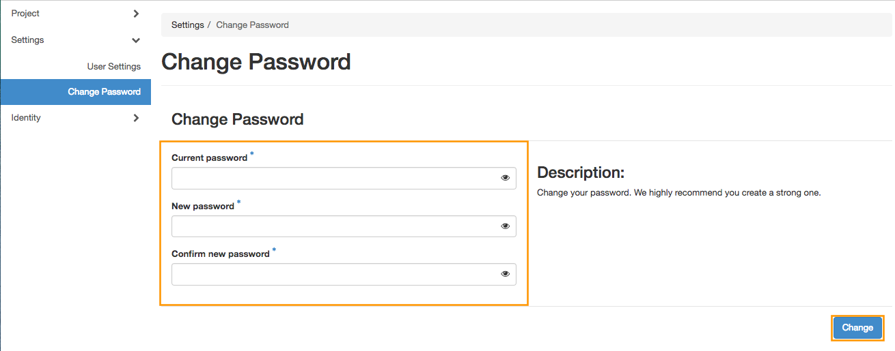
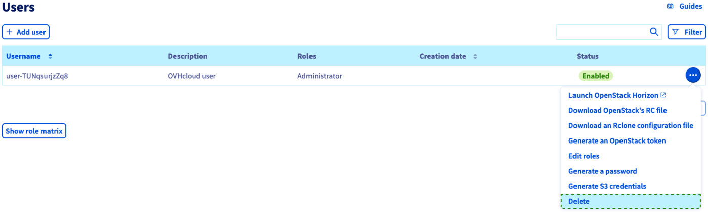

## Objetivo

El acceso a Horizon y a las API de OpenStack se realiza a través de combinaciones de usuario y contraseña denominadas "*OpenStack users*". Puede crear tantos usuarios OpenStack como sea necesario y asignarles distintos permisos de acceso.

En Horizon puede establecer una contraseña para cada usuario. Atención: El cambio de contraseña de una cuenta de usuario implica la revocación inmediata de la contraseña anterior.

**Esta guía explica cómo gestionar usuarios de OpenStack desde el área de cliente de OVHcloud y a través de Horizon.**

<iframe class="video" width="560" height="315" src="https://www.youtube.com/embed/NC69nrb6QlA" title="YouTube video player" frameborder="0" allow="accelerometer; autoplay; clipboard-write; encrypted-media; gyroscope; picture-in-picture" allowfullscreen></iframe>

## Requisitos

- Un proyecto de [Public Cloud](/pages/public_cloud/compute/create_a_public_cloud_project) en su cuenta de OVHcloud
- Tienes acceso a tu [Panel de configuración de OVHcloud](/links/manager)

## Procedimiento

### Creación de un usuario de OpenStack

Conéctese al área de cliente de OVHcloud y abra su proyecto de `Public Cloud`{.action}. Haga clic en `Users & Roles`{.action} en el menú de la izquierda, en "Project management". 

Haga clic en el botón `Crear un usuario`{.action}.

{.thumbnail}

La descripción del usuario no es el nombre de usuario de OpenStack, sino una descripción que deberá introducir para ayudarle a organizar los usuarios y sus permisos. Introduzca una descripción y haga clic en `Siguiente`{.action}.

{.thumbnail}

Ahora puede seleccionar roles que representen las autorizaciones que recibirá el usuario. Para cada casilla de verificación, el usuario obtendrá privilegios de acceso según la tabla de abajo.

{.thumbnail}

Haga clic en `Confirmar`{.action} para crear el usuario OpenStack. El usuario y la contraseña se generan automáticamente y se muestran en el área de cliente.

{.thumbnail}

En este momento, guarde la contraseña en un gestor de contraseñas. La contraseña no podrá recuperarse más adelante. Sin embargo, es posible crear una nueva contraseña haciendo clic en `...`{.action} y seleccionando `Regenerar una contraseña`{.action}.

{.thumbnail}

Una vez que haya creado el usuario de OpenStack, podrá utilizar sus claves de acceso a [la interfaz Horizon](/pages/public_cloud/public_cloud_cross_functional/introducing_horizon) haciendo clic en `Horizon`{.action} en el menú de la izquierda.

### Cambiar la contraseña de un usuario de OpenStack

Una vez conectado a [OpenStack Horizon](https://horizon.cloud.ovh.net), es posible cambiar la contraseña de OpenStack.

{.thumbnail}

Haga clic en su nombre de usuario de Horizon, situado en la esquina superior derecha del panel, para desplegar un menú con las opciones disponibles,
y seleccione `Settings`{.action}. En la columna izquierda, haga clic en `Change Password`{.action}.

{.thumbnail}

Introduzca la contraseña actual en el primer campo y una nueva contraseña en los dos campos siguientes.

> [!primary]
>
> Es recomendable que la contraseña cumpla los siguientes criterios:
>
> - la contraseña debe tener al menos 8 caracteres;
> - la contraseña debe tener un máximo de 30 caracteres;
> - la contraseña debe contener al menos una letra mayúscula;
> - la contraseña debe contener al menos una letra minúscula;
> - la contraseña debe contener al menos un número;
> - la contraseña debe estar compuesta únicamente por números y letras.
>

A continuación, haga clic en el botón `Change`{.action} para confirmar el cambio de contraseña.

{.thumbnail}

Tenga en cuenta que, al cambiar la contraseña de una cuenta de usuario, se cancela inmediatamente lla contraseña anteriormente utilizada.

### Eliminación del usuario OpenStack

La eliminación del usuario de OpenStack se realiza desde el [Panel de configuración de OVHcloud](/links/manager). Haga clic en `Users & Roles`{.action} en el menú de la izquierda, en "Project management". 

{.thumbnail}

Haga clic en `...`{.action} y seleccione `Eliminar`{.action}.

> [!warning]
>
> La eliminación de un usuario es definitiva e invalidará todos los tokens asociados, incluidos aquellos cuya fecha de expiración aún no se haya superado.
> 

## Más información

[Presentación de Horizon](/pages/public_cloud/public_cloud_cross_functional/introducing_horizon)

Interactúe con nuestra [comunidad de usuarios](/links/community).
