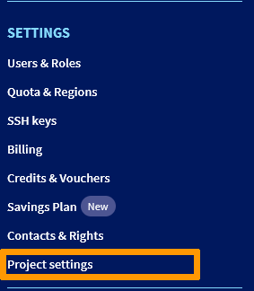
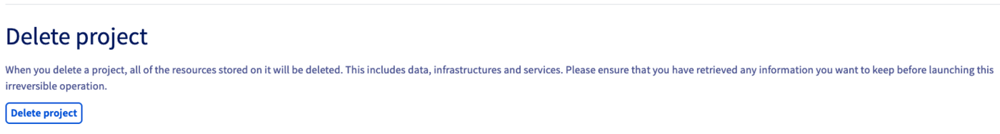
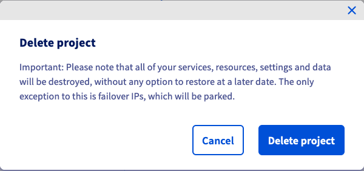

## Objectif

Lorsque vous n’avez plus besoin d'un [projet Public Cloud](https://www.ovhcloud.com/fr-ca/public-cloud/), vous pouvez le supprimer directement depuis votre espace client [OVHcloud](/links/manager).

Lorsque vous supprimez un projet Public Cloud, une facture finale est émise qui contient le montant restant à payer.

> [!warning]
>
La suppression d'un projet est différente de la désactivation de vos instances Public Cloud. 
Lorsque vous supprimez un projet, les ressources qu'il contient sont définitivement perdues. Cette action est irréversible.
>

**Découvrez comment supprimer un projet Public Cloud depuis votre espace client OVHcloud.**

## Prérequis

- Un [projet Public Cloud](https://www.ovhcloud.com/fr-ca/public-cloud/) dans votre compte OVHcloud
- Être connecté à votre [espace client OVHcloud](/links/manager)

## En pratique

Connectez-vous à l’[espace client OVHcloud](/links/manager), rendez-vous dans la section `Public Cloud`{.action} et sélectionnez le projet Public Cloud concerné.

Cliquez sur `Paramètres du projet`{.action} dans la partie **Paramètres** tout en bas du menu latéral de gauche.

{.thumbnail}

Cliquez sur le bouton `Supprimer le projet`{.action}.

{.thumbnail}

Un message de confirmation s'affiche, vous informant de la suppression des ressources du projet, à l'exception des adresses Additional IP attachées. 

Cliquez sur `Supprimer le projet`{.action} pour continuer. 

{.thumbnail}

En cliquant sur ce bouton, un e-mail vous sera envoyé, à l’adresse de contact, afin de confirmer ou d’annuler la suppression du projet. 
Après avoir cliqué sur le lien de confirmation affiché dans cet e-mail, vous serez redirigé vers une page web où vous devrez renseigner le mot de passe de votre compte. 
Une fois votre mot de passe saisi et confirmé, votre projet entrera en phase de suppression.

> [!warning]
> Veuillez noter que lorsqu'un projet entre dans cette phase de suppression, il reste dans un statut de suspension pendant 7 jours. Le projet n'est donc pas immédiatement supprimé. Si cette situation vous affecte, par exemple si votre quota de projets est limité, veuillez contacter nos équipes d'assistance.
>

## Aller plus loin

[Créer votre premier projet Public Cloud](/pages/public_cloud/public_cloud_cross_functional/create_a_public_cloud_project)

[Créer une première instance Public Cloud et s’y connecter](/pages/public_cloud/compute/public-cloud-first-steps)

Échangez avec notre [communauté d'utilisateurs](/links/community).
