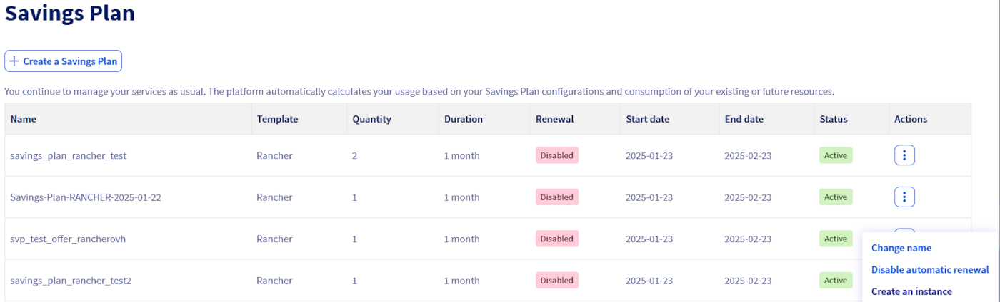
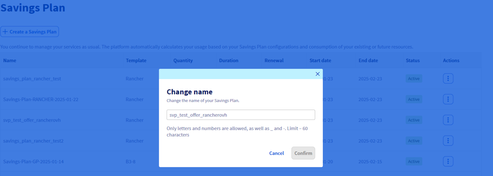
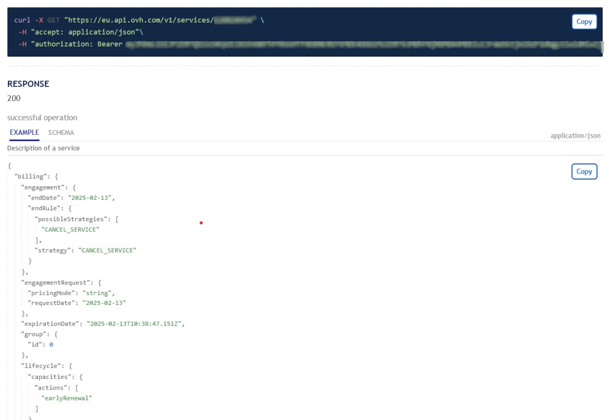

<style>
details>summary {
    color:rgb(33, 153, 232) !important;
    cursor: pointer;
}
details>summary::before {
    content:'\25B6';
    padding-right:1ch;
}
details[open]>summary::before {
    content:'\25BC';
}
.w-400 {
  max-width:400px !important;
}
.h-600 {
  max-height:600px !important;
}
</style>

## Objectif

Ce guide a pour objectif de fournir une méthode claire et détaillée pour la création et la mise à jour des Savings Plans pour vos ressources. Vous découvrirez comment gérer vos Savings Plans en utilisant l'espace client OVHcloud, l'API OVHcloud, ainsi que Terraform. En suivant ce guide, vous serez en mesure de :

- Créer un Savings Plan pour vos ressources.
- Modifier un Savings Plan.
- Automatiser la gestion des Savings Plans via l'API OVHcloud ou Terraform pour une plus grande efficacité et flexibilité.

### Prérequis

- Un [projet Public Cloud OVHcloud](https://www.ovhcloud.com/fr/public-cloud/) dans votre compte OVHcloud.
- Être connecté à l'[espace client OVHcloud](/links/manager) ou à l'[API OVHcloud](/links/api) (créez vos identifiants en consultant [ce guide](/pages/manage_and_operate/api/first-steps)).
- Être familier de l'utilisation de [Terraform](/pages/public_cloud/public_cloud_cross_functional/how_to_use_terraform) si vous souhaitez l'utiliser.
- Connaitre les principes d'un [Savings Plan](/links/public-cloud/savings-plan)

## En pratique

Connectez-vous à l'[espace client OVHcloud](/links/manager) et rendez-vous dans la section `Public Cloud`{.action}. Après avoir sélectionné votre projet Public Cloud, cliquez sur `Savings Plans`{.action} dans la barre de navigation de gauche sous **Project Management**.

### Créer un Savings plan

Vous pouvez créer votre Savings Plan pour le type de ressource voulue en suivant ces étapes :

> [!tabs]
> Via l'espace client OVHcloud
>> Cliquez sur le bouton `Créer un Savings Plan`{.action}.
>>
>> {.thumbnail}
>>
>> Sélectionnez le type de ressource pour lequel le Savings Plan s'appliquera, définissez le modèle spécifique de ressource et indiquez le nombre de ressources concernées par ce plan.
>>
>> {.thumbnail .h-600}
>>
>> Choisissez la durée de votre Savings Plan parmi les durées disponibles et donnez-lui un nom. 
>>
>> {.thumbnail}
>>
>> Lisez attentivement les termes et conditions, puis cochez la case pour confirmer leur acceptation. Une fois tous les paramètres configurés, cliquez sur le bouton `Créer un Savings Plan`{.action} pour finaliser la création.
>>
>> {.thumbnail}
>>
> Via Terraform
>> Pour créer un Savings plan, vous aurez besoin de 5 éléments minimum :
>> 
>> - L'ID de votre projet Public Cloud
>> - La flavor concernée par votre Savings Plan
>> - La durée de votre Savings Plan (au format standard ISO 8601)
>> - Le nombre de ressources concernées
>> - Le nom de votre Savings Plan
>>
>> Dans notre exemple, nous allons créer un Savings Plan pour 10 instances de type **b3-8**, pour une durée de 1 mois. Ajoutez les lignes suivantes à un fichier nommé *savings_plan.tf* :
>>
>> ```python
>> # création d'un Savings Plan
>> resource "ovh_savings_plan" "Savings_plan_simple_b3_8" {
>>   service_name = "<public cloud project ID>"
>>   flavor = "b3-8" # type de l'instance ou rancher/rancher_standard ou rancher_ovhcloud_edition
>>   period = "P1M" # P obligatoire, chiffre pour la durée et M pour "mois", Y pour "year" ..
>>   size = 10
>>   display_name = "Savings_plan_simple_b3_8"
>>   auto_renewal = true # facultatif, "true" pour activer.
>> }
>> ```
>>
>> Vous pouvez créer votre Savings Plan en entrant la commande suivante dans votre console :
>>
>> ```console
>> terraform apply
>> ```

### Modifier un Savings plan

> [!tabs]
> Via l'espace client OVHcloud
>> > [!primary]
>> >
>> > Les options modifiables via l'espace client OVHcloud se limitent au **nom** et à **l'activation/désactivation** du renouvellement automatique du Savings Plan.
>>
>> {.thumbnail}
>>
>> Si vous souhaitez modifier le nom d'unn Savings Plan, cliquez sur le bouton `Modifier le nom`{.action}, modifiez-le puis cliquez sur `Comfirmer`{.action}.
>>
>> {.thumbnail}
>>
>> Si vous souhaitez activer/désactiver le renouvellement automatique de votre Savings Plan, cliquez sur le bouton `Activer/Désactiver le renouvellement automatique`{.action} puis sur le bouton `Activer`{.action} ou `Désactiver`{.action} selon votre cas.
>>
>> {.thumbnail}
>>
> Via l'API OVHcloud
>> Retrouvez d'abord l'id de votre service dans la liste de vos service qui s'obtient via l'appel suivant :
>>
>> > [!api]
>> >
>> > @api {v1} /services GET /services
>> >
>>
>> Vous devez inscrire en paramètre, dans le champ **resourceName**, l'id de votre projet Public Cloud.
>>
>> Vous obtenez une liste contenant l'id de vos services comme suit :
>>
>> {.thumbnail}
>>
>> Vous pouvez vérifier si le service correspond au projet Public Cloud concerné via cette appel :
>>
>> > [!api]
>> >
>> > @api {v1} /services GET /services/{serviceId}
>> >
>> Le **serviceId** correspond à l'id récupéré via l'appel API précédent.
>>
>> Vous obtenez une liste contenant les détails de votre service comme ci-dessous. Vérifiez qu'il s'agit bien du bon projet grâce au champ `vars.value` :
>>
>> {.thumbnail .h-600}
>>
>> Vous pouvez retrouver l'ID de votre Savings Plan dans la liste de vos Savings Plans qui s'obtient via l'appel suivant :
>>
>> > [!api]
>> >
>> > @api {v1} /services GET /services/{serviceId}/savingsPlans/subscribed
>> >
>> Le **serviceId** correspondant à l'id récupéré précédemment.
>>
>> Vous obtenez une liste de Savings Plans comme suit :
>>
>> {.thumbnail .h-600}
>>
>> Cherchez ensuite le Savings Plan concerné dans la liste et copiez le champ **id**.
>>
>> /// details | Modifier le nom d'un Savings Plan
>>
>> Pour modifier le nom d'un Savings plan, utilisez l'appel API suivant :
>>
>> > [!api]
>> >
>> > @api {v1} /services PUT /services/{serviceId}/savingsPlans/subscribed/{savingsPlanId}
>> >
>>
>> Le **savingsPlanId** correspondant à l'id de votre Savings Plan copié précédemment.
>>
>> ///
>>
>> /// details | Activer/désactiver le renouvellement automatique d'un Savings Plan
>>
>> Pour **activer/désactiver** le renouvellement automatique du Savings Plan, utilisez l'appel API suivant :
>>
>> > [!api]
>> >
>> > @api {v1} /services POST /services/{serviceId}/savingsPlans/subscribed/{savingsPlanId}/changePeriodEndAction
>> >
>>
>> ///
>>
>> /// details | Augmenter le nombre de ressources d'un Savings Plan
>>
>> Pour augmenter le nombre de ressources souscrites par votre Savings Plan, utilisez cet appel API :
>>
>> > [!primary]
>> >
>> > Le nombre de ressources peut uniquement être augmenté.
>> >
>>
>> > [!api] 
>> >
>> > @api {v1} /services POST /services/{serviceId}/savingsPlans/subscribed/{savingsPlanId}/changeSize
>> >
>>
>> ///
>>
> Via Terraform
>> Modifiez votre ressource dans le fichier Terraform *savings_plan.tf* précédemment créé.
>>
>> > [!primary]
>> >
>> > A noter que seuls les champs **service_name**, **size** et **auto_renewal** sont modifiables. La valeur de **size** peut uniquement être augmentée.

## Aller plus loin

Échangez avec notre [communauté d'utilisateurs](/links/community).
