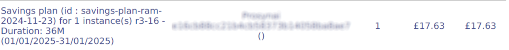
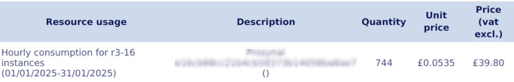
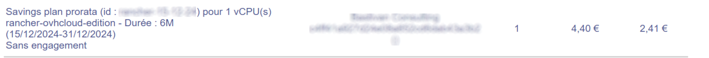
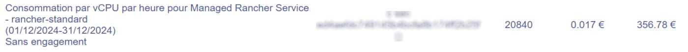

## Objective

This guide aims at providing you with a clear and practical understanding of [Savings Plans](/links/public-cloud/savings-plan), to help you optimise your infrastructure costs. We'll explain what Savings Plans are, how they work, and how to choose the model best suited to your specific needs. Through concrete examples, you will discover how these plans can reduce your expenditure while offering flexibility in the management of your resources.

This guide will also detail the use of the Savings Plans dashboard, which will allow you to track your costs, the number of resources used and covered by your plans, and the savings generated. Finally, we'll help you understand the billing aspects so you can analyse and maximise the benefits of your Savings Plan choices.

## How do Savings Plans work?

<iframe class="video" width="560" height="315" src="https://www.youtube-nocookie.com/embed/Dd7P7CUN21M?si=OvK6Gec1BLFFB25O" title="YouTube video player" frameborder="0" allow="accelerometer; autoplay; clipboard-write; encrypted-media; gyroscope; picture-in-picture; web-share" referrerpolicy="strict-origin-when-cross-origin" allowfullscreen></iframe>

### What is a Savings Plan?

[Savings Plans](/links/public-cloud/savings-plan) are a flexible pricing model that offers lower rates than pay-as-you-go pricing, in exchange for a commitment to use the service for a given period (1, 6, 12, 24 or 36 months).

### How does a Savings Plan work in general?

> [!primary]
>
> When a customer subscribes to a Savings Plan, he agrees to pay a **fixed amount** for a **given period**. In return, this plan covers a specific number of simultaneous resources for which he will pay no other charges, enabling them to benefit from advantageous billing.
>

Here are a few scenarios to help you understand how this works:

- **Case "1:1" :** Let's imagine that a customer has 10 OVHcloud B3-8 instances and subscribes to a Savings Plan that covers precisely 10 B3-8 instances for a period of 1 year. In this case, the customer will only pay the amount of their Savings Plan, and this amount will fully cover the costs associated with their 10 B3-8 instances for the duration of the commitment. There are no additional charges at the end of each month, as the instances are covered by the plan.
- **Case "1,5:1" :** Now let's suppose that another customer uses 15 B3-8 instances, but subscribes to a Savings Plan covering only 10 B3-8 instances. In this case, the customer benefits from the advantageous Savings Plan tariff for the first 10 instances. However, the other 5 instances, which are not covered by the Savings Plan, will be billed at the standard hourly rate. 
- **Case "0,8 :1" :** Lastly, a customer has subscribed to a Savings Plan for 10 B3-8 type instances, but only uses 8 instances simultaneously during the month. Even if this customer does not use all the instances covered by his plan, he will not pay any additional charges. The Savings Plan will always cover the 8 simultaneous instances used, and the customer will benefit from the advantageous pricing of the 10 instances at no extra cost. This situation remains financially advantageous, even if the customer does not use all 10 instances of the Savings Plan.

> [!warning]
> 
> Update on the term **simultaneous resources**.
>
> A Savings Plan covers a number of simultaneously active resources. For example, for a Savings Plan of 1 resource, if a customer starts a resource at 10:05 AM and deletes it at 10:10 AM, then creates another resource at 10:17 AM and deletes it at 10:30 AM, even though he has started and deleted two resources, only the resources that were switched on at the same time are counted. In this case, only one resource is active at the same time, so the Savings Plan covers both resources without additional billing. This also applies if the resources are used at different times during the month (for example, from the 1st to the 10th and then from the 15th to the 30th), as long as they are not active at the same time.
>

### How do Savings Plans work for instances?

Savings Plans for instances are based on the commitment of a quantity of instances for a given duration, offering advantageous invoicing for these.

> [!warning]
>
> With regards to simultaneously active instances, find out whether a suspended or paused resource is considered active with the following guide: [Shelve or pause an instance](/pages/public_cloud/compute/suspend_or_pause_an_instance).
>
> Please note that only 3rd-generation **instances** (B3, C3, R3) are eligible for Savings Plans. Make sure that your instance belongs to this generation to benefit from this offer.
>

### How do Savings Plans work for Managed Rancher Service?

Savings Plans for Rancher Managed Service are based on the commitment of a quantity of vCPUs over a defined period, enabling you to make savings on the Managed Rancher service. This model offers increased flexibility, as committed vCPUs can be shared across all your Rancher environments, optimising billing for resources used in a flexible and scalable way.

By subscribing to a Rancher Savings Plan, you commit to using a certain amount of vCPUs, which are then shared between your Rancher clusters, ensuring cost-effectiveness even if your usage fluctuates over time.

> [!primary]
>
> The Savings Plans for Rancher only apply to vCPUs. Other resources, such as storage, instances, and other services, are not covered by this Savings Plan and will still be billed separately. Make sure to account for these additional costs when planning your Rancher resources.
>
> In order for the vCPUs included in your Savings Plan to be consumed, you must assign an instance to your Kubernetes nodes. Without a configured instance, the resources covered by the Savings Plan will remain unused, and you will continue to pay for these unused resources. Make sure you size your instances to match your vCPU and RAM requirements.
>

### Eligible / compatible services

This table summarises the eligibility of OVHcloud services:

| Service                      | Eligible    |
| ---------------------------- | ----------- |
| Compute instances            | Yes         |
| Container (via Compute)      | Yes         |
| Managed Rancher              | Yes         |
| Network                      | No          |
| Storage                      | No          |
| Public Cloud Databases       | No          |
| AI                           | No          |

> [!warning]
>
> The Local Zones and US regions are not eligible to Savings Plan.
>

### Automated infrastructure management with Savings Plans

Customers do not have to manually associate their instances with Savings Plans. We manage this automatically, taking into account all existing and future instances when calculating Savings Plan consumption.

For example:

- If a customer has 10 B3-8 instances and subscribes to a Savings Plan for 10 B3-8 instances, these will automatically be covered by the Savings Plan billing.
- If the customer has 15 B3-8 instances and subscribes to a Savings Plan for 10 B3-8 instances, the first 10 will automatically be covered by the Savings Plan billing and the other 5 will be billed by the hour without discount.

### Creating a tailor-made business model

To optimise costs while adapting to your varied needs, it is possible to combine several Savings Plans with different characteristics, such as size, type/model of resources or length of commitment. This approach makes it possible to align coverage with specific uses, while maximising savings.

/// details | **Real-life example :**

- A customer uses two types of workloads:
    - A stable production environment with 20 B3-16 VMs, used 24/7 all year round.
    - A variable development environment, with an average of 10 B3-8 VMs, used mainly over 8 months of the year.
- After analysing its needs, the customer opted for the following combination:
    - A 3-year Savings Plan covering 20 B3-16 VMs. This represents a **reduction of 54%** compared with hourly billing.
    - A 1-year Savings Plan covering 10 B3-8 VMs. This represents a **reduction of 35%** compared to hourly billing.

Thanks to this combination, the customer achieves substantial savings by optimising its production resources over the long term, while maintaining the flexibility required for its development environment, with reductions of 54% and 35% respectively compared with hourly invoicing.

///

## Use the dashboard to analyse your Savings Plans

> [!primary]
>
> This section will be available at the same time as the Dashboard functionality in your OVHcloud Control Panel.
>

<!--The Savings Plans dashboard allows you to track and analyse your Savings Plans, providing essential information about their usage, coverage and savings. You can view specific data by period, service, instance type or other relevant criteria.

/// details | **a. Selection filters**

 Image avec focus sur les filtres

- **Service:** Allows you to filter the data according to the specific service with which Savings Plans are associated.
- **Instance type:** Allows you to choose between different types of instances ("instances" or "Managed Rancher Services").
- **Model:** Choice of specific resource model to refine Savings Plans monitoring.
- **Period:** Allows you to select a specific period to observe the use of Savings Plans and the associated coverage.

///

/// details | **b. KPIs (Key Performance Indicators)**

> [!primary]
>
> The KPI data in the Savings Plans dashboard is adjusted according to the filters applied. This makes it possible to customise the display of indicators to focus on specific periods, particular services or selected instance types.
>

 Image avec focus sur les KPIs

- **Number of active Savings Plans:** Displays the total number of active Savings Plans.
- **% use of Savings Plans:** Indicates the percentage of Savings Plans used in relation to the total capacity available.
- **% of Savings Plan coverage:** Shows the proportion of resources covered by Savings Plans compared to total usage.
- **Savings achieved:** Displays the total savings made through Savings Plans over the specified period.
- **Excess amount:** Displays the amount of excess consumption that generates non-discounted charges.

///

/// details | **c. Graphics**

 Image avec focus sur le graphique

- **Y-axis legend on graph:**
    - If ‘Instances’ is selected, the Y axis will display the number of instance(s) used.
    - If ‘Managed Rancher Services’ is selected, the Y axis will show the number of vCPU(s) used.
- **Graph colour legends :**
    - **Green :** Represents the number of resources covered by a Savings Plan.
    - **Red :** Represents the number of resources not covered by a Savings Plan and billed by the hour.

///

/// details | **d. Consumption monitoring table**

 Image avec focus sur la parti de suivi de consommation

- **Create a Savings Plan:** A button to create a new Savings Plan.
- **Download (Export as CSV):** A button for exporting data from the **Consumption monitoring table** in CSV format, so that you can analyse it in detail or save it for your archives.
- **Consumption monitoring table columns:**
    - **Begin:** This column shows the start date and time of the resource consumption period.
    - **End:** This column shows the date and time at which the resource consumption period ends.
    - **Consumption Size:** Shows the quantity of resources consumed during the period. This value represents the actual use of resources during the selected period.
    - **Cumul Plan Size:** Indicates the total coverage of resources during the period, i.e. the quantity of resources covered by your Savings Plans for this specific period.

///

Thanks to this dashboard, you can monitor the use and efficiency of your Savings Plans in real time, adjust your strategy according to the data observed and optimise your costs for more effective management of your OVHcloud resources. -->

## Understanding billing

> [!primary]
>
> Please note that it is not yet possible to modify a Savings Plan. Please contact the [support teams](https://help.ovhcloud.com/csm?id=csm_get_help).
>

To better understand your billing once you subscribe to a Savings Plan, here is an explanation of the different lines you can find.

/// details | Billing for Savings Plan instances

- **a. Billing for your Savings Plans**

When you subscribe to a Savings Plan, you agree to pay a fixed amount for a certain number of instances over a specified period. However, the instances covered by this plan are not itemised individually on your bill.
On your invoice, you will only see the total amount corresponding to the Savings Plan, and not the specific instances it covers. This simplifies invoicing by showing only one line grouping together all the instances covered by your commitment, without the need to detail each instance.

{.thumbnail}

> [!primary]
>
> A pro rata will be applied if your Savings Plan starts during the month.
>

- **b. Billing for your additional instances**

Additional instances, i.e. those not covered by your Savings Plan, are billed on an hourly basis, as with standard billing.
For example, if you use 10 3rd-generation instances for 10 hours during the month, you will be billed on a per-hour basis. This gives an invoice for 100 hours (10 instances x 10 hours), billed at the standard hourly rate, in addition to the Savings Plan line.

{.thumbnail}

///

/// details | Billing for Rancher Savings Plan

- **a. Billing for your Savings Plans**

When you subscribe to a Savings Plan, you agree to pay a fixed amount for a certain number of vCPUs over a specified period. However, the vCPUs covered by this plan are not itemised individually on your bill.
On your invoice, you will only see the total amount corresponding to the Savings Plan. You won't have details of the different Rancher with the number of vCPUs that cover them belonging to the savings plan.

{.thumbnail}

> [!primary]
>
> A pro rata will be applied if your Savings Plan starts during the month.
>

- **b. Billing for your additional vCPUs**

Additional vCPUs, i.e. those not covered by your Savings Plan, are billed on an hourly basis, as with standard billing.
For example, if you use 10 vCPUs for 10 hours during the month, you will be billed on a per-hour basis. This gives an invoice for 100 hours (10 vCPUs x 10 hours), billed at the standard hourly rate, in addition to the Savings Plan line.

{.thumbnail}

> [!primary]
>
> Rancher is billed according to the total number of vCPUs on each of the work nodes in your downstream clusters.
The vCPUs of control-plane nodes are not billed.
>
> The minimum consumption for the Managed Rancher Service is 20 vCPUs per Rancher, although you can create one or more Saving Plans starting from 1 vCPU. Subscribed vCPUs will be deducted from the total number of vCPUs consumed.
>

///

## Go further

Join our [community of users](/links/community).