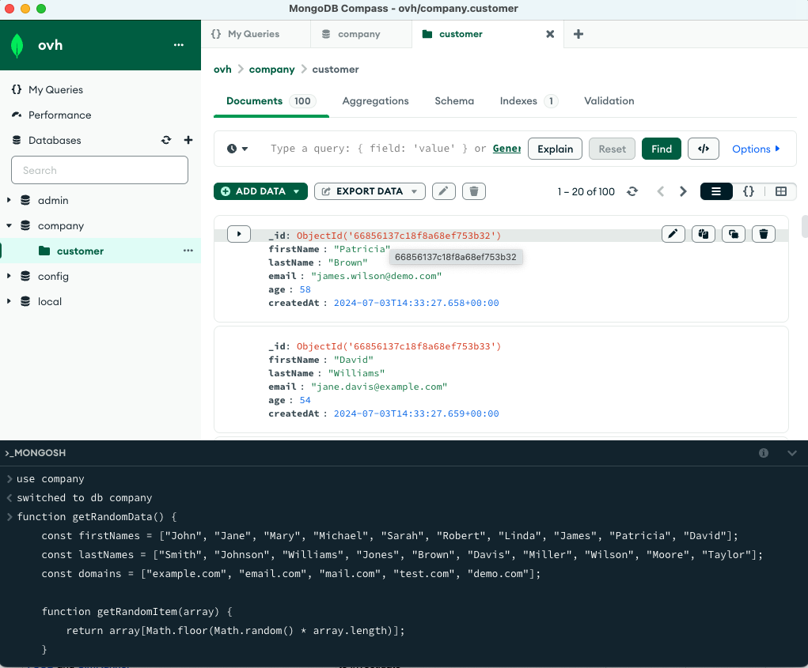
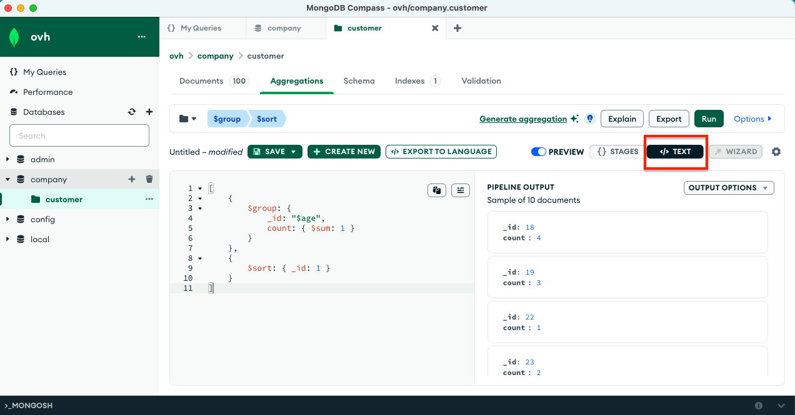

## Objective

Public Cloud Databases allow you to focus on building and deploying cloud applications while OVHcloud takes care of the database infrastructure and maintenance in operational conditions.

**This guide explains how to connect to a MongoDB database instance with one of the world's most famous Open Source (SSPL) management tool for MongoDB: MongoDB Compass.**

## Requirements

- A [Public Cloud project](https://www.ovhcloud.com/de/public-cloud/) in your OVHcloud account
- Access to the [OVHcloud Control Panel](https://www.ovh.com/auth/?action=gotomanager&from=https://www.ovh.de/&ovhSubsidiary=de)
- A MongoDB database running on your OVHcloud Public Cloud Databases ([this guide](/pages/public_cloud/public_cloud_databases/databases_01_order_control_panel) can help you to meet this requirement)
- [Configure your MongoDB instance](/pages/public_cloud/public_cloud_databases/mongodb_02_manage_control_panel) to accept incoming connections
- A MongoDB Compass stable version installed and public network connectivity (Internet). This guide was made in MongoDB Compass version 1.30.1.

## Concept

A MongoDB instance can be managed through multiple ways.
One of the easiest, yet powerful, is to use a Command Line Interface (CLI), as shown in our guide: [Connect to MongoDB with CLI](/pages/public_cloud/public_cloud_databases/mongodb_03_connect_cli) or by using programming languages, such as [PHP](/pages/public_cloud/public_cloud_databases/mongodb_04_connect_php) or [Python](/pages/public_cloud/public_cloud_databases/mongodb_05_connect_python).

Another way is to interact directly using a management tool for MongoDB: MongoDB Compass.

In order to do so, we will need to install MongoDB Compass, then configure our Public Cloud Databases for MongoDB instances to accept incoming connections, and finally configure MongoDB.

## Instructions

### Installation

Pleese follow the [official documentation](https://docs.mongodb.com/compass/current/install/) to install MongoDB Compass.

We are now ready to learn how to connect to our MongoDB instance.

### Connect with MongoDB Compass

In MongoDB Compass fill in the connection field with the `Service URI`:

{.thumbnail}

Now you are now interact with your Public Cloud Databases for MongoDB:

{.thumbnail}

### Insert and Query Data
you can use the [mongoshell](https://www.mongodb.com/docs/mongodb-shell/), integrated in Compass, to create your first database and collection. Below is a script that creates the database **company** and collection **customer** and inserts 100 random documents.

#### Load Data into MongoDB

To load 100 documents into a collection called `customer` with random data, use the following `mongosh` script:

```javascript
use company;

// Function to generate random data
function getRandomData() {
    const firstNames = ["John", "Jane", "Mary", "Michael", "Sarah", "Robert", "Linda", "James", "Patricia", "David"];
    const lastNames = ["Smith", "Johnson", "Williams", "Jones", "Brown", "Davis", "Miller", "Wilson", "Moore", "Taylor"];
    const domains = ["example.com", "email.com", "mail.com", "test.com", "demo.com"];
    
    function getRandomItem(array) {
        return array[Math.floor(Math.random() * array.length)];
    }
    
    return {
        firstName: getRandomItem(firstNames),
        lastName: getRandomItem(lastNames),
        email: `${getRandomItem(firstNames).toLowerCase()}.${getRandomItem(lastNames).toLowerCase()}@${getRandomItem(domains)}`,
        age: Math.floor(Math.random() * 60) + 18,
        createdAt: new Date()
    };
}

// Insert 100 random documents into the customer collection
const bulk = db.customer.initializeUnorderedBulkOp();
for (let i = 0; i < 100; i++) {
    bulk.insert(getRandomData());
}
bulk.execute();

print("100 random documents inserted into the 'customer' collection.");
```


#### Query Data with the Aggregation Framework

The below MongoDB aggregation pipeline uses the [MongoDB Aggregation Framework](https://www.mongodb.com/docs/manual/aggregation/) to group customers by age and count each occurence. You can use the mongoshell to execute:

```javascript
db.customer.aggregate([
    {
        $group: {
            _id: "$age",
            count: { $sum: 1 }
        }
    },
    {
        $sort: { _id: 1 }
    }
]);
```

You can also use the UI with Compass to execute the aggregation pipeline.



## Go further

Explore the [documentation](https://docs.mongodb.com/compass/current/) to view all the features and how to interact with your data.

[MongoDB capabilities](/pages/public_cloud/public_cloud_databases/mongodb_01_concept_capabilities)

[Configuring vRack for Public Cloud](/pages/public_cloud/public_cloud_network_services/getting-started-07-creating-vrack)

Visit the [Github examples repository](https://github.com/ovh/public-cloud-databases-examples/tree/main/databases/mongodb) to find how to connect to your database with several languages.

Join our community of users on <https://community.ovh.com/en/>.

## We want your feedback!

We would love to help answer questions and appreciate any feedback you may have.

If you need training or technical assistance to implement our solutions, contact your sales representative or click on [this link](https://www.ovhcloud.com/de/professional-services/) to get a quote and ask our Professional Services experts for a custom analysis of your project.
Are you on Discord? Connect to our channel at [https://discord.gg/ovhcloud](https://discord.gg/ovhcloud) and interact directly with the team that builds our databases service!
