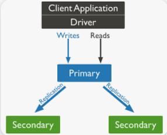
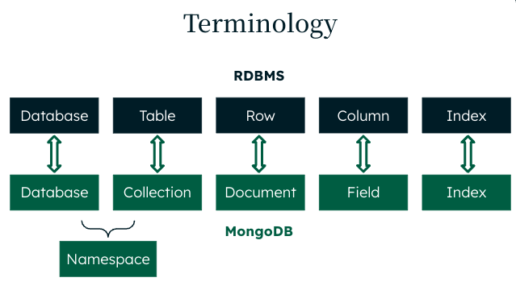

## Introduction

[MongoDB](https://www.mongodb.com/) is a leading NoSQL database that provides a flexible, scalable, and high-performance solution for modern application development. It stores data in JSON-like documents, which allows for a dynamic schema, making it ideal for handling unstructured and semi-structured data. This document-oriented approach ensures high flexibility in how data is stored, queried, and indexed.

MongoDB's architecture is built for high availability and horizontal scalability. It supports replica sets, providing automatic failover and data redundancy to ensure data availability and reliability. This ensures that applications can continue to run smoothly even in the event of hardware failures.

The database engine uses a storage model based on collections and documents, where collections hold sets of documents and documents are the basic units of data. This structure simplifies the development process, allowing developers to interact with data using native and intuitive APIs. MongoDB's powerful querying capabilities, including ad-hoc queries, indexing, and real-time aggregation, enable developers to create robust and efficient applications.

MongoDB also offers comprehensive security features, including encryption at rest and in transit, role-based access control, and auditing. These features ensure that data is protected and meets compliance requirements. The MongoDB community and enterprise support options provide developers and organizations with the resources and assistance needed to optimize their use of the database.

## Main Benefits of Choosing MongoDB

- [Flexible Schema](https://www.mongodb.com/docs/manual/data-modeling/): MongoDB's document-oriented storage allows for dynamic schema, making it easy to handle unstructured and semi-structured data.
    - **Example of a MongoDB Collection with 2 Documents:**
      ```json
        {
          "_id": 1,
          "name": "John Doe",
          "address": {
            "street": "123 Main St",
            "city": "Springfield",
            "postal_code": "12345"
          },
          "phone_numbers": ["555-1234", "555-5678"],
          "email": "john.doe@example.com"
        },
        {
          "_id": 2,
          "name": "Jane Smith",
          "address": {
            "street": "456 Elm St",
            "city": "Shelbyville"
          },
          "phone_numbers": ["555-8765"],
          "date_of_birth": "1985-01-01"
        }
      ```
  - **Key Points:**
    - <ins>Nested Documents</ins>: The address field in both documents is a nested document containing subfields like street, city, and postal_code.
    - <ins>Array Fields</ins>: The phone_numbers field in both documents is an array containing multiple phone numbers.
    - <ins>Varying Fields</ins>: The email field is present only in the first document, while the date_of_birth field is present only in the second document. The structure and number of fields vary between the two documents within the same collection.

- [Scalability](https://www.mongodb.com/resources/basics/scaling): Horizontal scaling with replica sets ensures high availability and scalability to meet growing data and workload demands.

{.thumbnail}

- [High Performance](https://www.mongodb.com/docs/manual/administration/analyzing-mongodb-performance/#mongodb-performance): Efficient storage and indexing mechanisms enable fast query responses and data processing.

- [Rich Query Language](https://www.mongodb.com/docs/manual/tutorial/query-documents/#query-documents): Supports complex queries, including ad-hoc queries, indexing, aggregation, and geospatial queries.

- [High Availability](https://www.mongodb.com/resources/basics/high-availability): Automatic failover and data redundancy through replica sets ensure data is always available.

- [Document Model](https://www.mongodb.com/resources/basics/json-and-bson): The document data model is a powerful way to store and retrieve data in any modern programming language, allowing developers to move quickly.

- [Real-Time Analytics](https://www.mongodb.com/solutions/use-cases/analytics/real-time-analytics): Built-in aggregation framework allows for real-time data analysis and transformation.

- [Strong Security](https://www.mongodb.com/docs/manual/security/): Comprehensive security features such as encryption at rest and in transit, In-Use Encryption, role-based access control, and auditing.

- [Robust Ecosystem](https://www.mongodb.com/products/tools): Integration with various tools and platforms such as Visual Studio Code, Terraform, Kubernetes, and kafka, enhancing functionality and ease of use.

- [Community](https://www.mongodb.com/community/forums/) and [Enterprise Support](https://www.mongodb.com/services/support/enterprise-advanced-support-plans): Access to a large community and enterprise-level support ensures help and resources are readily available.

## MongoDB vs SQL Database Engines

| Feature                    | MongoDB                                  | RDBMS (e.g., MySQL, PostgreSQL)          |
|----------------------------|------------------------------------------|------------------------------------------|
| **Data Model**             | Document-oriented (JSON-like documents)  | Table-based (rows and columns)           |
| **Schema**                 | Flexible, dynamic schema                 | Fixed, predefined schema                 |
| **Scalability**            | Horizontal scaling with ease             | Primarily vertical scaling, horizontal scaling is complex |
| **Transactions**           | Supports multi-document ACID transactions | Supports ACID transactions               |
| **Query Language**         | MongoDB Query Language (MQL)              | SQL (Structured Query Language)          |
| **Indexing**               | Supports various types of indexes, including compound, geospatial, text, etc. | Supports various types of indexes, primarily B-tree and hash |
| **Joins**                  | Supports joins using `$lookup`            | Supports joins to combine data from multiple tables |
| **Performance**            | Optimized for read and write performance, especially for large volumes of data | Performance can degrade with complex joins and large datasets |
| **Flexibility**            | High flexibility due to dynamic schema   | Less flexible due to rigid schema constraints |
| **Use Cases**              | Best for unstructured data, real-time analytics, and applications with rapidly changing data requirements | Best for structured data and applications requiring complex transactions and relationships |
| **Deployment**             | Cloud-native, on-premises, hybrid        | On-premises, cloud                        |
| **Community and Support**  | Strong community, enterprise support available | Strong community, enterprise support available |

{.thumbnail}

## MongoDB Use Cases

### 1. Real-Time Analytics

**Example:** E-commerce Websites

- **Scenario:** An e-commerce website needs to analyze user behaviour, sales data, and inventory in real-time to optimize user experience and sales strategies.
- **MongoDB Advantage:** MongoDB's document model allows for flexible data structures that can store complex data types. Its aggregation framework supports real-time analytics by processing data directly within the database, reducing the need for additional ETL processes.

### 2. Content Management Systems (CMS)

**Example:** Blogging Platforms

- **Scenario:** A blogging platform needs to manage and serve diverse content types, including articles, images, and metadata, with varying schema requirements.
- **MongoDB Advantage:** MongoDB's flexible schema makes it easy to handle different content types and adapt to changing requirements without significant changes to the database schema. This flexibility accelerates development and iteration cycles.

### 3. Internet of Things (IoT)

**Example:** Smart Home Devices

- **Scenario:** A smart home system collects and processes data from various sensors and devices in real-time to automate and optimize home environments.
- **MongoDB Advantage:** MongoDB can efficiently store and process large volumes of time-series data from IoT devices. Its horizontal scalability ensures it can handle the growing amount of data generated by an increasing number of connected devices.

### 4. Mobile Applications

**Example:** Social Media Apps

- **Scenario:** A social media app requires a backend that can handle a high volume of user-generated content, real-time interactions, and complex relationships between data.
- **MongoDB Advantage:** MongoDB's document-oriented model suits the storage of user profiles, posts, comments, and likes, all within a single database. Furthermore, its scalability supports growing user bases.

## Main MongoDB Engine Concepts

### 1. Documents

- **Definition:** The basic unit of data in MongoDB, similar to a row in a relational database, but more flexible.
- **Format:** JSON-like (BSON) structure, allowing for nested objects and arrays.

### 2. Collections

- **Definition:** A group of MongoDB documents, similar to a table in a relational database.
- **Characteristics:** Collections do not enforce a schema, allowing for a diverse set of documents.

### 3. Databases

- **Definition:** A container for collections.
- **Usage:** Each database has its own set of files on the file system.

### 4. Replica Sets

- **Definition:** A group of MongoDB servers that maintain the same data set, providing redundancy and high availability.
- **Components:** Consists of a primary node and secondary nodes, with automatic failover.

### 5. Sharding

- **Definition:** The process of distributing data across multiple machines to support large datasets and high throughput operations.
- **Components:** Shards, config servers, and query routers.

### 6. Indexes

- **Definition:** Special data structures that store a small portion of the data set in an easy-to-traverse form.
- **Usage:** Improve query performance by allowing MongoDB to quickly locate documents.

### 7. Aggregation Framework

- **Definition:** A powerful tool for performing data processing and transformation operations directly within the database.
- **Usage:** Supports operations like filtering, grouping, and sorting.

### 8. Transactions

- **Definition:** Multi-document ACID transactions that ensure data integrity.
- **Usage:** Allows for operations across multiple documents to be executed in a way that ensures atomicity, consistency, isolation, and durability.

### 9. Storage Engines

- **Definition:** The components responsible for managing how data is stored, retrieved, and maintained on disk.
- **Common Engines:** WiredTiger (default), In-Memory, and MMAPv1 (deprecated).

### 10. Security

- **Features:** Role-based access control, encryption at rest, encryption in transit, and auditing capabilities.
- **Purpose:** Ensure data security and compliance with various regulations.

## Go further

[MongoDB Documentation](https://www.mongodb.com/docs/)
[MongoDB Reference architecture](https://www.mongodb.com/resources/products/fundamentals/mongodb-architecture-guide)

## We want your feedback!

We would love to help answer questions and appreciate any feedback you may have.

If you need training or technical assistance to implement our solutions, contact your sales representative or click on [this link](/links/professional-services) to get a quote and ask our Professional Services experts for a custom analysis of your project. 

Join our [community of users](/links/community).

Are you on Discord? Connect to our channel at <https://discord.gg/ovhcloud> and interact directly with the team that builds our databases service!
