## Objectif

En plus de l’adressage IP privé, le [vRack](/links/network/vrack) vous permet également de router le trafic IP public via le port [vRack](/links/network/vrack) de votre serveur à l’aide d’un bloc d’adresses IP publiques.

**Ce guide vous montrera comment configurer un bloc d'adresses IP publiques à utiliser avec le vRack sur une instance Public Cloud.**

## Prérequis

- Un bloc public d'adresses IP dans votre compte, avec un minimum de quatre adresses
- Une [instance Public Cloud OVHcloud](/pages/public_cloud/compute/public-cloud-first-steps)
- Un service [vRack](/links/network/vrack) activé dans votre compte
- Être connecté à [l'espace client OVHcloud](/links/manager)
- Être connecté à [l'interface Horizon](/pages/public_cloud/compute/introducing_horizon)

### Sommaire

- [Ajouter le projet Public Cloud au vRack](#addproject)
- [Ajouter le bloc IP au vRack](#addipblock)
- [Créer un réseau privé](#createnetwork)
- [Créer un sous-réseau](#subnet)
    - [Depuis l’interface Horizon](#subnethorizon)
- [Attacher une interface réseau à l’instance](#attachinterface)
- [Configurer une adresse IP utilisable](#ipconfig)
    - [Créer une nouvelle table de routage IP](#routing)
    - [Application non persistante](#nonpersistent)
    - [Application persistante par distribution](#persistent)

## En pratique

Avant de commencer, veuillez noter que plusieurs étapes sont à suivre pour cette configuration. Une partie de la configuration se fera via l'espace client OVHcloud et une autre via l'interface Horizon.

<a name="addproject"></a>

### Ajouter le projet Public Cloud au vRack

> [!primary]
> Ceci ne s’applique pas aux projets nouvellement créés, qui sont automatiquement livrés avec un vRack. Pour visualiser le vRack une fois le projet créé, connectez-vous à [l'espace client OVHcloud](/links/manager), puis rendez-vous dans le menu `Bare Metal Cloud`{.action} et cliquez sur `Network`{.action}. Cliquez sur `Réseau privé vRack`{.action} pour voir le(s) vRack(s).
>
> Vous pouvez également supprimer le projet de son vRack alloué et l'attacher à un autre vRack si vous le souhaitez.

Pour les projets plus anciens, allez dans le menu `Bare Metal Cloud`{.action} et cliquez sur `Network`{.action} dans l'onglet de gauche. Cliquez sur `Réseau privé vRack`{.action} et sélectionnez votre vRack dans la liste.

Dans la liste des services éligibles, sélectionnez le projet que vous souhaitez ajouter au vRack et cliquez sur le bouton `Ajouter`{.action} .

{.thumbnail}

<a name="addipblock"></a>

### Ajouter le bloc IP au vRack

> [!warning]
>
> Une fois que le bloc d’adresses IP est ajouté au vRack, il n’est plus attaché à un serveur physique.
>
> Cette configuration vous permet de configurer des adresses IP d’un même bloc sur plusieurs serveurs, à condition que ces serveurs soient tous dans le même vRack que ce bloc. Le bloc d'adresses IP doit avoir au moins 2 adresses IP utilisables ou plus pour que cela soit possible.
>

Dans votre [espace client OVHcloud](/links/manager), rendez-vous dans la section `Bare Metal Cloud`{.action} et cliquez sur `Network`{.action}. Ensuite, ouvrez le menu `vRack`{.action}.

Sélectionnez votre vRack dans la liste pour afficher la liste des services éligibles. Cliquez sur le bloc IP que vous souhaitez ajouter au vRack et cliquez sur `Ajouter`{.action}.

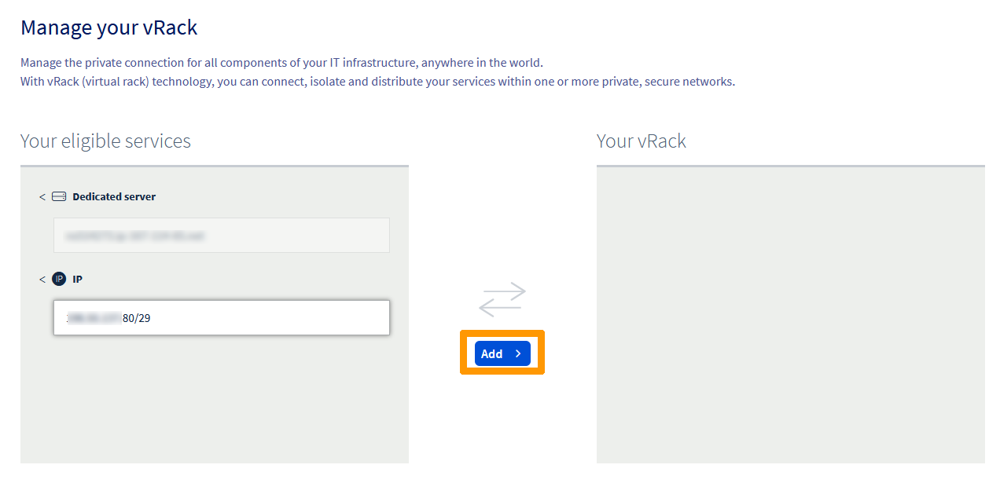{.thumbnail}

<a name="createnetwork"></a>

### Créer un réseau privé

Une fois votre projet ajouté au vRack, l’étape suivante consiste à créer un réseau privé. Ce réseau privé sera lié à l'instance Public Cloud.

Dans l'onglet `Public Cloud`{.action}, cliquez sur `Private Network`{.action} sous **Network**.

Cliquez sur `Créer un réseau privé`{.action}.

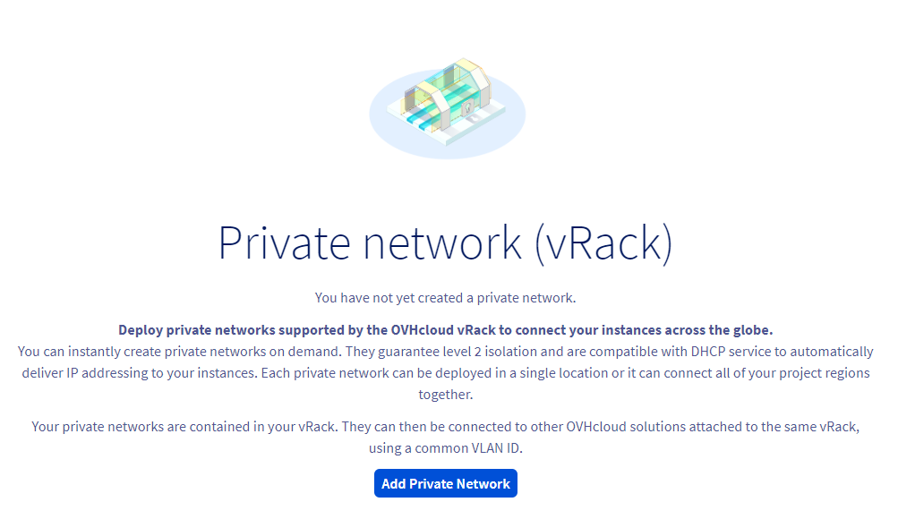{.thumbnail}

La page suivante vous permet de personnaliser plusieurs paramètres.

À l'étape 1, sélectionnez la région dans laquelle vous souhaitez placer le réseau privé (cette région doit être la même que celle de l'instance).

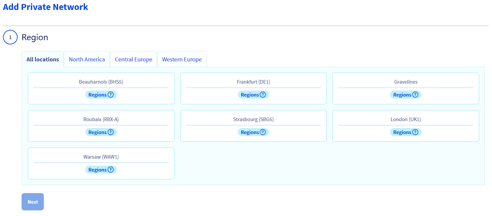{.thumbnail}

Ensuite, définissez un ID de VLAN. Pour cette configuration, vous devez « tagguer » votre réseau privé avec l'ID de VLAN 0.

Celui-ci peut être configuré à l'étape 2.

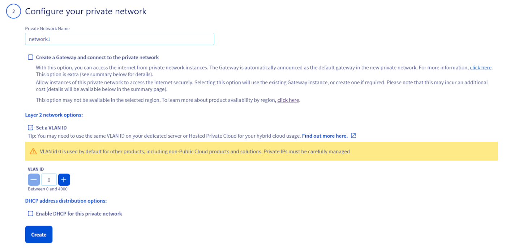{.thumbnail}

Cette étape offre plusieurs options de configuration. Pour les besoins de ce guide, nous allons nous concentrer sur les éléments nécessaires :

- **Nom du réseau privé** : Entrez un nom pour votre réseau privé.
- **Option réseau du layer 2** : Cochez la case **Définir un ID de VLAN** et sélectionnez VLAN ID **0**.
- **Options de distribution des adresses DHCP** : Vous pouvez conserver la plage IP privée par défaut ou en utiliser une autre. Laissez toutefois la case **DHCP** désactivée.


Cliquez ensuite sur `Configurez votre réseau privé`{.action}.

<a name="subnet"></a>

### Créer un sous-réseau (*subnet*)

Pour la configuration, vous devez créer un sous-réseau dans le réseau privé précédemment créé et y ajouter le CIDR du bloc d'adresses IP public.

> [!warning]
> Cette action ne peut être effectuée qu'à partir de l'interface Horizon ou de l'API OpenStack.
>

<a name="subnethorizon"></a>

#### Depuis l’interface Horizon

Connectez-vous à l'[interface Horizon](https://horizon.cloud.ovh.net/auth/login/) et assurez-vous de vous situer dans la bonne région. Vous pouvez le vérifier en haut à gauche.

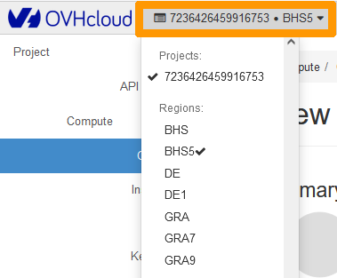{.thumbnail}

Cliquez sur `Network`{.action} dans l'onglet de gauche, puis sur `Networks`{.action}.

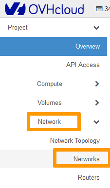{.thumbnail}

Cliquez sur la flèche déroulante à côté du réseau privé et sélectionnez `Create Subnet`{.action}.

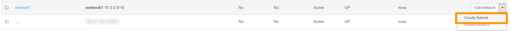{.thumbnail}

Dans la fenêtre qui s'affiche, complétez les champs :

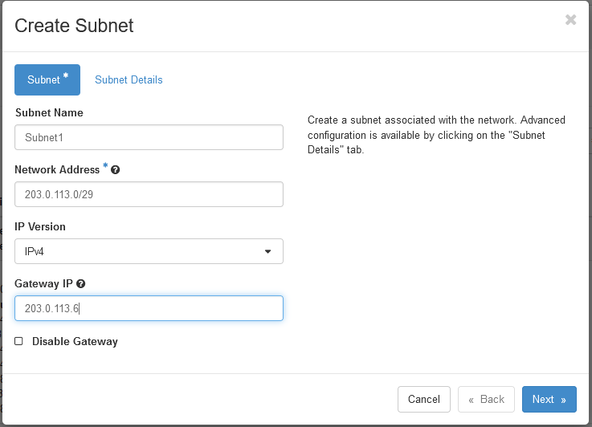{.thumbnail}

- **Nom du sous-réseau** (**Subnet Name**) : entrez le nom de votre choix.<br>
- **Adresse réseau** (**Network address**) : entrez le CIDR complet de votre bloc IP public (dans cet exemple : 203.0.113.0/29).<br>
- **IP de la passerelle** (**Gateway IP**) : avant-dernière IP du bloc d'adresses IP (dans cet exemple 203.0.113.6). Lorsque vous achetez votre bloc IP, ces informations vous sont communiquées par e-mail.

Cliquez sur `Next`{.action} et décochez la case `Enable DHCP`{.action}. 

- **DNS Name Servers** : Facultatif. Nous vous recommandons d'ajouter un serveur DNS principalement pour la résolution de domaines.

Cliquez sur `Create`{.action}.

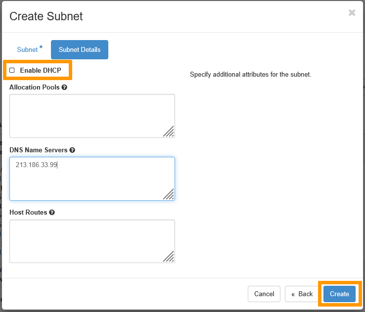{.thumbnail}

Une fois le sous-réseau créé, votre réseau privé apparaîtra comme suit :

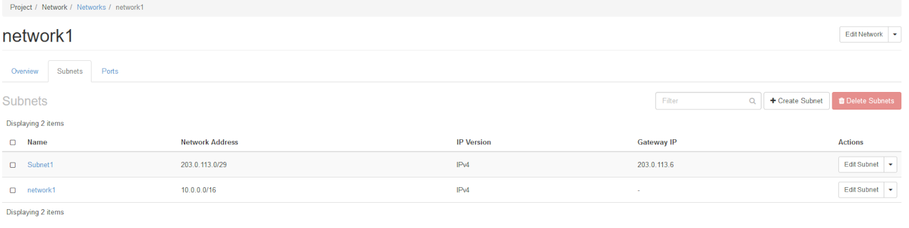{.thumbnail}

<a name="attachinterface"></a>

### Attacher une interface réseau à l’instance

Cette action ne doit être effectuée que via l'interface Horizon.

Si vous n'avez pas encore créé d'instance, vous devez d'abord la créer, puis attacher le réseau ultérieurement. Ne sélectionnez pas le réseau privé lors de la création de l'instance.

Nous vous recommandons de consulter les guides suivants si vous créez une instance Public Cloud pour la première fois : [Comment créer une instance Public Cloud et s'y connecter](/pages/public_cloud/compute/public-cloud-first-steps/) ou [Créer une instance depuis l'interface Horizon](/pages/public_cloud/compute/create_instance_in_horizon/).

Si vous disposez déjà d'une instance, vous pouvez passer à l'étape suivante.

Connectez-vous à l'[interface Horizon](https://horizon.cloud.ovh.net/auth/login/) et assurez-vous de vous situer dans la bonne région. Vous pouvez le vérifier en haut à gauche.

{.thumbnail}

Ensuite, sélectionnez `Compute`{.action} puis `Instances`{.action} dans le menu.

{.thumbnail}

Sélectionnez `Attach Interface`{.action} dans la liste déroulante de l'instance correspondante.

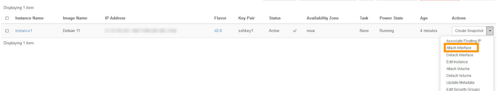{.thumbnail}

Dans le menu déroulant, sélectionnez les options appropriées :

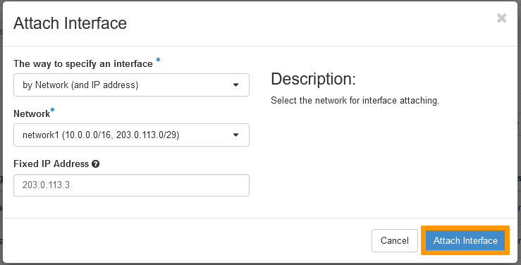{.thumbnail}

- **Réseau** (**Network**) : sélectionnez le réseau privé créé<br>
- **Adresse IP fixe** (**Fixed IP Address**) : spécifiez une adresse IP publique à partir de votre bloc (si vous ne le faites pas, le système attribuera automatiquement une IP privée).

> [!warning]
> Il n’est pas possible d’ajouter plusieurs adresses IP à la fois depuis l’interface Horizon.
>
> Pour chaque IP publique que vous souhaitez utiliser, vous devez suivre la même procédure et saisir à chaque fois une IP publique utilisable différente.
>

<a name="ipconfig"></a>

### Configurer une adresse IP utilisable

Dans le cas du vRack, la première, l'avant-dernière et la dernière adresses d'un bloc d'IP donné sont toujours réservées respectivement à l'adresse réseau, la passerelle réseau et au *broadcast* du réseau. Cela signifie que la première adresse utilisable est la deuxième adresse du bloc, comme indiqué ci-dessous :

```sh
203.0.113.0   # Réservée : adresse réseau
203.0.113.1   # Première IP utilisable
203.0.113.2
203.0.113.3
203.0.113.4
203.0.113.5   # Dernière IP utilisable
203.0.113.6   # Réservée : passerelle réseau
203.0.113.7   # Réservée : broadcast réseau
```

Pour configurer la première adresse IP utilisable, vous devez éditer le fichier de configuration réseau comme indiqué ci-dessous. Dans cet exemple, nous utilisons un masque de sous-réseau de **255.255.255.248**.

> [!primary]
> Le masque de sous-réseau utilisé dans cet exemple est approprié pour notre bloc IP. Votre masque de sous-réseau peut différer en fonction de la taille de votre bloc. Lorsque vous achetez votre bloc d'adresses IP, vous recevez un e-mail vous indiquant le masque de sous-réseau à utiliser.
>

<a name="routing"></a>

### Créer une nouvelle table de routage IP

Tout d'abord, nous devons télécharger et installer **iproute2**, qui est un paquet qui nous permettra de configurer manuellement le routage IP sur le serveur. Dans la plupart des cas, ce paquet sera déjà disponible sur votre serveur. Si tel est le cas, passez à l'étape suivante.

Établissez une connexion SSH à votre instance et exécutez la commande suivante à partir de la ligne de commande. Cela téléchargera et installera iproute2.

```sh
sudo apt-get install iproute2
```

Ensuite, nous devons créer une nouvelle route IP pour le vRack. Nous allons ajouter une nouvelle règle de trafic en modifiant le fichier, comme indiqué ci-dessous :

```sh
sudo nano /etc/iproute2/rt_tables # Pour fedora: sudo nano /usr/share/iproute2/rt_tables

#
# reserved values
#
255	local
254	main
253	default
0	unspec
#
# local
#
#1	inr.ruhep
1 vrack
```

<a name="nonpersistent"></a>

#### Application non persistante

> [!warning]
>
> Cette configuration sera perdue après un redémarrage de votre instance (configuration non persistante).
>

Connectez-vous en SSH à votre serveur et renseignez les commandes suivantes. Remplacez `NETWORK_INTERFACE`, `IP_ADDRESS/PREFIX` et `GATEWAY_IP` par vos propres valeurs.

```bash
ip addr add IP_ADDRESS/PREFIX dev NETWORK_INTERFACE
ip route add IP_ADDRESS/PREFIX dev NETWORK_INTERFACE
ip route add default via GATEWAY_IP dev NETWORK_INTERFACE
```

<a name="persistent"></a>

#### Application persistante par distribution

Cliquez sur l'onglet correspondant à votre distribution

> [!tabs]
> **Debian (hors Debian 12)**
>>
>> La configuration ci-dessous est basée sur Debian 11.
>>
>> Pour identifier votre interface vRack, connectez-vous à votre instance via SSH et exécutez la commande suivante :
>>
>> ```bash
>> ip a
>> ```
>>
>> En utilisant l'éditeur de texte de votre choix, ouvrez le fichier de configuration réseau situé dans `/etc/network/interfaces.d` pour l'éditer. Ici, le fichier est appelé `50-cloud-init`.
>>
>> ```bash
>> sudo nano /etc/network/interfaces.d/50-cloud-init
>> ```
>>
>> Ajoutez les lignes suivantes à votre fichier de configuration, en remplaçant `NETWORK_INTERFACE`, `IP_ADDRESS`, `NETMASK_IP` et `BROADCAST_IP` par vos propres valeurs :
>>
>> ```bash
>> auto NETWORK_INTERFACE
>> iface NETWORK_INTERFACE inet static
>>     address IP_ADDRESS
>>     netmask NETMASK_IP
>>     broadcast BROADCAST_IP
>> ```
>>
>> Nous avons déterminé que l'adresse de passerelle (*gateway*) de notre bloc IP est **203.0.113.6**. Pour router le trafic du vRack à travers l'adresse IP de cette passerelle, ajoutez les lignes suivantes au fichier de configuration réseau, en remplaçant `NETWORK_INTERFACE`, `IP_BLOCK/PREFIX` et `GATEWAY_IP` par vos propres valeurs :
>>
>> ```console
>> post-up ip route add IP_BLOCK/PREFIX dev NETWORK_INTERFACE table vrack
>> post-up ip route add default via GATEWAY_IP dev NETWORK_INTERFACE table vrack
>> post-up ip rule add from IP_BLOCK/PREFIX table vrack
>> post-up ip rule add to IP_BLOCK/PREFIX table vrack
>> ```
>>
>> **Exemple de configuration :**
>>
>>
>> ```bash
>> auto eth1
>> iface eth1 inet static
>>     address 203.0.113.1
>>     netmask 255.255.255.248
>>     broadcast 203.0.113.7
>>     post-up ip route add 203.0.113.0/29 dev eth1 table vrack
>>     post-up ip route add default via 203.0.113.6 dev eth1 table vrack
>>     post-up ip rule add from 203.0.113.0/29 table vrack
>>     post-up ip rule add to 203.0.113.0/29 table vrack
>> ```
>>
>> Redémarrez votre interface réseau avec la commande suivante :
>>
>> ```bash
>> sudo /etc/init.d/networking restart
>> ```
>>
> **Ubuntu et Debian 12**
>>
>> La configuration ci-dessous est basée sur Ubuntu 24.04.
>>
>> Pour identifier votre interface vRack, connectez-vous à votre instance via SSH et exécutez la commande suivante :
>>
>> ```bash
>> ip a
>> ```
>>
>> En utilisant l'éditeur de texte de votre choix, ouvrez le fichier de configuration réseau situé dans `/etc/netplan` pour l'éditer. Ici, le fichier s'appelle `50-cloud-init.yaml`.
>>
>> ```bash
>> sudo nano /etc/netplan/50-cloud-init.yaml
>> ```
>>
>> Ajoutez la configuration IP après la première, en remplaçant `NETWORK_INTERFACE`, `IP_ADDRESS/PREFIX` et `GATEWAY_IP` par vos propres valeurs.
>>
>> ```bash
>> NETWORK_INTERFACE:
>> dhcp4: false
>> addresses:
>> - IP_ADDRESS/PREFIX
>> routes:
>> - to: NETWORK_IP/PREFIX
>>   via: GATEWAY_IP
>> ```
>>
>> **Exemple de configuration :**
>>
>> ```bash
>>   ens7:
>>     dhcp4: false
>>     addresses:
>>     - 203.0.113.1/29
>>     routes:
>>     - to: 203.0.113.0/29
>>       via: 203.0.113.6
>> ```
>>
>> Appliquez la configuration avec la commande suivante :
>>
>> ```bash
>> sudo netplan apply
>> ```
>>
> **CentOS, AlmaLinux & RockyLinux**
>>
>> La configuration ci-dessous est basée sur CentOS 7.
>>
>> Pour identifier votre interface vRack, connectez-vous à votre instance via SSH et exécutez la commande suivante :
>>
>> ```bash
>> ip a
>> ```
>>
>> À l'aide de l'éditeur de texte de votre choix, créez un fichier de configuration réseau dans le dossier `/etc/sysconfig/network-scripts` afin de l'éditer.
>> Dans notre exemple, notre interface vRack s'appelle `eth1`, nous créons le fichier de configuration suivant (remplacez **eth1** par vos propres valeurs) :
>>
>> ```bash
>> sudo touch /etc/sysconfig/network-scripts/ifcfg-eth1
>> ```
>>
>> Ajoutez les lignes suivantes à votre fichier de configuration, en remplaçant `NETWORK_INTERFACE`, `IP_ADDRESS`, `NETMASK_IP` et `BROADCAST_IP` par vos propres valeurs.
>>
>> ```bash
>> DEVICE=NETWORK_INTERFACE
>> ONBOOT=yes
>> BOOTPROTO=none # For CentOS use "static"
>> IPADDR=IP_ADDRESS
>> NETMASK=NETMASK_IP
>> BROADCAST=BROADCAST_IP
>> ```
>>
>> **Exemple de configuration :**
>>
>> ```bash
>> DEVICE=eth1
>> ONBOOT=yes
>> BOOTPROTO=static
>> IPADDR=203.0.113.1
>> NETMASK=255.255.255.248
>> BROADCAST=203.0.113.7
>> ```
>>
>> Redémarrez votre interface réseau avec la commande suivante :
>>
>> ```bash
>> sudo systemctl restart network
>> ```
>>
> **Fedora**
>>
>> La configuration ci-dessous est basée sur Fedora 40.
>>
>> Notez les paramètres **NAME** et **DEVICE** de votre interface réseau en exécutant la commande suivante :
>>
>> ```bash
>> sudo nmcli con show
>> ```
>>
>> **Exemple :**
>>
>> ```bash
>> $ sudo nmcli con show
>> NAME                UUID                                  TYPE      DEVICE
>> cloud-init eth0     1dsdytd7-d123-55gt-84r6-c639tyhfla7c  ethernet  eth0
>> Wired connection 1  3sdfsd35-7064-5b6e-89pd-bfdsl934ngs8  ethernet  eth1
>> ```
>>
>> En utilisant le gestionnaire `nmcli`, éditez votre configuration en remplaçant `INTERFACE_NAME`, `IP_ADDRESS/PREFIX` et `GATEWAY_IP` par vos propres valeurs.
>>
>> > [!warning]
>> > Veuillez noter que `INTERFACE_NAME` est remplacé par la valeur **NAME** (Wired connection 1) et non par la valeur **DEVICE** (eth1). Ces informations peuvent être récupérées en exécutant la commande `nmcli con show`.
>> >
>>
>> Ajoutez l'adresse IP :
>>
>> ```bash
>> sudo nmcli connection modify INTERFACE_NAME IPv4.address IP_ADDRESS/PREFIX
>> ```
>>
>> **Exemple :**
>>
>> ```bash
>> sudo nmcli connection modify 'Wired connection 1' IPv4.address 203.0.113.1/29
>> ```
>>
>> Ajoutez la passerelle :
>>
>> ```bash
>> sudo nmcli connection modify INTERFACE_NAME IPv4.gateway GATEWAY_IP
>> ```
>>
>> **Exemple :**
>>
>> ```bash
>> sudo nmcli connection modify 'Wired connection 1' IPv4.gateway 203.0.113.6
>> ```
>>
>> Ajouter un serveur DNS :
>>
>> ```bash
>> sudo nmcli connection modify INTERFACE_NAME IPv4.dns 213.186.33.99
>> ```
>>
>> **Exemple :**
>>
>> ```bash
>> sudo nmcli connection modify 'Wired connection 1' IPv4.dns 213.186.33.99
>> ```
>>
>> Changez la configuration en manuelle :
>>
>> ```bash
>> sudo nmcli connection modify INTERFACE_NAME IPv4.method manual
>> ```
>>
>> **Exemple :**
>>
>> ```bash
>> sudo nmcli connection modify 'Wired connection 1' IPv4.method manual
>> ```
>>
>> Rendez la configuration persistante :
>>
>> ```bash
>> sudo nmcli con mod INTERFACE_NAME connection.autoconnect true
>> ```
>>
>> **Exemple :**
>>
>> ```bash
>> sudo nmcli con mod 'Wired connection 1' connection.autoconnect true
>> ```
>>
>> Redémarrez votre réseau avec la commande suivante :
>>
>> ```bash
>> sudo systemctl restart NetworkManager
>> ```
>>

## Allez plus loin

Échangez avec notre [communauté d'utilisateurs](/links/community).
