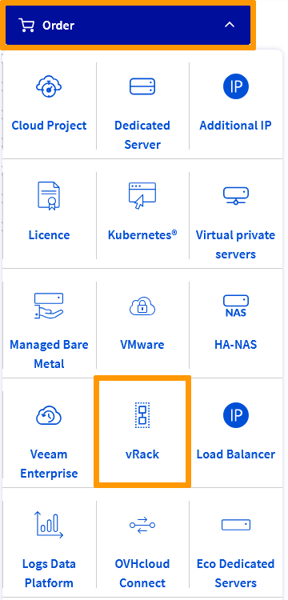
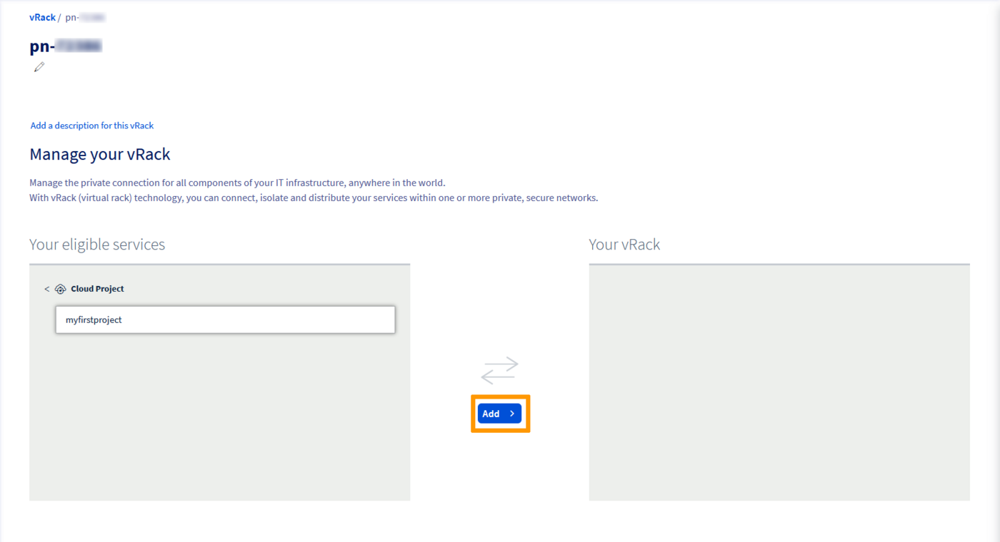

## Objective

The OVHcloud [vRack](/links/network/vrack) is a private network solution that enables our customers to route traffic between OVHcloud dedicated servers as well as other OVHcloud services. At the same time, it allows you to add [Public Cloud instances](/links/public-cloud/compute) to your private network to create an infrastructure of physical and virtual resources.

**This guide provides some basic information on creating and configuring the vRack on Public Cloud using OpenStack CLI.**

## Requirements

- A [Public Cloud project](/pages/public_cloud/public_cloud_cross_functional/create_a_public_cloud_project) in your OVHcloud account
- An [OpenStack user account](/pages/public_cloud/public_cloud_cross_functional/create_and_delete_a_user) (Optional)
- Basic networking knowledge
- Consulting the guide [Configuring the vRack on Public Cloud](/pages/public_cloud/public_cloud_network_services/getting-started-07-creating-vrack) (to understand the different methods to manage the vRack with the Public Cloud)

Before you get started, make sure you read these guides to properly setup your OpenStack environment:

- [Preparing an environment for using the OpenStack API](/pages/public_cloud/public_cloud_cross_functional/prepare_the_environment_for_using_the_openstack_api).
- [Setting OpenStack environment variables](/pages/public_cloud/public_cloud_cross_functional/loading_openstack_environment_variables).


## Instructions

### Content overview

- [Step 1: Activating and managing a vRack](#activating-vrack)
    - [In the OVHcloud Control Panel](#control-panel)
    - [With the OVHcloud APIv6](#ovhcloud-api)
- [Step 2: Creating a private network in the vRack](#private-network)
- [Step 3: Integrating an instance into vRack](#instance-vrack)
    - [In case of a new instance](#new-instance)
    - [In case of an existing instance](#existing-instance)
- [Removing a network interface](#detach-interface)

<a name="activating-vrack"></a>

### Step 1: Activating and managing a vRack

> [!warning]
> vRack is managed at the OVHcloud infrastructure level, meaning you can only administrate it in the OVHcloud Control Panel and the OVHcloud APIv6.
>

<a name="control-panel"></a>

#### In the OVHcloud Control Panel

> [!primary]
> This does not apply to newly created projects which are now automatically delivered with a vRack. To view the vRack once the project has been created, go the `Bare Metal Cloud`{.action} menu and click on `Network`{.action} in the left tab. Click on `vRack private network`{.action} to view the vRack(s).
>

If you have an older project and don't have a vRack, you need to order one. Using the vRack itself is free of charge and it can be delivered within a few minutes.

Go to the `Bare Metal Cloud`{.action} menu and click on the `Order`{.action} button. Under this menu, click on `vRack`{.action}.

{.thumbnail}

You will be redirected to another page to validate the order, it will take a few minutes for the vRack to be setup in your account.

Once the service is active, you will find it in your Control Panel in the `Bare Metal Cloud`{.action} section > `Network`{.action} > `vRack private network`{.action}. Labelled "pn-xxxxxx".

From the list of eligible services, select the project you want to add to the vRack and click the `Add`{.action} button.

{.thumbnail}

<a name="ovhcloud-api"></a>

#### With the OVHcloud APIv6

To activate and manage a vRack using the OVHcloud APIv6, please refer to [this section](/pages/public_cloud/public_cloud_network_services/getting-started-08-creating-vrack-with-api#step-1-activating-and-managing-a-vrack) of the corresponding guide.

<a name="private-network"></a>

### Step 2: Creating a private network in the vRack

It is necessary to create a private network with a virtual local area network (VLAN) so that the connected instances can communicate with each other.

With the Public Cloud service, you can create up to 4,000 VLANs within one vRack. This means that you can use each private IP address up to 4,000 times.
Thus, for example, 192.168.0.10 of VLAN 2 is different from IP 192.168.0.10 of VLAN 42.
This can be useful in order to segment your vRack between multiple virtual networks.

In order to create the same private network, we need to create 2 OpenStack objects: network and subnet.

In the following example we specify the `VLAN_ID` to which we want the network to be part of through `--provider-network-type` and `--provider-segment`.

You can remove those parameters. In that case, an available `VLAN_ID` will be used.

```bash 
openstack network create --provider-network-type vrack --provider-segment 42 OS_CLI_private_network
openstack subnet create --dhcp --network OS_CLI_private_network OS_CLI_subnet --subnet-range 10.0.0.0/16
```

<a name="instance-vrack"></a>

### Step 3: Integrating an instance into vRack

To intergrate an instance into the vRack, you need to link it to a private network.

There are two possible scenarios:

- The instance to be integrated does not exist yet.
- An existing instance needs to be added to the vRack.

<a name="new-instance"></a>

#### In case of a new instance

The following steps are necessary to create an instance directly in the vRack.

**Retrieving the required information**

Public and private networks:

```bash
openstack network list
 
+--------------------------------------+------------+-------------------------------------+
| ID                                   | Name       | Subnets                             |
+--------------------------------------+------------+-------------------------------------+
| 12345678-90ab-cdef-xxxx-xxxxxxxxxxxx | MyVLAN-42  | xxxxxxxx-yyyy-xxxx-yyyy-xxxxxxxxxxxx|
| 34567890-12ab-cdef-xxxx-xxxxxxxxxxxx | Ext-Net    | zzzzzzzz-yyyy-xxxx-yyyy-xxxxxxxxxxxx|
| 67890123-4abc-ef12-xxxx-xxxxxxxxxxxx | MyVLAN_0   | yyyyyyyy-xxxx-xxxx-yyyy-xxxxxxxxxxxx|
+--------------------------------------+------------+-------------------------------------+
```

or

```bash
nova net-list
 
+--------------------------------------+------------+------+
| ID                                   | Label      | CIDR |
+--------------------------------------+------------+------+
| 12345678-90ab-cdef-xxxx-xxxxxxxxxxxx | MyVLAN-42  | None |
| 34567890-12ab-cdef-xxxx-xxxxxxxxxxxx | Ext-Net    | None |
| 67890123-4abc-ef12-xxxx-xxxxxxxxxxxx | MyVLAN_0   | None |
+--------------------------------------+------------+------+
```

> [!primary]
> You will need to note the network IDs of interest:
><br> - Ext-Net for a public IP address
><br> - The VLAN(s) required for your configuration
>

Also note the information detailed in [this guide](/pages/public_cloud/compute/starting_with_nova):

- ID or name of the OpenStack SSH key
- ID of the instance type (flavor)
- ID of the desired image (operating system, snapshot, etc.)

**Deploying the instance**

With the previously retrieved items, an instance can be created, including it directly in the vRack:

```bash
nova boot --key-name SSHKEY --flavor [ID-flavor] --image [ID-Image] --nic net-id=[ID-Network 1] --nic net-id=[ID-Network 2] [instance name]
```

Example:

```bash
nova boot --key-name my-ssh-key --flavor xxxxxx-xxxx-xxxx-xxxx-xxxxxxxxxxxx --image yyyy-yyyy-yyyy-yyyy-yyyyyyyyyyyy --nic net-id=[id_Ext-Net] --nic net-id=[id_VLAN] NameOfInstance

+--------------------------------------+------------------------------------------------------+
| Property                             | Value                                                |
+--------------------------------------+------------------------------------------------------+
| OS-DCF:diskConfig                    | MANUAL                                               |
| OS-EXT-AZ:availability_zone          |                                                      |
| OS-EXT-STS:power_state               | 0                                                    |
| OS-EXT-STS:task_state                | scheduling                                           |
| OS-EXT-STS:vm_state                  | building                                             |
| OS-SRV-USG:launched_at               | -                                                    |
| OS-SRV-USG:terminated_at             | -                                                    |
| accessIPv4                           |                                                      |
| accessIPv6                           |                                                      |
| adminPass                            | xxxxxxxxxxxx                                         |
| config_drive                         |                                                      |
| created                              | YYYY-MM-DDTHH:MM:SSZ                                 |
| flavor                               | [Flavor type] (xxxxxx-xxxx-xxxx-xxxx-xxxxxxxxxxxx)   |
| hostId                               |                                                      |
| id                                   | xxxxxx-xxxx-xxxx-xxxx-xxxxxxxxxxxx                   |
| image                                | [Image type] (xxxxxx-xxxx-xxxx-xxxx-xxxxxxxxxxxx)    |
| key_name                             | [Name of key]                                        |
| metadata                             | {}                                                   |
| name                                 | [Name of instance]                                   |
| os-extended-volumes:volumes_attached | []                                                   |
| progress                             | 0                                                    |
| security_groups                      | default                                              |
| status                               | BUILD                                                |
| tenant_id                            | zzzzzzzzzzzzzzzzzzzzzzzzzzzzzzzz                     |
| updated                              | YYYY-MM-DDTHH:MM:SSZ                                 |
| user_id                              | zzzzzzzzzzzzzzzzzzzzzzzzzzzzzzzz                     |
+--------------------------------------+------------------------------------------------------+
```

or

```bash
openstack server create --key-name SSHKEY --flavor [ID-flavor] --image [ID-Image] --nic net-id=[ID-Network 1] --nic net-id=[ID-Network 2] [instance name]
```

Example:

```bash
openstack server create --key-name my-ssh-key --flavor xxxxxx-xxxx-xxxx-xxxx-xxxxxxxxxxxx --image yyyy-yyyy-yyyy-yyyy-yyyyyyyyyyyy --nic net-id=[id_Ext-Net] --nic net-id=[id_VLAN] NameOfInstance

+--------------------------------------+------------------------------------------------------+
| Property                             | Value                                                |
+--------------------------------------+------------------------------------------------------+
| OS-DCF:diskConfig                    | MANUAL                                               |
| OS-EXT-AZ:availability_zone          |                                                      |
| OS-EXT-STS:power_state               | 0                                                    |
| OS-EXT-STS:task_state                | scheduling                                           |
| OS-EXT-STS:vm_state                  | building                                             |
| OS-SRV-USG:launched_at               | -                                                    |
| OS-SRV-USG:terminated_at             | -                                                    |
| accessIPv4                           |                                                      |
| accessIPv6                           |                                                      |
| adminPass                            | xxxxxxxxxxxx                                         |
| config_drive                         |                                                      |
| created                              | YYYY-MM-DDTHH:MM:SSZ                                 |
| flavor                               | [Flavor type] (xxxxxx-xxxx-xxxx-xxxx-xxxxxxxxxxxx)   |
| hostId                               |                                                      |
| id                                   | xxxxxx-xxxx-xxxx-xxxx-xxxxxxxxxxxx                   |
| image                                | [Image type] (xxxxxx-xxxx-xxxx-xxxx-xxxxxxxxxxxx)    |
| key_name                             | [Name of key]                                        |
| metadata                             | {}                                                   |
| name                                 | [Name of instance]                                   |
| os-extended-volumes:volumes_attached | []                                                   |
| progress                             | 0                                                    |
| security_groups                      | default                                              |
| status                               | BUILD                                                |
| tenant_id                            | zzzzzzzzzzzzzzzzzzzzzzzzzzzzzzzz                     |
| updated                              | YYYY-MM-DDTHH:MM:SSZ                                 |
| user_id                              | zzzzzzzzzzzzzzzzzzzzzzzzzzzzzzzz                     |
+--------------------------------------+------------------------------------------------------+
```

You can set the IP address of the instance of your vRack interface at the OpenStack level.

To do this, you can add a single argument to the function "--nic":

`--nic net-id=[ID-Network],v4-fixed-ip=[IP_static_vRack]`

Example:

`--nic net-id=[ID-vRack],v4-fixed-ip=192.168.0.42`

**Verifying the instance**

After a few moments you can check the list of existing instances to find the server you created:

```bash
openstack server list
+--------------------------------------+---------------------+--------+--------------------------------------------------+--------------------+
| ID                                   |       Name          | Status | Networks                                         |     Image Name     |
+--------------------------------------+---------------------+--------+--------------------------------------------------+--------------------+
| xxxxxx-xxxx-xxxx-xxxx-xxxxxxxxxxxxxx | [Name of instance] | ACTIVE | Ext-Net=[IP_V4], [IP_V6]; MyVrack=[IP_V4_vRack] | [Name-of-instance]|
+--------------------------------------+---------------------+--------+--------------------------------------------------+--------------------+
```

```bash
nova list
+--------------------------------------+--------------------+--------+------------+-------------+--------------------------------------------------+
| ID                                   | Name               | Status | Task State | Power State | Networks                                         |
+--------------------------------------+--------------------+--------+------------+-------------+--------------------------------------------------+
| xxxxxx-xxxx-xxxx-xxxx-xxxxxxxxxxxx   | [Name of instance]| ACTIVE | -          | Running     | Ext-Net=[IP_V4], [IP_V6]; MyVrack=[IP_V4_vRack] |
+--------------------------------------+--------------------+--------+------------+-------------+--------------------------------------------------+
```

<a name="existing-instance"></a>

#### In case of an existing instance

The following steps are necessary to integrate an existing instance into the vRack.

**Retrieving the required information**

Identify your instances:

```bash
openstack server list
 
+--------------------------------------+--------------+--------+------------------------------------------------------------------------+------------+
| ID                                   | Name         | Status | Networks                                                               | Image Name |
+--------------------------------------+--------------+--------+------------------------------------------------------------------------+------------+
| 12345678-90ab-cdef-xxxx-xxxxxxxxxxxx | My-Instance | ACTIVE | Ext-Net=xx.xx.xx.xx, 2001:41d0:yyyy:yyyy::yyyy; MyVrack=192.168.0.124 | Debian 9   |
+--------------------------------------+--------------+--------+------------------------------------------------------------------------+------------+
```

or

```bash
nova list
 
+--------------------------------------+--------------+--------+------------+-------------+----------------------------------------------------------------------+
| ID                                   | Name         | Status | Task State | Power State | Networks                                                             |
+--------------------------------------+--------------+--------+------------+-------------+----------------------------------------------------------------------+
| 12345678-90ab-cdef-xxxx-xxxxxxxxxxxx | My-Instance | ACTIVE | -          | Running     | Ext-Net=xx.xx.xx.xx,2001:41d0:yyyy:yyyy::yyyy;MyVrack=192.168.0.124 |
+--------------------------------------+--------------+--------+------------+-------------+----------------------------------------------------------------------+
```

Public and private networks:

```bash
openstack network list
 
+--------------------------------------+------------+-------------------------------------+
| ID                                   | Name       | Subnets                             |
+--------------------------------------+------------+-------------------------------------+
| 12345678-90ab-cdef-xxxx-xxxxxxxxxxxx | MyVLAN-42  | xxxxxxxx-yyyy-xxxx-yyyy-xxxxxxxxxxxx|
| 34567890-12ab-cdef-xxxx-xxxxxxxxxxxx | Ext-Net    | zzzzzzzz-yyyy-xxxx-yyyy-xxxxxxxxxxxx|
| 67890123-4abc-ef12-xxxx-xxxxxxxxxxxx | MyVLAN-0   | yyyyyyyy-xxxx-xxxx-yyyy-xxxxxxxxxxxx|
+--------------------------------------+------------+-------------------------------------+
```

or

```bash
nova net-list
 
+--------------------------------------+------------+------+
| ID                                   | Label      | CIDR |
+--------------------------------------+------------+------+
| 12345678-90ab-cdef-xxxx-xxxxxxxxxxxx | MyVLAN-42  | None |
| 34567890-12ab-cdef-xxxx-xxxxxxxxxxxx | Ext-Net    | None |
| 67890123-4abc-ef12-xxxx-xxxxxxxxxxxx | MyVLAN-0   | None |
+--------------------------------------+------------+------+
```

> [!primary]
> You will need to note the network IDs of interest:
><br> - Ext-Net for a public IP address
><br> - The VLAN(s) required for your configuration
>

**Adding a private network interface**

In order to attach a new interface, execute the following command:

```bash
nova interface-attach --net-id <ID-VLAN> <ID-instance>
```

Example:

```bash
nova interface-attach --net-id 12345678-90ab-cdef-xxxx-xxxxxxxxxxxx 12345678-90ab-cdef-xxxx-xxxxxxxxxxxx
```

You can verify that the action has been performed:

```bash
nova show <ID-instance>
 
+--------------------------------------+----------------------------------------------------------+
| Property                             | Value                                                    |
+--------------------------------------+----------------------------------------------------------+
| Ext-Net network                      | xx.xx.xx.xx, 2001:41d0:xxx:xxxx::xxxx                    | => your public IP
| MyVLAN-42 network                    | 192.168.0.x                                              | => your private IP
[...]
```

or

```bash
openstack server show <ID-instance>
+--------------------------------------+-------------------------------------------------------------------------+
| Field                                | Value                                                                   |
+--------------------------------------+-------------------------------------------------------------------------+
[...]
| addresses                            | Ext-Net=xx.xx.xx.xx, 2001:41d0:xxx:xxxx::xxxx ; MyVLAN-42=192.168.0.x  | => your public IP ; your private IP                                                                     
[...]
```

<a name="detach-interface"></a>

### Removing a network interface

> [!warning]
> Detaching a network interface is permanent.
>
> However, it is important to note that if you detach the "Ext-Net" interface (public IP), this address will be released and put back into circulation. It is not possible to just reassign it.
><br>This action is only required if you wish to isolate your server in the vRack (private network), or if you wish to remove it from one or more VLANs.
>

In order to detach an interface, you will first need to identify the Neutron port that has been created.

You can do this by using the following commands:

```bash
neutron port-list
+--------------------------------------+------+-------------------+---------------------------------------------------------------------------------------------------+
| id                                   | name | mac_address       | fixed_ips                                                                                         |
+--------------------------------------+------+-------------------+---------------------------------------------------------------------------------------------------+
| 12345678-abcd-ef01-2345-678910abcdef |      | fa:xx:xx:xx:xx:xx | {"subnet_id": "01234567-8901-abscdef12345678910abcd", "ip_address": "192.168.0.x"}                |
| 09876543-210a-bcde-f098-76543210abcd |      | fa:yy:yy:yy:yy:yy | {"subnet_id": "65432109-abcd-ef09-8765-43210abcdef1", "ip_address": "2001:41d0:xxx:xxxx::xxxx"}   |
|                                      |      |                   | {"subnet_id": "abcdef12-3456-7890-abcd-ef1234567890", "ip_address": "YY.YY.YY.YY"}                |
+--------------------------------------+------+-------------------+---------------------------------------------------------------------------------------------------+
```

or

```bash
openstack port list
+--------------------------------------+------+-------------------+-------------------------------------------------------------------------------------------+
| ID                                   | Name | MAC Address       | Fixed IP Addresses                                                                        |
+--------------------------------------+------+-------------------+-------------------------------------------------------------------------------------------+
| 12345678-abcd-ef01-2345-678910abcdef |      | fa:xx:xx:xx:xx:xx | ip_address='192.168.0.xx', subnet_id='301234567-8901-abscdef12345678910abcd'              |
| 09876543-210a-bcde-f098-76543210abcd |      | fa:yy:yy:yy:yy:yy | ip_address='2001:41d0:xxx:xxxx::xxxx', subnet_id='65432109-abcd-ef09-8765-43210abcdef1'   |
|                                      |      |                   | ip_address='YY.YY.YY.YY', subnet_id='abcdef12-3456-7890-abcd-ef1234567890'                |
+--------------------------------------+------+-------------------+-------------------------------------------------------------------------------------------+
```

Once you have identified the port to remove, you can execute the following command:

```bash
nova interface-detach <ID_instance> <port_id>
```

Example:

```bash
nova interface-detach 12345678-90ab-cdef-xxxx-xxxxxxxxxxxx 12345678-abcd-ef01-2345-678910abcdef
```

## Go further

[Configuring vRack for Public Cloud using OVHcloud APIv6](/pages/public_cloud/public_cloud_network_services/getting-started-08-creating-vrack-with-api).

[Creating multiple vLANs in a vRack](/pages/bare_metal_cloud/dedicated_servers/creating-multiple-vlans-in-a-vrack).

If you need training or technical assistance to implement our solutions, contact your sales representative or click on [this link](/links/professional-services) to get a quote and ask our Professional Services experts for assisting you on your specific use case of your project.

Join our [community of users](/links/community).