> [!primary]
> VSPC on OVHcloud is currently in alpha phase. This guide can evolve and be updated in the future with the advances of our teams in charge of this product.

## Objective

The **Veeam Service Provider Console (VSPC)** is a cloud-enabled platform for centralized management and monitoring of data protection operations and services. 

With VSPC, you can monitor backups, create custom backup policies, and make sure your servers are always protected, all from one central dashboard.

**This guide is an introduction to VSPC.** 

It will walk you through the first steps to get started with VSPC, including:

- Accessing the VSPC portal with your OVHcloud credentials.
- Downloading and installing the management agent to connect your servers to VSPC.
- Verifying that your servers are connected and showing up in VSPC.
- Setting up and customizing backup policies for your servers.

> [!warning]
> OVHcloud provides services for which you are responsible, with regard to their configuration and management. It is therefore your responsibility to ensure that they work properly.
> This guide is designed to assist you as much as possible with common tasks. However, we recommend contacting a specialist provider if you experience any difficulties or doubts when it comes to managing, using, or setting up a service on a server.
>
## Requirements

- Administrative permissions for the [OVHcloud Control Panel](/links/manager) to manage resources.
- A server compatible with the Veeam Backup Agents, running a supported [operating system](https://helpcenter.veeam.com).
- A firewall configured to allow communication between the VSPC and your managed servers.

## Instructions

### Step 1: Accessing the VSPC portal

Visit the VSPC portal link provided by OVHcloud and log in using the administrative credentials assigned to your Hosted Private Cloud infrastructure. 

If credentials are missing, contact our product teams on [Discord](https://discord.gg/ovhcloud) or your account manager.

Key elements of the dashboard include:

- **Active alarms**: Displays and allows customization of alarms to monitor key operations.
- **Protected workloads**: Shows the total number of workloads safeguarded in your backup and cloud infrastructures.
- **Cloud resource usage**: Highlights the resources consumed by your organization in the cloud.
- **Job session statuses**: Provides the status and efficiency of data protection jobs.
- **Backup jobs**: Lists all configured backup jobs, enabling you to create, run, or modify them.
- **Data overview**: Summarizes backed-up data for quick reference.
- **Host discovery rules**: Allows you to define rules for automatically discovering hosts.
- **Managed computers**: Displays all computers connected and managed within the VSPC.
- **Reports**: Offers access to detailed reports on backup job completion and performance.

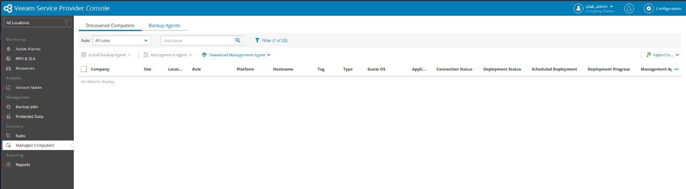{.thumbnail}

### Step 2: Downloading the Management Agent

Navigate to the `Discovered Computers`{.action} section in the VSPC.

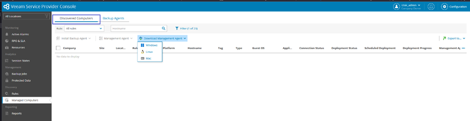{.thumbnail}

Click `Download Management Agent`{.action}, then select `Create Download Link`{.action}.

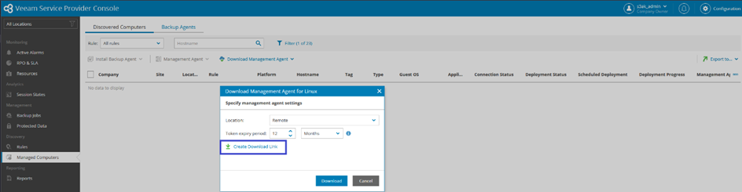{.thumbnail}

Available options :

- Copy the download link.
- Download the agent directly.

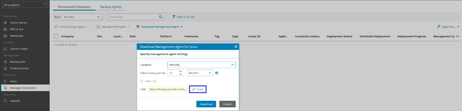{.thumbnail}

> [!warning]
> Make sure your firewall rules allow access to the VSPC for the agent download to succeed.

### Troubleshooting tips

- **Firewall blockage**: If the agent fails to download, verify that TCP ports 443 and 6183 are open for outbound communication.
- **Browser compatibility**: Ensure you're using a supported browser (e.g., Chrome, Edge). Older browsers may block or restrict downloads.
- **Expired download Link**: If you shared the link and it has expired, generate a new one from the **Discovered Computers** section.
- **Proxy issues**: If your network uses a proxy server, verify that it allows traffic to and from the VSPC.

### Step 3: Installing the Management Agent

1. Open the generated link on the target server to download the management agent.
1. Run the downloaded file on the target server.
1. Follow the installation prompts to complete the setup.
    - For Linux systems, use the `.rpm` or `.deb` installer depending on the distribution.
1. Once installed, the server will automatically connect to the VSPC.
1. Verify that the server appears in the **Discovered Computers** list with an installation progress bar.

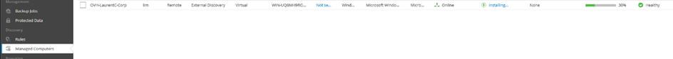{.thumbnail}

> [!primary]
> Some OVHcloud distributions may encounter issues (e.g., UUID errors) during installation. Contact our product teams on [Discord](https://discord.gg/ovhcloud) if the agent fails to install or does not appear in the dashboard.

### Step 4: Verifying the Agent installation

- Confirm the agent status in the **Discovered Computers** section.
- Check for successful connection and registration with the VSPC.

### Step 5: Changing backup policies

OVHcloud provides a **default backup policy** that includes a 2TB S31-compatible Object Storage bucket. Currently, users can modify this default policy but cannot create custom policies or add personal S3-compatible Object Storage buckets.

To review or configure the policy:

1\. Go to the `Backup Job`{.action} section in the VSPC dashboard.

2\. Click the value under `Successful Jobs`{.action} . A window will open showing the default policy name (e.g., `FCO – Windows …`).

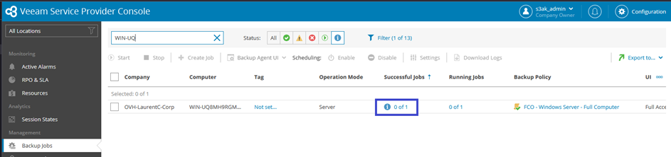{.thumbnail}

3\. Select the **backup policy** you want to modify. A new window will display the policy components.

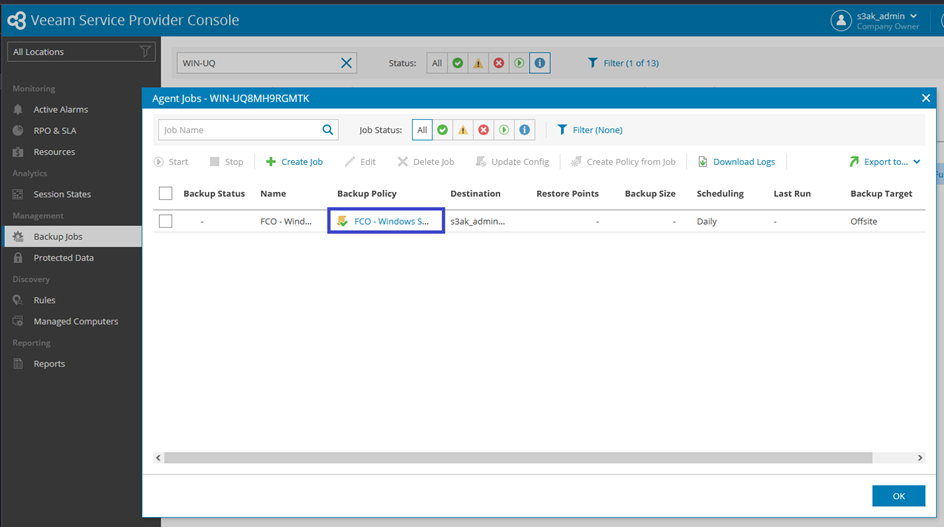{.thumbnail}

Here are the components you can adjust:

- **Operation mode**: Choose the type of host to back up.
- **Backup mode**: Select specific data to back up (e.g., entire server, partition).
- **Destination**: Define the backup storage location (default is a 2TB S3-compatible Object Storage bucket).
- **Repository credentials**: Configure authentication for the repository.
- **Retention policy**: Specify the duration for keeping backups (default is 7 days).
- **Backup cache**: Disabled by default.
- **Guest processing mode**:
    - **Application-aware processing**: Maintains consistency for VSS-aware applications by processing application logs for disaster recovery.
    - **System indexing**: Enables file-by-file browsing and selective restoration.
- **Schedule**: Backups run daily at 10 PM, with up to three retries for failed jobs.

Before finalizing, a summary screen will display all settings for review.

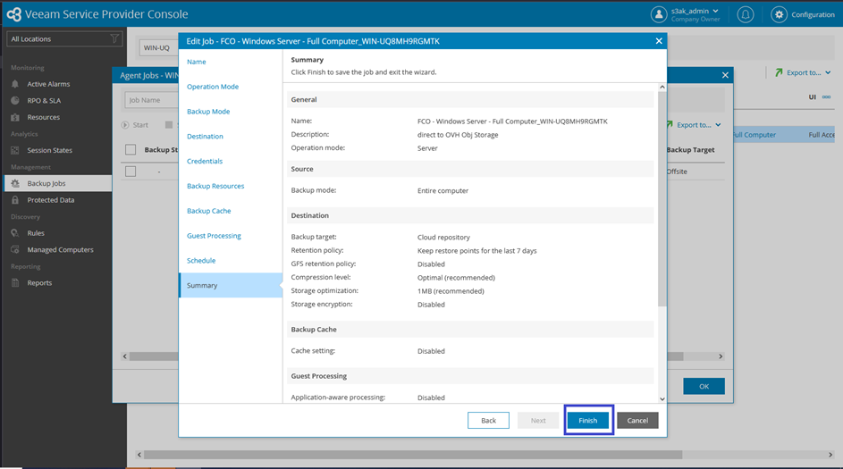{.thumbnail}

> [!warning]
> Verify available storage space before starting backups or restorations. Insufficient space can result in failures.

### Policy customization scenarios

#### **Windows example - Partition-level backup**

Configure the policy to back up only the `C:` drive:

1. Navigate to `Backup Job`{.action} and select the server.
2. Modify the backup policy by selecting `Partition Backup`.
3. Choose the `C:` partition and exclude others.

#### **Linux example - Directory-level backup**

Target critical directories like `/var/www`, excluding `/tmp`:

1. Navigate to `Backup Job`{.action} and select the Linux server.
2. Assign or modify a policy to include `/var/www` and exclude `/tmp`.

### Step 6: Assigning policies to servers

1\. Navigate to `Managed Computers`{.action} and select `Backup Agents`{.action}.

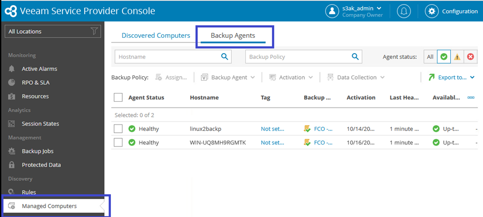{.thumbnail}

2\. Choose the server from the list.
3\. Click `Assign`{.action}, select the desired policy, and confirm.

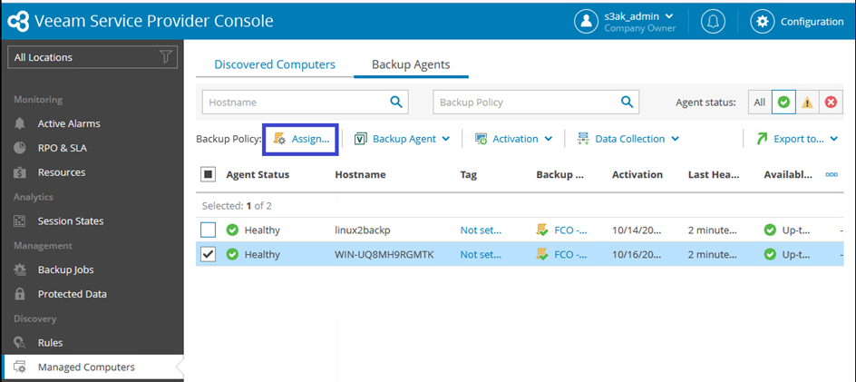{.thumbnail}

4\. View the summary of assigned policies by clicking `Show`{.action}.

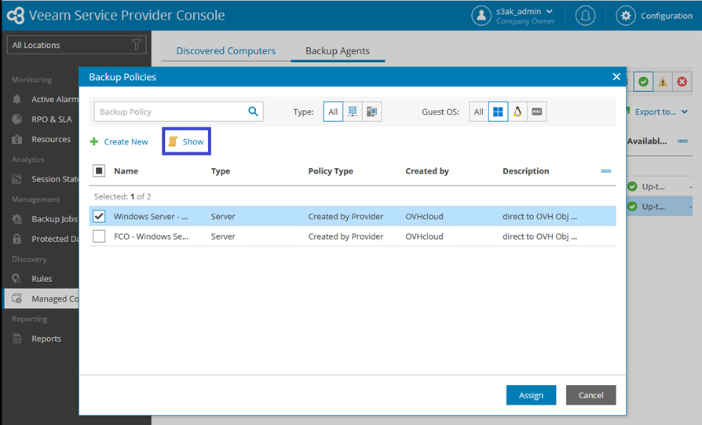{.thumbnail}

### Step 7: Managing backup jobs

#### **Scheduled backups**

- Backups run automatically as per the configured schedule.

#### **On-demand backups**

1. In the `Backup Job`{.action} section, select the server.
2. Click `Start`{.action} to initiate a backup immediately.

### Step 8: Logs and reporting

1. Generate reports from the `Reports`{.action} section in the VSPC.
2. Review logs to troubleshoot any issues during backup or restoration.

### Step 9: Restoring Data

Restoring data from VSPC lets you recover lost or corrupted files, folders, or entire systems. Follow these steps to perform a restoration.

#### **1. Access the Restore List**

1. Log in to the VSPC interface and navigate to the `Protected Data`{.action} section.
2. Select the `Backup Job`{.action} containing the data you want to restore.
3. Click `File-Level Restore`{.action} to begin. 

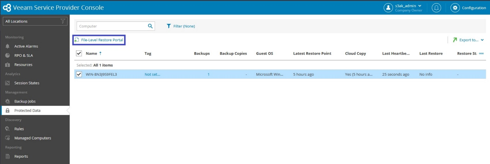{.thumbnail}

#### **2. Select the Restore Point**

1\. Navigate to the `Restore List`{.action}.

You will land on the following screen:

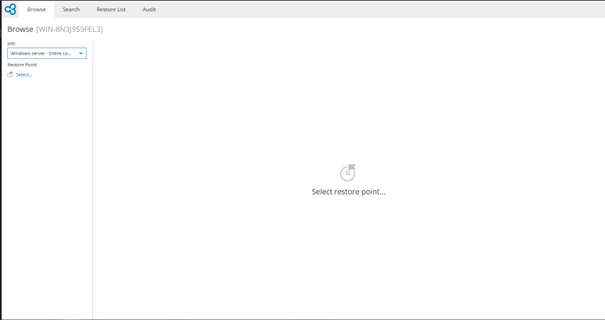{.thumbnail}

2\. Click on `Select Restore Point`{.action} to display the calendar.
3\. The calendar will appear, showing all available restore points.

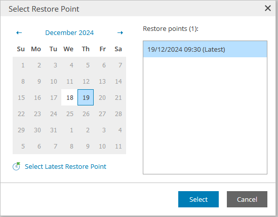{.thumbnail}
 
4\. Choose the desired date on the calendar and click `Select`{.action}.
5\. A list of files, folders, or system components from the selected restore point will load.

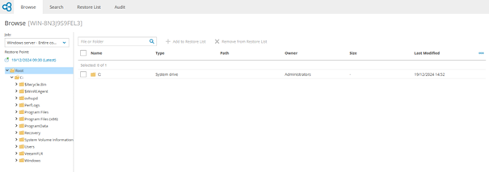{.thumbnail}

> [!primary]
> Ensure the target environment has sufficient storage and no conflicts with the restore destination.

#### **3. Choose Restore Options**

1\. Expand the list to locate specific files or folders, select the file you want to restore and click on `Add to the restore list`{.action}.

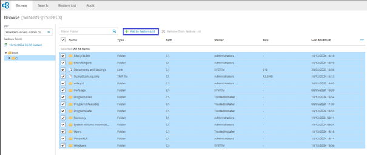{.thumbnail}
 
Above the screen, you can see the amount of file added: 
 
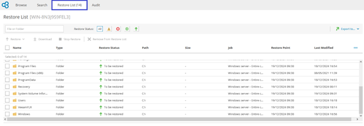{.thumbnail}

2\. Add the selected items to the **Restore List**:

- **Overwrite**: Replace the original files on the target system.
- **Keep**: Save restored files in the same directory, prefixed with `RESTORED-`.
- **Download**: Retrieve the restored files locally for manual application. 

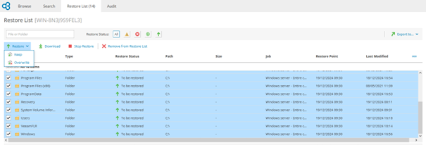{.thumbnail}

#### **4. Initiate Restoration**

1. Review the **Restore List** to ensure accuracy.
2. Confirm the settings and click `Restore`{.action} to start the process.
3. Monitor progress in real time via the VSPC dashboard.

#### **5. Verify Restoration**

1. After completion, navigate to the `Audit Logs`{.action }tab for detailed records of the restore process.
2. Check for errors or warnings and validate that the restored data is functional.

> [!warning]
> Data integrity is your responsibility. Always verify restored files, particularly for critical systems, to avoid issues post-restoration.

## Go Further

If you need training or technical assistance to implement our solutions, please contact your Technical Account Manager or click on [this link](/links/professional-services) to get a quote and ask our Professional Services experts for a custom analysis of your project.

Ask questions, give your feedback and interact directly with the team building our Hosted Private Cloud services on the dedicated [Discord](https://discord.gg/ovhcloud) channel.

Join our [community of users](/links/community).

1: S3 is a trademark of Amazon Technologies, Inc. OVHcloud’s service is not sponsored by, endorsed by, or otherwise affiliated with Amazon Technologies, Inc.